처음엔 네이버 클립도 YouTube처럼 "영상 파일 하나와 제목만 있으면 업로드 API 하나로 끝나지 않을까"라고 생각했다. 그런데 `C:\Users\user2401\Downloads\codex_video_upload\codex_video_upload` 폴더를 열어 보니 아니었다. 네이버 클립 업로드는 **최종 저장 API 하나가 아니라, VOD 업로드 파이프라인 전체를 통과한 뒤 마지막에 `clip/save`를 호출하는 구조**였다.

이 글은 그 흐름을 코드 기준으로 다시 풀어 쓴 기록이다. 공개 글이라 로그인 쿠키, 토큰, 세션 키 같은 값은 쓰지 않는다. 그리고 실제 업로드 소재의 민감한 제목이나 내용도 일부러 제외한다. 여기서 다루는 건 콘텐츠 소재가 아니라 **자동 업로드 구조**다.

앞서 [[naver-blog-smarteditor-rabbitwrite-image-upload-automation|네이버 블로그 자동 발행기 해부]]에서는 SmartEditor가 받는 `documentModel`과 `RabbitWrite.naver`를 봤다. 네이버 클립은 그것보다 더 영상 업로드 쪽에 가깝다. [[youtube-api-mp4-srt-thumbnail-shorts-pipeline|YouTube MP4·SRT·썸네일·쇼츠 업로드 파이프라인]]에서 봤던 것처럼, 여기서도 핵심은 "업로드 버튼을 누르는 일"이 아니라 **업로드 버튼이 서버에 보내는 단계들을 정확히 재현하는 일**이었다.

## 전체 흐름은 어떻게 생겼나?

내가 이해한 큰 그림은 이렇다.

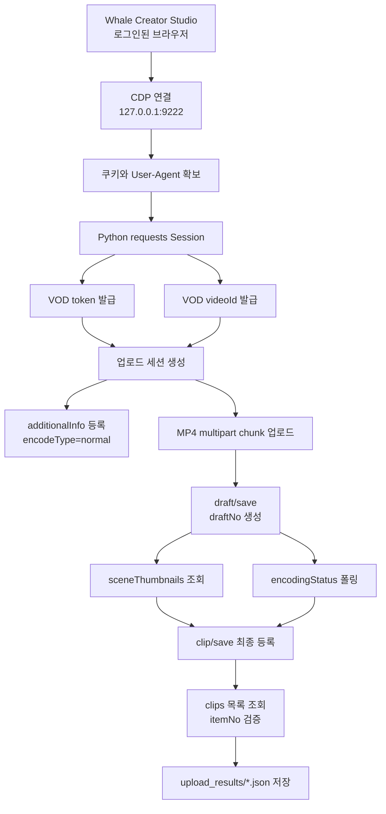

여기서 CDP는 Chrome DevTools Protocol이다. 쉽게 말하면 "브라우저 개발자도구가 브라우저를 조종하고 관찰하는 통로"다. 이 프로젝트는 Whale 브라우저를 원격 디버깅 포트로 열고, 이미 로그인된 Creator Studio 탭에서 쿠키와 User-Agent를 가져온다. 그다음부터는 브라우저 UI를 클릭하지 않고 Python `requests`로 직접 API를 호출한다.

즉 구조는 이렇게 나뉜다.

| 층 | 역할 | 핵심 파일 |
|---|---|---|
| 네트워크 캡처 | 수동 업로드가 어떤 요청을 내보내는지 기록 | `capture_naver_upload_network.mjs` |
| 인증 확인 | CDP 쿠키로 API 호출이 되는지 검증 | `naver_direct_http_probe.mjs` |
| 단건 업로드 | 실제 VOD 업로드와 `clip/save` 호출 | `direct_naver_clip_upload.py` |
| 후보 수집 | 외부 페이지에서 영상 후보와 `<video>` 태그 확인 | `collect_damdaworld_media_candidates.mjs` |
| 파일 다운로드 | 후보 페이지에서 MP4를 내려받고 manifest 생성 | `download_videos.mjs` |
| 메타 생성 | 제목·설명·해시태그 정리 및 금칙 표현 필터링 | `generate_meta_seo_for_manifest.mjs` |
| 배치 실행 | manifest를 읽어 여러 클립을 순차 업로드 | `upload_clips.ps1` |
| 사후 수정 | 이미 올라간 클립 제목/설명 수정 | `rewrite_naver_clip_metadata.py` |

이 구분이 중요했다. 업로드 본체는 Python이고, JS는 크게 두 가지 역할을 한다. 하나는 브라우저 네트워크를 관찰하는 분석 도구이고, 다른 하나는 업로드할 후보와 메타데이터를 만드는 전처리 도구다.

## 왜 브라우저 캡처가 먼저 필요했나?

처음부터 Python으로 API를 때릴 수는 없었다. 어떤 URL에 어떤 순서로 무엇을 보내야 하는지 몰랐기 때문이다. 그래서 먼저 수동 업로드를 한 번 하면서 CDP Network 이벤트를 잡았다.

`capture_naver_upload_network.mjs`의 역할은 단순하지만 중요하다.

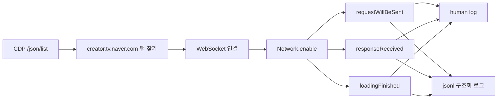

이 스크립트가 괜찮았던 점은 기본적으로 민감한 값을 마스킹한다는 것이다. `Cookie`, `Authorization`, CSRF 계열 헤더, token/session/auth 같은 문자열은 로그에 그대로 남기지 않는다. response body까지 보고 싶을 때는 `CAPTURE_PRIVATE_BODIES=1`을 켜야 하는데, 이건 별도 private 로그로 빠진다. 공개할 수 있는 분석 로그와 민감한 디버그 로그를 분리한 것이다.

캡처로 확인한 결론은 이거였다.

```text
최종 clip/save만 호출해서는 새 MP4를 올릴 수 없다.
먼저 VOD 업로드 세션과 draftNo가 만들어져 있어야 한다.
```

이 한 줄이 전체 구현 방향을 바꿨다. 네이버 클립 업로드는 "게시 API" 이전에 "영상 파일을 VOD 시스템에 올리는 단계"가 따로 있었다.

## 업로드는 어떤 API 순서로 이어지나?

캡처와 프론트엔드 JS 번들 분석을 맞춰 보니 순서가 이렇게 정리됐다.

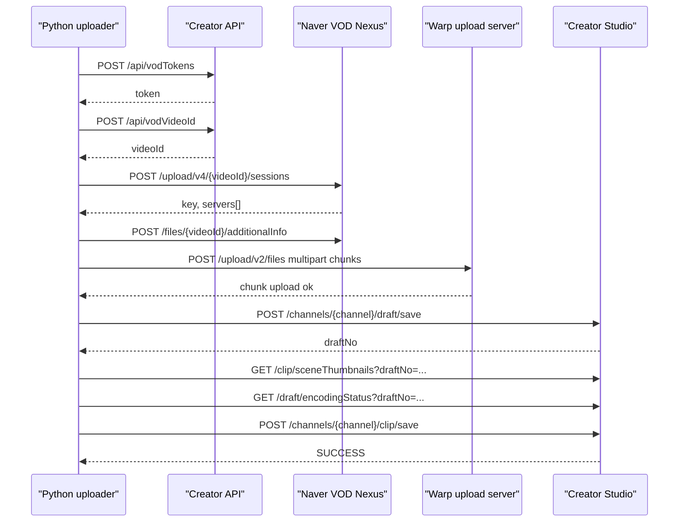

동적 값의 관계는 더 중요하다. 한 단계에서 받은 값이 다음 단계의 입력이 된다.

| 값 | 어디서 나옴 | 어디에 쓰임 |
|---|---|---|
| `token` | `vodTokens` | 업로드 세션 생성 body |
| `videoId` | `vodVideoId` | upload session, additionalInfo, draft/save |
| `key` | upload session | multipart chunk 업로드 field |
| `servers[0]` | upload session | 실제 MP4 업로드 host |
| `draftNo` | draft/save | 썸네일 조회, 인코딩 조회, 최종 clip/save |
| `sceneThumbnailImageUrls` | sceneThumbnails | 최종 썸네일 URL |
| `itemNo` | clips 목록 | 최종 등록 검증 |

이 값들이 이어져야 최종 등록이 된다. `clip/save`는 게시 버튼에 가깝고, 실제 파일 업로드는 그 전에 이미 끝나 있어야 한다.

## direct_naver_clip_upload.py는 어떤 구조인가?

`direct_naver_clip_upload.py`는 이 폴더의 중심이다. 구조는 크게 네 덩어리다.

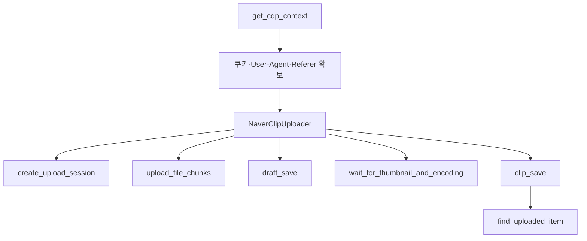

핵심 함수는 이렇게 읽으면 된다.

| 함수 | 하는 일 |
|---|---|
| `get_cdp_context()` | CDP 9222에서 Creator Studio 탭을 찾고 쿠키와 User-Agent를 읽는다 |
| `headers_for()` | 호출 host별로 Cookie, Referer, Origin, User-Agent 헤더를 만든다 |
| `post_creator_json()` | `vodTokens`, `vodVideoId` 같은 Creator API를 호출한다 |
| `create_upload_session()` | VOD token/videoId를 받고 업로드 세션을 만든다 |
| `post_additional_info()` | 인코딩 타입 같은 부가 정보를 VOD에 알린다 |
| `upload_file_chunks()` | MP4를 5MB 단위 chunk로 나눠 multipart 업로드한다 |
| `draft_save()` | 업로드된 videoId를 Creator Studio draft로 저장한다 |
| `wait_for_thumbnail_and_encoding()` | 썸네일과 인코딩 상태가 준비될 때까지 기다린다 |
| `clip_save()` | 제목/설명/카테고리/썸네일과 함께 최종 공개 저장한다 |
| `find_uploaded_item()` | `/clips` 목록에서 방금 올린 제목을 찾아 `itemNo`를 확인한다 |

실행 인자는 단순하다.

```powershell
python direct_naver_clip_upload.py `
  --channel "채널ID" `
  --file "C:\path\to\clip.mp4" `
  --title "클립 제목" `
  --description "클립 설명" `
  --hashtags "#네이버클립 #짧은영상" `
  --result-json ".\upload_results\result.json" `
  --verify-listing
```

여기서 중요한 점은 `--file`에 들어가는 MP4가 권리 확인된 파일이어야 한다는 것이다. 기술적으로 올릴 수 있다고 해서 아무 영상이나 재업로드해도 된다는 뜻은 아니다. 이 글에서는 코드 구조만 다루고, 특정 소재나 제3자 콘텐츠 재업로드 사례는 설명하지 않는다.

## MP4 chunk 업로드는 어떻게 재현했나?

업로드 세션을 만들면 응답으로 `key`와 `servers`가 온다. 그중 첫 업로드 서버를 골라 MP4를 보낸다. 브라우저 쪽은 Flow.js 계열 업로드처럼 동작했고, Python은 그 multipart 필드를 맞춰 보냈다.

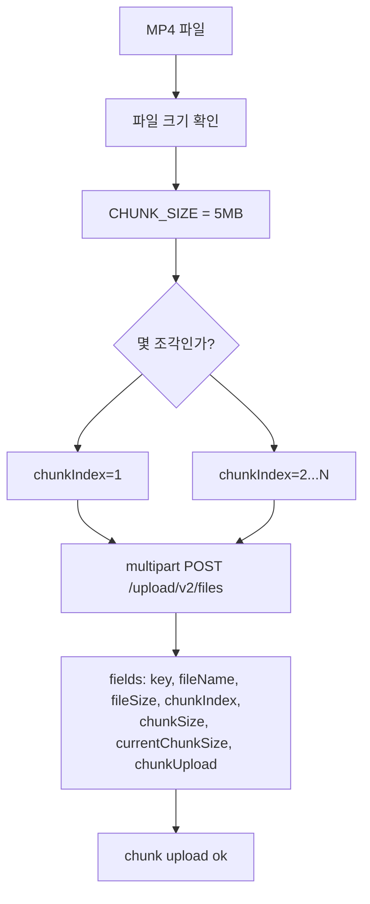

Python 코드에서 중요한 상수는 이 정도다.

```python
SERVICE_ID = "2010"
CHUNK_SIZE = 5 * 1024 * 1024
```

실제 multipart 필드는 이런 구조다.

```text
key                = upload session key
fileName           = 로컬 MP4 파일명
fileSize           = 전체 파일 크기
chunkIndex         = 1부터 시작
chunkSize          = 5242880
currentChunkSize   = 이번 조각 크기
chunkUpload        = true
file               = 이번 chunk bytes
```

작은 파일은 chunk 1개로 끝난다. 5MB보다 큰 파일은 같은 요청을 여러 번 반복한다. 이때 `chunkIndex`와 `currentChunkSize`가 틀리면 업로드 서버가 받아도 최종 세션 상태가 꼬일 수 있다.

## draft와 썸네일은 왜 필요한가?

MP4 chunk 업로드가 끝났다고 바로 공개되는 건 아니다. 다음 단계는 draft다.

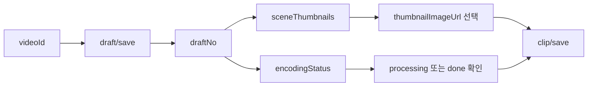

`draft/save`는 업로드된 VOD 영상을 Creator Studio의 편집 가능한 초안으로 묶는 단계다. 응답에서 `draftNo`가 나온다. 이 `draftNo`가 있어야 썸네일 목록을 조회하고, 인코딩 상태를 확인하고, 최종 저장할 수 있다.

코드는 썸네일을 이렇게 고른다.

```python
thumbnail_url = thumbnails[2] if len(thumbnails) > 2 else thumbnails[0] if thumbnails else None
```

즉 세 번째 썸네일이 있으면 그걸 쓰고, 없으면 첫 번째를 쓴다. 별도의 썸네일 파일 업로드가 아니라, 네이버 VOD가 영상에서 추출한 장면 썸네일 중 하나를 쓰는 흐름이다.

인코딩 상태는 업로드 직후 일시적으로 500이 나올 수 있었다. 코드가 이걸 바로 실패로 보지 않고 warning으로 남긴 뒤 다시 묻는 이유가 여기에 있다.

```text
encodingStatus 500  -> 잠깐 기다림
processing          -> 썸네일 있으면 최종 저장 가능
done                -> 최종 저장 가능
```

실무적으로는 이 부분이 중요하다. 자동화에서 "첫 실패 응답 = 전체 실패"로 처리하면, 사실은 정상 처리 중인 업로드를 불필요하게 중단할 수 있다.

## clip/save는 어떤 정보를 받나?

최종 저장은 Creator Studio API의 `clip/save`로 간다. 여기서 제목, 설명, 카테고리, 공개 상태, 댓글 허용, 글로벌 공개 여부, 썸네일 URL이 붙는다.

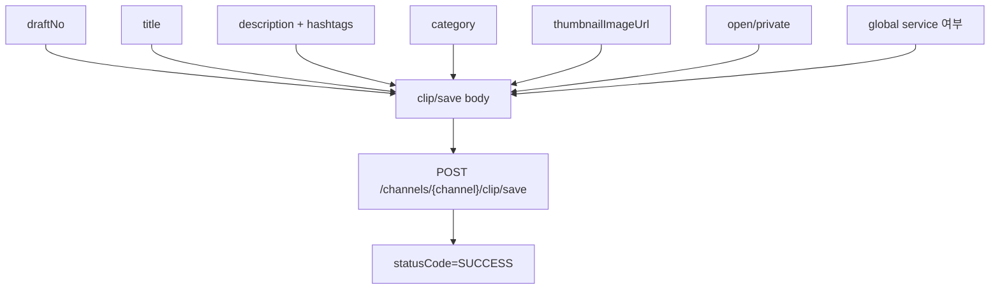

단순화하면 body는 이런 느낌이다.

```json
{
  "draftNo": 1234567,
  "isShortform": true,
  "clipTitle": "클립 제목",
  "clipDescription": "클립 설명 #네이버클립 #짧은영상",
  "firstCategory": "ENTERTAINMENT",
  "secondCategory": "VARIETYSHOW",
  "thumbnailImageUrl": "https://video-phinf.pstatic.net/...",
  "squareThumbnailImageUrl": "https://video-phinf.pstatic.net/...",
  "isOpen": true,
  "isGlobalService": true,
  "isComment": "true",
  "isSubscribeOnly": "false"
}
```

`direct_naver_clip_upload.py`는 `metaTemplate?isShortform=true`도 먼저 읽는다. 이 템플릿에서 기본 설정값을 가져와 `isScrap`, `isCopyright`, `people`, `lastModifyUser...` 같은 값을 채운다. 사람이 Creator Studio 화면에서 기본값을 두고 저장하는 것과 비슷하게 맞춘 것이다.

## 배치 업로드는 어떻게 안전하게 묶었나?

단건 업로드가 되면 그다음 문제는 배치다. `upload_clips.ps1`이 이 역할을 맡는다.

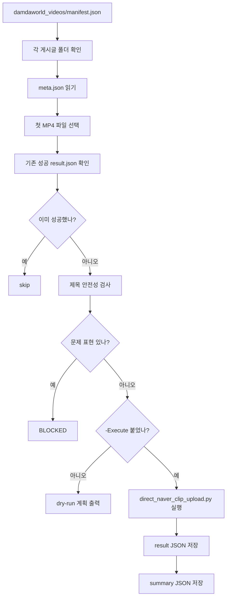

이 스크립트에서 마음에 들었던 안전장치는 네 가지다.

| 안전장치 | 이유 |
|---|---|
| `-Execute` 없으면 업로드 안 함 | 실수로 실행했을 때 실제 업로드를 막음 |
| 기존 성공 result 스킵 | 재실행 중복 업로드 방지 |
| 제목 금칙 패턴 검사 | 정책 민감 표현이 남은 채 업로드되는 것 차단 |
| 업로드 간 `DelaySec` | 연속 업로드 속도를 낮춰 안정성 확보 |

PowerShell에서 Python을 부를 때 UTF-8 설정을 넣은 것도 중요하다. 한국어 제목과 설명이 깨지면 업로드는 성공해도 운영상 실패다.

```powershell
$env:PYTHONUTF8 = "1"
$env:PYTHONIOENCODING = "utf-8"
```

`upload_clips.ps1`은 각 클립마다 `--result-json`을 넘긴다. 그러면 Python 업로더가 `videoId`, `draftNo`, `thumbnail`, `finalStatusCode`, 목록 검증 결과를 파일로 남긴다. 마지막에는 전체 요약 `summary_*.json`도 만든다. 이 로그가 있어야 나중에 "어느 파일이 올라갔고, 어떤 itemNo가 생겼는지"를 추적할 수 있다.

## 메타데이터는 어떻게 순화해서 만들었나?

업로드 자동화에서 제목과 설명은 그냥 문자열이 아니다. 플랫폼 정책, 검색 성과, 사용자 반응이 모두 걸려 있다. 그래서 `generate_meta_seo_for_manifest.mjs`는 원문 제목을 그대로 쓰지 않고 정리한다.

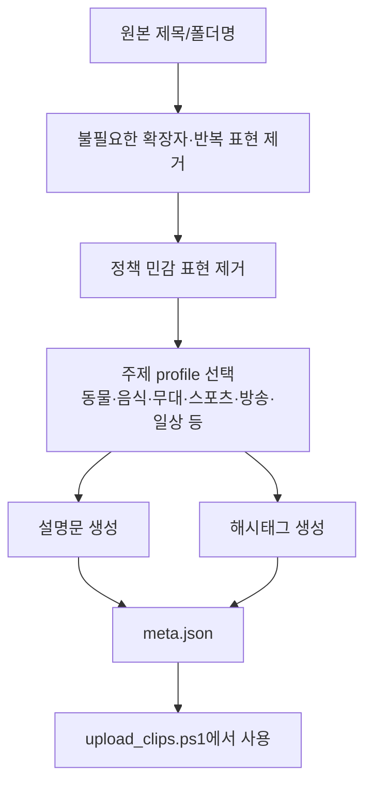

이 글에서는 실제 금칙어 목록이나 민감한 원문 예시는 쓰지 않는다. 구조만 말하면, 스크립트는 `REPLACEMENTS`로 제목을 순화하고, `BLOCKED_PATTERNS`로 마지막 검사를 한 번 더 한다. 통과하지 못하면 `meta.json` 생성 단계에서 에러를 내거나, 배치 업로드 단계에서 막힌다.

`meta.json`은 업로드 단계에서 이렇게 쓰인다.

```json
{
  "video_num": "1234567",
  "title": "짧게 보기 좋은 화제 영상",
  "description": "짧은 클립 설명입니다.",
  "hashtags": ["네이버클립", "짧은영상", "화제영상"]
}
```

이 구조가 좋은 이유는 명확하다. 업로드 스크립트가 제목을 만들지 않는다. 업로드 스크립트는 검증된 `meta.json`만 읽는다. 콘텐츠 정책과 업로드 프로토콜이 분리된다.

## 후보 수집과 다운로드는 어디까지 자동화됐나?

`collect_damdaworld_media_candidates.mjs`와 `download_videos.mjs`는 업로드 전단계다. 이 글에서는 특정 게시물이나 소재를 다루지 않고, 구조만 정리한다.

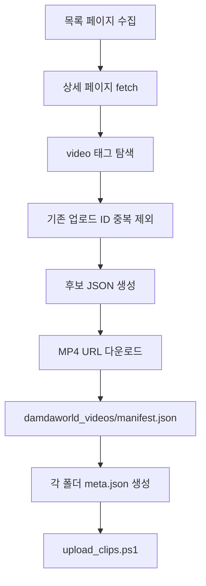

`download_videos.mjs`는 상세 페이지의 `<video>`와 `<source>`를 보고 MP4 URL을 찾는다. 다운로드 결과는 `damdaworld_videos/manifest.json`에 남긴다. 업로드 배치는 이 manifest를 보고 각 폴더의 첫 번째 MP4를 선택한다.

다만 이 단계는 항상 권리 확인이 먼저다. 자동화 구조 자체는 로컬 MP4를 네이버 클립으로 올릴 수 있게 해 주지만, 외부 페이지에서 받은 영상을 그대로 재업로드하는 것은 저작권과 초상권 문제가 생길 수 있다. 운영형으로 쓰려면 "내가 올릴 권리가 있는 MP4만 manifest에 넣는다"는 규칙이 앞에 있어야 한다.

## 사후 수정은 어떻게 했나?

`rewrite_naver_clip_metadata.py`는 이미 올라간 클립의 제목과 설명을 고치는 스크립트다. 흐름은 업로드와 조금 다르다.

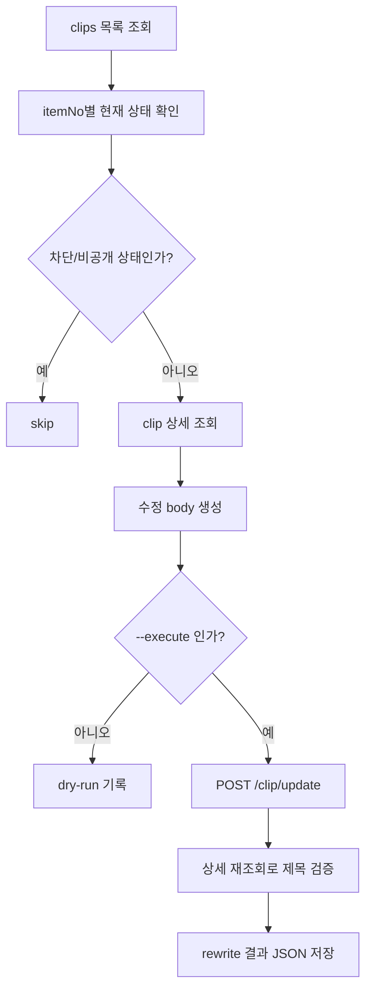

여기서도 dry-run이 먼저다. 이미 공개된 콘텐츠를 수정하는 일은 업로드만큼 조심해야 한다. 특히 정책상 제한되었거나 비공개 상태인 클립은 자동 수정 대상에서 제외하도록 되어 있다.

## JS와 PY 분석을 합치면 무엇이 보이나?

이 프로젝트의 핵심은 JS와 Python이 역할을 나눠 가진다는 점이다.

| 영역 | JS/MJS가 한 일 | Python/PowerShell이 한 일 |
|---|---|---|
| 네트워크 분석 | CDP Network 이벤트 캡처, 요청 순서 파악 | 캡처 결과를 실제 API 호출로 구현 |
| 후보 수집 | HTML 파싱, `<video>` 태그 수집, manifest 생성 | 없음 |
| 메타 생성 | 제목/설명/해시태그 생성, 정책 민감 표현 차단 | 업로드 인자로 전달 |
| 인증 | CDP 쿠키 호출 검증 | CDP 쿠키를 가져와 requests 헤더로 재사용 |
| 파일 업로드 | 프론트엔드 번들에서 Flow.js 규격 추론 | multipart chunk 업로드 구현 |
| 최종 등록 | 수동 업로드 흐름에서 API 확인 | `clip/save` 직접 호출 |
| 운영 안전 | 로그 마스킹, private body 분리 | dry-run, `-Execute`, 중복 skip, 결과 JSON |

브라우저 자동화라고 하면 화면 클릭만 떠올리기 쉽지만, 이 폴더는 그보다 더 아래를 본다. 브라우저가 실제로 어떤 API를 어떤 순서로 호출하는지 분석하고, 그 순서를 Python으로 재현했다. 그래서 UI가 조금 바뀌어도 API 구조가 유지되면 계속 쓸 수 있다. 반대로 내부 API가 바뀌면 UI가 그대로여도 스크립트는 깨질 수 있다.

## 운영할 때 무엇을 조심해야 하나?

내 기준으로 운영 체크리스트는 이렇다.

| 체크 | 이유 |
|---|---|
| Whale CDP 포트는 로컬에서만 열기 | 로그인 세션 접근 통로라서 위험함 |
| 작업 후 원격 디버깅 브라우저 종료 | 쿠키 유출 위험 줄이기 |
| 쿠키/토큰/private 로그 커밋 금지 | 계정 권한 유출 방지 |
| 업로드 전 dry-run 확인 | 제목, 설명, 파일 경로 실수 방지 |
| result JSON 기반 중복 스킵 | 같은 클립 재업로드 방지 |
| 정책 민감 표현 검사 | 제목/설명 문제로 인한 제한 방지 |
| 인코딩 500은 retry | 정상 처리 중인 영상을 조기 실패 처리하지 않기 |
| 권리 확인된 MP4만 사용 | 저작권·초상권 리스크 방지 |

특히 CDP 포트는 가볍게 보면 안 된다. `127.0.0.1:9222`는 로컬 프로세스가 브라우저 세션을 읽을 수 있는 통로다. 편하지만 강력하다. 작업 끝나면 닫는 게 맞다.

## 최종적으로 이 자동화는 어떤 의미인가?

이 폴더의 자동화는 단순히 "네이버 클립에 파일을 올렸다"가 아니다. 구조적으로 보면 이런 출판 라인이 된다.

```text
후보 수집
→ MP4 확보
→ 제목/설명/해시태그 정리
→ 안전성 검사
→ VOD 업로드 세션 생성
→ chunk 업로드
→ draft 생성
→ 썸네일/인코딩 확인
→ clip/save 최종 등록
→ 목록 API 검증
→ 결과 로그 저장
```

YouTube 업로드 글에서 말한 것처럼, 업로드 자동화의 본질은 파일 전송 하나가 아니다. **업로드 가능한 패키지를 만들고, 플랫폼이 기대하는 순서대로 상태를 전진시키고, 마지막에 검증 로그를 남기는 일**이다. 네이버 클립은 이 점이 더 선명했다. VOD 시스템, Creator Studio draft, 썸네일 추출, 최종 공개 저장이 서로 다른 단계로 나뉘어 있기 때문이다.

다음에 이 구조를 더 다듬는다면 나는 세 가지를 먼저 하고 싶다.

1. 업로드 대상 manifest에 `rights_checked: true` 같은 필드를 두고, 확인된 파일만 통과시키기.
2. 썸네일 선택을 자동이 아니라 후보 목록 중 사람이 고를 수 있게 만들기.
3. 결과 JSON을 모아 `itemNo`, 제목, 등록일, 공개 상태, 실패 원인을 한눈에 보는 대시보드로 만들기.

결론은 이렇다. 네이버 클립 자동 업로드는 가능했다. 다만 버튼 클릭 자동화가 아니라, **Creator Studio가 내부적으로 진행하는 VOD 업로드 절차를 CDP와 JS 분석으로 복원하고, Python으로 재현한 구조**였다. 그래서 강력하지만, 동시에 조심해서 써야 한다. 공개 글에 남길 핵심도 업로드 소재가 아니라 이 구조다. 구조를 알고 있으면 다음에는 네이버든 YouTube든, 어떤 플랫폼이든 "파일을 올리는 API"가 아니라 "파일이 게시 가능한 상태가 되는 전체 과정"을 먼저 보게 된다.
