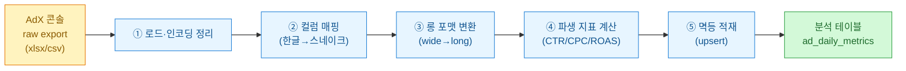
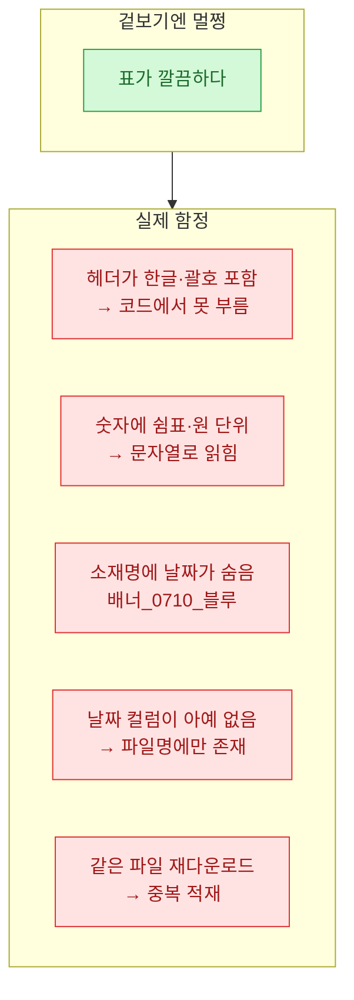
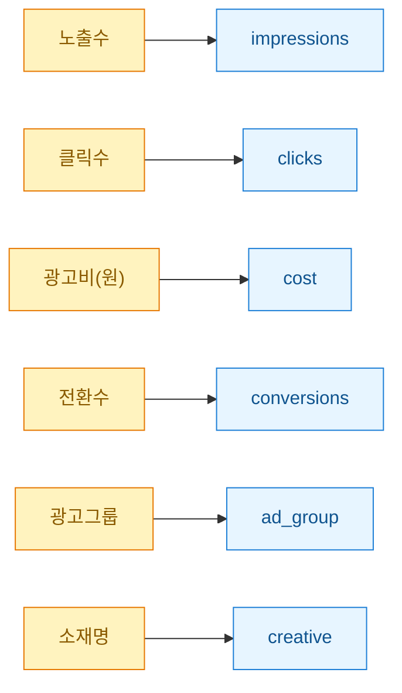
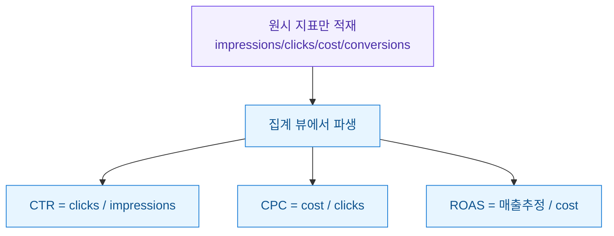
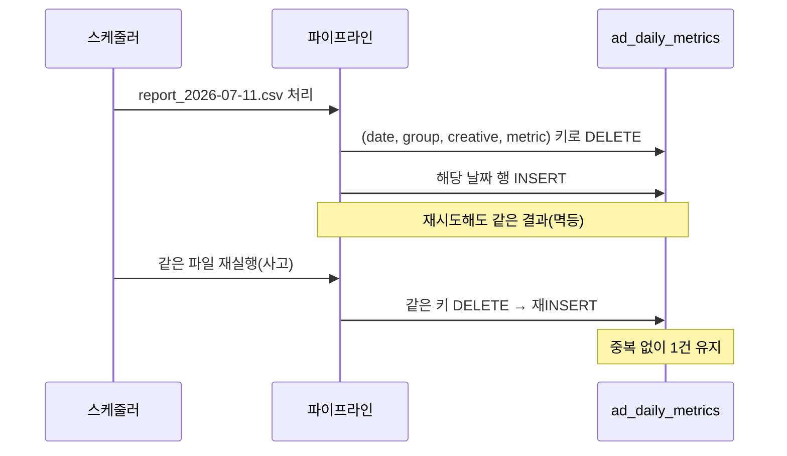

> 이 글의 모든 데이터·플랫폼명·수치는 **합성(더미) 데이터**다. 특정 회사의 실제 광고 계정·거래처·집행 내역은 등장하지 않는다. 광고 플랫폼은 가상의 디스플레이 광고 매체 **"AdX"**로 통칭한다.

광고 리포트를 다루다 보면 늘 같은 지점에서 막힌다. 매체 콘솔에서 내려받은 엑셀·CSV는 사람이 눈으로 보라고 만든 물건이라, 그대로 DB에 넣으면 분석이 안 된다. 헤더가 한글이고, 지표가 가로로 펼쳐져 있고, 소재 이름 안에 날짜가 섞여 있고, 같은 파일을 두 번 받으면 두 배로 쌓인다. 이 글은 그 raw export를 "분석용 테이블"로 바꾸는 전처리 파이프라인을 내 손으로 정리한 기록이다.

## 전체 그림은 어떻게 되나?

먼저 원시 리포트가 분석 테이블이 되기까지의 전체 흐름을 한 장으로 봤다.



핵심은 "사람이 보는 표"를 "기계가 집계하는 표"로 바꾸는 것이다. 왼쪽은 노랑(원본), 가운데는 파랑(가공), 오른쪽은 초록(산출물)으로 색을 나눠 두면 나중에 파이프라인이 커져도 어디가 입력이고 어디가 결과인지 헷갈리지 않는다.

## raw export는 왜 그대로 못 쓰나?

콘솔에서 받은 파일을 열어 보면 대략 이런 모양이다. (합성 데이터)

| 광고그룹 | 소재명 | 노출수 | 클릭수 | 광고비(원) | 전환수 |
|---|---|---|---|---|---|
| 여름_A그룹 | 배너_0710_블루 | 12,430 | 210 | 84,000 | 7 |
| 여름_A그룹 | 배너_0710_레드 | 9,880 | 145 | 61,500 | 4 |
| 여름_B그룹 | 영상_0711_15s | 25,100 | 402 | 133,000 | 11 |

문제는 눈에 잘 안 띈다. 정리하면 이렇다.



특히 네 번째가 고약하다. 일자별 리포트인데 정작 "일자" 컬럼이 파일 안에 없고, 다운로드할 때 지정한 기간이 파일명에만 남는 경우가 많다. 그래서 로드 단계에서 날짜를 **바깥에서 주입**해줘야 한다.

## 첫 단계: 어떻게 안전하게 읽어 들이나?

인코딩과 숫자 포맷을 먼저 잡는다. 한글 CSV는 매체마다 `cp949`거나 `utf-8-sig`라 자동 판별이 필요하고, `84,000` 같은 값은 쉼표를 떼야 숫자가 된다.

```python
import pandas as pd
import re
from pathlib import Path

def load_raw(path: str) -> pd.DataFrame:
    """AdX raw export(csv)를 안전하게 로드. 합성 데이터 기준."""
    for enc in ("utf-8-sig", "cp949"):
        try:
            df = pd.read_csv(path, encoding=enc, dtype=str)
            break
        except UnicodeDecodeError:
            continue
    else:
        raise ValueError(f"인코딩 판별 실패: {path}")

    # 파일명에서 리포트 일자 주입: report_2026-07-11.csv
    m = re.search(r"(\d{4}-\d{2}-\d{2})", Path(path).name)
    df["report_date"] = m.group(1) if m else None

    # 쉼표 섞인 숫자 컬럼 정리
    num_cols = ["노출수", "클릭수", "광고비(원)", "전환수"]
    for c in num_cols:
        df[c] = (df[c].str.replace(",", "", regex=False)
                       .str.replace(r"[^\d.]", "", regex=True)
                       .astype(float))
    return df
```

여기서 이미 두 함정(인코딩·쉼표)을 막고, 파일명에서 날짜를 뽑아 `report_date`로 심었다. 정규식 `\d{4}-\d{2}-\d{2}`는 그냥 "네자리-두자리-두자리"를 찾으라는 뜻이다.

## 한글 헤더는 어떻게 표준화하나?

분석 테이블은 컬럼명이 코드 친화적이어야 한다. 한글 헤더를 스네이크 케이스로 바꾸는 **매핑 딕셔너리**를 하나 두고 관리한다. 매체가 헤더 문구를 바꿔도 이 딕셔너리만 손보면 되니까 유지보수가 편하다.



```python
COLUMN_MAP = {
    "광고그룹": "ad_group",
    "소재명": "creative",
    "노출수": "impressions",
    "클릭수": "clicks",
    "광고비(원)": "cost",
    "전환수": "conversions",
}

def normalize_columns(df):
    df = df.rename(columns=COLUMN_MAP)
    # 소재명에 숨은 날짜 태그 추출: 배너_0710_블루
    df["creative_tag_date"] = df["creative"].str.extract(r"_(\d{4})_")[0]
    return df
```

소재명 안에 박힌 `0710` 같은 태그는 별도 컬럼으로 빼 뒀다. 나중에 "제작 회차별 성과"를 볼 때 쓴다. 원본 문자열은 그대로 두고 파생 컬럼만 추가하는 게 안전하다.

## 지표는 wide로 둘까, long으로 펼까?

이게 설계에서 제일 갈리는 지점이다. 원본은 지표가 가로로 나열된 **wide 포맷**인데, BI 도구나 집계 쿼리에는 지표를 세로로 세운 **long 포맷**이 훨씬 유연하다.

| 구분 | wide 포맷 | long 포맷 |
|---|---|---|
| 모양 | 한 행에 지표들이 컬럼으로 | 한 행에 지표 하나(metric/value) |
| 새 지표 추가 | 컬럼(스키마) 변경 필요 | 행만 추가, 스키마 불변 |
| 사람이 보기 | 편함 | 불편 |
| 집계·피벗 | 지표마다 쿼리 수정 | GROUP BY 한 방 |
| 추천 용도 | 최종 리포트 출력 | 적재·분석 저장소 |

나는 저장은 long, 출력은 wide 원칙으로 간다. 적재 테이블은 long으로 두고, 대시보드에 뿌릴 때만 피벗한다.

```python
def to_long(df):
    id_cols = ["report_date", "ad_group", "creative"]
    metric_cols = ["impressions", "clicks", "cost", "conversions"]
    long = df.melt(
        id_vars=id_cols,
        value_vars=metric_cols,
        var_name="metric",
        value_name="value",
    )
    return long
```

## 파생 지표는 언제 계산하나?

CTR·CPC·ROAS 같은 파생 지표는 **저장하지 않고 조회 시 계산**하는 걸 기본으로 삼는다. 원시 지표(노출·클릭·비용·전환)만 적재해 두면, 정의가 바뀌어도 원본을 다시 안 받아도 되기 때문이다. 저장은 원자적 값만, 비율은 뷰에서.



분모가 0일 때(노출은 있는데 클릭 0 등)를 반드시 방어해야 한다. SQL에서는 `NULLIF`로 처리하는 게 깔끔하다.

```sql
-- 합성 스키마 기준. long 테이블을 다시 피벗해 파생 지표 계산
SELECT
  report_date,
  ad_group,
  creative,
  SUM(CASE WHEN metric='impressions' THEN value END) AS impressions,
  SUM(CASE WHEN metric='clicks'      THEN value END) AS clicks,
  SUM(CASE WHEN metric='cost'        THEN value END) AS cost,
  -- CTR: 분모 0 방어
  ROUND(
    SUM(CASE WHEN metric='clicks' THEN value END)
    / NULLIF(SUM(CASE WHEN metric='impressions' THEN value END), 0),
    4
  ) AS ctr
FROM ad_daily_metrics_long
GROUP BY report_date, ad_group, creative;
```

## 같은 파일을 두 번 받으면 어떻게 되나?

운영에서 제일 자주 터지는 사고다. 스케줄러가 재시도하거나 사람이 수동으로 또 받으면 같은 날짜 데이터가 두 번 쌓인다. 그러면 지표가 2배로 부풀어 리포트가 통째로 틀린다. 해법은 **멱등 적재(idempotent upsert)** — 몇 번을 돌려도 결과가 같게 만드는 것.



핵심은 "append(추가)"가 아니라 "해당 날짜를 지우고 다시 넣기"다. 자연키를 `(report_date, ad_group, creative, metric)`로 잡고, 적재 전에 같은 날짜를 삭제한 뒤 넣으면 몇 번을 돌려도 안전하다.

```python
def upsert_by_date(conn, long_df, report_date):
    cur = conn.cursor()
    # ① 같은 날짜 먼저 제거 (멱등성 확보)
    cur.execute(
        "DELETE FROM ad_daily_metrics_long WHERE report_date = ?",
        (report_date,),
    )
    # ② 새로 적재
    rows = long_df[long_df["report_date"] == report_date]
    cur.executemany(
        """INSERT INTO ad_daily_metrics_long
           (report_date, ad_group, creative, metric, value)
           VALUES (?, ?, ?, ?, ?)""",
        rows[["report_date", "ad_group", "creative",
              "metric", "value"]].itertuples(index=False, name=None),
    )
    conn.commit()
```

## 파이프라인을 한 번에 돌리면?

앞의 조각들을 이어 붙이면 파일 하나가 분석 테이블로 들어가는 한 사이클이 완성된다.

```python
def run(path, conn):
    df = load_raw(path)              # ① 로드·인코딩·숫자정리
    df = normalize_columns(df)       # ② 헤더 매핑·태그 추출
    long = to_long(df)               # ③ wide → long
    date = df["report_date"].iloc[0]
    upsert_by_date(conn, long, date) # ⑤ 멱등 적재
    print(f"적재 완료: {date}, {len(long)}행")
```

파생 지표(④)는 적재가 아니라 조회 시점에 뷰로 계산하니 이 사이클엔 안 들어간다. 실제 운영에서는 이 `run`을 폴더 감시나 스케줄러에 걸어 두면 된다.

## 정리하면


핵심 세 줄로 남긴다.

- 원본은 사람이 보라고 만든 표이므로, **컬럼 매핑·숫자 정리·날짜 주입**으로 기계가 읽을 형태로 먼저 바꾼다.
- 저장은 **long 포맷 + 원시 지표만**, 비율(CTR·CPC·ROAS)은 조회 시 뷰에서 계산해 정의 변경에 강하게 만든다.
- 광고 데이터 파이프라인의 진짜 안정성은 화려한 집계가 아니라 **멱등 적재** — 같은 파일을 몇 번 넣어도 결과가 같은가에서 갈린다.
