> "검색은 '이 질문에 맞는 글'을 고른다. 홈피드는 '이 사람이 지금 궁금해할 글'을 고른다. 같은 방법으로 공략할 수 없다."

블로그를 하다 보면 어느 순간 이런 걸 느낀다. **검색 유입은 그대론데 갑자기 조회수가 튀는 날이 있다.** 유입 경로를 보면 검색이 아니다. 네이버 앱을 켰을 때 뜨는 그 피드, 홈피드에서 들어온 것이다.

그런데 이 홈피드가 어떻게 돌아가는지에 대해 인터넷에 도는 이야기는 대부분 추측이다. "이렇게 하면 홈판 뜬다"는 카더라가 많고 근거가 없다. 그래서 이 글은 **네이버가 직접 공개한 자료 두 개만 가지고** 정리했다. 네이버가 매년 여는 개발자 콘퍼런스에서 홈피드를 만든 팀이 직접 발표한 내용이다.

읽는 분들이 IT 쪽이 아니라는 걸 아니까, **용어는 나올 때마다 전부 풀어서** 쓰겠다. 그림도 최대한 많이 넣었다.

## 이 글의 근거는 어디서 왔나?

두 개의 공식 발표 자료다. 둘 다 네이버가 공개해 둔 것이라 누구나 볼 수 있다.

| 자료 | 발표자 | 무엇을 다루나 |
|---|---|---|
| **[홈피드: 네이버의 진입점에서 추천피드를 외치다!](https://dan.naver.com/24/sessions/602)** (DAN 24) | 김세호·김영세·박희성 (NAVER 발견/탐색 프로덕트) | 홈피드 추천이 **기술적으로 어떻게 작동하는지** — 후보를 어떻게 모으고, 어떤 기준으로 순위를 매기고, 첫 카드를 어떻게 고르는지 |
| **[사용자에 대한 이해로부터: 검색과 홈피드 서비스의 성장 문법](https://dan.naver.com/25/sessions/726)** (DAN25) | 김기동 (NAVER Data Strategy & Operations Center) | 홈피드와 검색을 **어떤 지표로 성장시키고 있는지** — 무엇을 좋게 만들려고 실험하고 있는지 |

세션 전체 목록은 [DAN 24 세션](https://dan.naver.com/24/sessions)과 [DAN25 세션](https://dan.naver.com/25/sessions)에서 볼 수 있다. 관련 발표로 [검색과 피드의 만남: LLM으로 완성하는 초개인화 서비스](https://dan.naver.com/24/sessions/585)도 같이 보면 좋다.

> ⚠️ **먼저 솔직하게 짚고 갑니다.**
> 이 발표들은 **"블로거를 위한 노출 공략집"이 아닙니다.** 네이버 엔지니어들이 자기들이 만든 시스템을 기술적으로 설명한 자료예요. 그래서 이 글에서 **"발표에 나온 사실"과 "그걸 보고 제가 유추한 블로그 전략"은 색깔을 나눠서** 적었습니다.
> 그리고 어떤 방법도 **홈피드 노출을 보장하지 않습니다.** 추천 시스템은 사람마다 다르게 작동하고 계속 바뀝니다. 이 글은 "확률을 올리는 법"이지 "확실한 방법"이 아닙니다.

## 홈피드가 대체 뭔가?

네이버 앱을 켜면 나오는 첫 화면을 **검색홈**이라고 부른다. 검색창이 있고, 그 아래로 콘텐츠 카드들이 쭉 이어진다. **그 아래로 이어지는 카드 목록이 홈피드**다.

여기서 아주 중요한 사실 하나가 김기동 발표에 나온다.

> **검색홈에 상위 2개 문서가 기본으로 노출된다. 단, 클릭 또는 스크롤에 의해서 서비스에 진입한다.**

무슨 뜻이냐면 이렇다.

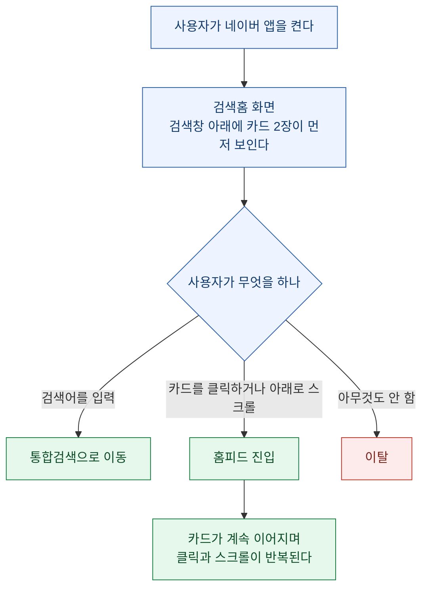

즉 **화면에 처음 보이는 카드 두 장이 "이 피드를 계속 볼지 말지"를 결정한다.** 그 두 장이 시시하면 사용자는 그냥 검색창에 뭔가를 치거나 앱을 닫는다. 이게 나중에 나올 **"첫 번째 카드가 왜 그렇게 중요한가"**의 배경이다.

그리고 이 홈피드는 지금 엄청나게 커지고 있다. DAN 24 발표에 나온 수치다.

| 지표 | 변화 |
|---|---|
| DAU (하루에 쓰는 사람 수) | **+600%** |
| Clicks (클릭 수) | **+800%** |

김기동 발표의 숫자도 같은 방향이다.

| 시점 | 상황 |
|---|---|
| 2023년 9월 | 서비스 초기. 사용자 규모도 크지 않고 충성 고객도 특정되지 않음 |
| 2024년 9월 | **DAU 약 400% 성장**, 충성 고객(Heavy User) **약 1,500% 성장** |
| 2025년 9월 | DAU **약 24% 성장**, Heavy User **105% 성장** — 양적 성장에 더해 질적 성장 확인 |

**블로거 입장에서 이게 왜 중요한가.** 네이버가 이 서비스에 계속 힘을 싣고 있고, 실제로 사람들이 여기서 콘텐츠를 소비하는 양이 폭증하고 있다는 뜻이다. **검색 유입만 보고 있으면 점점 커지는 파이프를 통째로 놓친다.**

## 먼저 용어부터 풀고 갑시다

발표 자료에 나오는 말들이 낯설 수 있어서 먼저 사전을 만들었다. **이 표만 이해하면 이 글 나머지는 다 읽힌다.**

| 용어 | 쉬운 말로 | 조금 더 자세히 |
|---|---|---|
| **홈피드** | 네이버 앱 첫 화면의 추천 카드 목록 | 검색어를 안 쳐도 알아서 보여주는 영역 |
| **Rank1 (랭크원)** | **첫 번째 카드** | 피드 맨 위에 놓이는 콘텐츠. 별도로 특별 관리된다 |
| **콘텐츠 풀** | 후보 창고 | 블로그·카페·네이버TV·포스트·클립(숏폼) 등 추천 대상 전체 |
| **리트리버(Retriever)** | **후보를 긁어오는 사람** | 수억 개 글 중에서 "이 사람한테 보여줄 만한 것" 수백 개를 1차로 뽑아오는 장치. 종류가 여러 개다 |
| **랭커(Ranker)** | **줄 세우는 사람** | 리트리버가 뽑아온 후보들의 순서를 정하는 장치 |
| **CTR** | 클릭률 | 100번 보여줬을 때 몇 번 눌렸는지. 10번 눌리면 10% |
| **체류시간** | 머문 시간 | 글을 열고 나서 얼마나 오래 읽었는지 |
| **DAU** | 하루 사용자 수 | Daily Active Users. 하루에 그 서비스를 쓴 사람 수 |
| **세션** | 한 번 들어와서 나갈 때까지 | 앱을 켜서 쓰다가 끄기까지의 한 덩어리 |
| **임베딩(Embedding)** | **글을 숫자 좌표로 바꾼 것** | 글의 의미를 숫자 목록으로 바꿔 놓으면, 비슷한 글끼리 좌표가 가까워진다. 그래서 "비슷한 글 찾기"가 계산으로 가능해진다 |
| **ANN** | 가까운 좌표 빠르게 찾기 | Approximate Nearest Neighbor. 위 좌표들 중 가까운 것을 빠르게 골라내는 기술 |
| **A/B 테스트 (ABT)** | 두 가지 안을 나눠서 실험 | 사용자를 두 무리로 갈라 A안과 B안을 각각 보여주고 어느 쪽 반응이 좋은지 재는 것 |
| **세그먼트** | 사용자 묶음 | 비슷한 성향의 사용자끼리 묶은 그룹 |
| **밴딧(Bandit)** | **탐색과 활용을 섞는 방법** | 잘 먹히던 걸 계속 보여줄지(활용), 새로운 걸 시험해 볼지(탐색)를 확률로 섞는 방식 |
| **캘리브레이션(Calibration)** | **비율 맞추기** | 그 사람이 실제로 소비하는 주제 비율에 맞춰 추천 비율을 조정하는 것 |

## 홈피드는 어떤 순서로 내 글을 고르나?

DAN 24 발표는 이걸 **비빔밥 만들기**에 비유했다. 재료를 모으고, 골라 담고, 비벼서 낸다.

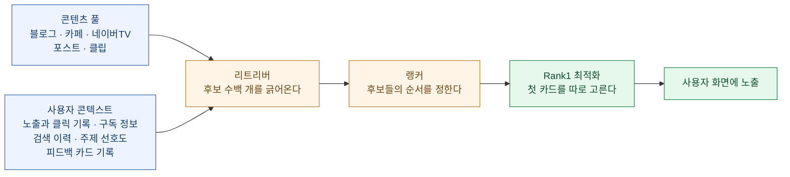

**핵심은 관문이 세 개라는 것이다.**

1. **리트리버 관문** — 내 글이 애초에 후보에 뽑혀야 한다. 여기서 걸리지 못하면 아무리 좋은 글이어도 끝이다.
2. **랭커 관문** — 후보들 사이에서 위로 올라가야 한다.
3. **Rank1 관문** — 첫 카드로 뽑히면 노출과 클릭이 폭발한다.

검색 상위노출을 생각하던 관성으로 보면 이 구조가 낯설다. 검색에서는 "질문(키워드)"이 먼저 있고 거기에 맞는 글을 찾는다. **홈피드에는 질문이 없다.** 대신 "이 사람"이 있다. 그래서 내 글이 뽑히는 조건이 **키워드 매칭이 아니라 "누구의 어떤 맥락에 걸리느냐"**로 바뀐다.

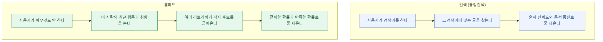

## 리트리버 — 홈피드로 들어가는 문은 여러 개다

여기가 이 글에서 가장 실용적인 부분이다. **리트리버는 한 종류가 아니라 여러 종류이고, 각각 다른 이유로 글을 뽑아온다.** 문이 여러 개라는 뜻이고, **내가 어느 문을 노릴지 고를 수 있다는 뜻**이다.

DAN 24 발표에 나온 리트리버들을 정리하면 이렇다.

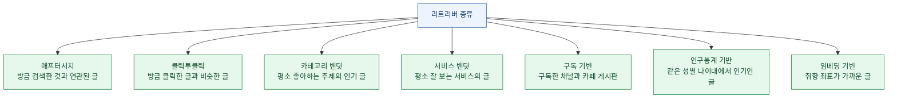

하나씩 뜯어보자. **각 문마다 "네이버가 발표한 사실"과 "그래서 블로거는 뭘 해야 하나"를 나눠서** 적는다.

### 문 1. 애프터서치 — 방금 검색한 것과 이어지는 글

**📘 발표에 나온 사실**

사용자가 **하루 이내에 검색한 이력과 연관된 문서**를 추천하는 리트리버다. 작동 방식은 이렇다.

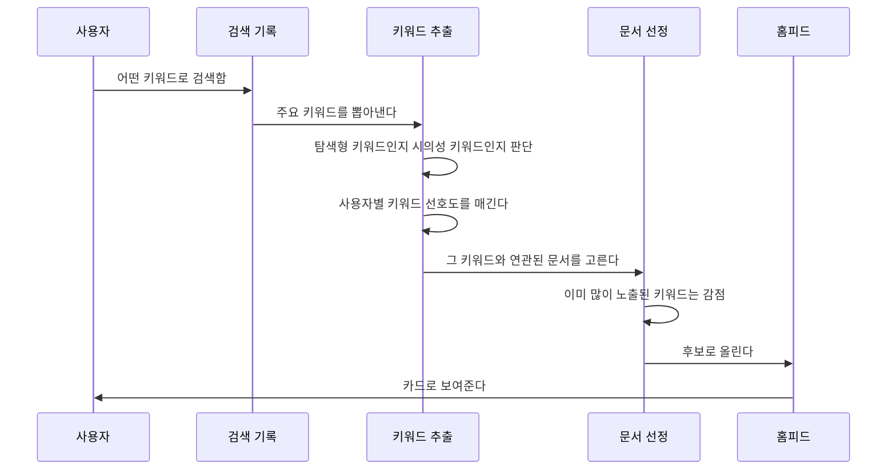

여기서 눈여겨볼 게 두 가지 있다.

- **"탐색형 / 시의성 키워드"를 골라낸다.** 모든 검색어를 쓰는 게 아니라, 더 알아보고 싶어 할 만한 것과 지금 시점에 의미 있는 것을 고른다.
- **"키워드 노출 패널티"가 있다.** 같은 키워드로 계속 보여주면 감점된다. 한 주제로 도배되는 걸 시스템이 스스로 막는다.

도입 후 성과도 공개됐다. 홈피드를 거의 안 쓰던 라이트 사용자층 대상이다.

| 지표 | 변화 |
|---|---|
| Rank1 CTR (첫 카드 클릭률) | **+5.4%** |
| 문서 다양성 | **+34.7%** |
| 전체 클릭 수 | +2.1% |
| 스크롤 세션 비율 | +1.1% |

**💡 그래서 블로거는**

이건 제 해석입니다. **"사람들이 검색한 직후에 더 알고 싶어할 글"을 쓰면 이 문에 걸릴 확률이 올라간다.** 검색 결과 상위에 오르는 것과는 조금 다른 얘기다.

예를 들어 누가 "속초 여행"을 검색했다고 하자. 검색 결과에서는 "속초 여행 코스" 같은 정공법 글이 상위를 먹는다. 그런데 애프터서치는 **그 검색 이후에 궁금해질 것**을 준다. "속초 갔다가 실패한 식당", "속초 주차 진짜 답 없는 구간", "속초 2박3일 실제 쓴 돈". 이런 글이다.

정리하면 이렇다.

| 검색을 노릴 때 | 애프터서치를 노릴 때 |
|---|---|
| 검색어를 제목에 정확히 넣는다 | 검색어의 **다음 질문**을 제목에 넣는다 |
| 그 키워드의 표준 정보를 담는다 | 검색 결과에 없는 **경험과 후일담**을 담는다 |
| 정보 완결성이 중요 | **호기심 자극**이 중요 |

### 문 2. 클릭투클릭 — 방금 읽은 글과 비슷한 글

**📘 발표에 나온 사실**

사용자가 **하루 이내에 클릭한 문서 중 최신 것을 씨앗(Seed)으로 삼아**, 그것과 비슷한 문서를 찾아준다. 방법은 이렇다.

① 사용자가 클릭한 문서 중 최신 것을 씨앗으로 고른다
② 홈피드 문서들을 **임베딩**(글을 숫자 좌표로 바꾼 것)으로 변환해 둔다
③ **ANN**으로 씨앗 좌표와 가까운 문서 N개를 뽑는다

성과는 이렇다(미디엄/헤비 사용자 대상).

| 지표 | 미디엄 | 헤비 |
|---|---|---|
| Rank1 CTR | +4.07% | +2.37% |
| 문서 다양성 | +0.9% | +1.53% |
| 전체 클릭 수 | +1.07% | +1.42% |
| 스크롤 세션 비율 | +1.32% | +0.87% |

**💡 그래서 블로거는**

여기가 **"비슷한 글 좌표"의 세계**다. 키워드가 정확히 같지 않아도, **의미가 가까우면 걸린다.** 반대로 말하면 **내 글이 어느 좌표에 찍히는지가 애매하면 아무 씨앗에도 안 걸린다.**

제 해석으로 실무 함의는 이렇다.

- **한 글에 주제를 여러 개 섞지 말 것.** 맛집 얘기하다 육아 얘기하다 재테크로 끝나면 좌표가 뭉개진다. 뭉개진 좌표는 어떤 씨앗과도 안 가깝다.
- **같은 주제로 여러 편을 쓰면 유리하다.** 독자가 내 글 하나를 클릭하면, 그 좌표 근처에 내 다른 글이 있을 때 연달아 뽑힐 수 있다.
- **제목과 본문의 주제가 일치해야 한다.** 좌표는 실제 내용으로 찍힌다.

### 문 3과 4. 카테고리 밴딧 · 서비스 밴딧 — 취향 기반

**📘 발표에 나온 사실**

밴딧은 **"잘 먹히던 것을 계속 줄지(활용), 새로운 걸 시험해 볼지(탐색)"를 확률로 섞는 방식**이다. 발표에 나온 설정은 이렇다.

| 항목 | 내용 |
|---|---|
| 방식 | 일정 확률로 랜덤 선택을 섞는 엡실론 그리디(Epsilon-Greedy) |
| 콘텍스트가 **충분한** 사용자 | **카테고리**를 고른다 (예: 자동차 > 차종) |
| 콘텍스트가 **부족한** 사용자 | **서비스**를 고른다 (예: 블로그) |
| 활용(exploitation) | 최근 클릭한 콘텐츠의 카테고리·서비스가 선택될 확률이 높다 |
| 탐색(exploration) | 일정 확률로 선택을 바꿔 본다 |
| 카테고리 개수 | **500개 이상** |
| 서비스 개수 | **8개** (블로그, 카페 등) |

그리고 별도로, LLM(대규모 언어모델)을 써서 홈피드 문서의 주제를 분류하고 있다. **약 760개 주제 분류**를 쓴다고 밝혔다. 예시로 든 게 이렇다.

```text
제목: 휴양과 관광을 동시에! 가성비 갑 방콕 여행
→ 여행 > 해외여행: 0.75
   여행 > 국내여행: 0.15
   스포츠/레저 > 해외야구: 0.01
   건강 > 다이어트: 0.0001
```

**💡 그래서 블로거는**

이게 제가 이 발표에서 **가장 중요하다고 본 지점**입니다.

**내 글은 발행되는 순간 LLM이 읽고 760개 주제 중 어디에 속하는지 점수로 매긴다.** 그리고 그 주제 점수가 "이 카테고리를 좋아하는 사람"에게 노출될 자격을 만든다.

여기서 나오는 실전 원칙 세 가지.

**① 내 글의 주제 점수가 뾰족해야 한다.** 위 예시에서 "여행 > 해외여행 0.75"처럼 한 곳에 점수가 몰려야 한다. 이것저것 섞인 글은 어느 주제에서도 0.2~0.3에 머물러서 어느 카테고리 팬에게도 안 걸린다.

**② 블로그 전체의 주제도 일관돼야 한다.** 카테고리 밴딧은 "이 사람이 좋아하는 카테고리의 인기 글"을 뽑는다. 내 블로그가 특정 카테고리에서 반응이 좋다는 신호가 쌓여야 그 카테고리 후보군에 자주 오른다.

**③ 그런데 완전히 한 우물만 파도 안 된다.** 탐색(exploration) 확률 때문에 새 주제도 시험 노출된다. 이게 **신규 블로거에게 열려 있는 틈**이다. 뒤에서 다시 다룬다.

### 문 5, 6, 7. 구독 · 인구통계 · 임베딩

나머지 셋은 짧게 정리한다.

| 문 | 발표에 나온 내용 | 블로거 함의 (제 해석) |
|---|---|---|
| **구독 기반** | 구독한 채널과 카페 게시판에서 뽑아온다 | **이웃·구독자 확보가 그대로 노출 자산이 된다.** 검색에서는 구독자가 직접적인 순위 요소가 아니지만 홈피드에서는 별도의 문이다 |
| **인구통계 기반** | 같은 성별·연령대 사용자에게 인기인 문서 | 내 글이 **특정 성별·연령대에서 잘 먹히면** 그 층 전체로 확산될 수 있다. 타깃이 뚜렷한 글이 유리하다 |
| **임베딩 기반** | EASE, Two-tower 모델 등 | 함께 소비되는 패턴과 취향 좌표로 뽑는다. 역시 **주제가 뚜렷할수록** 좌표가 선명해진다 |

여기에 더해 **AiRScout**라는 게 있다. LLM으로 사용자의 맥락을 더 풍부한 태그로 바꾸는 기술이다. 발표에 나온 예가 재밌다.

```text
사용자가 검색한 키워드: "뉴진스"
사용자가 클릭한 문서 제목: "뉴진스 일본 데뷔 타이틀 뮤비 공개"
→ LLM이 만든 태그: "뉴진스 supernatural 뮤비"
```

**단순히 "뉴진스"가 아니라 "뉴진스의 어떤 부분에 관심 있는지"까지 좁혀서 잡는다.** 제 해석으로는, 앞으로 **넓은 키워드보다 구체적인 소재가 더 잘 걸릴 것**이라는 신호로 읽힌다.

## 랭커 — 클릭만 잘 나면 되는 게 아니다

후보가 모였으면 순서를 정해야 한다. 발표는 랭킹의 어려움을 세 가지로 정리했다.

| 어려움 | 해결책 |
|---|---|
| 성격이 전혀 다른 콘텐츠를 한 피드에서 줄 세우기 | DCN 랭커 |
| 클릭할 확률뿐 아니라 **만족할 확률**까지 예측하기 | **MDE 랭커** |
| 정확한 추천만이 아니라 다양하게 발견하게 하기 | 캘리브레이션 |

두 번째가 블로거에게 결정적이다.

### 📘 MDE 랭커 — 클릭 확률과 만족 확률을 함께 본다

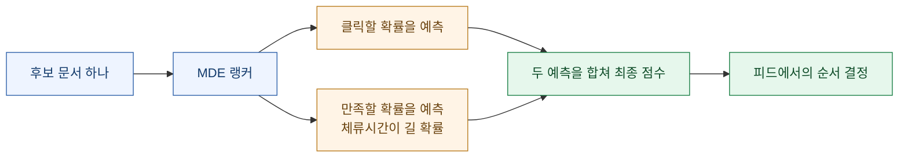

발표에 따르면 이 랭커를 도입한 A/B 테스트 결과는 이랬다(기존 DCN 랭커 대비).

| 지표 | 변화 |
|---|---|
| 새로운 사용자 수 | +1.85% |
| 클릭 사용자 비율 | +2.31% |
| 전체 CTR | +4.19% |
| **Rank1 CTR** | **+5.70%** |

참고로 그 이전 단계인 DCN 랭커도 기존 방식 대비 전체 클릭 수 +9.43%, 전체 CTR +8.99%, Rank1 CTR +8.37%를 기록했다.

### 💡 그래서 블로거는 — 낚시 제목이 손해인 이유

이건 제 해석이지만 근거가 분명하다. **시스템이 "클릭 확률"과 "체류시간이 길 확률"을 따로 예측해서 합친다.**

그러면 이런 일이 벌어진다.

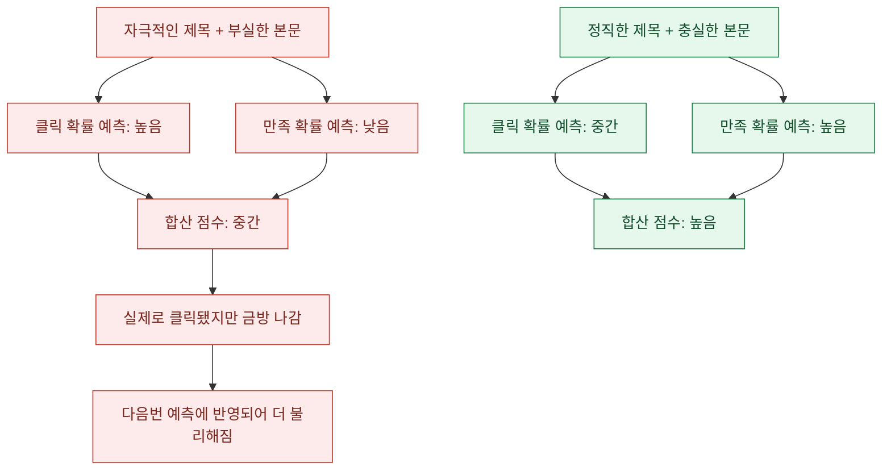

검색 최적화 시절의 습관 중에 **"일단 클릭만 시키면 된다"**가 있었다. 홈피드에서는 이게 정확히 반대로 작동할 수 있다. **클릭은 되는데 3초 만에 나가는 글**은 만족 확률 예측을 스스로 깎는다.

실무적으로는 이렇게 번역된다.

- 제목이 약속한 것을 **본문 앞부분에서 바로** 지켜라. 스크롤을 한참 내려야 나오면 그 전에 나간다.
- **결론을 뒤에 숨기지 마라.** 체류시간을 늘리려고 결론을 미루는 건 옛날 방식이고, 지금은 이탈만 부른다.
- 사진만 잔뜩이고 글이 없는 포스팅은 **읽을 시간 자체가 안 나온다.**

## 다양성 — 한 우물을 파되, 쏠리면 안 된다

이 절은 두 발표가 정면으로 만나는 지점이라 좀 길게 쓴다.

### 📘 캘리브레이션 — 비율을 맞춘다

발표에 나온 개념 설명이 명쾌하다.

```text
유저가 실제로 소비한 카테고리 비율:  패션 70% / 여행 30%
랭커가 추천한 카테고리 비율:          패션 50% / 여행 50%
→ 이 차이를 줄이는 방향으로 보정한다
```

즉 **그 사람의 실제 취향 비율에 맞춰 피드 구성을 조정한다.** 결과는 이랬다.

| 지표 | 변화 |
|---|---|
| 전체 CTR | +1.11% |
| 인당 클릭 수 | +1.53% |
| 인당 체류시간 | +0.46% |

### 📘 다양성 실험 — 김기동 발표의 핵심

김기동 발표는 여기에 실험을 하나 더 얹었다. 가설은 이랬다.

> **첫 번째 카드(Rank1)의 문서 다양성이 높으면, 사용자의 주간 방문일수도 증가할 것이다.**

그런데 2025년 초 기준으로 **Rank1 문서 다양성은 꾸준히 감소**하고 있었다(일부 카테고리 쏠림 현상). 그래서 실험을 두 번 돌렸다.

| 실험 | 기간 | 조작 | 결과 |
|---|---|---|---|
| **밴딧 탐색 계수 조정** | 3/13~3/19 | 실험군1: 다양성 **감소** | Rank1 클릭률과 검색홈→홈피드 전환율 **감소** |
| | | 실험군2: 다양성 **증가** | Rank1 클릭률과 전환율 **증가** |
| **리트리버 최적화** | 4/22~4/29 | 리트리버 다양성 감소 → 카테고리 다양성 증가 | Rank1 클릭률과 전환율 **증가** |

결론은 **가설 검증**이었다. 랭크1 문서 다양성이 증가하면 사용자 리텐션(주간 방문일수)이 증가한다. 이 결과는 2025년 상반기에 실제 서비스에 반영됐다.

그런데 **여기에 아주 중요한 예외가 붙는다.** 네이버 유저 모델(NUM) 10개 세그먼트로 쪼개서 보니 이랬다.

| 세그먼트 | 다양성과 방문일수의 관계 |
|---|---|
| 전체적으로 | **양의 관계** (다양할수록 자주 온다) |
| Active Senior W (50대 이상 여성) | **음의 관계** — 관심 있는 특정 카테고리(엔터)를 첫 카드에 집중적으로 보여주는 걸 선호 |
| Gen Z W, Single W | 채널 다양성과 **음의 관계** |
| 효과가 큰 층 | Single M, Dad, Couple M |

즉 **"다양성이 좋다"는 전체 평균의 이야기이고, 어떤 층은 반대**다.

### 💡 그래서 블로거는

여기서 제가 끌어낸 결론은 세 줄이다.

**첫째, 블로그 전체는 한 주제로 뾰족하게.** 그래야 카테고리 밴딧과 임베딩에서 좌표가 선명해진다.

**둘째, 그 주제 안에서는 소재를 다양하게.** 시스템이 "카테고리 쏠림"을 스스로 줄이고 있다. 똑같은 소재를 반복하면 키워드 노출 패널티까지 겹친다. 예를 들어 캠핑 블로그라면 장비 리뷰만 30편 쓰지 말고, 장비·사이트 후기·요리·실패담·비용 정리로 소재를 벌려라.

**셋째, 내 독자층이 어느 세그먼트인지 알면 전략이 갈린다.** 50대 이상 여성 독자가 많다면 다양성보다 **한 관심사를 깊게 파는 쪽**이 유리할 수 있다는 게 발표의 시사점이다.

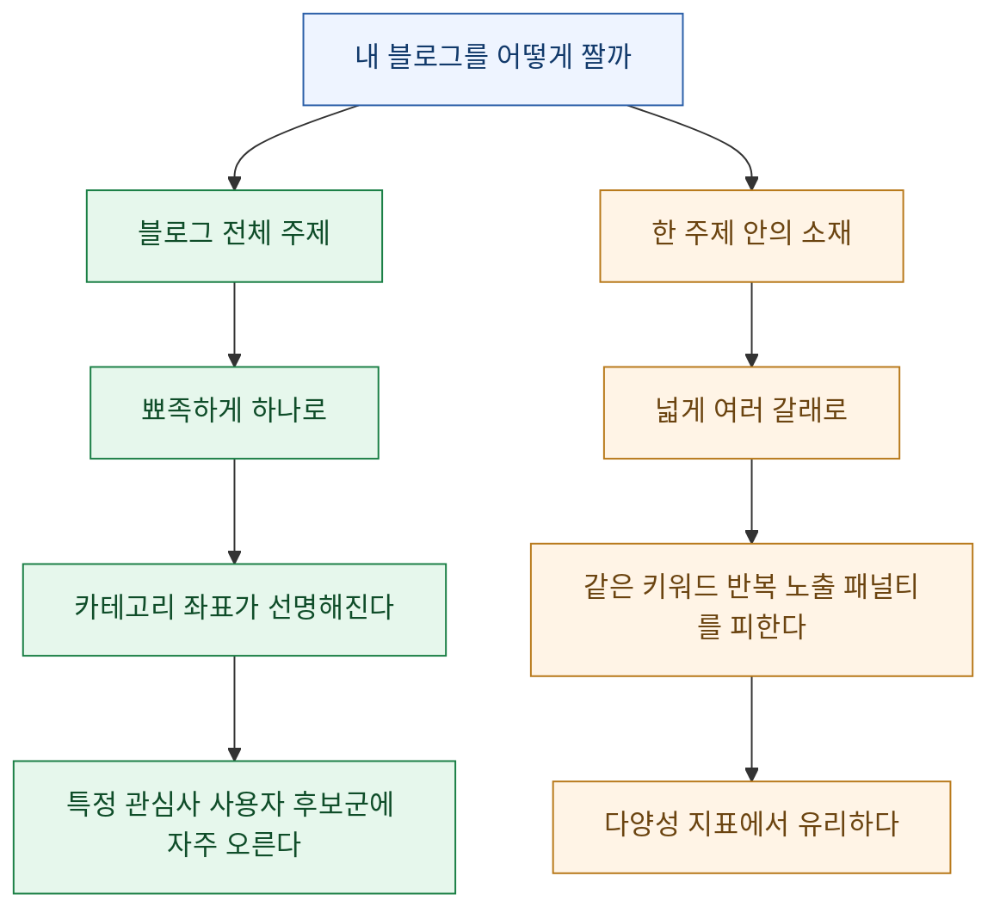

## 첫 번째 카드 — 이 한 장이 판을 가른다

### 📘 발표가 공개한 숫자

DAN 24 발표에서 가장 강렬한 부분이다. 첫 카드(Rank1)에 대해 이렇게 적혀 있다.

> **첫 번째 콘텐츠 = 서비스의 첫 이미지**

그리고 숫자 셋.

| 항목 | 수치 |
|---|---|
| 네이버 앱에 진입한 사용자 | **전원에게 홈피드가 노출된다** |
| 홈피드 클릭 중 Rank1에서 발생하는 클릭 비율 | **23%** |
| Rank1 클릭 여부에 따른 사용자의 하단 CTR 상승 비율 | **45%** |

세 번째 줄이 중요하다. **첫 카드를 클릭한 사람은 그 아래 카드들도 45% 더 많이 누른다.** 첫 카드가 "이 피드 볼 만하네"라는 신호가 되는 것이다.

그리고 첫 카드 최적화 A/B 테스트 결과.

| 지표 | 변화 |
|---|---|
| 유저 수 | **+41.4%** |
| 클릭 수 | **+38.4%** |
| 체류시간 | **+9.8%** |

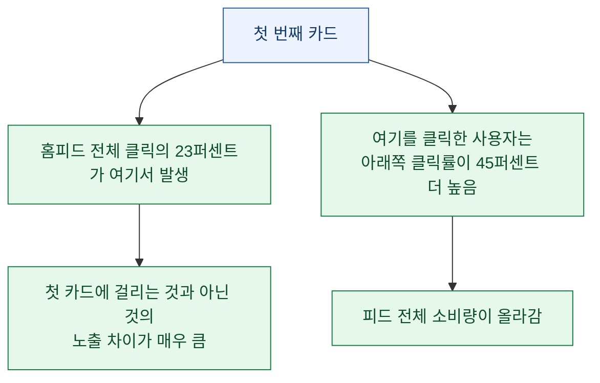

### 📘 첫 카드는 어떻게 뽑히나

발표에 따르면 첫 카드는 **어떤 리트리버에서 가져올지를 먼저 고르는 방식**으로 정해진다. 사용자의 행동과 맥락을 보고, 네 개의 리트리버 중 하나를 선택한다.

| 리트리버 | 언제 선택되나 |
|---|---|
| 애프터서치 | 콘텍스트가 적은 사용자. 홈피드 인식이 낮음. **현재 관심사인 검색 결과로 첫 카드 추천** |
| 클릭투클릭 | 콘텍스트가 충분한 사용자. **최근 클릭한 콘텐츠와 유사한 것으로 추천** |
| 카테고리·서비스 밴딧 | 관심사 기반 |
| MDE 랭커 | 만족할 만한 것 기반 |

이걸 고르는 데도 모델을 쓴다. **컨텍스추얼 밴딧(LinUCB)** 이라는 방식으로, **콘텐츠를 직접 고르는 게 아니라 "어느 리트리버를 쓸지"를 고른다.** 사용할 정보는 이렇다.

- **행동 패턴**: 최근 N시간 이내 검색·클릭 횟수, 검색·클릭 이후 경과 시간, 클릭한 콘텐츠
- **콘텍스트**: 사용자의 클릭 빈도, 세대·성별 정보, 구독과 선호도

### 💡 그래서 블로거는

**첫 카드는 "사람마다 다른 문"으로 뽑힌다.** 그러니 "첫 카드에 뜨는 필승법"은 존재하지 않는다. 대신 **내가 어느 문에 서 있는지**는 고를 수 있다.

| 내 글의 성격 | 어느 문에서 첫 카드가 될 가능성 |
|---|---|
| 방금 뜬 이슈·시의성 소재 | **애프터서치** — 검색 직후 사용자에게 |
| 특정 주제의 깊은 후속편 | **클릭투클릭** — 비슷한 글 읽은 직후 사용자에게 |
| 확실한 카테고리의 반응 좋은 글 | **카테고리 밴딧** — 그 주제 팬에게 |
| 읽는 데 시간이 걸리는 충실한 글 | **MDE 랭커** — 만족도 예측이 높게 |

## 독자 등급마다 열리는 문이 다르다

### 📘 발표가 밝힌 등급별 전략

네이버는 홈피드 사용자를 클릭 수에 따라 **라이트 / 미디엄 / 헤비** 셋으로 나누고, 각각 다른 리트리버를 주로 쓴다.

| 사용자 등급 | 상태 | 주로 쓰는 리트리버 | 실험 결과 |
|---|---|---|---|
| **라이트** | 콘텍스트가 적음. 홈피드를 잘 안 씀 | 애프터서치, 서비스 밴딧 | Rank1 CTR +3.12%, 스크롤 사용자 비율 +1.41%, 체류시간 +4.4% |
| **미디엄** | 콘텍스트가 적당함 | 카테고리 밴딧, 클릭투클릭 | 전체 클릭 수 +2.8%, Rank1 CTR +1.43%, 세션당 클릭 수 +1.18% |
| **헤비** | 콘텍스트가 충분함 | 클릭투클릭, MDE 랭커 | 노출 문서 수 +4.72%, 세션당 최대 노출 Rank +0.74%, 전체 CTR +0.32% |

김기동 발표도 같은 구조로 사용자를 나눈다. 최근 1주간 사용일수 기준으로 **Heavy / Medium / Light**(활성)와 **Dormant / Churned / Unvisited**(비활성)로 구분하고, 두 갈래 전략을 쓴다고 밝혔다.

- **기존 유저의 사용성을 높인다** — 더 자주 방문하고, 더 많이 스크롤하고, 더 오래 머물게
- **비활성 유저를 활성화한다** — 마케팅·프로모션, 네이버 타 서비스 사용성 기반 유저 콘텍스트 발굴

### 💡 그래서 블로거는

**내 글이 누구에게 도달하느냐에 따라 필요한 무기가 다르다.**

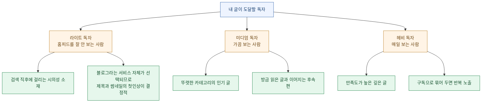

**신규 블로거에게 특히 중요한 발견이 있다.** 라이트 사용자에게는 "서비스 밴딧"이 쓰인다고 했는데, 이건 **카테고리가 아니라 "블로그"라는 서비스 단위로 고른다**는 뜻이다. 즉 **내 블로그가 아직 이력이 없어도, 블로그라는 서비스가 뽑히는 자리에 들어갈 여지가 있다.** 그 자리에서는 개인 이력보다 **제목과 첫인상**이 상대적으로 크게 작용할 가능성이 있다(이 부분은 제 해석이다).

## 네이버가 실제로 올리려는 숫자는 무엇인가

마지막으로 김기동 발표의 큰 그림을 보자. **네이버가 뭘 좋게 만들려고 하는지 알면, 내가 뭘 도와줘야 유리한지도 보인다.**

### 📘 사용일수라는 지표

발표는 서비스 성장을 재는 지표로 **사용자의 서비스 사용일수**를 제안한다. 이유는 이렇다.

- 사용 습관을 기준으로 사용자 활동성을 나누므로 **장기 분석에 안정적**이다
- 주간 방문일수는 주 단위 루틴·습관과 자연스럽게 연결된다

그런데 여기서 한 걸음 더 나간다. **단순 방문이 아니라 품질 기반의 유효 방문으로 재겠다**는 것이다.

| 지표 | 정의 |
|---|---|
| **유효 체류시간** (Quality Time Spent) | 사용자 경험의 품질을 바탕으로 세션 품질을 계산 |
| **유효 방문일수** (Qualified Visit Days) | 사용자가 **유의미한 소비 활동이나 만족스러운 경험을 한 날짜**를 집계 |

또 참고 문헌으로 구글의 2022년 논문(Surrogate for Long-Term User Experience in Recommender Systems)을 인용하며 이런 관찰을 제시한다.

> 콘텐츠 소비가 늘어나는 사용자군은 더 많은 주제를 소비하고 특정 토픽을 집중 소비하는 패턴을 보인다. 또한 **같은 콘텐츠의 재소비와 고품질 소비가 늘어나고, 재방문까지의 시간도 짧아진다.**

성장의 모양을 보는 도구로는 **파워 유저 커브**를 쓴다([a16z 원문 설명](https://a16z.com/the-power-user-curve-the-best-way-to-understand-your-most-engaged-users/)). 한 달 중 며칠 썼는지로 사용자를 늘어놓았을 때, 성장하는 서비스는 오른쪽 끝(매일 쓰는 사람)이 올라가는 **스마일 커브**가 된다는 개념이다. 홈피드는 2024년에 이 커브가 확인됐고, 발표는 **충성 고객층 성장과 홈피드 매출 성장이 함께 관찰됐다**고 밝혔다.

### 💡 그래서 블로거는

**네이버가 원하는 건 "클릭"이 아니라 "다시 오게 만드는 것"이다.**

| 네이버가 올리려는 것 | 내가 도와줄 수 있는 방법 |
|---|---|
| 유효 체류시간 | 열었을 때 **읽을 게 실제로 있는** 글 |
| 유효 방문일수 | **다음 편이 궁금해지는** 연재성 구조 |
| 재소비 | 나중에 다시 찾을 만한 **정리·레퍼런스형** 글 |
| 재방문까지의 시간 단축 | 시의성 있는 소재로 **자주 발행** |

## 실전 — 홈피드 노출을 극대화하는 12가지

여기까지의 내용을 실행 가능한 형태로 압축했다. **앞의 것일수록 효과가 크다고 제가 판단한 순서**다.

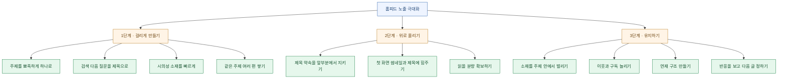

표로 다시 정리한다.

| # | 할 일 | 왜 (근거) |
|---|---|---|
| ① | **블로그 주제를 하나로 뾰족하게** | LLM이 760개 주제로 분류하고 500개 이상 카테고리로 밴딧이 돈다. 좌표가 흐리면 어느 문에도 안 걸린다 |
| ② | **한 글에 한 주제만** | 임베딩 좌표가 뭉개지면 클릭투클릭에 안 잡힌다 |
| ③ | **검색어의 "다음 질문"을 제목으로** | 애프터서치는 하루 이내 검색과 연관된 문서를 뽑는다. 검색 결과 1등과는 다른 자리다 |
| ④ | **시의성 소재를 빠르게 발행** | 애프터서치가 "탐색형·시의성 키워드"를 골라 쓴다 |
| ⑤ | **제목이 약속한 걸 본문 앞에서 지키기** | MDE 랭커가 **만족 확률(체류시간이 길 확률)** 을 함께 예측한다 |
| ⑥ | **낚시 제목 금지** | 클릭만 나고 금방 나가면 만족 확률 예측이 깎인다 |
| ⑦ | **첫 화면 인상에 힘주기** | 홈피드 클릭의 23%가 첫 카드에서 나오고, 첫 카드 클릭 시 하단 클릭률이 45% 높다 |
| ⑧ | **같은 주제로 여러 편 쌓기** | 클릭투클릭은 방금 읽은 글과 가까운 좌표를 뽑는다. 내 글끼리 이어질 수 있다 |
| ⑨ | **주제 안에서 소재는 벌리기** | 카테고리 쏠림을 시스템이 줄이고 있고, 키워드 노출 패널티도 있다 |
| ⑩ | **이웃·구독 늘리기** | 구독 기반 리트리버가 별도로 존재한다 |
| ⑪ | **연재 구조 만들기** | 네이버가 올리려는 지표가 **유효 방문일수**다. 다음 편이 있으면 재방문 사이클이 생긴다 |
| ⑫ | **타깃 독자를 좁히기** | 인구통계 기반 리트리버가 있다. 특정 성별·연령대에서 잘 먹히면 그 층으로 확산된다 |

## 반대로, 하지 말아야 할 것

| 하지 말 것 | 이유 |
|---|---|
| **한 글에 여러 주제 섞기** | 주제 분류 점수가 분산돼 어느 카테고리에서도 못 뽑힌다 |
| **같은 키워드로 매일 도배** | 발표에 **키워드 노출 패널티**가 명시돼 있다 |
| **제목만 자극적이고 본문 부실** | 만족 확률 예측을 스스로 낮춘다 |
| **결론을 맨 뒤로 미루기** | 옛날 체류시간 전략이다. 지금은 이탈을 부른다 |
| **사진만 있고 글이 없는 포스팅** | 읽을 시간이 안 나오니 체류시간이 짧다 |
| **검색 상위노출 공식만 그대로 적용** | 홈피드에는 검색어가 없다. 게임이 다르다 |
| **홈피드만 노리고 검색을 버리기** | 애프터서치·클릭투클릭 모두 **사용자의 검색·클릭 이력**에서 출발한다. 검색 유입이 있어야 그 씨앗도 생긴다 |

마지막 줄을 강조하고 싶다. **검색과 홈피드는 대체재가 아니라 보완재다.** 김기동 발표의 유입 퍼널 그림을 보면 검색홈에서 통합검색과 홈피드가 나란히 갈라진다. 검색으로 들어온 독자가 다시 홈피드의 씨앗이 된다.

## 내 성과를 어떻게 확인하나?

발행하고 나서 홈피드 유입이 실제로 늘었는지 봐야 한다. 네이버가 제공하는 무료 도구가 있다.

| 도구 | 무엇을 보나 | 주소 |
|---|---|---|
| **크리에이터 어드바이저** | 유입 경로별 조회수, 홈피드 유입 비중, 성별·연령대 분포 | [creator-advisor.naver.com](https://creator-advisor.naver.com/) |
| **블로그 통계** | 글별 조회수, 유입 검색어, 체류 관련 지표 | 블로그 관리 화면 내 통계 메뉴 |
| **네이버 서치어드바이저** | 검색 노출·클릭, 수집 요청 | [searchadvisor.naver.com](https://searchadvisor.naver.com/) |

**볼 때의 요령**은 이렇다.

- 유입 경로에서 **"네이버 앱 홈피드" 계열이 차지하는 비중**을 매주 기록해 둔다. 절대값보다 **추세**가 중요하다.
- 홈피드 유입이 잘 나온 글과 안 나온 글을 **주제·제목 형식별로 묶어서** 비교한다. 내 블로그에서 어느 문이 열려 있는지 알 수 있다.
- **평균 체류시간**을 같이 본다. 조회수만 오르고 체류시간이 떨어지면 낚시 쪽으로 기울고 있다는 신호다.

## 예시로 보는 적용법 — 캠핑 블로그라면 어떻게 할까?

원리만 늘어놓으면 막상 뭘 해야 할지 감이 안 온다. 그래서 가상의 캠핑 블로그를 하나 놓고 위 12가지를 실제로 적용해 보겠다. **아래는 전부 예시이고 실제 블로그가 아니다.**

### 상황 설정

캠핑 블로그를 6개월째 운영 중이고, 글은 40편쯤 있다. 검색 유입은 하루 300명 정도인데 홈피드 유입은 거의 없다. 지금까지 쓴 글은 대부분 "○○ 텐트 리뷰", "○○ 화로대 후기" 같은 장비 리뷰다.

### 진단 — 왜 홈피드에 안 걸리나

앞의 구조에 대입해 보면 문제가 보인다.

| 문 | 현재 상태 | 진단 |
|---|---|---|
| 애프터서치 | 장비 이름 검색은 **구매 직전 검색**이라 이후 탐색 여지가 적다 | 🔴 씨앗이 잘 안 생긴다 |
| 클릭투클릭 | 장비 리뷰끼리는 좌표가 가깝다 | 🟡 작동은 하나 폭이 좁다 |
| 카테고리 밴딧 | 캠핑 카테고리로는 뚜렷하다 | ✅ 좌표는 선명함 |
| 구독 | 이웃이 적다 | 🔴 문이 닫혀 있음 |
| 인구통계 | 타깃이 불명확 | 🟡 |
| MDE 랭커 | 리뷰 글이 짧고 사진 위주 | 🔴 만족 확률이 낮게 예측될 소지 |

핵심 문제는 **"장비 리뷰"라는 소재가 애프터서치와 궁합이 나쁘다**는 점이다. 사람들이 텐트 이름을 검색하는 건 살까 말까 고민할 때인데, 그 검색 이후에 이어질 탐색 여지가 크지 않다. 그리고 **소재가 한 갈래로 쏠려서** 다양성 쪽에서도 불리하다.

### 처방 — 소재를 벌리고 씨앗을 만든다

주제(캠핑)는 그대로 두되, **소재를 다섯 갈래로 벌린다.** 이게 앞에서 말한 "블로그는 뾰족하게, 소재는 넓게"의 실제 모습이다.

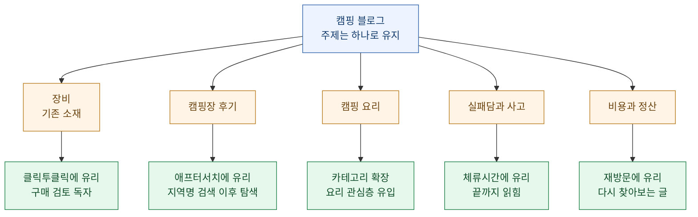

### 제목을 어떻게 바꾸나

같은 소재라도 **검색을 노리는 제목과 홈피드를 노리는 제목이 다르다.** 예시로 비교해 본다.

| 소재 | 검색형 제목 | 홈피드형 제목 (애프터서치·클릭투클릭 겨냥) |
|---|---|---|
| 캠핑장 | "가평 캠핑장 추천 베스트 10" | "가평 캠핑장 예약하기 전에 몰랐던 3가지" |
| 장비 | "○○ 텐트 리뷰" | "3년 쓴 텐트 버리고 알게 된 것" |
| 요리 | "캠핑 요리 레시피 모음" | "불 조절 실패해서 다 태운 날 배운 것" |
| 비용 | "캠핑 비용 정리" | "1년 캠핑비 계산했다가 조용해진 이유" |

차이가 보이는가. 왼쪽은 **검색어를 그대로 담는다.** 오른쪽은 **검색 이후에 궁금해질 지점**을 건드린다. 홈피드에는 검색창이 없으므로, 사용자가 스크롤을 멈추게 만드는 건 키워드 일치가 아니라 **"어 뭔데?"라는 반응**이다.

⚠️ 단, 여기서 조심할 것이 있다. **오른쪽 제목이 낚시가 되면 안 된다.** MDE 랭커가 만족 확률을 함께 보기 때문에, 제목이 던진 궁금증을 본문 앞부분에서 해소해 줘야 한다. "3가지"라고 했으면 첫 화면에서 첫 번째가 바로 나와야 한다.

### 4주 운영 계획 예시

| 주차 | 발행 | 목적 |
|---|---|---|
| 1주 | 캠핑장 후기 2편 + 실패담 1편 | 소재 확장 시작. 애프터서치 씨앗 만들기 |
| 2주 | 요리 2편 + 장비 1편 | 새 카테고리 반응 관찰 |
| 3주 | 반응 좋았던 갈래로 2편 + 비용 정리 1편 | 클릭투클릭 연결 고리 만들기 |
| 4주 | 1~3주 글을 묶는 정리글 1편 + 신규 2편 | 재소비형 콘텐츠 확보 |

**4주차의 "묶는 정리글"이 중요하다.** 김기동 발표가 인용한 구글 연구에서 **같은 콘텐츠의 재소비가 늘어나는 것**이 성장하는 사용자군의 특징으로 나왔다. 나중에 다시 찾아볼 만한 정리글은 그 재소비를 만드는 장치다.

### 4주 뒤에 무엇을 보나

크리에이터 어드바이저에서 이 세 가지를 확인한다.

| 확인 항목 | 좋은 신호 | 나쁜 신호 |
|---|---|---|
| 홈피드 유입 비중 | 0%에서 조금이라도 올라옴 | 4주간 변화 없음 → 소재를 더 벌려야 함 |
| 갈래별 반응 | 특정 갈래에서 유입이 튐 | 전 갈래가 고르게 낮음 → 제목 형식 점검 |
| 평균 체류시간 | 유지되거나 상승 | 조회수는 늘었는데 체류시간 급락 → 낚시 쪽으로 기울었다는 경고 |

## 자주 묻는 질문

### 홈피드에 뜨려면 이웃이 몇 명이나 있어야 하나요?

**정해진 숫자는 없고, 이웃이 없어도 뜰 수 있습니다.** 발표에 나온 리트리버 중 구독 기반은 **여러 문 중 하나**일 뿐입니다. 애프터서치, 클릭투클릭, 카테고리·서비스 밴딧은 구독과 무관하게 작동합니다. 특히 홈피드를 잘 안 쓰는 라이트 사용자에게는 **"서비스 밴딧"** 이 쓰이는데, 이건 "블로그라는 서비스"를 고르는 방식이라 개인 이력의 비중이 상대적으로 작을 수 있습니다.

다만 이웃과 구독이 많으면 **문이 하나 더 열리는 것**은 맞습니다. 없어도 되지만 있으면 유리한 쪽입니다.

### 하루에 몇 개를 써야 하나요?

**발표 자료에 발행 빈도에 대한 언급은 없습니다.** 다만 구조상 유추할 수 있는 게 있습니다. 애프터서치는 **하루 이내 검색 이력**, 클릭투클릭은 **하루 이내 클릭 이력**과 연결됩니다. 즉 **시의성이 있는 소재는 빨리 써야 그 창에 들어갑니다.**

그리고 **같은 키워드로 계속 쓰는 건 역효과**입니다. 발표에 "키워드 노출 패널티"가 명시돼 있습니다. 개수보다 **소재를 벌리는 것**이 중요합니다.

### 글자 수는 몇 자가 좋은가요?

**발표에 글자 수 기준은 나오지 않습니다.** 인터넷에 도는 "1,500자 이상" 같은 숫자는 근거를 확인하기 어렵습니다.

대신 확인된 사실은 이것입니다. 랭커가 **체류시간이 길 확률**을 예측합니다. 그러니 기준은 글자 수가 아니라 **"이 글을 열면 실제로 읽을 것이 있는가"** 입니다. 사진 20장에 글이 세 줄이면 읽을 시간 자체가 안 나옵니다. 반대로 억지로 늘린 5,000자도 중간에 이탈을 부릅니다.

### 검색 상위노출과 홈피드 중 뭘 먼저 해야 하나요?

**둘은 대체재가 아니라 보완재입니다.** 애프터서치와 클릭투클릭 모두 사용자의 **검색·클릭 이력**에서 출발합니다. 검색으로 들어온 독자가 남긴 흔적이 홈피드 추천의 씨앗이 됩니다. 검색을 버리면 그 씨앗이 안 생깁니다.

순서를 굳이 정하자면, **검색으로 기본 유입을 만들고 → 그 위에 홈피드형 소재를 얹는** 순서가 자연스럽습니다.

### 카테고리를 여러 개 운영하면 불리한가요?

**블로그 전체 주제가 여러 갈래로 흩어지면 불리할 수 있습니다.** 카테고리 밴딧과 임베딩 기반 리트리버 모두 "이 블로그·이 글이 어느 좌표인가"를 봅니다. 육아와 주식과 맛집이 섞여 있으면 어느 좌표에서도 대표성이 약해집니다.

다만 **하나의 큰 주제 안에서 소재를 나누는 카테고리**는 오히려 좋습니다. 캠핑 블로그 안의 장비·캠핑장·요리 카테고리 같은 경우죠. 이건 흩어지는 게 아니라 **다양성을 만드는 것**입니다.

### 오래된 글도 홈피드에 뜰 수 있나요?

**가능성은 있지만 신선한 글이 유리한 구조입니다.** 애프터서치와 클릭투클릭은 모두 **하루 이내**의 사용자 행동을 씨앗으로 씁니다. 그리고 김기동 발표에서 홈피드와 별개로 검색 쪽 분석을 다루며 최신성의 중요성이 계속 언급됩니다.

다만 **카테고리 밴딧의 "선호 카테고리 인기 문서"** 쪽은 반드시 최신일 필요가 없습니다. 반응이 누적된 글이 계속 뽑힐 여지가 있습니다. 그래서 **잘 되는 글은 계속 관리하는 것**이 의미가 있습니다.

### 이 내용이 언제까지 유효한가요?

**정직하게 말하면 모릅니다.** 근거로 삼은 자료는 2024년과 2025년 발표이고, 발표 안에서도 "향후 계획"으로 새 모델 도입을 예고하고 있습니다. 실제로 김기동 발표는 다양성 실험 결과를 2025년 상반기에 이미 서비스에 반영했다고 밝혔습니다.

그래서 이 글에서 오래 갈 부분과 빨리 바뀔 부분을 나눠 보면 이렇습니다.

| 오래 갈 가능성이 높은 것 | 빨리 바뀔 수 있는 것 |
|---|---|
| 클릭과 만족을 함께 본다는 방향 | 구체적인 모델 이름과 구조 |
| 다양성과 개인화를 함께 잡으려는 방향 | 실험에서 나온 개별 수치 |
| 첫 카드의 중요성 | 첫 카드를 고르는 방식 |
| 유효 방문일수라는 목표 지표 | 각 리트리버의 비중 |

**왼쪽 칸을 기준으로 글을 쓰고, 오른쪽 칸은 참고만 하는 게 안전합니다.**

## 정리하면

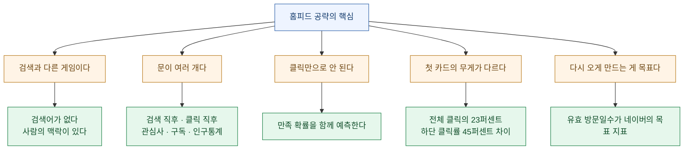

세 문장으로 줄이면 이렇다.

**하나. 홈피드는 키워드 싸움이 아니라 맥락 싸움이다.** 검색은 "이 질문에 맞는 글"을 고르고, 홈피드는 "이 사람이 지금 궁금해할 글"을 고른다. 그래서 제목에 키워드를 정확히 박는 것보다, **누군가의 방금 전 행동과 이어지는 소재**를 잡는 게 중요하다.

**둘. 클릭만 잘 나는 글은 오히려 손해다.** 랭커가 클릭 확률과 만족 확률을 **함께** 예측한다. 열자마자 나가는 글은 다음번 노출을 스스로 깎는다. 제목이 약속한 것을 본문 앞에서 바로 지키는 게 가장 확실한 최적화다.

**셋. 블로그는 뾰족하게, 소재는 넓게.** 주제 좌표가 선명해야 문에 걸리고, 소재가 다양해야 쏠림 패널티를 피한다. 이 두 가지는 모순이 아니라 **층위가 다른 이야기**다.

마지막으로 하나만 덧붙이고 싶다. 이 발표들을 읽으면서 제일 인상 깊었던 건 기술이 아니라 **네이버가 재려는 지표가 바뀌고 있다**는 점이었다. 클릭 수에서 **"유의미한 소비 활동이나 만족스러운 경험을 한 날짜"** 로. 이런 방향으로 지표가 옮겨가는 서비스에서 오래 살아남는 글은 결국 하나다. **읽고 나서 시간이 안 아까운 글.** 공략법을 아무리 정교하게 짜도 여기서 벗어날 수는 없을 것 같다.

---

### 출처

- 김세호·김영세·박희성 (NAVER 발견/탐색 프로덕트), **[홈피드: 네이버의 진입점에서 추천피드를 외치다! — 추천피드 도입 고군분투기](https://dan.naver.com/24/sessions/602)**, DAN 24
- 김기동 (NAVER Data Strategy & Operations Center), **[사용자에 대한 이해로부터: 검색과 홈피드 서비스의 성장 문법](https://dan.naver.com/25/sessions/726)**, DAN25
- 관련 세션: [검색과 피드의 만남: LLM으로 완성하는 초개인화 서비스](https://dan.naver.com/24/sessions/585) · [DAN 24 전체 세션](https://dan.naver.com/24/sessions) · [DAN25 전체 세션](https://dan.naver.com/25/sessions)
- Andrew Chen (a16z), [The Power User Curve](https://a16z.com/the-power-user-curve-the-best-way-to-understand-your-most-engaged-users/)
- 측정 도구: [네이버 크리에이터 어드바이저](https://creator-advisor.naver.com/) · [네이버 서치어드바이저](https://searchadvisor.naver.com/)

> ⚠️ **면책**: 이 글의 📘 표시 내용은 위 공개 발표 자료에 근거한 사실이고, 💡 표시 내용은 그것을 블로그 운영에 적용해 본 **제 해석**입니다. 추천 시스템은 사용자마다 다르게 작동하고 지속적으로 변경되므로, **어떤 방법도 노출을 보장하지 않습니다.** 발표에 공개된 수치는 해당 실험 시점의 값이며 현재와 다를 수 있습니다.
