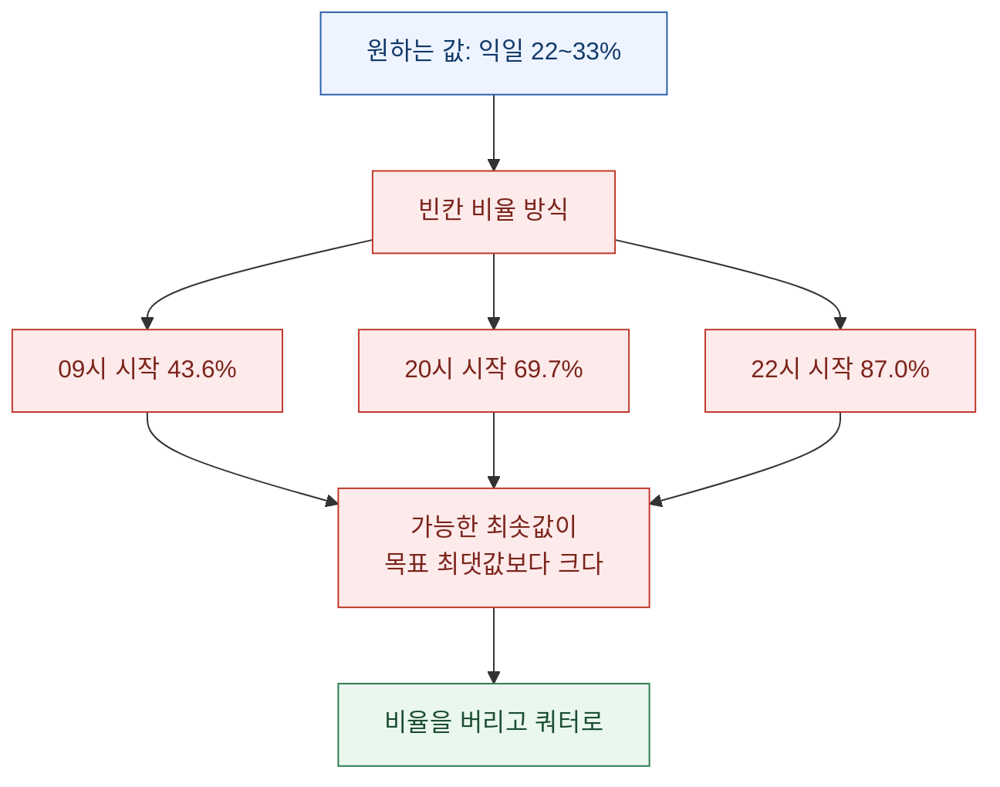
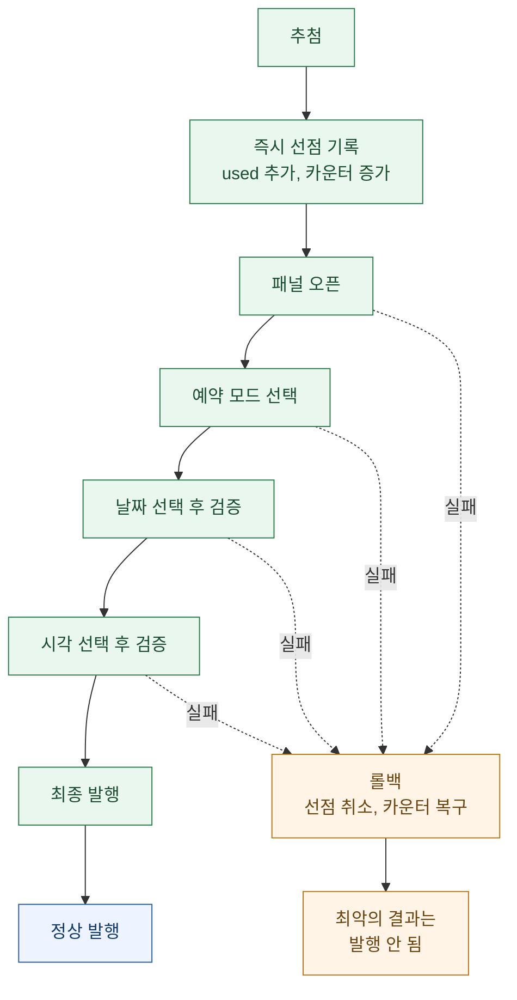

블로그 글을 예약 발행하는 스크립트를 고쳤다. 단축키 한 번에 랜덤한 시각으로 예약이 걸리는, 원래는 스무 줄이면 끝나던 물건이다.

그런데 요구가 여섯 번 바뀌는 동안 이게 **배분 문제**로 변했다. 그리고 배분 문제가 되는 순간, 처음에 자연스러워 보였던 설계가 **원하는 값을 구조적으로 만들어 낼 수 없다**는 게 드러났다.

이 글은 그 지점에 대한 기록이다. 결론만 먼저 적으면 이렇다.

> **비율에 맡기면, 언제 시작하느냐가 결과를 결정한다. 목표가 있는 배분은 비율이 아니라 쿼터로 관리해야 한다.**

미리 밝혀 둘 것 — 대상은 **내 블로그, 내가 쓴 글의 예약 시각**이다. 남의 계정을 건드리거나 콘텐츠를 자동 생성하는 얘기가 아니다. 그리고 아래 나오는 DOM 셀렉터는 **2026년 7월 29일 확인 기준**이라 언제든 바뀔 수 있다. 셀렉터를 베끼는 것보다 **왜 그렇게 검증했는지**를 가져가는 편이 오래 간다.

## 요구는 여섯 번 바뀌었다

최종본만 보면 중간 설계가 왜 폐기됐는지 알 수 없다. 그래서 변천을 남겼다.

| 단계 | 요구 | 결과 |
|---|---|---|
| 1 | (원본) 현재+30분부터 23:50까지 균등 랜덤 | 시간대 편중 없음 |
| 2 | 시간대별 분포표대로 발행 | 24시간 창 144슬롯으로 표를 재현, 오차 0.027%p |
| 3 | 표 대신 특정 시간대만 쓰고 그 안에서 랜덤 | 9\~11 / 17\~23 / 익일 0\~5 |
| 4 | 08시 추가 | 8\~11 / 17\~23 / 익일 0\~5 |
| 5 | 당일과 익일의 허용 시간대를 분리 | `HOURS_TODAY` / `HOURS_NEXTDAY` |
| 6 | 45개 중 당일 30\~35 / 익일 10\~15 | 칸 수 비율이 아닌 **쿼터**로 관리 |

1단계에서 6단계 사이에 문제의 성격이 완전히 바뀌었다. **"아무 때나 골라라"에서 "정해진 몫만큼 나눠라"로** 옮겨 간 것이다. 이 둘은 같은 코드로 풀리지 않는다.

### 2단계 분포표를 왜 버렸나

원래 아이디어는 실제 유입이 잘 되는 시간대 분포를 그대로 재현하는 것이었다. 이건 기술적으로 깔끔하게 풀렸다.

후보를 `현재+30분`부터 **정확히 144칸**(10분 × 24시간)으로 잡으면 된다. 그러면 각 시각이 후보에 정확히 6번씩 들어가므로, 언제 실행하든 표의 분포가 그대로 재현된다. 시뮬레이션 30만 회에서 평균 오차 0.027%p가 나왔다.

문제는 이 방식이 **하루 24시간 전체에 글을 흩뿌린다**는 점이다. 새벽 3시에도, 낮 12시에도 글이 올라간다. 실제로 원한 건 그게 아니라 특정 시간대만 쓰는 것이었다. 그래서 폐기했다.

여기서 기억해 둘 게 하나 있다. **오늘 안으로만 제한하면 이 성질이 깨진다.** 지나간 시간대가 후보에서 빠지면서 남은 시간대로 재정규화되고, 22시가 원래 9.3%에서 14\~25%까지 폭주한다. 24시간 창이라는 조건이 분포 재현의 전제였던 것이다.

## 비율은 왜 구조적으로 실패하는가

3\~5단계를 거치며 시간대가 이렇게 굳었다.

```js
const HOURS_TODAY   = [8,9,10,11, 17,18,19,20,21,22,23];  // 11시간 x 6칸 = 66칸
const HOURS_NEXTDAY = [0,1,2,3,4,5,6];                    //  7시간 x 6칸 = 42칸
```

여기서 자연스러운 구현은 **남은 빈칸 전체에서 균등 랜덤**이다. 당일 빈칸이 많으면 당일이 많이 뽑히고, 적으면 익일이 많이 뽑힌다. 코드가 짧고 직관적이다.

그런데 이 방식은 **언제 시작하느냐가 결과를 결정한다.**

익일 칸 42개는 언제나 살아 있다. 반면 당일 칸은 시간이 갈수록 사라진다. 그래서 시작 시각별로 이렇게 된다.

| 실행 시작 | 당일 빈칸 | 익일 빈칸 | 익일 비율 |
|---|---|---|---|
| 09시 | 57 | 42 | 43.6% |
| 20시 | 21 | 42 | 69.7% |
| 22시 | 9 | 42 | **87.0%** |

원하는 익일 비율은 45개 중 10\~15개, 즉 **22\~33%** 다.

표의 어느 줄에도 그 구간이 없다. 제일 유리한 09시 시작조차 43.6%다. 이건 "평균이 안 맞는다"가 아니라 **가능한 최솟값이 목표 최댓값보다 크다**는 뜻이다. 아무리 오래 돌려도, 운이 아무리 좋아도 도달할 수 없다.



이게 이 글을 쓰는 이유다. 비율 방식이 **틀린 값을 내는 것**과 **원하는 값을 낼 수 없는 것**은 다른 문제다. 앞의 것은 튜닝으로 고치는데, 뒤의 것은 설계를 바꿔야 한다. 그리고 이 구분은 시뮬레이션을 돌려 보기 전까지 잘 안 보인다. 나도 표를 만들고 나서야 알았다.

**남은 자원의 비율로 목표 배분을 맞추려는 시도는 대체로 여기에 걸린다.** 자원이 시간에 따라 줄어드는데 목표는 고정이면, 시작 시점이 결과를 밀어 버린다.

## 쿼터로 바꾸기

해법은 단순하다. **빈칸을 세지 말고 목표를 세는 것.**

하루 첫 실행 때 당일 목표치를 30\~35 중 하나로 뽑아 두고, 그 뒤로는 **남은 배분량에 비례해** 당일이냐 익일이냐를 먼저 정한다. 날짜가 정해진 다음에 그 날의 빈칸에서 균등 랜덤으로 시각을 뽑는다.

```js
if (!st.tgtToday) st.tgtToday = TODAY_MIN + Math.floor(Math.random() * (TODAY_MAX - TODAY_MIN + 1));
const tgtNext = Math.max(0, DAILY_TOTAL - st.tgtToday);

const remToday = Math.max(0, st.tgtToday - st.cToday);
const remNext  = Math.max(0, tgtNext - st.cNext);

const wantToday = Math.random() * (remToday + remNext) < remToday;
```

마지막 줄이 핵심이다. **남은 몫을 저울로 쓰는 베르누이 추첨**이다. 당일 몫이 많이 남았으면 당일이 뽑힐 확률이 높고, 소진될수록 자연스럽게 익일로 넘어간다. 별도의 보정 로직이 없어도 총량이 목표에 수렴한다.

순서를 뒤집은 게 전부다.

| | 비율 방식 | 쿼터 방식 |
|---|---|---|
| 1단계 | 전체 빈칸에서 시각 추첨 | **날짜(당일/익일) 먼저 결정** |
| 2단계 | 뽑힌 시각의 날짜를 따름 | 그 날의 빈칸에서 시각 추첨 |
| 결과 | 시작 시각이 비율을 지배 | 목표가 비율을 지배 |

30일 × 300회 시뮬레이션에서 목표 적중률 100%가 나왔다.

빈칸이 물리적으로 부족한 경우는 남는다. 당일 목표가 24개인데 빈칸이 9개면 방법이 없다. 그래서 조용히 넘어가지 않고 경고를 찍고 초과분을 익일로 넘긴다.

```
[!] 당일 빈칸 9개 < 당일 남은 목표 24개. 초과분은 익일로 넘어간다
```

이 경고 덕분에 **"목표를 못 채웠다"와 "코드가 틀렸다"를 구분**할 수 있게 됐다. 뒤에 나오는 실사용 결과에서 실제로 이 구분이 필요했다.

### 언제 시작하느냐는 여전히 중요하다

쿼터가 익일 비율은 고정해 줬지만, **당일 안에서 오전이냐 저녁이냐**는 여전히 시작 시각에 달렸다. 08\~11시 칸은 그 시각 전에 시작해야만 후보에 남기 때문이다.

| 시작 | 오전(8\~11) | 저녁(17\~23) | 익일새벽(0\~6) | 오전 10개 이상인 날 |
|---|---|---|---|---|
| **06\~07시** | **11.8개** | 20.7 | 12.5 | **86%** |
| 08시 | 10.2개 | 22.4 | 12.5 | 64% |
| 09시 | 7.7개 | 24.8 | 12.5 | 14% |
| 10시 | 4.7개 | 27.8 | 12.5 | 0% |
| 12시 이후 | **0개** | 32.5 | 12.5 | 0% |

익일 새벽이 시작 시각과 무관하게 항상 12.5개인 게 쿼터가 작동한다는 증거다. 반면 오전은 12시 이후 시작하면 **구조적으로 0개**다.

그래서 운영 규칙이 하나 생겼다. **새벽 6시에 시작한다.** 그러면 첫 글의 예약 시각은 빨라야 08:00이 된다(06:30·07:00은 허용 시간대에 없어서 후보에서 빠진다).

## 상태가 어긋나는 버그 셋

배분을 고치고 나니 다른 종류의 버그가 드러났다. 셋 다 원인이 같다 — **화면에 보이는 값과 내부 상태가 어긋났다.**

### 참조를 재사용했다

날짜를 고른 뒤 값이 제대로 들어갔는지 검증하는 코드에서, 처음에 잡아 둔 input 참조를 그대로 다시 읽었다.

문제는 React가 날짜 선택 후 input을 **다시 그린다**는 것이다. 기존 참조는 DOM에서 떨어져 나간 노드를 가리키고, 그 노드의 `value`는 옛날 값이다. **정상 동작인데도 검증에 실패해 발행이 중단됐다.**

고치는 방법은 참조를 재사용하지 않고 매번 다시 조회하는 것이다. 리액트 앱을 밖에서 자동화할 때 반복해서 밟는 지뢰다.

### 되돌아오는 경로가 없었다

이건 실사용에서 나왔다.

```js
if (DAY_DIFF > 0) { /* 날짜 변경 */ }   // 익일일 때만 건드림
```

익일이 뽑히면 달력을 열어 날짜를 바꾼다. 그런데 **당일이 뽑히면 아무것도 안 한다.** 패널이 처음부터 당일을 보여 준다고 가정한 것이다.

연속 발행에서는 그 가정이 깨진다. 직전에 익일(30일)을 골라 패널에 30일이 남아 있는데 이번에 당일(29일)이 뽑히면, **30일 그대로 발행된다.**

고친 방식은 조건문을 없애고 **날짜 선택을 매번 실행**하는 것이다. 표시값이 목표와 같아 보여도 건너뛰지 않는다. 표시값과 내부 상태가 어긋날 수 있다는 게 방금 배운 교훈이기 때문이다.

비용은 발행 1건당 달력을 여닫는 0.8초, 45건이면 36초다. 그 대가로 "엉뚱한 날짜로 발행"이 사라졌다. 싸다.

### 월 이동이 단방향이었다

위를 고치자마자 따라 나온 문제다. 8월 1일을 잡아 둔 뒤 당일인 7월 31일로 되돌아오려면 이전 달 버튼이 필요한데, 다음 달 버튼만 누르고 있었다.

```js
const goNext = (cy < wantY) || (cy === wantY && cm < wantM);
const nav = dp.querySelector(goNext ? '.ui-datepicker-next' : '.ui-datepicker-prev');
```

"익일로 간다"는 전제가 코드 곳곳에 **암묵적으로** 깔려 있었다는 얘기다. 전제를 하나 걷어내면 그 전제에 기대던 다른 코드가 같이 드러난다.

## 선점 먼저, 실패하면 되돌리기

가장 재미있었던 건 동시성 문제다.

작업 방식이 이렇다. 글 45개를 각각 다른 창에 띄워 놓고 순서대로 실행한다. 상태는 `localStorage`에 저장하는데, **localStorage는 탭이 아니라 origin 단위**라 45개 창이 같은 저장소를 공유한다. 그래서 창을 옮겨 다녀도 카운터가 이어진다.

그런데 기록 시점이 마지막 단계에 있었다.

```
실행 → (개발자도구 열고 붙여넣기 2.5초) → JS 시작 → 2.6~3.4초 → 기록
```

**실행부터 기록까지 5\~6초.** 이전 창이 끝나기 전에 다음 창에서 실행하면 옛 상태를 읽는다. 카운터가 유실되고 같은 칸이 또 뽑힌다.

해법은 데이터베이스에서 쓰는 것과 같다. **추첨 직후에 선점을 기록하고, 이후 실패하면 되돌린다.**

```js
st.used.push(slotId(t));
if (DAY_DIFF > 0) st.cNext++; else st.cToday++;
saveState();                                    // 뽑자마자 선점

const fail = msg => {                           // 이후 실패 시 취소
  st.used = st.used.filter(v => v !== slotId(t));
  if (DAY_DIFF > 0) st.cNext--; else st.cToday--;
  saveState();
  console.error(msg + ' [선점 취소됨]');
  return null;
};
```

그리고 이후 11개의 중단 지점을 전부 `fail()`로 바꿨다.



설계 원칙을 한 문장으로 적으면 이렇다. **최악의 경우가 "발행 안 됨 + 콘솔 에러"이지 "엉뚱한 시각으로 발행"이 되면 안 된다.**

여기 딸린 함정도 하나 있었다. 선점을 앞으로 옮기면서 **마지막 단계에 남아 있던 기존 증가 코드를 지우지 않으면 한 번 발행에 카운터가 2씩 오른다.** 로직을 앞으로 옮길 때는 옮긴 게 아니라 복사된 건 아닌지 확인해야 한다.

## 브라우저 없이 브라우저 자동화 검증하기

45건짜리 워크플로를 매번 실제로 돌려 보며 디버깅할 수는 없다. 그래서 `jsdom`으로 발행 패널을 재현했다. 발행 버튼, 예약 라디오, readonly 날짜 input, 클릭하면 열리는 달력, 시·분 select까지.

그 위에 `Date`를 고정하고 **실제 스크립트의 JS를 그대로** 돌렸다.

| 하네스 | 검사 항목 | 결과 |
|---|---|---|
| 문법·안전성 검사 | 스크립트에서 JS 추출, 문법 검사, 중복 선언 | 통과 |
| 달력 로직 | 익일, 월 넘김, 해 넘김, 안 닫힘, 과거일 거부 | 5/5 |
| 단건 흐름 | 당일 / 익일 / 월말 / 마감 직전 | 4/4 |
| 연속 발행 | 익일→당일, 8/1→7/31, 당일→당일 | 3/3 |
| 다중 창 | 누적, 겹쳐 실행, 실패 롤백 | 3/3 |
| 쿼터 배분 | 30일 × 300회 | 목표 적중 100% |

**연속 발행 하네스가 없었으면 "되돌아오는 경로가 없다"는 버그를 실사용에서 처음 만났을 것이다.** 단건 테스트는 전부 통과했기 때문이다. 상태를 갖는 자동화는 한 번 돌려서는 검증이 안 된다. **직전 상태를 남긴 채 다시 돌리는 시나리오**가 반드시 필요하다.

한계도 적어 둔다. 이 모형은 DOM 덤프를 보고 재현한 것이라 실제 렌더 타이밍은 다를 수 있다. 검증했다는 말이 곧 실제로 된다는 뜻은 아니다.

### 시뮬레이션이 만들어 낸 가짜 버그

초기 시뮬에서 슬롯 겹침이 0.11\~0.44%로 나왔다. 겹치면 안 되는 값이라 한참 뒤졌는데, 추첨 시점에 직접 단언을 걸어 보니 **재선택은 0건**이었다.

원인은 시뮬레이션이 실행 시각을 `09:00 → 09:57 → 09:00`처럼 **되감았기 때문**이다. 시각이 뒤로 가면 이미 배정한 미래 슬롯이 "지난 슬롯"으로 잘못 정리되고, 다시 후보로 돌아온다. 실제로는 시간이 앞으로만 가니 발생하지 않는다.

**테스트가 만들어 낸 버그였다.** 이런 건 코드를 고치는 게 아니라 테스트를 고쳐야 하는데, 구분이 쉽지 않다. 나는 "실제 실행에서 이 조건이 성립할 수 있나"를 물어서 갈랐다.

## 실사용 45건

17시 06분에 시작해 45건 전부 발행됐다. 최종 카운터는 `당일 35/35 · 익일 10/10`.

**오전 발행이 0개였는데, 이건 버그가 아니라 예측된 동작이다.** 17시에 시작했으니 08\~11시가 이미 지나갔고, 익일은 새벽만 허용하므로 오전에 도달할 경로가 없다. 시뮬레이션도 17시 시작이면 오전 0개를 예측했다. 앞서 만들어 둔 시작 시각별 표가 없었으면 이걸 버그로 오해하고 멀쩡한 코드를 뜯었을 것이다.

**롤백이 실제로 작동한 사례도 나왔다.**

```
[2] 예약 라디오 없음 [선점 취소됨]
...
[0] ... 당첨: 2026-07-30 00:10 (익일)   ← 취소된 칸이 그대로 재사용됨
[4] ✅ 발행 완료 → 2026-07-30 00:10
```

라디오 버튼을 못 찾아 실패했지만 선점이 취소되어 그 칸이 다음 실행에서 다시 쓰였고, 카운터도 새지 않았다. 45건 중 딱 1건에서 걸렸는데, 그 1건이 롤백 설계를 실전에서 검증해 줬다.

## 아직 안 고친 것

정직하게 남겨 둔다.

**발행할 때마다 다운로드 폴더의 오늘자 이미지를 전부 지우는 코드가 있다.** 글 하나씩 쓰던 시절엔 안전했다. 그런데 하루 45건을 연속으로 돌리면서 **뒷글에 쓸 이미지를 미리 받아 뒀다면 첫 발행에서 같이 날아간다.**

아직 안 고쳤다. 방향은 둘 중 하나다.

- 발행할 때마다가 아니라 **세션이 끝날 때 한 번**으로 분리
- **방금 쓴 글에 실제로 사용한 이미지만** 지우도록 범위 축소

이건 앞에서 다룬 버그들과 성질이 다르다. 앞의 것들은 코드가 틀렸는데, 이건 **코드는 맞고 전제가 바뀌었다.** 워크플로가 1건에서 45건으로 커지는 동안 "발행 후 정리"라는 전제만 그대로 남았다. 이런 종류가 제일 늦게 발견된다. 아무도 그 코드를 의심하지 않기 때문이다.

단계 사이의 대기가 고정값(400\~600ms)인 것도 남은 문제다. 45건 중 1건에서 요소를 못 찾은 게 타이밍 문제일 수 있다. 재발이 잦으면 고정 대기 대신 요소 등장 폴링으로 바꾸는 게 맞다.

## 정리하면

이 작업에서 가져갈 건 셋이다.

**하나, 목표가 있는 배분은 비율로 풀리지 않는다.** 남은 자원이 시간에 따라 줄어드는데 목표가 고정이면, 시작 시점이 결과를 밀어 버린다. 도달 가능한 범위를 표로 그려 보면 튜닝으로 될 문제인지 설계를 바꿀 문제인지가 바로 보인다.

**둘, 화면에 보이는 값은 상태가 아니다.** 참조는 낡고, 이전 실행의 흔적은 남아 있고, 되돌아오는 경로는 대개 빠져 있다. "같아 보이니 건너뛰자"가 제일 비싼 최적화였다.

**셋, 상태를 갖는 자동화는 두 번 돌려야 검증된다.** 단건 테스트를 전부 통과하고도 연속 실행에서 깨졌다. 직전 상태를 남긴 채 다시 돌리는 시나리오가 없으면, 그 버그는 실사용에서 만나게 된다.

마지막으로 하나 더. **예측한 값을 미리 표로 만들어 두면 실사용 결과를 오해하지 않는다.** 오전 0개를 보고도 당황하지 않은 건 그게 이미 표에 있었기 때문이다. 로그를 읽는 일은 로그를 남기는 일과 다른 준비를 요구한다.
