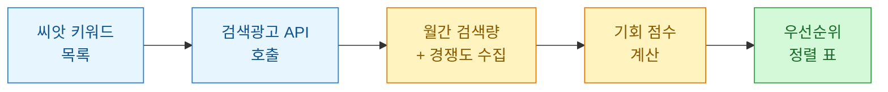
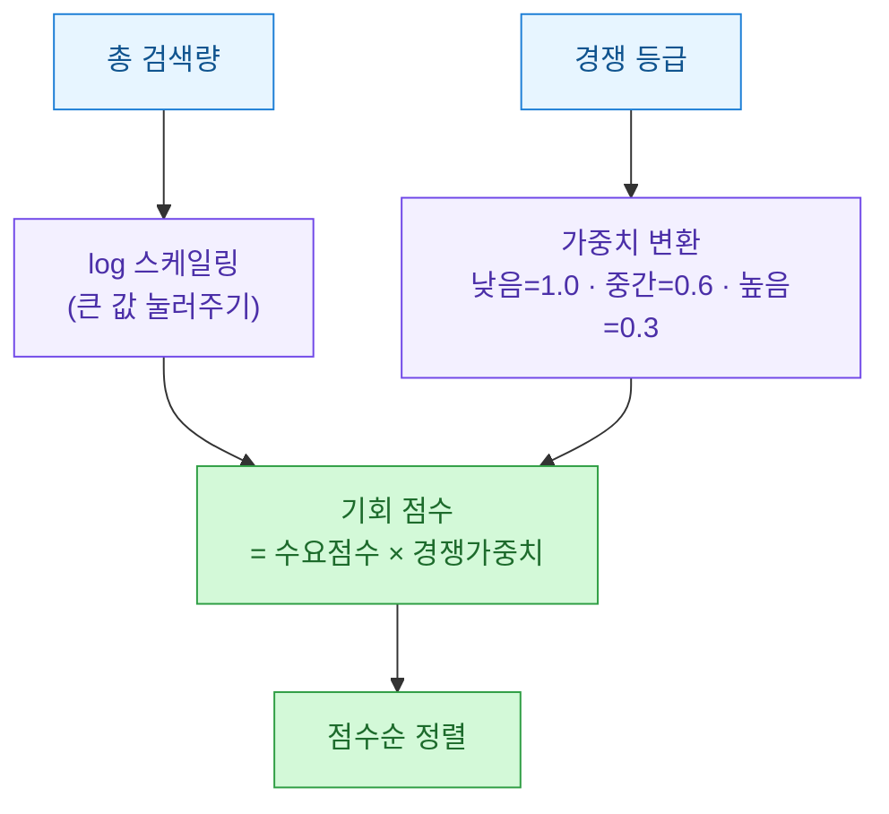
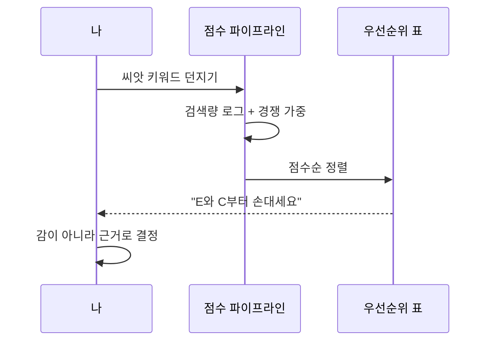
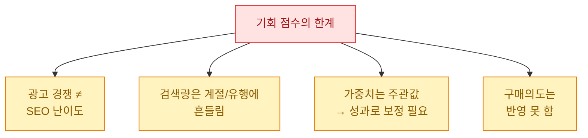

키워드를 고를 때마다 나는 늘 감에 의존했다. "이 단어가 좀 뜨는 것 같은데" 하는 식으로. 그런데 감은 회고가 안 된다. 왜 그 키워드를 골랐는지 3개월 뒤에 설명할 수가 없다. 그래서 검색량과 경쟁도를 **공식 API**로 받아서, 아예 점수로 줄을 세우기로 했다. 이 글은 그 워크플로를 정리한 기록이다.

> ⚠️ 이 글의 모든 검색량·경쟁도·표는 **합성(더미) 데이터**다. 특정 회사의 실제 계정·키·성과가 아니며, 방법론만 일반화해 공개한다.

## 무엇을 만들려는 걸까?

먼저 전체 그림부터. 원시 키워드 목록을 넣으면, 검색량과 경쟁도를 붙이고, 점수를 매겨서 "먼저 손댈 키워드"를 뱉는 파이프라인이다.



핵심은 마지막 두 단계다. API가 주는 raw 숫자를 그대로 보면 판단이 안 된다. 검색량이 높으면 좋아 보이지만 경쟁이 세면 실속이 없다. 그래서 둘을 하나의 점수로 합쳐야 한다.

## API는 어떤 숫자를 돌려주나?

공식 검색광고 API의 키워드 도구는 대략 이런 필드를 준다. 이름은 플랫폼마다 다르지만 개념은 비슷하다.

| 필드(개념) | 뜻 | 우리가 쓰는 법 |
|---|---|---|
| 월간 검색수(PC) | 한 달 PC 검색 횟수 | 수요 크기 |
| 월간 검색수(모바일) | 한 달 모바일 검색 횟수 | 수요 크기 |
| 경쟁정도 | 낮음/중간/높음 등급 | 진입 난이도 |
| 월평균 노출 광고수 | 붙는 광고 개수 | 경쟁 밀도 보조 |

여기서 주의할 점. "경쟁정도"는 **광고 경쟁**이지 자연검색(SEO) 난이도가 아니다. 둘은 상관은 있지만 같지 않다. 나는 이걸 "진입 난이도의 대리 지표" 정도로만 쓴다. 완벽한 신호가 아니라 참고 신호라는 걸 처음부터 인정하고 시작하는 게 마음이 편하다.

## 인증은 어떻게 처리하나?

검색광고 API는 대체로 **시크릿 키로 서명(signature)**을 만들어 헤더에 넣는 방식이다. 타임스탬프와 요청 경로를 합쳐 HMAC 해시를 만든다. 아래는 합성 키를 쓴 예시 구조다(실제 키 아님).

```python
import time, hmac, hashlib, base64

def make_signature(secret_key: str, method: str, path: str) -> tuple[str, str]:
    """타임스탬프 + 서명 헤더를 만든다. secret_key는 더미."""
    timestamp = str(round(time.time() * 1000))
    message = f"{timestamp}.{method}.{path}"
    digest = hmac.new(
        secret_key.encode("utf-8"),
        message.encode("utf-8"),
        hashlib.sha256,
    ).digest()
    signature = base64.b64encode(digest).decode("utf-8")
    return timestamp, signature

# 합성 자격증명 — 실제 값 아님
ts, sig = make_signature("DUMMY_SECRET_0000", "GET", "/keywordstool")
print(ts, sig[:12], "...")
```

포인트는 서명 메시지에 **요청 경로가 들어간다**는 것. 그래서 엔드포인트마다 서명을 새로 만들어야 한다. 이걸 한 번 만들어 재사용하다가 401을 만나는 게 흔한 함정이다.

## 검색량을 어떻게 받아오나?

인증이 되면 씨앗 키워드를 넣고 연관 키워드 + 검색량을 받는다. 실제 응답 대신, 아래는 **합성 데이터로 만든 가짜 응답**을 흉내 낸 것이다.

```python
import pandas as pd

# 합성 응답 데이터 (실제 API 결과 아님)
synthetic_rows = [
    # 키워드,        PC검색,  모바일검색, 경쟁정도
    ("가상키워드 A",   1200,    9800,    "높음"),
    ("가상키워드 B",    300,    2100,    "중간"),
    ("가상키워드 C",     80,     640,    "낮음"),
    ("가상키워드 D",   4500,   38000,    "높음"),
    ("가상키워드 E",    150,     920,    "낮음"),
]

df = pd.DataFrame(
    synthetic_rows,
    columns=["keyword", "pc", "mobile", "competition"],
)
df["total"] = df["pc"] + df["mobile"]
print(df[["keyword", "total", "competition"]])
```

이제 `total`(총 검색량)과 `competition`(경쟁 등급)이 손에 들어왔다. 문제는 이 둘을 어떻게 하나의 우선순위로 합치느냐다.

## '기회 점수'는 어떤 논리로 만드나?

내가 쓰는 규칙은 단순하다. **수요는 크고 경쟁은 낮을수록 좋다.** 다만 검색량은 스케일이 널뛴다(수십 ~ 수만). 그대로 곱하면 검색량 큰 놈이 다 이긴다. 그래서 검색량은 로그로 눌러주고, 경쟁은 페널티로 곱한다.



경쟁 가중치는 정답이 있는 값이 아니다. 나는 "낮음이 높음보다 3배쯤 매력적"이라는 내 감각을 1.0 / 0.6 / 0.3으로 박아넣었을 뿐이다. 이 숫자는 나중에 성과를 보고 조정하면 된다. 중요한 건 **판단 기준을 코드로 고정**했다는 것이다.

```python
import numpy as np

comp_weight = {"낮음": 1.0, "중간": 0.6, "높음": 0.3}

df["demand"] = np.log1p(df["total"])          # 검색량 로그 스케일
df["comp_w"] = df["competition"].map(comp_weight)
df["opportunity"] = (df["demand"] * df["comp_w"]).round(3)

ranked = df.sort_values("opportunity", ascending=False)
print(ranked[["keyword", "total", "competition", "opportunity"]])
```

## 그래서 어떤 키워드가 위로 올라오나?

위 합성 데이터로 점수를 매기면 이런 순서가 나온다(값은 재현 가능한 더미).

| 순위 | 키워드 | 총 검색량 | 경쟁 | 기회 점수 |
|---|---|---|---|---|
| 1 | 가상키워드 D | 42,500 | 높음 | 3.20 |
| 2 | 가상키워드 A | 11,000 | 높음 | 2.79 |
| 3 | 가상키워드 B | 2,400 | 중간 | 4.68 |
| 4 | 가상키워드 E | 1,070 | 낮음 | 6.98 |
| 5 | 가상키워드 C | 720 | 낮음 | 6.58 |

재밌는 게 보인다. 검색량 1등(가상키워드 D)이 기회 점수로는 꼴찌 근처다. 경쟁 페널티 때문이다. 반대로 검색량이 작은 가상키워드 E가 "낮은 경쟁" 덕에 점수 1위로 올라왔다. 이게 바로 raw 검색량만 보면 놓치는 지점이다. **틈새 키워드**를 숫자가 대신 찾아준 것이다.



## 이 방법의 한계는 무엇인가?

솔직하게 적어둔다. 이건 만능이 아니다.



특히 네 번째, **구매의도**가 빠진 게 크다. 검색량 큰 정보성 키워드는 트래픽은 몰려도 전환은 안 되는 경우가 흔하다. 그래서 나는 이 점수를 "1차 후보 필터"로만 쓰고, 상위로 올라온 키워드는 사람이 한 번 더 눈으로 본다. 자동화가 판단을 대신하는 게 아니라, **판단할 대상을 줄여주는** 역할이라고 생각하면 딱 맞다.

## 정리하면

- 검색광고 공식 API로 **검색량 + 경쟁도**를 받아, 감이 아니라 점수로 키워드를 줄 세운다.
- 점수 = `log(검색량) × 경쟁가중치`. 검색량 스케일을 눌러야 틈새 키워드가 보인다.
- 점수는 **1차 필터**일 뿐, 구매의도·계절성은 사람이 한 번 더 본다.

감으로 고르던 걸 공식으로 바꾸니, 적어도 "왜 이 키워드였는지"는 설명할 수 있게 됐다. 그거면 절반은 성공이다.
