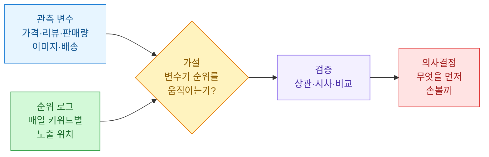
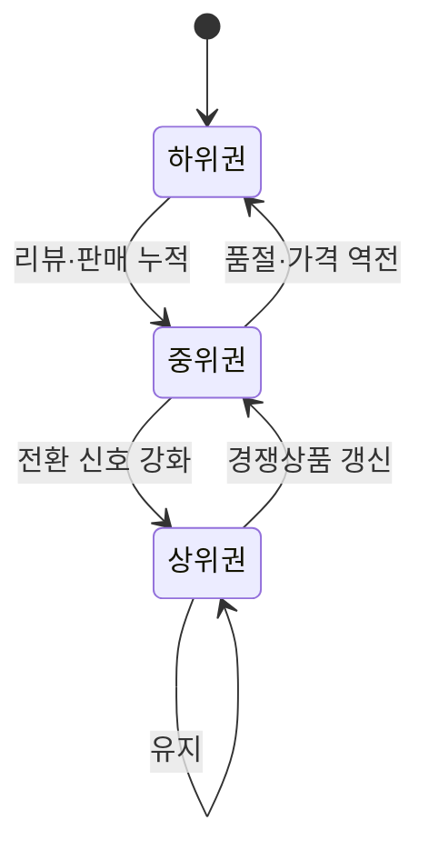
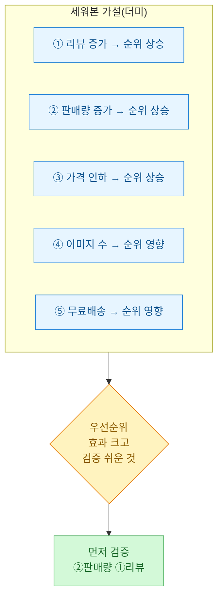
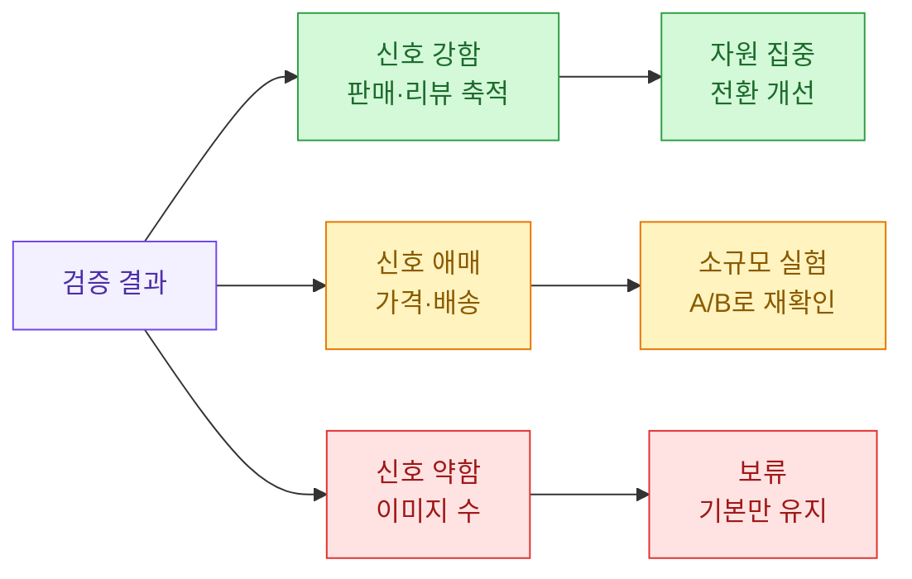
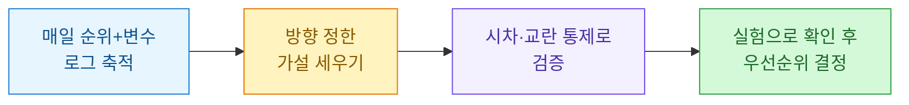

쇼핑 검색에서 순위가 왜 올랐냐고 물으면, 대개 "리뷰가 늘어서요" 같은 답이 돌아온다. 그럴듯하지만 근거는 없다. 나도 한동안 그런 식으로 말했다. 그러다 순위를 매일 기록해두기 시작하면서, "감"을 "가설"로 바꾸고 그걸 데이터로 확인하는 습관이 생겼다. 이 글은 그 과정을 정리한 회고다.

> ⚠️ 이 글의 모든 지표·표·쿼리 결과는 **합성(더미) 데이터**다. 특정 쇼핑몰·상품·플랫폼의 실제 로그가 아니라, 방법론을 보여주기 위해 지어낸 예시다. 특정 플랫폼의 순위 알고리즘을 리버스 엔지니어링하려는 글도 아니다. 어디까지나 "내가 관측할 수 있는 변수와 순위의 관계"를 다룬다.

## 왜 상위노출을 "감"으로 말하면 안 되나?

상위노출(검색 결과에서 위쪽에 뜨는 것)은 매출로 직결된다. 그래서 순위가 흔들리면 다들 원인을 궁금해한다. 문제는, 순위에 영향을 줄 만한 요소가 한둘이 아니라는 것이다. 가격, 리뷰 수, 판매량, 배송 조건, 이미지 개수, 키워드 매칭... 이걸 눈으로 한꺼번에 보는 건 불가능하다.

그래서 나는 세 가지를 분리하기로 했다. 관측할 수 있는 **변수(feature)**, 매일 측정하는 **순위(rank)**, 그리고 둘을 잇는 **가설(hypothesis)**이다.



핵심은 **순위를 하루치만 보면 아무것도 모른다**는 것이다. 시계열로 쌓아야 "언제 무엇이 바뀌었고, 그 다음 순위가 어떻게 움직였나"를 볼 수 있다. 그래서 제일 먼저 한 일은 매일 순위를 기록하는 로그를 만든 것이다.

## 무엇을 어떻게 기록해야 하나?

순위 모니터링은 거창할 필요 없다. 하루에 한 번, 정해둔 키워드로 검색해 내 상품이 몇 번째에 있는지와 그 시점의 관측 변수를 함께 저장하면 된다. 중요한 건 **순위와 변수를 같은 시점에 같이 찍는 것**이다. 나중에 "리뷰가 늘었을 때 순위가 올랐나"를 물으려면 두 값이 같은 날짜에 묶여 있어야 하니까.

기록 단위를 표로 정리하면 이렇다.

| 컬럼 | 의미 | 예시(더미) |
|---|---|---|
| obs_date | 관측 날짜 | 2026-06-01 |
| keyword | 검색 키워드 | 키워드A |
| item_id | 내 상품 식별자 | item-001 |
| rank | 검색 결과 순위(작을수록 위) | 12 |
| price | 관측 시점 가격(원) | 24900 |
| review_cnt | 누적 리뷰 수 | 340 |
| sales_7d | 최근 7일 판매량 | 58 |
| img_cnt | 상세/썸네일 이미지 수 | 9 |
| free_ship | 무료배송 여부 | 1 |

수집 자체는 아주 단순한 형태로 시작했다. 아래는 하루치 관측을 한 줄 append 하는 합성 예시다. 실제 요청 부분은 플랫폼마다 다르니 `fetch_rank_snapshot`라는 가짜 함수로 추상화했다.

```python
import csv
from datetime import date
from pathlib import Path

LOG = Path("rank_log.csv")
FIELDS = ["obs_date", "keyword", "item_id", "rank",
          "price", "review_cnt", "sales_7d", "img_cnt", "free_ship"]

def fetch_rank_snapshot(keyword: str, item_id: str) -> dict:
    """합성 데이터: 실제로는 검색 결과에서 순위·관측 변수를 파싱한다."""
    return {
        "keyword": keyword, "item_id": item_id, "rank": 12,
        "price": 24900, "review_cnt": 340, "sales_7d": 58,
        "img_cnt": 9, "free_ship": 1,
    }

def append_log(keyword: str, item_id: str) -> None:
    row = {"obs_date": date.today().isoformat()}
    row.update(fetch_rank_snapshot(keyword, item_id))
    new_file = not LOG.exists()
    with LOG.open("a", newline="", encoding="utf-8") as f:
        w = csv.DictWriter(f, fieldnames=FIELDS)
        if new_file:
            w.writeheader()
        w.writerow(row)

if __name__ == "__main__":
    for kw in ["키워드A", "키워드B"]:
        append_log(kw, "item-001")
```

이렇게 몇 주만 돌려도 분석할 재료가 생긴다. 수집 빈도는 하루 1회로 충분했다. 순위는 하루 안에서도 출렁이는데, 너무 자주 찍으면 그 노이즈에 휘둘린다.

## 순위가 오르내리는 과정을 어떻게 그리나?

로그가 쌓이면 상태 변화로 볼 수 있다. 순위대를 몇 개 구간으로 나눠서, 상품이 어느 구간에 있고 무엇 때문에 위/아래로 움직였는지를 상태도로 그리면 이해가 빠르다.



여기서 배운 건, 순위는 "올라가는 힘"과 "밀려나는 힘"이 동시에 작용한다는 점이다. 내 지표가 좋아져도 경쟁 상품이 더 좋아지면 상대적으로 밀린다. 그래서 절대값(내 리뷰가 늘었다)만 보지 말고, 가능하면 **같은 키워드 상위권의 분포와 비교**해야 한다.

## 가설은 어떻게 세우고 우선순위를 정하나?

무작정 상관관계를 다 돌려보면 그럴듯한 착시가 많이 나온다. 그래서 먼저 "말이 되는" 가설부터 리스트로 적고, 검증 난이도와 기대 효과로 줄을 세웠다.



가설을 세울 때 스스로 지킨 규칙이 있다.

- **방향을 미리 적는다.** "판매량이 늘면 순위가 올라갈 것"처럼 부호까지 적어둔다. 나중에 데이터를 보고 이야기를 지어내는 걸 막는다.
- **시차를 고려한다.** 오늘 판매가 늘었다고 오늘 순위가 오르진 않는다. 며칠 뒤 반영될 수 있어서, 변수를 하루~며칠 당겨서(lag) 비교한다.
- **혼자 움직이는 변수는 없다.** 가격을 내리면 보통 판매도 는다. 그래서 상관 하나만 보고 "가격이 원인"이라고 못 박지 않는다.

## 실제로 어떻게 검증했나?

가장 먼저 본 건 **시차 상관**이다. 변수를 며칠 앞당겨 놓고 순위와의 관계를 본다. 순위는 작을수록 좋으니, "판매량↑ → 순위값↓"이면 음의 상관이 나오는 게 기대다. 아래는 합성 로그로 시차 상관을 구하는 예시다.

```python
import pandas as pd

# 합성 데이터: 한 상품의 일자별 로그
df = pd.DataFrame({
    "obs_date": pd.date_range("2026-06-01", periods=10, freq="D"),
    "rank":      [30, 28, 27, 24, 22, 19, 18, 15, 14, 12],
    "sales_7d":  [20, 22, 25, 31, 35, 40, 44, 52, 55, 60],
    "review_cnt":[300, 305, 308, 312, 318, 322, 330, 336, 340, 348],
}).set_index("obs_date")

def lag_corr(frame: pd.DataFrame, feature: str, lag: int) -> float:
    """feature를 lag일 앞당겨 rank와의 상관을 본다(순위는 작을수록 좋음)."""
    shifted = frame[feature].shift(lag)
    return shifted.corr(frame["rank"])

for feat in ["sales_7d", "review_cnt"]:
    for lag in (0, 1, 2, 3):
        print(f"{feat} lag={lag}: {lag_corr(df, feat, lag):.3f}")
```

이 더미 데이터에서는 두 변수 모두 순위와 강한 음의 상관(순위값이 함께 낮아짐)을 보인다. 하지만 여기서 멈추면 안 된다. 판매량과 리뷰는 서로도 같이 늘기 때문에, 둘 중 무엇이 진짜인지 이 표만으로는 못 가른다. 그래서 다음 표처럼 **관측된 상관과 그 해석의 함정**을 같이 적어뒀다.

| 가설 | 관측(더미) | 주의할 함정 |
|---|---|---|
| ② 판매량↑ → 순위↑ | 강한 음의 상관 | 리뷰와 동반 상승, 분리 필요 |
| ① 리뷰↑ → 순위↑ | 강한 음의 상관 | 판매의 결과일 수 있음 |
| ③ 가격 인하 → 순위↑ | 약한 관계 | 인하 시 판매도 늘어 교란 |
| ④ 이미지 수 → 순위 | 거의 무관 | 이미 다들 많이 넣음(변별력 낮음) |
| ⑤ 무료배송 → 순위 | 그룹 간 차이 있음 | 다른 조건과 묶여 있을 수 있음 |

가짜 원인을 걸러내려고, 교란 변수를 나눠서 보는 방식을 썼다. 예를 들어 "가격 인하가 정말 순위를 올렸나"를 보려면, 판매량이 비슷한 구간끼리 묶은 뒤 그 안에서 가격 효과를 비교해야 한다. 완벽한 인과 추론은 아니지만, 최소한 "판매가 늘어서 순위가 오른 걸 가격 덕분이라고 착각"하는 실수는 줄여준다.

## 검증 결과를 어떻게 의사결정으로 바꾸나?

분석의 목적은 논문이 아니라 "다음에 뭘 먼저 손볼까"를 정하는 것이다. 그래서 검증이 끝나면 항상 세 갈래로 정리했다.



애매한 신호는 바로 믿지 않고, 통제된 실험으로 다시 확인했다. 예를 들어 무료배송의 효과가 의심스러우면, 비슷한 상품군 일부에만 조건을 바꿔보고 며칠 순위를 비교하는 식이다. 관측 데이터의 상관은 "가설을 좁히는 데" 쓰고, 최종 확인은 가능하면 실험으로 했다.

## 이 방식에서 조심해야 할 것은?

몇 번 데면서 배운 한계도 적어둔다.

- **순위는 나만 보는 게 아니다.** 지역·기기·로그인 상태에 따라 다르게 보일 수 있어서, 관측 조건을 매번 똑같이 고정해야 비교가 된다.
- **관측 변수는 빙산의 일각이다.** 내가 못 보는 내부 지표가 순위를 좌우할 수 있다. 그래서 결론은 늘 "내가 관측한 변수 범위 안에서"라고 못 박았다.
- **과최적화 경계.** 순위 하나에 집착하다 보면 정작 매출·전환을 놓친다. 순위는 수단이지 목적이 아니다.
- **약관과 매너.** 순위를 확인하는 수집은 부담을 주지 않게 하루 1회, 낮은 빈도로. 자동화가 과하면 그 자체로 문제다.

## 한 줄 정리



- 순위는 하루치가 아니라 **시계열**로 봐야 원인이 보인다.
- 상관은 가설을 좁히는 도구일 뿐, **교란 변수와 시차**를 통제하지 않으면 가짜 원인에 속는다.
- 결론은 늘 "내가 관측한 변수 안에서"로 겸손하게. 확신이 필요하면 작은 **실험**으로 확인한다.
