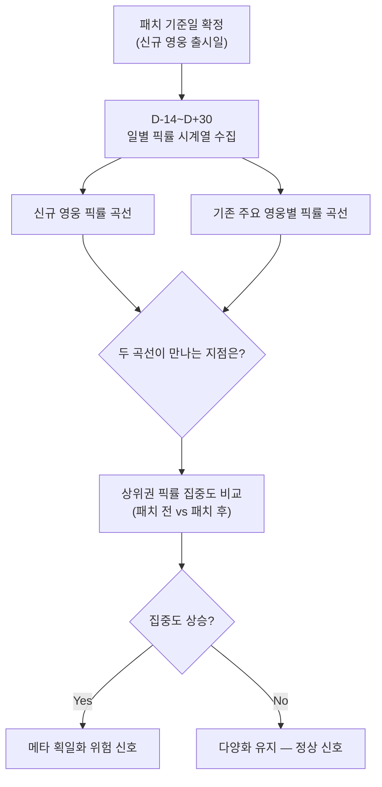
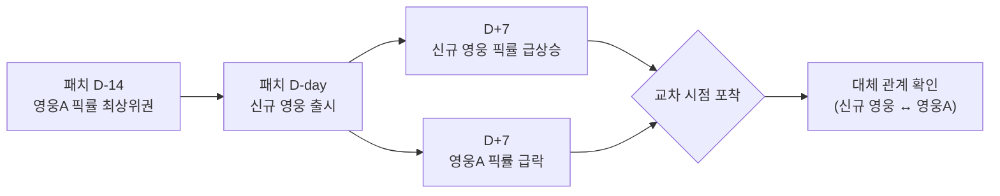
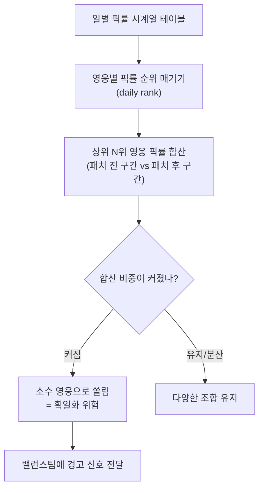

신규 영웅 패치가 나간 다음 날, 대시보드에서 픽률 그래프가 치솟는 걸 보고 나는 "됐다, 이번 패치 성공이다" 싶어 리포트를 반쯤 써놓고 있었다. 그런데 옆 칸, 그동안 늘 상위권이던 영웅 하나의 그래프가 같은 기간 거의 수직으로 꺼지는 걸 뒤늦게 발견했다. 픽률 하나만 보고 "메타가 바뀌었다"고 부를 수 있는 걸까, 아니면 그냥 유저들이 하나의 정답으로 몰려간 것뿐일까.

메타(meta)란 특정 시점에 유저 다수가 "이게 정석"이라고 받아들이는 영웅·조합 선택 성향을 뜻한다. 메타가 "바뀐다"는 건 그 정석이 다른 것으로 교체된다는 뜻이고, 메타가 "획일화된다"는 건 정석의 가짓수 자체가 줄어든다는 뜻이다. 이 둘은 전혀 다른 현상인데, 픽률 스냅샷 하나로는 구분이 안 됐다. 그래서 픽률을 패치 전후 두 숫자가 아니라 매일 찍히는 곡선으로 다시 뽑았다.

## 패치 전후 '두 점'만 비교하면 뭘 놓치나?

이전 글에서는 패치 전/후 픽률을 두 시점의 숫자로 비교했다. 신규 영웅 픽률이 약 **70% 상승**했다는 결론은 그 자체로 맞는 얘기였다. 하지만 두 점만 찍으면 그 사이에 무슨 일이 있었는지, 그리고 신규 영웅이 오른 만큼 어디선가 내려간 게 있는지는 보이지 않는다.

그래서 패치일을 D-day로 놓고 D-14(패치 2주 전)부터 D+30(패치 한 달 후)까지 영웅별 일별 픽률을 하나의 표에 쌓았다. 이미 매일 도는 daily 배치로 서버별 픽률을 모으고 있었으니, 새로 만든 건 파이프라인이 아니라 **그 데이터를 시계열로 이어 보는 관점**이었다.

## 신규 영웅이 뜨는 동안 어떤 영웅이 조용히 가라앉았나?

신규 영웅 픽률 곡선을, 그전까지 상위권이던 영웅들의 곡선과 같은 그래프에 겹쳐 그렸다. 대부분은 큰 변화가 없었는데, 그중 하나(이하 영웅A)만 신규 영웅이 오르는 시점과 거의 같은 기울기로 **픽률이 급락**했다. 두 곡선은 패치 후 일주일 안쪽에서 교차했다.

이 교차가 중요한 이유는, 픽률 상승분이 "새로 생긴 자리"가 아니라 "영웅A가 내주던 자리"였을 가능성을 보여주기 때문이다. 즉 유저 덱에서 슬롯 하나가 영웅A에서 신규 영웅으로 그대로 옮겨간, **대체(substitution) 관계**로 읽혔다.

## 픽률이 올랐다는 게 메타가 다양해졌다는 뜻일까?

대체 관계 하나만으로는 획일화라고 단정할 수 없다. 영웅 하나가 다른 영웅 하나로 바뀐 거면 그냥 메타가 "이동"한 것뿐이다. 획일화인지 보려면 **상위 몇 개 영웅이 전체 픽률에서 차지하는 비중**, 즉 픽이 얼마나 소수에게 쏠려 있는지를 패치 전 구간과 후 구간으로 나눠 비교해야 했다.

방법은 이렇다. 일별 픽률 표에서 그날 픽률 상위 N위 영웅들을 뽑고, 그 N명의 픽률을 합산한다. 이 합산치를 패치 전 2주 평균과 패치 후 2주 평균으로 나눠 비교하면 상위권으로의 쏠림이 커졌는지 줄었는지가 나온다. 정확한 비중 수치까지 재현하지는 못하지만(원 자료에도 이 부분은 "획일화 우려"로만 남아 있다), 이 비교에서 상위권 합산 픽률이 패치 후 구간에서 더 커지는 흐름을 확인했다. 신규 영웅이 기존 상위권 영웅 중 하나를 밀어내고 그 자리를 대신 채운 형태였다.

## 이 진단으로 실제로 무엇이 달라졌나?

"신규 영웅 대박"이라는 리포트 한 줄로 끝났으면 나오지 않았을 결론이다. 시계열과 집중도를 같이 보고 나서야 "**픽률 상승 = 콘텐츠 성공**"이 아니라 "**픽률 상승 = 특정 조합으로의 쏠림**"일 수 있다는 경고를 기획·밸런스팀에 넘길 수 있었다. 이 쏠림은 다른 글에서 다룬 재구매율 하락과도 같은 뿌리에서 나온 우려였다. 유저가 덱 구성의 선택지를 잃으면, 게임의 재미도 지갑을 열 이유도 함께 줄어든다.

밸런스팀은 이 시계열을 근거로 다음 패치에서 영웅A 계열을 손보는 우선순위를 조정했다. 분석가로서 내가 넘긴 건 "무엇을 고쳐라"가 아니라 "**어디서, 언제부터 쏠림이 시작됐는가**"라는 좌표였다.

픽률 하나는 스냅샷이지만, 그 픽률을 매일 이어 붙이면 메타가 움직이는 방향과 속도가 보인다. 이번 케이스에서 배운 건 단순하다. **상승 지표는 항상 "어디서 빠졌는가"와 짝지어 봐야 한다**는 것. 신규 영웅의 픽률이 오른 자리는, 거의 항상 누군가 내준 자리다.

다음 글에서는 이 획일화 신호와 함께 짚었던 재구매율 하락을 코호트 단위로 더 파고들어, 과금 이탈을 패치 이후 며칠 안에 조기 감지하는 방법을 정리한다.

- 방법론·합성 스키마 레시피: [github.com/DBhyeong/game-data-recipes](https://github.com/DBhyeong/game-data-recipes)
