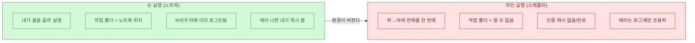
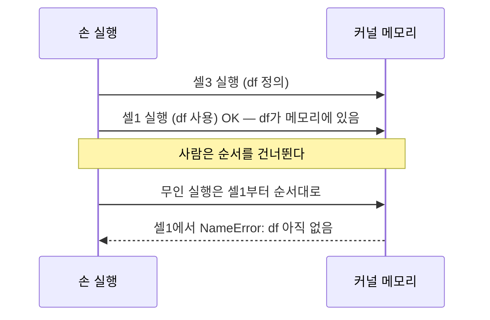
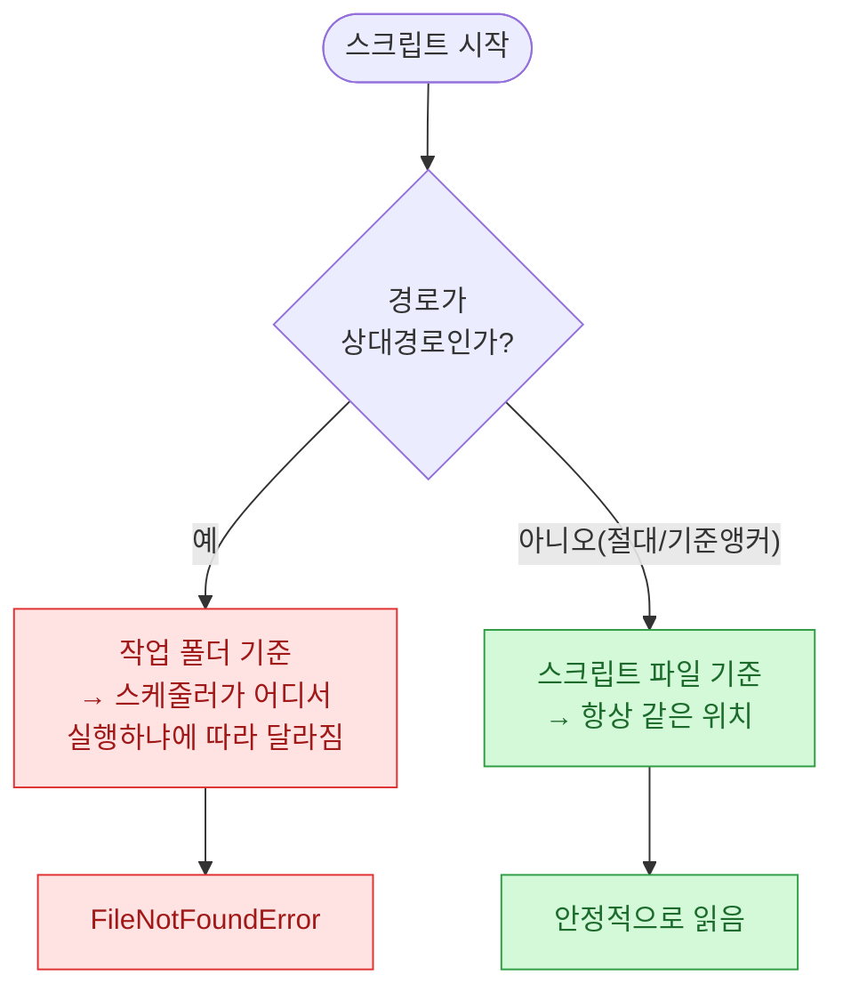
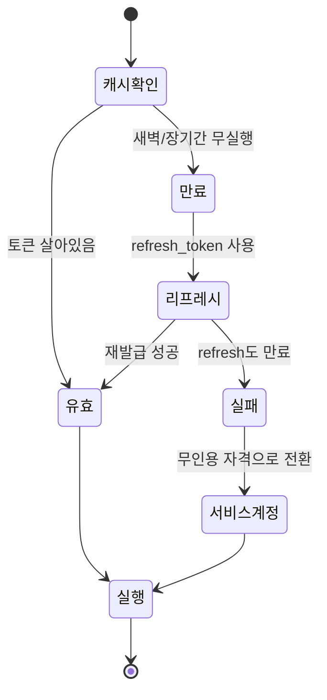
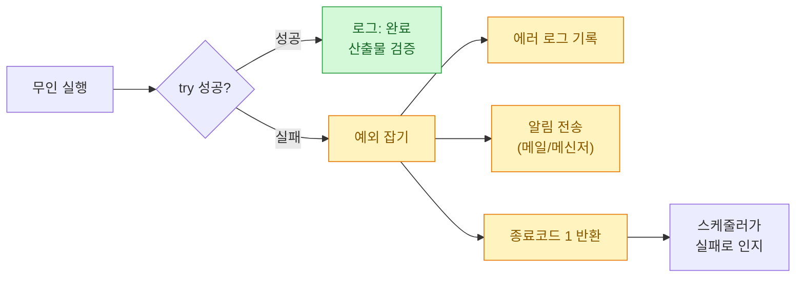
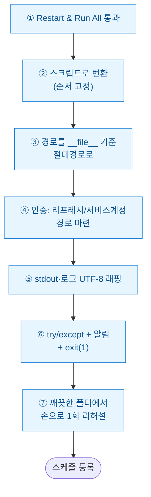

노트북에서 잘 돌던 코드가 스케줄러에 올라가는 순간 딴사람이 된다. 나는 이걸 여러 번 새벽에 배웠다. 손으로 위에서 아래로 실행할 때는 한 번도 안 터지던 게, 아무도 안 보는 새벽 3시에 조용히 죽어 있는 것이다. 이 글은 그 다섯 가지 함정과 내가 쓰는 방어법을 정리한 회고다.

> 이 글의 모든 코드·경로·데이터는 **합성(더미) 데이터**다. 회사 실무 코드나 실제 계정은 등장하지 않는다.

## 먼저, 노트북과 스케줄러 실행은 뭐가 다른가?

머릿속 그림부터 맞추자. 손으로 돌리는 노트북과 무인 스케줄 실행은 "실행되는 코드"만 같고 나머지 환경은 거의 다르다.



차이를 표로 다시 보면 이렇다.

| 항목 | 손 실행 | 무인 실행 | 깨지는 지점 |
|------|---------|-----------|-------------|
| 실행 순서 | 내가 위아래로 오간다 | 무조건 위→아래 1회 | 셀 순서 의존 |
| 작업 폴더 | 노트북이 있는 폴더 | 스케줄러가 정한 폴더 | 상대경로 |
| 인증 | 브라우저·토큰 살아있음 | 캐시 없음/만료 | 토큰 재발급 |
| 출력 | 화면에서 즉시 확인 | 로그 파일뿐 | 조용한 실패 |

이제 하나씩 뜯어보자.

## 함정 ①: 셀 실행 순서에 의존하고 있었다

노트북의 가장 은밀한 함정. 나는 개발하면서 셀을 위아래로 왔다 갔다 실행한다. 아래쪽 셀에서 만든 변수를 위쪽 셀이 참조하는데도 "이미 메모리에 있으니까" 잘 돈다. 그런데 스케줄러는 `jupyter nbconvert --execute`나 `papermill`로 **위에서 아래로 딱 한 번** 실행한다. 순서가 어긋난 곳은 즉시 `NameError`로 터진다.



**방어법은 두 가지다.**

첫째, 개발 마지막에 반드시 커널을 재시작하고 `Restart & Run All`로 한 번 통과시킨다. 이게 안 되면 스케줄러에서도 안 된다.

둘째, 노트북을 아예 실행 대상으로 삼지 말고 스크립트로 뽑아 함수 순서를 명시적으로 고정한다.

```bash
# 노트북을 스크립트로 변환해 실행 순서를 눈으로 고정
jupyter nbconvert --to script pipeline.ipynb
```

```python
# 변환 후: 실행 순서가 코드 흐름에 그대로 드러난다
def main():
    df = load_raw()        # ① 먼저
    df = clean(df)         # ② 다음
    save(summarize(df))    # ③ 마지막

if __name__ == "__main__":
    main()
```

## 함정 ②: 상대경로가 엉뚱한 폴더를 가리켰다

노트북에서 `pd.read_csv("data/input.csv")`는 잘 됐다. 노트북의 작업 폴더가 노트북 위치였으니까. 그런데 스케줄러는 종종 `C:\Windows\System32`나 사용자 홈 같은 데서 실행을 시작한다. 그러면 상대경로 `data/input.csv`는 존재하지 않는 폴더를 가리키고 `FileNotFoundError`가 난다.



핵심은 "현재 작업 폴더" 대신 "이 파일이 있는 위치"를 기준점으로 삼는 것이다.

```python
from pathlib import Path

# __file__ = 이 스크립트 자신의 위치. 스케줄러가 어디서 부르든 고정된다.
BASE = Path(__file__).resolve().parent
INPUT = BASE / "data" / "input.csv"
OUTPUT = BASE / "out" / "summary.csv"

# 드라이브 문자(C:, D:)에 의존하지 않고 상대 앵커로만 조립 → 이식성 확보
df = read_synthetic(INPUT)
```

노트북에는 `__file__`이 없으니, 파라미터로 기준 폴더를 받는 방식도 좋다. `papermill`을 쓴다면 실행 시 `base_dir`을 주입해 두면 노트북 안에서 상대경로를 안 쓴다.

## 함정 ③: 인증 캐시가 새벽에 만료됐다

이게 제일 억울한 함정이다. 낮에 손으로 돌릴 때는 브라우저에 로그인이 살아 있고, API 토큰도 캐시에 남아 있다. 그래서 인증 코드가 조용히 통과한다. 그런데 무인 환경에는 그 캐시가 없거나, 있어도 만료된다. 결과는 새벽 3시의 `401 Unauthorized`.



교훈은 이렇다. **무인 실행은 "사람 로그인"에 기대면 안 된다.** 손 실행에서 우연히 통과하던 인증은 무인에서 반드시 명시적으로 관리해야 한다.

```python
# 나쁜 예: 브라우저/캐시가 있다고 가정 (손 실행에서만 통과)
# creds = load_cached_login()

# 좋은 예: 만료를 가정하고 재발급 경로를 항상 준비
def get_token(store):
    tok = store.load()
    if tok is None or tok.expired:
        if tok and tok.refresh_token:
            tok = refresh(tok)        # ① 리프레시 토큰으로 조용히 재발급
        else:
            tok = machine_credential() # ② 무인용 자격(서비스 계정 등)으로 폴백
        store.save(tok)
    return tok
```

- 대화형 OAuth(사람이 브라우저에서 동의)는 무인 스케줄에 부적합하다.
- 가능하면 리프레시 토큰을 안전한 저장소에 두고 자동 재발급하거나, 무인 실행용 자격(서비스 계정 등)으로 갈아탄다.
- 자격 정보는 코드에 박지 말고 환경 변수나 별도 비밀 저장소에서 읽는다.

## 함정 ④: 콘솔 인코딩 때문에 로그가 터졌다 (특히 Windows)

작은데 자주 겪는다. 노트북 셀 출력은 UTF-8을 잘 받아준다. 그런데 Windows 스케줄러가 잡아주는 콘솔의 기본 인코딩은 종종 `cp949`라서, 한글이나 이모지를 `print`하는 순간 `UnicodeEncodeError`로 스크립트가 통째로 죽는다. 데이터 처리는 멀쩡히 끝냈는데 마지막 로그 한 줄 때문에 실패로 기록되는 것이다.

```python
import sys, io

# stdout/stderr를 UTF-8로 감싸 콘솔 인코딩과 무관하게 만든다
sys.stdout = io.TextIOWrapper(sys.stdout.buffer, encoding="utf-8")
sys.stderr = io.TextIOWrapper(sys.stderr.buffer, encoding="utf-8")

print("적재 완료: 합성 데이터 1,240행 처리 ✅")  # 이제 안 터진다
```

파일로 로그를 쓸 때도 반드시 `encoding="utf-8"`을 명시한다. 안 하면 열 때 기본 인코딩을 따라가서 같은 사고가 난다.

## 함정 ⑤: 실패했는데 아무도 몰랐다 (조용한 실패)

앞의 네 개보다 무서운 건 이거다. 스크립트가 중간에 죽었는데 스케줄러는 "실행은 시켰다"고만 알고, 나는 데이터가 안 쌓인 걸 며칠 뒤에 안다. 손 실행이면 빨간 에러를 즉시 봤을 텐데, 무인이면 로그를 안 열면 모른다.



방어의 핵심 세 가지: **로그로 남기고, 알림을 쏘고, 종료 코드로 실패를 알린다.**

```python
import logging, sys
from pathlib import Path

BASE = Path(__file__).resolve().parent
logging.basicConfig(
    filename=BASE / "run.log",
    level=logging.INFO,
    encoding="utf-8",                 # 함정 ④ 방어도 겸함
    format="%(asctime)s %(levelname)s %(message)s",
)

def main():
    rows = run_pipeline()             # 합성 데이터 파이프라인
    if rows == 0:                     # 성공했지만 결과가 비면 그것도 이상신호
        raise ValueError("산출물 0행 — 상류 데이터 확인 필요")
    logging.info("완료: %d행", rows)

if __name__ == "__main__":
    try:
        main()
    except Exception:
        logging.exception("파이프라인 실패")  # 스택트레이스까지 기록
        notify("새벽 배치 실패 — run.log 확인")  # 알림 (더미 함수)
        sys.exit(1)                    # 스케줄러에 실패를 명시적으로 알림
```

`sys.exit(1)`이 중요하다. 예외를 잡아 로그만 남기고 정상 종료(코드 0)하면, 스케줄러는 성공한 줄 안다. 실패는 실패라고 말해줘야 한다.

## 그래서 노트북을 스케줄러에 올리기 전 체크리스트는?

내가 지금은 무인 실행에 올리기 전에 이 순서로 점검한다.



마지막 ⑦번, "일부러 낯선 폴더로 옮겨서 한 번 돌려보기"가 사실상 앞의 모든 함정을 한꺼번에 걸러준다. 노트북이 있던 폴더가 아닌 곳에서, 캐시를 비운 상태로 돌렸을 때 통과하면 새벽에도 통과한다.

핵심 3줄 요약:

- 노트북은 "사람이 옆에 있다"는 전제(순서·경로·로그인·화면)를 깔고 돈다. 무인 실행은 그 전제가 전부 사라진다.
- 순서는 스크립트로 고정, 경로는 `__file__` 기준, 인증은 재발급 경로 준비, 로그는 UTF-8, 실패는 `exit(1)`로 알린다.
- 등록 전 낯선 폴더에서 한 번 리허설하면 대부분의 새벽 사고를 미리 잡는다.
