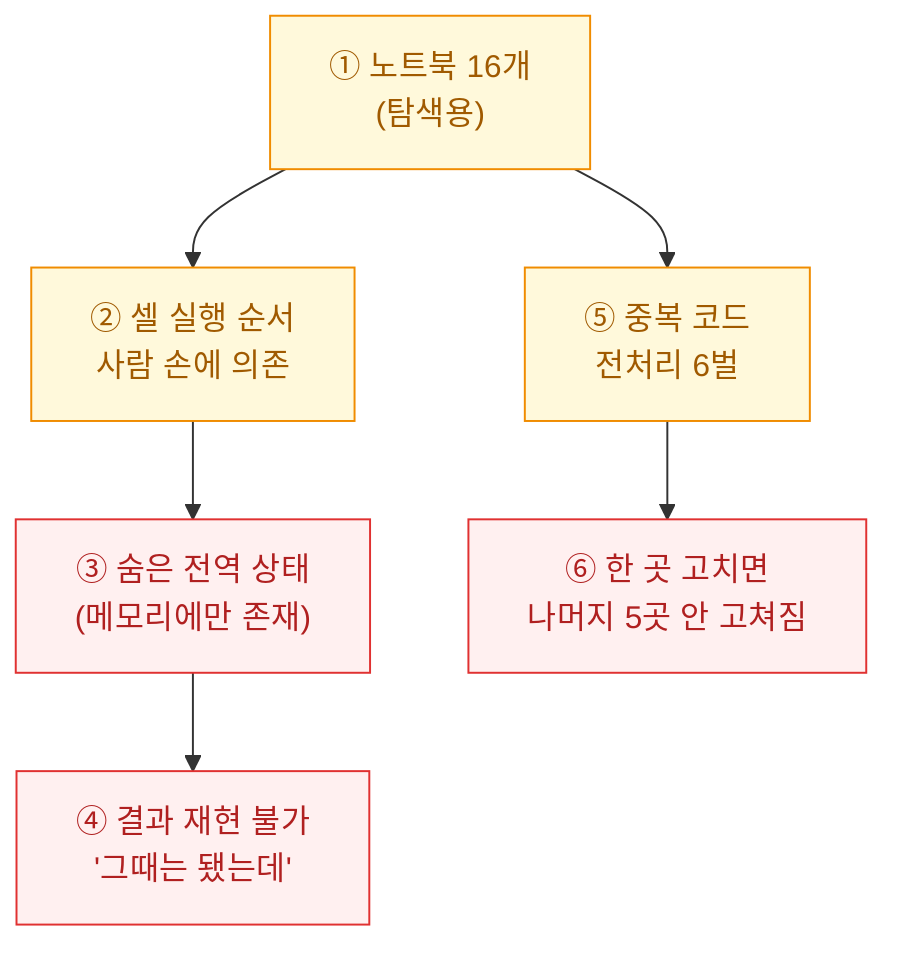
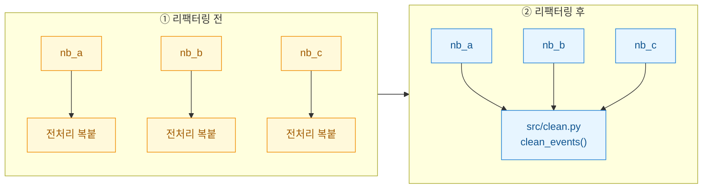
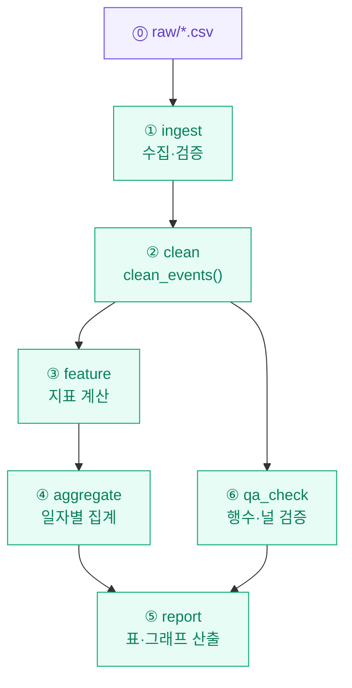

폴더를 열었더니 `분석_최종.ipynb`, `분석_최종_v2.ipynb`, `진짜최종.ipynb` 같은 파일이 16개 있었다. 전부 내가 만든 것이다. 실험할 때는 노트북만큼 편한 게 없었는데, 이걸 매주 돌려야 하는 처지가 되자 문제가 드러났다. "지난주 그 숫자 어떻게 나온 거예요?"라는 질문에 나조차 답을 못 했다. 오늘은 이 더미를 하나의 파이프라인으로 굳힌 과정을 남긴다.

> ℹ️ 아래 코드·수치는 전부 합성/더미다. 실무 데이터나 고객 정보는 포함되지 않는다.

## 왜 노트북은 운영에 부적합했나?

한마디로 **재현성(reproducibility)이** 없었다. 노트북은 셀을 위에서 아래로 실행한다고 착각하기 쉽지만, 실제로는 내가 이 셀 저 셀을 손으로 눌러가며 만든 "실행 순서의 역사"가 결과에 박혀 있다.



특히 무서웠던 건 **숨은 상태(hidden state)다**. 앞 셀에서 만든 변수가 메모리에 살아 있어서, 그 셀을 지워도 아래 코드가 멀쩡히 돌아간다. 커널을 재시작하는 순간 전부 무너진다.

| 항목 | 노트북 더미 | 파이프라인 |
|------|------------|-----------|
| 실행 방식 | 셀을 손으로 클릭 | `python run.py` 한 줄 |
| 순서 보장 | 사람 기억에 의존 | DAG가 강제 |
| 전처리 코드 | 6벌 복붙 | 함수 1개 재사용 |
| 결과 재현 | "그때는 됐는데" | 매번 동일 |
| 리뷰 | diff 지옥(JSON) | 일반 `.py` diff |

## 무엇부터 뜯어냈나 — 인벤토리와 공통 함수 추출

리팩터링의 첫 삽은 코딩이 아니라 **정리(inventory)였다**. 노트북 16개를 열어 "이 노트북은 무엇을 입력받아 무엇을 뱉는가"만 표로 적었다. 그러자 절반이 같은 전처리를 복붙하고 있다는 게 보였다.



중복 전처리를 모듈 하나로 뽑았다. 노트북에 흩어져 있던 로직이 테스트 가능한 순수 함수(pure function)가 되는 순간이다.

```python
# src/clean.py — 합성 예시
import pandas as pd

def clean_events(df: pd.DataFrame) -> pd.DataFrame:
    """원시 이벤트 로그를 표준 스키마로 정리한다.
    입력/출력이 명확하고 전역 상태에 의존하지 않는다."""
    out = df.copy()
    out["ts"] = pd.to_datetime(out["ts"], errors="coerce")
    out = out.dropna(subset=["ts", "user_id"])
    out["day"] = out["ts"].dt.floor("D")
    return out.reset_index(drop=True)
```

## 어떻게 실행 순서를 강제했나 — 노트북을 DAG로

핵심은 "사람이 순서를 기억한다"를 "코드가 순서를 강제한다"로 바꾸는 것이다. 각 노트북을 **단계(stage)** 함수로 만들고, 입력 파일이 있어야 다음 단계가 돌도록 의존성을 명시했다. 이게 곧 **DAG(방향 비순환 그래프)다** — 화살표가 한 방향으로만 흐르고 되돌아오지 않는 작업 흐름.



오케스트레이션은 거창한 도구 없이 시작했다. 얇은 러너 하나면 충분하다. 나중에 규모가 커지면 그때 전용 도구로 갈아타면 된다.

```python
# run.py — 합성 예시
from src import ingest, clean, feature, aggregate, report

def main():
    raw = ingest.load("data/raw")        # ①
    events = clean.clean_events(raw)     # ②
    feats = feature.build(events)        # ③
    daily = aggregate.by_day(feats)      # ④
    report.render(daily, "out/")         # ⑤
    print("pipeline done:", len(daily), "rows")

if __name__ == "__main__":
    main()
```

이제 `python run.py` 한 줄이면 끝이다. 커널 상태도, 셀 클릭 순서도 개입할 여지가 없다.

## 굳히고 나서 무엇이 달라졌나 — 검증과 남은 노트북의 역할

파이프라인이 생기니 **검증(QA)을** 흐름 안에 넣을 수 있었다. 중간 단계에서 행 수와 널 비율을 확인하고, 기준을 벗어나면 아예 멈추게 했다. 조용히 틀린 숫자를 뱉는 것보다 시끄럽게 멈추는 게 낫다.

```python
# src/qa_check.py — 합성 예시
def assert_sane(df, min_rows=100, max_null=0.05):
    assert len(df) >= min_rows, f"행 수 부족: {len(df)}"
    null_ratio = df.isna().mean().max()
    assert null_ratio <= max_null, f"널 비율 초과: {null_ratio:.2%}"
```

그렇다고 노트북을 버린 건 아니다. 역할을 나눴을 뿐이다.

| 목적 | 도구 | 재현성 요구 |
|------|------|-----------|
| 새 가설 탐색·시각화 | 노트북(자유롭게) | 낮음 |
| 매주 돌리는 운영 산출 | `.py` 파이프라인 | 높음 |
| 파이프라인 결과 검토 | 노트북(읽기 전용) | 중간 |

정리하면, 노트북은 **실험(exploration)의** 언어이고 파이프라인은 **운영(operation)의** 언어다. 둘을 억지로 하나로 쓰려던 게 문제였다. 탐색은 노트북에서 자유롭게 하되, "매주 같은 결과가 나와야 하는 것"만 골라 스크립트로 굳히니 "그 숫자 어떻게 나왔어요?"라는 질문에 이제는 `run.py`를 가리키며 답할 수 있게 됐다.
