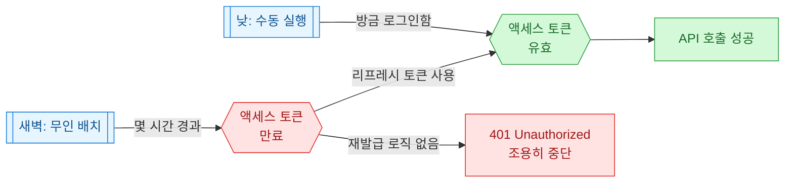
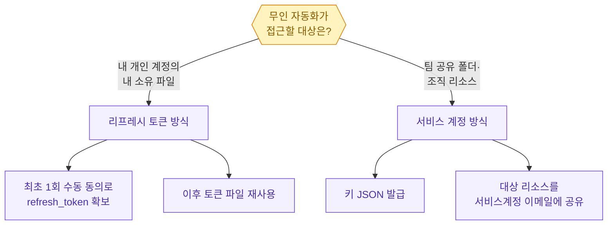
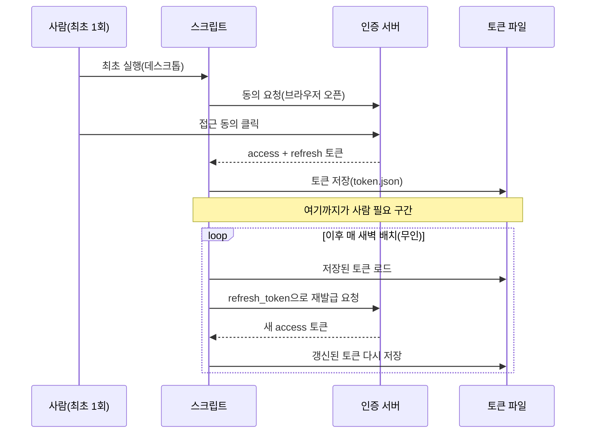
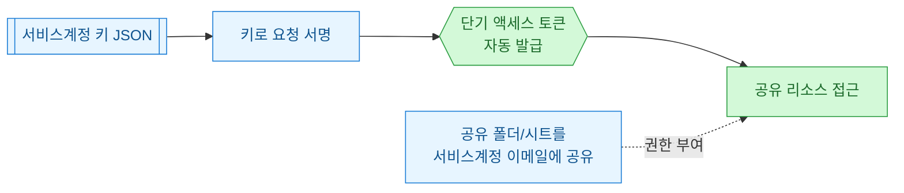

무인 스케줄러에 올려둔 자동화가 낮에는 멀쩡하다가 새벽 배치에서만 조용히 죽어 있던 적이 있다. 로그를 열어보면 코드 버그가 아니라 인증이 끊긴 것이었다. 이 글은 그 원인을 **OAuth 토큰 만료**로 좁혀서, 리프레시 토큰과 서비스 계정 두 갈래로 어떻게 끊김 없이 돌게 만드는지 정리한 회고다.

> 이 글의 모든 토큰 값·계정명·경로·수치는 **합성(더미) 데이터**다. 실제 자격증명은 등장하지 않는다.

## 왜 낮엔 되던 게 새벽엔 멈추나?

핵심은 두 종류의 토큰이 수명이 다르다는 점이다. **액세스 토큰(access token)**은 짧게 살고(보통 1시간), **리프레시 토큰(refresh token)**은 길게 살면서 액세스 토큰을 재발급받는 열쇠 역할을 한다.

낮에 내가 직접 스크립트를 돌릴 땐, 조금 전에 브라우저 로그인으로 받아둔 액세스 토큰이 아직 살아 있어서 그냥 된다. 그런데 새벽 배치는 그로부터 몇 시간 뒤에 도는지라, 그 사이 액세스 토큰이 만료된다. 재발급 로직이 없으면 바로 그 자리에서 `401`을 맞고 멈춘다.



정리하면, 무인 환경에서 필요한 건 "사람이 다시 로그인하지 않아도 액세스 토큰을 스스로 갱신하는 능력"이다. 이걸 확보하는 길이 크게 두 갈래로 갈린다.

## 두 갈래 — 리프레시 토큰이냐 서비스 계정이냐?

| 방식 | 누구의 권한으로 접근? | 최초 사람 개입 | 무인 적합도 | 주 용도 |
| --- | --- | --- | --- | --- |
| 리프레시 토큰 (설치형 앱) | 특정 사용자 본인 | 최초 1회 브라우저 동의 필요 | 중 | 개인 계정의 내 파일에 접근 |
| 서비스 계정 (service account) | 로봇 계정 | 없음(키 파일만) | 상 | 공유 리소스·조직 자원 접근 |

둘의 갈림길은 "**누구의 신원으로** API를 부르느냐"다. 리프레시 토큰은 결국 나(사용자)를 대신하는 것이라 최초에 한 번은 사람이 브라우저에서 동의를 눌러줘야 한다. 서비스 계정은 처음부터 사람이 아닌 로봇 계정이라, 그 계정에 리소스를 공유해두면 사람 개입이 아예 없다.



## 리프레시 토큰 방식은 어떻게 돌아가나?

이 방식의 함정은 **최초 인증을 스케줄러 안에서 하려는 것**이다. 무인 프로세스엔 브라우저가 없으니 동의 화면을 띄울 수 없어 그대로 멈춰버린다. 그래서 흐름을 둘로 나눈다. 처음 한 번은 사람이 있는 데스크톱에서 동의를 마치고 토큰을 파일로 저장해두고, 그 다음부터 스케줄러는 저장된 토큰만 재사용한다.



아래는 합성 예시다. 핵심은 저장된 토큰이 만료됐으면 리프레시 토큰으로 조용히 갱신하고, 갱신 결과를 다시 파일에 써두는 부분이다.

```python
import json
from pathlib import Path
from datetime import datetime, timedelta, timezone

TOKEN_FILE = Path("token.json")  # 합성 경로

def load_token() -> dict:
    # 실제로는 발급 라이브러리의 Credentials 객체를 쓰지만
    # 여기서는 구조만 보이기 위한 더미 토큰이다.
    return json.loads(TOKEN_FILE.read_text(encoding="utf-8"))

def is_expired(tok: dict) -> bool:
    exp = datetime.fromisoformat(tok["expiry"])
    # 만료 2분 전이면 미리 갱신(경계에서 깨지는 것 방지)
    return datetime.now(timezone.utc) >= exp - timedelta(minutes=2)

def refresh(tok: dict) -> dict:
    # 실제 구현은 refresh_token으로 토큰 엔드포인트에 POST.
    # 여기서는 새 access 토큰과 만료시각을 갱신하는 흐름만 표현한다.
    tok["access_token"] = "DUMMY_NEW_ACCESS_" + datetime.now().strftime("%H%M%S")
    tok["expiry"] = (datetime.now(timezone.utc) + timedelta(hours=1)).isoformat()
    return tok

def get_valid_token() -> dict:
    tok = load_token()
    if is_expired(tok):
        tok = refresh(tok)
        TOKEN_FILE.write_text(json.dumps(tok, ensure_ascii=False), encoding="utf-8")
        print("[auth] 액세스 토큰 갱신 완료")
    else:
        print("[auth] 기존 토큰 유효, 재사용")
    return tok

if __name__ == "__main__":
    token = get_valid_token()
    print("사용할 access:", token["access_token"][:16], "...")
```

여기서 놓치기 쉬운 두 가지가 있다. 첫째, **갱신한 토큰을 반드시 다시 저장**해야 한다. 저장을 빼먹으면 다음 실행 때 또 만료된 토큰을 로드해 무의미한 갱신을 반복한다. 둘째, 만료 직전이 아니라 **2분쯤 여유를 두고** 미리 갱신하는 편이 안전하다. 호출 도중 토큰이 만료되는 경계 케이스를 피할 수 있다.

## 리프레시 토큰이 갑자기 무효가 되는 이유는?

리프레시 토큰은 오래 살긴 해도 영원하진 않다. 새벽에 멈췄는데 코드도 안 건드렸다면, 아래 중 하나일 확률이 높다.


이 목록이 알려주는 교훈은, 리프레시 토큰 방식은 **언젠가 사람이 다시 개입해야 하는 순간이 온다**는 점이다. 그래서 나는 갱신이 실패하면 조용히 죽지 않고 나에게 알림을 보내도록 만들어둔다. 새벽에 멈춘 걸 다음 날 낮에야 발견하는 상황을 막기 위해서다.

```python
def get_token_or_alert():
    try:
        return get_valid_token()
    except Exception as e:
        # 실제로는 메신저/메일 알림. 여기선 표준출력으로 대체.
        print(f"[ALERT] 토큰 갱신 실패 → 수동 재인증 필요: {e}")
        raise
```

## 서비스 계정은 왜 더 조용한가?

접근 대상이 개인 파일이 아니라 팀 공유 리소스라면, 애초에 사람 신원을 빌리지 말고 로봇 계정으로 가는 게 깔끔하다. 서비스 계정은 브라우저 동의 단계가 없고, 키 파일로 토큰을 발급받는다. 갱신도 라이브러리가 알아서 처리하는 경우가 많아 "만료로 새벽에 멈추는" 문제 자체가 줄어든다.



다만 서비스 계정에도 함정이 있다. 흔한 실수는 **키만 만들고 리소스 공유를 안 하는 것**이다. 서비스 계정 이메일(예: `robot@example-project.dummy`)은 사람 계정과 별개의 신원이라, 그 이메일에게 대상 폴더나 시트를 명시적으로 공유해주지 않으면 인증은 되는데 정작 파일이 안 보인다. "권한은 통과했는데 목록이 비어 있다"면 십중팔구 이 경우다.

```python
# 서비스 계정 키를 파일 밖(환경변수)에 두는 편이 안전하다.
import os, json

def load_service_key() -> dict:
    raw = os.environ.get("SVC_KEY_JSON")  # 키 JSON 문자열을 환경변수로 주입(합성)
    if not raw:
        raise RuntimeError("서비스 계정 키가 주입되지 않음(SVC_KEY_JSON)")
    key = json.loads(raw)
    print("[auth] 서비스계정:", key.get("client_email", "robot@example.dummy"))
    return key
```

키 파일을 코드 저장소에 커밋하지 말고 환경변수나 별도 시크릿 저장소로 주입하는 건 기본이다. 무인이라도(무인이라서 더욱) 자격증명이 로그나 저장소에 새어 나가지 않게 관리해야 한다.

## 그래서 실전에선 어떻게 고르나?

두 방식의 성격을 한 장으로 요약하면 이렇다.

| 판단 기준 | 리프레시 토큰 | 서비스 계정 |
| --- | --- | --- |
| 대상이 개인 소유 파일 | 적합 | 공유 설정 시 가능 |
| 대상이 팀 공유 리소스 | 가능하나 번거로움 | 적합 |
| 최초 사람 개입 | 필요(1회) | 불필요 |
| 장기 무인 안정성 | 중(토큰 무효화 위험) | 상 |
| 자격증명 관리 부담 | 토큰 파일 갱신 저장 | 키 파일 유출 방지 |

내 결론은 단순하다. 내 개인 계정의 내 파일을 다뤄야 하면 리프레시 토큰으로 가되 **갱신 실패 알림**을 반드시 붙이고, 팀 공유 리소스라면 처음부터 **서비스 계정**으로 가서 새벽에 깨어날 일을 없앤다.

## 핵심 3줄 요약

- 새벽에 조용히 멈추는 자동화의 흔한 범인은 코드가 아니라 **만료된 액세스 토큰**이다.
- 리프레시 토큰 방식은 최초 1회 사람 동의가 필요하고, 갱신한 토큰을 **다시 저장**하고 **실패 시 알림**을 붙여야 한다.
- 팀 공유 리소스라면 **서비스 계정**이 더 조용하다 — 단, 대상 리소스를 서비스 계정 이메일에 공유하는 걸 잊지 말 것.
