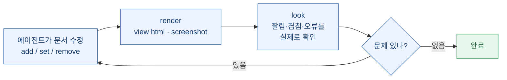
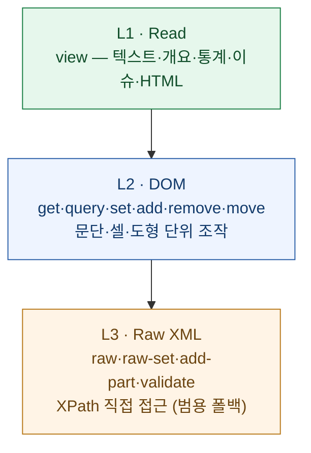

AI 에이전트로 문서를 만들다 보면 늘 같은 벽에 부딪힌다. `.docx`는 python-docx, `.xlsx`는 openpyxl, `.pptx`는 python-pptx — **형식마다 API가 따로**다. 그런데 더 근본적인 문제는 따로 있다. **에이전트가 자기가 만든 결과를 볼 수 없다는 것.** 제목이 넘쳐 잘렸는지, 도형 두 개가 겹쳤는지를 모른 채 XML 구조만 더듬으며 작업한다.

PyTorch KR에 올라온 [9bow(박정환) 님의 소개글](https://discuss.pytorch.kr)로 **OfficeCLI**를 알게 됐다. "세 형식을 하나로 묶고, 에이전트에게 눈을 준다"는 주장이 흥미로워서, 늘 하던 대로 [공식 저장소](https://github.com/iOfficeAI/OfficeCLI)를 1차 출처로 뜯어 검증했다.

> ⚠️ 이 글은 소개글과 공식 저장소·README를 **적대적으로 팩트체크**한 정리다. 나는 아직 직접 실행해 보진 않았으니, 렌더링 정밀도·함수 정확도 같은 실사용 품질은 별도 검증 몫으로 남긴다.

## 먼저 — 주장은 사실인가? (검증)

소개글의 핵심 주장을 GitHub API와 README로 대조했다.

| 주장 | 검증 결과 |
|---|---|
| 저장소 실재·활발 | ✅ `iOfficeAI/OfficeCLI` (C#), 2026-03-15 생성, **2026-07-23에도 커밋**(활발) |
| 인기 | ✅ **★21,737 · 포크 1,454 · 오픈 이슈 41** (2026-07-24 기준) |
| 라이선스 Apache 2.0 | ✅ README·배지·LICENSE 일치 |
| 단일 자체완결 바이너리·.NET 내장·Office 불필요 | ✅ *"Single binary. No Office installation. The .NET runtime is embedded"* |
| 세 형식 읽기·수정·생성 | ✅ README 표에 docx/xlsx/pptx 모두 ✅✅✅ |
| 350개 이상 Excel 함수·피벗 | ✅ *"350+ built-in Excel functions evaluated automatically on write"* |
| 내장 렌더링·MCP 서버 | ✅ `view html/screenshot/watch`·`officecli mcp claude` 모두 명시 |
| **"세계 최초이자 최고"** | ⚠️ **저장소 자체 태그라인**(*"the world's first and the best Office suite designed for AI agents"*) — 검증 불가한 최상급. 소개글은 이걸 정확히 옮겼을 뿐, 사실 주장이 아니라 **제작사의 포지셔닝**으로 읽어야 한다 |

정리하면 **기능·라이선스·인기·활성도는 전부 사실**이고, 유일하게 조심할 건 "세계 최초/최고"라는 자기소개 문구다. 4개월 된 저장소가 별 2만을 넘긴 건 눈에 띄는 초기 견인이지만, 별 수는 화제성이지 품질 보증은 아니다.

## 핵심 차별점 — 에이전트에게 '눈'을 준다

가장 인상적인 건 **내장 HTML 렌더링 엔진**이다. DOM만 보고 추측하는 대신, 렌더된 문서를 실제로 보고 고치는 **render → look → fix** 순환을 화면 없는 CI·Docker에서도 돌린다.

렌더링 모드는 셋이다.

- **`view html`** — 에셋 인라인된 단독 HTML(아무 브라우저에서 열림)
- **`view screenshot`** — 페이지별 PNG(멀티모달 에이전트가 그대로 읽음)
- **`watch`** — 로컬 HTTP 서버로 자동 새로고침 미리보기(`add/set/remove`마다 즉시 갱신)

차트(폭포형·캔들스틱·스파크라인), 수식(OMML→LaTeX→KaTeX), Three.js 기반 3D `.glb`까지 렌더한다고 README에 적혀 있다. 이 대목이 사실이라면, "에이전트가 만든 슬라이드가 실제로 어떻게 보이나"를 사람이 매번 열어 확인하던 병목이 사라진다.

## 복잡도에 따라 내려가는 3계층

또 하나 잘 설계됐다 싶은 건 **3계층 구조**다. 대부분의 작업은 위에서 끝나고, 저수준 제어가 필요할 때만 아래로 내려간다.

영리한 부분은 요소 지정 문법이다. XPath 대신 `/slide[1]/shape[2]`처럼 **1부터 시작하는 인덱스 + 로컬 이름**을 써서, 에이전트가 **XML 네임스페이스를 몰라도** 문서를 탐색한다. OOXML을 직접 만져 본 사람이면 이게 왜 고마운지 안다.

## 반복 생성의 함정을 피하는 두 기능

- **템플릿 병합(`merge`)**: `{{key}}` 자리표시자를 JSON으로 치환. 에이전트가 **레이아웃을 한 번만 설계**(비싼 작업)하면, 이후 코드가 그 템플릿을 **결정적으로 N번** 채운다(토큰 비용 0). "매 보고서를 처음부터 다시 생성하다 N개가 제각각 달라지는" 실패를 막는다.
- **덤프·배치(`dump`/`batch`)**: 기존 문서를 재생 가능한 JSON으로 직렬화하고 다시 재생. 흉내 낼 샘플을 주면 에이전트가 원시 OOXML 대신 구조화 명세를 읽고 고친다. 배치는 기본 원자적이라 한 항목이 실패하면 전체를 되돌린다.

그리고 **MCP 서버 내장** — `officecli mcp claude` 한 줄로 Claude Code에 등록하면 모든 문서 연산이 JSON-RPC 도구로 노출된다.

## 🧭 내 볼트 연결

이건 내가 매일 씨름하는 지점과 정확히 맞닿아 있다.

- 내 지식창고의 문서 추출기(docx·hwp/hwpx·pptx·xlsx·pdf)는 **읽기(추출)** 쪽이다. OfficeCLI는 **쓰기·수정·렌더 검증** 쪽이라 정확히 **상보적**이다. 읽기는 내 도구로, 생성·검증은 이런 도구로 나눌 수 있다.
- 회고 영상용 **PPTX 덱 빌더**(슬라이드 노트=내레이션)를 만들 때 늘 아쉬웠던 게 "생성한 슬라이드가 실제로 어떻게 보이나"였다. `render → look → fix`는 딱 그 구멍을 메운다.
- ⚠️ 단 **한국 포맷(HWP/HWPX)은 대상 밖**이다. 국내 문서 자동화는 여전히 kordoc·hwpx 도구가 필요하고, OfficeCLI는 docx/xlsx/pptx에 한한다. 나한텐 **둘을 함께 쓰는 그림**이 현실적이다.

한 줄 요약: **"에이전트가 자기 결과를 눈으로 보고 고친다"** 는 방향은 문서 생성 자동화의 오래된 맹점을 정면으로 겨눈다. 별 2만은 화제성일 뿐이니, 다음 숙제는 내가 실제 덱 하나를 이걸로 만들어 렌더 정밀도를 직접 재보는 것이다.

---

*출처: PyTorch KR 9bow(박정환) 소개글 + [공식 저장소](https://github.com/iOfficeAI/OfficeCLI)(Apache 2.0). 별·라이선스·기능은 2026-07-24 GitHub API·README 실측. "세계 최초/최고"는 제작사 자체 표현.*
