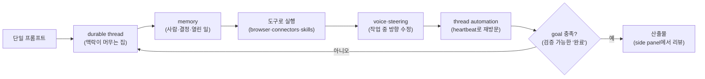
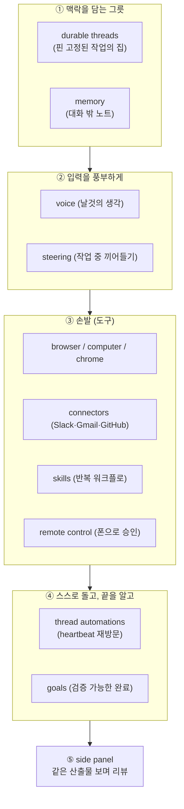
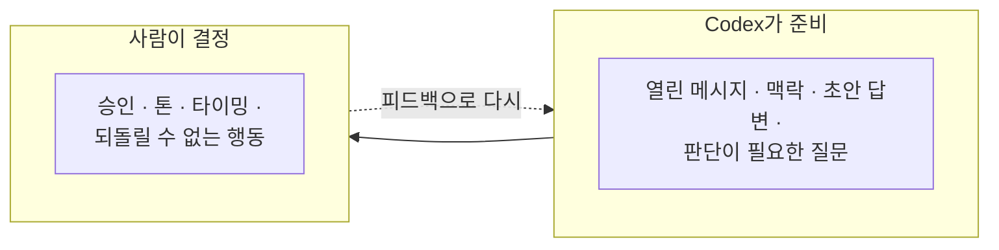
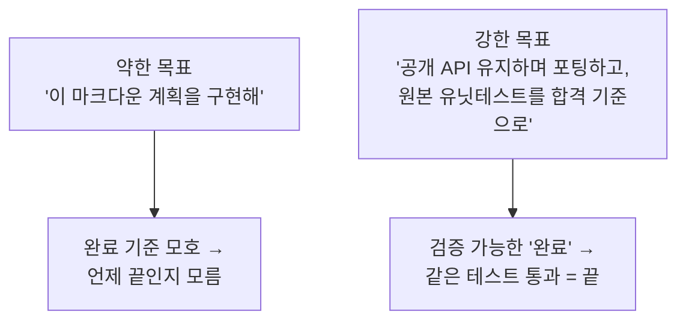
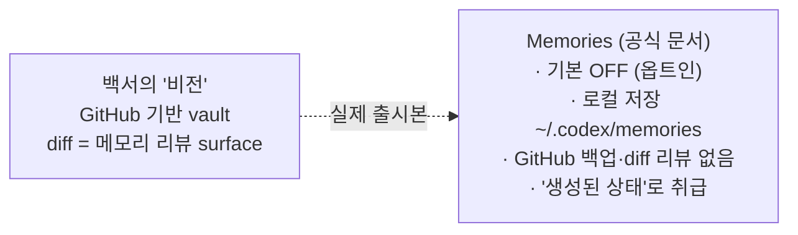
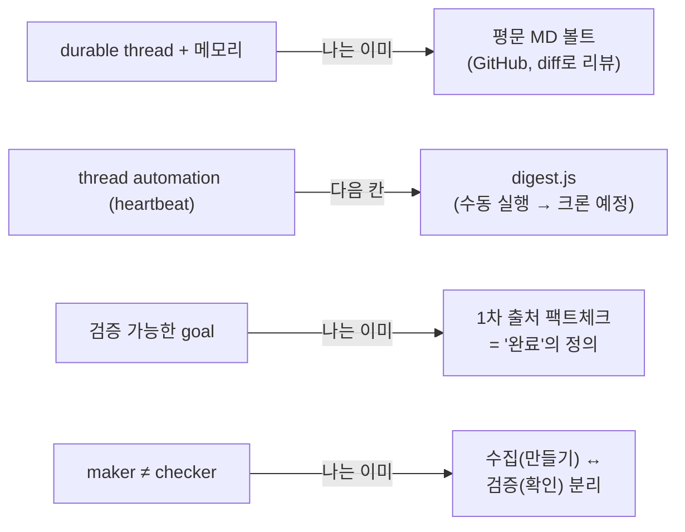

오늘 루프 엔지니어링 글을 두 편 쓰고 나서, OpenAI가 낸 **"Codex-maxxing for long-running work"** 백서를 읽었다. 'maxxing'(맥싱)은 *최대로 끌어쓴다*는 슬랭인데, 한 줄로 요약하면 이렇다 — **단일 프롬프트를 '운영 루프(operating loop)'로 바꿔서, Codex를 일이 머무는 곳으로 만든다.**

읽다 보니 묘했다. 이건 내가 [어제오늘 정리한 루프 엔지니어링]([[loop-engineering-four-loops-loopcraft|루프 4단계]])의 **제품판**이었고, 심지어 백서가 "이렇게 되면 좋다"고 *비전*으로 그린 한 조각은 **내가 이미 평문 MD 볼트로 하고 있는 것**이었다. 그래서 백서를 도식으로 다시 정리하되, 평소 습관대로 **"이게 진짜 출시된 기능인지"를 OpenAI 공식 문서로 대조**해서, 마케팅이 과한 곳은 ⚠️로 떼어냈다.

> 이 글은 OpenAI 백서 *Codex-maxxing for long-running work*(2026, 사례 주인공은 `instructor` 라이브러리 창시자이자 현 OpenAI Codex 팀의 **Jason Liu**)를 **내 식으로 다시 도식화·해설**한 글이다. 원문·원본 도식은 OpenAI 백서에 있다.

## 백서 한 줄 요약은 뭔가?

핵심 주장은 *"Codex는 코딩 도구를 넘어, **일이 시작되고·계속되고·실제 산출물이 되는 장소**가 된다"*는 것이다. 그 장치가 바로 **루프**다 — 맥락·도구·메모리·반복·리뷰가 한 바퀴를 돈다.

> **운영 루프(operating loop)**란? "한 번 묻고 한 번 답받는" 단발 대화가 아니라, **같은 작업 맥락으로 계속 되돌아오며 조금씩 완성도를 올리는** 구조다. 어제 정리한 [에이전트 루프]([[loop-vs-harness-vs-ralph-when-to-use|루프·하네스·랄프]])의 제품 버전이라고 보면 된다.

## 어떤 조각들로 루프를 만드나?

백서는 10개 조각을 든다. 나는 이걸 **역할별로 묶어서** 봤다.

조각별로 짧게 (✅=출시 확인 / ⚠️=주의):

- **durable threads ✅** — 중요한 작업은 *핀 고정된 스레드 하나*를 집으로 삼아 맥락·선호·과거 결정·열린 일을 누적. (단, 긴 스레드는 맥락을 이고 다녀 **비용이 더 들 수 있다**는 트레이드오프를 백서도 인정.)
- **voice ✅** — 말로 주면 *다듬어지지 않은 날것의 생각*(반쯤 기억나는 이름, 막연한 방향)이 들어가 계획이 더 좋아진다. (현재는 Ctrl+M 받아쓰기. 옛 `/realtime` 실험 모드는 제거됨.)
- **steering ✅** — Codex가 *일하는 중에* 다음 지시를 끼워 넣어 방향을 고치거나 다음 단계를 큐에 쌓는다.
- **memory ✅(단, '볼트' 서술은 ⚠️)** — 대화 밖에 열고·편집하고·diff로 비교할 수 있는 노트. *이 대목이 실제 출시본과 가장 다르다 → 아래 별도 점검.*
- **browser/computer/chrome ✅(@computer는 ⚠️)** — `$browser`(로그인 불필요 로컬 프리뷰)·`@chrome`(로그인된 탭)·`@computer`(GUI 클릭). `@computer`는 **지역 제한 + macOS/Windows 한정**.
- **connectors·skills ✅** — Slack·Gmail·GitHub 등으로 손을 뻗고, 성공한 워크플로는 skill로 포장해 재사용.
- **remote control ✅** — 책상에서 시작하고, **폰으로 다음 결정 지점만 승인/수정**. 파일·권한은 원래 기계에 둔 채.
- **thread automations ✅** — *heartbeat(심장박동)처럼 일정 주기로 같은 스레드에 되돌아오는* 예약. 매번 새로 시작하지 않고 맥락을 보존. (분/일/주·cron 지원. 단 "조건 충족까지"는 네이티브 트리거가 아니라 **프롬프트 설계로** 구현.)
- **goals ✅** — *검증 가능한 완료 기준*을 준다. (Goal 모드는 정식 출시.)
- **side panel ✅** — 산출물(PDF·스프레드시트·문서·슬라이드)을 *같은 화면에서 보며* 코멘트·리뷰. ("일이 일어나는 곳"으로 채팅을 넘어섬.)

> **heartbeat**가 핵심 단어다. 어제 글의 [랄프 루프·이벤트 구동 루프]([[loop-vs-harness-vs-ralph-when-to-use]])와 같은 발상 — "사람이 매번 부르지 말고, 정해진 박동으로 알아서 돌아오게."

## 세 가지 '루프 예시'는 어떻게 도나?

백서가 든 예시 3개의 공통 뼈대가 인상 깊었다. **Codex는 *준비*하고, 사람은 *결정*한다.** 어제 글에서 말한 "maker(만드는 쪽) ≠ checker(검증하는 쪽)" 분리가 제품 UX로 그대로 들어가 있다.

| 루프 | Codex가 하는 일 | 사람이 쥐는 키 |
|---|---|---|
| **① Chief of Staff** | Slack·Gmail을 주기적으로 확인 → 답이 필요한 메시지·맥락·**초안 답장** 준비 | 무엇을 보낼지·톤·타이밍 |
| **② 피드백 모니터링** | Slack 피드백 감시 → Remotion 렌더 갱신 → 리뷰본 준비 (도구 횡단) | 창의적 판단·발행 결정 |
| **③ 환불 받기** | 상담원 합류 여부 확인 → 상황 바뀌면 다음 응답 준비 | 동의·승인·**되돌릴 수 없는 행동** |

세 예시 모두 **"사람이 자리를 비워도 작업은 굴러가지만, 비가역적 행동은 반드시 사람 승인"**이라는 경계가 같다. 이게 자동화를 안전하게 만드는 핵심이다.

## 약한 목표 vs 강한 목표, 뭐가 다른가?

백서에서 제일 실용적인 한 장. **약한 목표는 "계획을 구현해"**라고 시키고, **강한 목표는 *테스트할 무언가*를 준다** — 기대 동작, 리뷰 기준, 제약, 명확한 '완료'의 정의.

백서의 구체 예시가 **Rich → Rust 포팅**이다. 목표는 단순히 "포팅"이 아니라 *"원본 유닛테스트를 통과하도록 포팅"*이었다. 그 테스트 묶음이 **객관적 합격선**이 됐고, 같은 테스트가 통과할 때까지는 끝난 게 아니었다.

> 이건 내가 데이터·공시 작업에서 쓰는 **"차변=대변·소계=합계 산술 검증"**과 똑같은 원리다. "AI에게 *완료의 정의*를 코드로 쥐여주면, 검증이 추측에서 *통과/실패*로 바뀐다." 어제 글의 maker≠checker가 여기선 *"테스트가 checker"*인 셈.

## 그런데 '메모리 볼트'는 진짜 출시된 걸까?

여기가 이번에 1차 출처로 잡은 **핵심 과대포장**이다. 백서는 메모리를 이렇게 그린다 — *"vault가 GitHub에 살면, **diff가 곧 메모리 리뷰 surface**가 된다. Codex가 무엇을 적어둘 만큼 중요하다고 봤는지 볼 수 있다."* 멋진 그림이다. 그런데 OpenAI **공식 Codex 문서**로 대조하면 실제 출시본은 다르다.

즉 **"GitHub에 사는 메모리 볼트 + diff 리뷰"는 현재 비전/마케팅에 가깝고**, 실제 'Memories'는 *기본 꺼져 있고, 로컬 디렉터리에 저장되며, diff 기반 리뷰 surface가 아니다*. (출처: [OpenAI Codex Memories 문서](https://developers.openai.com/codex/memories).)

그런데 여기서 진짜 재밌는 건 — **백서가 비전으로 그린 그 그림을, 나는 이미 하고 있다는 것**이다. 내 [평문 MD 지식볼트]([[plaintext-md-llm-knowledge-vault|벡터DB 없이 만든 평문 MD 지식볼트]])는 GitHub에 살고, **모든 변경이 commit diff로 리뷰**된다. OpenAI가 "이렇게 되면 좋다"는 걸, 나는 도구가 아니라 **습관으로** 먼저 갖고 있던 셈이다.

### 그 밖에 짚고 갈 점 (⚠️ 마케팅 vs 출시본)

| 백서 서술 | 실제(OpenAI 공식 문서) |
|---|---|
| GitHub 메모리 볼트 + diff 리뷰 | ⚠️ 실제 Memories는 **로컬·기본 OFF·diff 없음** |
| `@computer`로 GUI 조작 | ⚠️ **지역 제한 + macOS/Windows 한정** |
| thread automation "조건 충족까지" | ⚠️ 시간 기반(분/일/주·cron). "조건까지"는 **프롬프트 설계로** 구현 |
| side panel에 MD·CSV도 | ⚠️ 공식 목록은 PDF·스프레드시트·문서·슬라이드. "웹 surface 조작"은 **별도 in-app 브라우저** 기능 |
| voice 입력 | ✅ 단 현재는 **Ctrl+M 받아쓰기**(옛 `/realtime` 모드는 제거됨) |

> 제품 자체는 진짜고 대부분 출시됐다. 다만 **백서(=마케팅)가 일부 기능을 '비전'까지 끌어와 서술**한 지점이 있어, 그대로 "다 된다"고 옮기면 틀린다. (이건 [어제 라운드업]([[ai-industry-roundup-2026-06-24|6월 AI 이슈]])에서 잡은 패턴과 같다 — 공식 1차 문서를 한 단계 거슬러 보면 갈린다.)

## 내 워크플로엔 어떻게 적용하나?

백서를 덮고 내 작업을 이 틀로 다시 봤더니, 이미 절반은 하고 있었다.

- **메모리 볼트** → 내 평문 MD 볼트가 이미 그 역할(GitHub diff = 리뷰). 백서의 "people/decision/open-loop 노트" 구조는 내 볼트에 바로 차용할 만하다.
- **thread automation** → 손으로 돌리는 다이제스트를 *heartbeat 예약*으로. (어제 글의 '루프 3 = 이벤트 구동'과 같은 한 칸.)
- **goal** → "1차 출처로 팩트체크 통과"를 *완료의 정의*로 명문화.

## 배운 점

백서의 진짜 메시지는 **"AI를 *대화창*이 아니라 *일이 사는 장소*로 바꾸라"**는 것이다. durable thread(집) + memory(기억) + automation(박동) + goal(완료 기준) + side panel(같이 보기) — 이 조각들이 합쳐지면 단발 프롬프트가 **운영 루프**가 된다.

그리고 다시 확인한 습관 — **공식 백서라도 1차 문서로 한 번 더 대조한다.** 'GitHub 메모리 볼트'처럼 멋진 그림이 실은 *아직 비전*인 경우가 있으니까. 동시에, 그 비전을 **이미 평문 MD + GitHub로 굴리고 있었다는 점**에서, 도구는 결국 *좋은 습관을 제품화*하는 방향으로 간다는 것도 느꼈다.

> 같이 보면 좋은 글: [[loop-engineering-four-loops-loopcraft|루프 엔지니어링 4단계]] · [[loop-vs-harness-vs-ralph-when-to-use|루프·하네스·랄프, 언제 써야 하나]] · [[plaintext-md-llm-knowledge-vault|평문 MD 지식볼트]]

---

*이 글은 OpenAI 백서 [Codex-maxxing for long-running work](https://openai.com/index/codex-maxxing-long-running-work/)를 **내 관점에서 다시 도식화·해설**한 것이며, 모든 도식은 원본 이미지를 옮긴 게 아니라 개념을 직접 다시 그린 것입니다. 기능의 실제 출시 여부는 OpenAI 공식 Codex 문서(developers.openai.com/codex)로 2026-06-24 시점에 대조했고, 이후 업데이트로 달라질 수 있습니다.*
