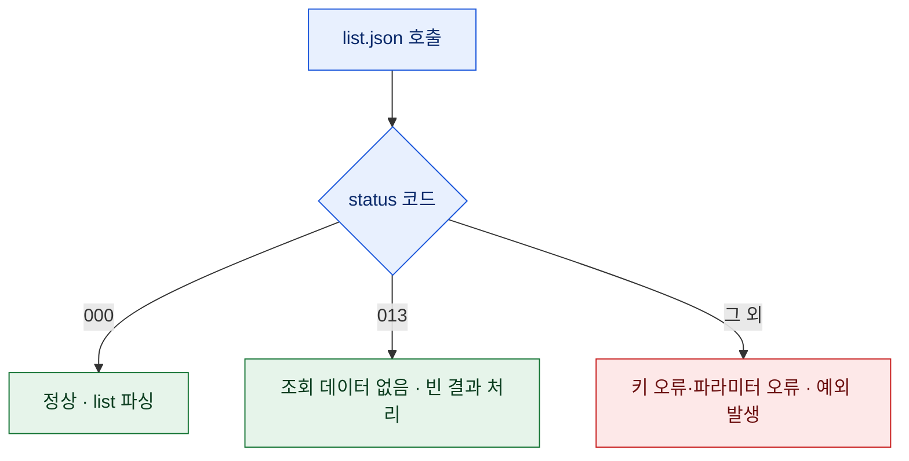

# OpenDART REST API 첫걸음

> 상장사 공시를 손으로 하나씩 열어보다가, 이걸 코드로 못 하나 싶어 OpenDART를 열었다. 금융감독원이 공시 데이터를 REST API로 열어둔 서비스다. 그런데 원문 예제를 그대로 쓰면 매번 URL과 파라미터를 새로 조립하게 돼서, 한 번 쓰고 버리는 코드가 된다. 그래서 처음부터 **재사용 가능한 래퍼**로 감쌌다. 이 글은 그 첫 삽이다. (공개 데이터 기준이며, 회계 판단·투자 권유가 아니다.)

## 시작 전에 — 키는 절대 코드에 박지 않는다

OpenDART는 발급받은 인증키(`crtfc_key`)를 모든 요청에 붙인다. 여기서 첫 원칙. **키를 소스에 하드코딩하지 마라.** 나중에 이 코드를 깃허브에 올리거나 노트북을 공유하는 순간, 키가 그대로 새어 나간다. 환경변수나 별도 설정 파일에서 읽어오고, 그 파일은 버전 관리에서 제외한다.

```python
import os
API_KEY = os.environ["OPENDART_API_KEY"]   # 코드엔 값이 없다
```

옛날에 짠 스크립트를 정리하다 키가 평문으로 박혀 있는 걸 여러 번 봤다. 한 번 새면 회수가 안 되니, 습관으로 굳히는 게 답이다.

## 공시목록 호출 — list.json

가장 기본은 공시목록 조회다. 회사 고유번호나 기간·공시유형으로 목록을 받아온다. 핵심은 파라미터를 딕셔너리로 조립해 `requests`에 넘기는 것.

```python
import requests
import pandas as pd

def list_disclosures(api_key, corp_code="", start="2024-01-01", end="2024-12-31",
                     kind="", final=False):
    url = "https://opendart.fss.or.kr/api/list.json"
    params = {
        "crtfc_key":   api_key,
        "corp_code":   corp_code,
        "bgn_de":      pd.to_datetime(start).strftime("%Y%m%d"),
        "end_de":      pd.to_datetime(end).strftime("%Y%m%d"),
        "last_reprt_at": "Y" if final else "N",
        "page_no":     1,
        "page_count":  100,
    }
    if kind:
        params["pblntf_ty"] = kind      # 공시유형(A=정기공시 등)
    return requests.get(url, params=params, timeout=10).json()
```

날짜를 `pd.to_datetime`으로 한 번 거쳐 `YYYYMMDD` 문자열로 맞추면, 입력 포맷이 좀 달라도 안전하게 받는다.

## 응답은 status 코드부터 본다

OpenDART는 HTTP 200을 주면서도 본문의 `status` 필드로 성패를 알린다. 그래서 **HTTP 상태가 아니라 응답 본문의 status를 봐야 한다.** `000`이 정상, 데이터 없음·키 오류 등은 다른 코드로 온다.



```python
def parse_list(jo):
    if jo.get("status") != "000":
        if jo.get("status") == "013":     # 조회된 데이터 없음
            return pd.DataFrame()
        raise ValueError(f'{jo.get("status")}: {jo.get("message")}')
    return pd.DataFrame(jo["list"])
```

## 여러 페이지는 total_page로 돈다

공시가 많으면 한 번에 다 안 온다. 응답의 `total_page`를 보고 2페이지부터 끝까지 돌며 이어 붙인다.

```python
def list_all(api_key, **kw):
    first = list_disclosures(api_key, **kw)
    frames = [parse_list(first)]
    for page in range(2, first.get("total_page", 1) + 1):
        jo = list_disclosures(api_key, **kw)   # page_no만 바꿔 호출
        frames.append(parse_list(jo))
    return pd.concat(frames, ignore_index=True)
```

## 회사 고유번호 — corpCode.zip 다루기

OpenDART는 회사명을 안 받는다. **고유번호(corp_code)** 로 회사를 지정한다. 이 매핑표는 ZIP으로 한 번 받아 그 안의 XML을 파싱해 테이블로 만들어 둔다.

```python
import zipfile, io
import xml.etree.ElementTree as ET

def load_corp_codes(api_key):
    url = "https://opendart.fss.or.kr/api/corpCode.xml"
    raw = requests.get(url, params={"crtfc_key": api_key}, timeout=30).content
    zf = zipfile.ZipFile(io.BytesIO(raw))          # 메모리에서 압축 해제
    xml = zf.read(zf.namelist()[0])
    rows = [{c.tag: c.text for c in item} for item in ET.fromstring(xml).iter("list")]
    return pd.DataFrame(rows)                       # corp_code ↔ corp_name 매핑
```

메모리에서 바로 풀어 DataFrame으로 만들면, 회사명으로 고유번호를 찾는 조회가 한 줄이 된다.

## 예의 — 레이트리밋과 에러 내성

공개 API에도 호출 한도가 있다. 페이징 루프에 짧은 간격을 두고, 일시적 오류(타임아웃·5xx)엔 지수 백오프로 물러났다 재시도한다. 이 두 가지만 넣어도 배치가 하루 종일 안정적으로 돈다.

## 정리 — 한 번 감싸두면 계속 쓴다

| 조각 | 역할 |
|---|---|
| 키=환경변수 | 유출 방지(하드코딩 금지) |
| list.json 래퍼 | 파라미터 조립 표준화 |
| status 체크 | HTTP가 아니라 본문으로 성패 판정 |
| total_page 루프 | 대량 공시 완주 |
| corpCode 매핑 | 회사명 → 고유번호 |

> API 하나를 함수로 감싸는 데 30분이면 충분하다. 그런데 그 30분이, 다음에 같은 데이터를 볼 때의 반나절을 아껴준다. OpenDART 같은 공개 데이터는 이렇게 래퍼 한 겹만 둘러두면 두고두고 재산이 된다.

*공개 DART 데이터 기준의 기술 예시입니다. 특정 기업 분석·회계 판단·투자 권유가 아닙니다.*
