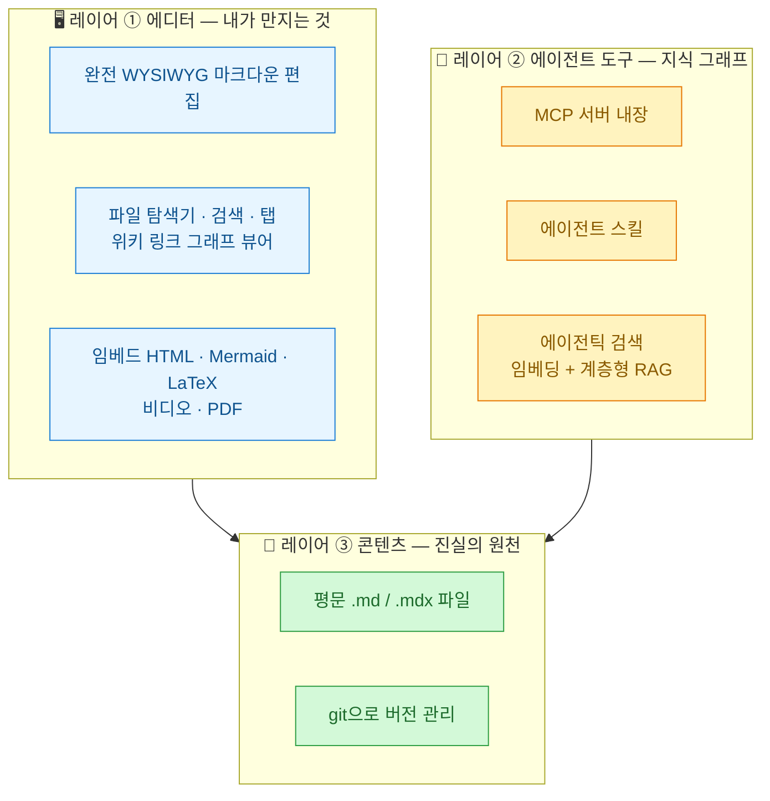
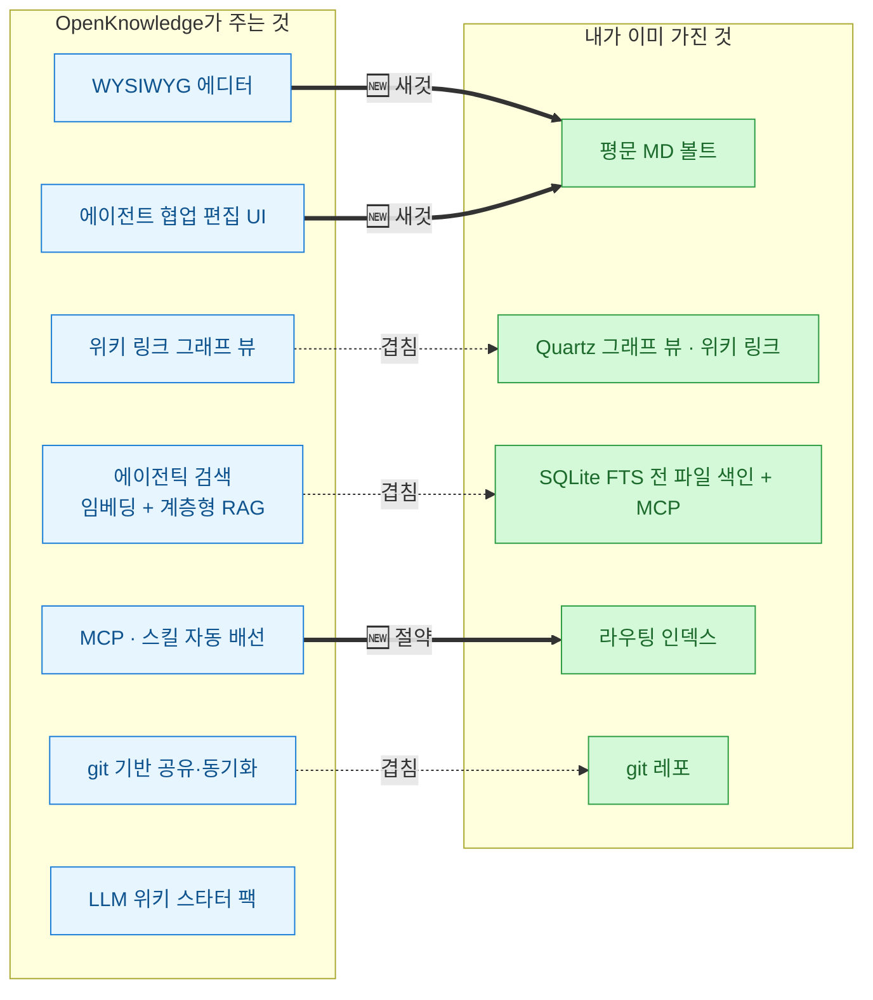
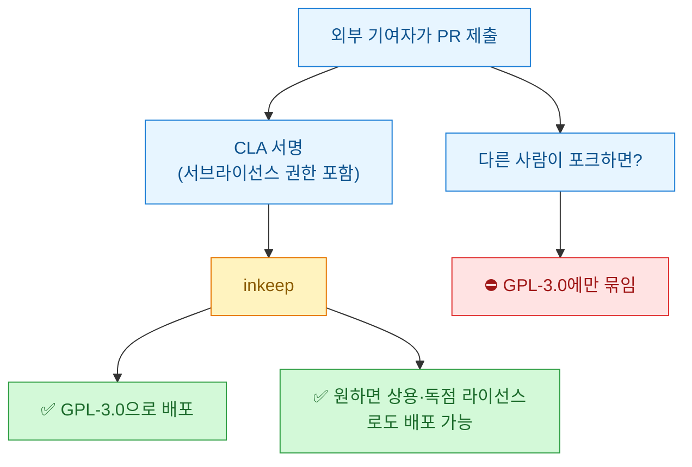
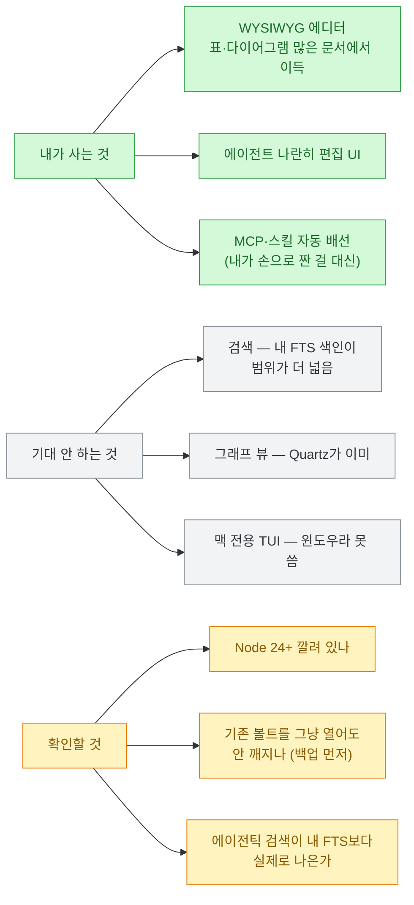

나는 이미 **평문 마크다운 지식 볼트**를 굴리고 있다. 폴더에 `.md`를 쌓고, 위키 링크로 엮고, [[llm-wiki-newsroom-multi-agent-knowledge-wiki|LLM 위키]]도 만들어 봤고, 전 파일 검색용으로 SQLite FTS 색인까지 따로 짰다. 에디터는 딱히 없다. 그냥 텍스트 편집기와 에이전트로 쓴다.

그래서 오늘 [파이토치 한국 사용자 모임에 박정환 님이 올린 OpenKnowledge 소개](https://discuss.pytorch.kr/t/openknowledge-claude-codex-llm-wiki/11222)를 보고 든 생각은 "오 신기하다"가 아니라 **"이거 내 볼트에 붙이면 뭐가 남지?"**였다. 겹치는 게 많아 보였기 때문이다.

그래서 레포를 직접 열어 봤다. [github.com/inkeep/open-knowledge](https://github.com/inkeep/open-knowledge). 결론부터 쓰면 이렇다 — **새로운 건 확실히 새롭고, 겹치는 건 확실히 겹친다. 그리고 라이선스 파일 옆에 CLA가 하나 더 있다.**

## OpenKnowledge는 대체 뭔가?

만든 곳은 **inkeep**이고, 자기네 표현은 **"노션과 VS Code가 만난 것"**이다. 마크다운의 이식성과 텍스트 기반 버전 관리는 그대로 두면서, 편집 경험만 **완전한 WYSIWYG**(What You See Is What You Get. 서식이 실시간으로 보이는 방식. 워드나 노션처럼)로 준다는 얘기다.

구조가 3계층으로 딱 떨어진다. 이게 이 도구를 이해하는 제일 빠른 길이다.



**핵심은 레이어 3이 평문 파일이라는 것**이다. 노션이나 구글 문서와 갈라지는 지점이 정확히 여기다. 편집 경험은 노션인데 **저장은 여전히 내 디스크의 `.md`**다.

그리고 이게 이 도구의 성격을 정한다 — **기존 폴더를 그냥 열면 된다.** 코드베이스든, 위키든, **옵시디언 볼트든** `.md`/`.mdx`가 있으면 대상이다. 마이그레이션이라는 단계가 아예 없다. 나처럼 이미 볼트가 있는 사람한테는 이 점이 제일 컸다.

기능은 크게 네 갈래다.

| 갈래 | 내용 |
|---|---|
| **완전 WYSIWYG** | 마크다운 파일 편집이 구글 문서·노션처럼. 원본은 여전히 텍스트 |
| **AI 협업 편집** | **Claude·Codex·Cursor·OpenCode·Pi** 등과 나란히 편집. MCP/CLI로 임의 하네스 연동 |
| **에이전트 검색 + LLM 위키** | MCP·스킬·에이전틱 검색 기본 내장. 스타터 팩에 **LLM 위키 템플릿** 포함 |
| **Git 동기화 · 팀 공유** | 내부적으로 git/GitHub 사용. 코드를 몰라도 공유·자동 동기화 |

내가 제일 흥미롭게 본 건 **`ok init`이 하는 일**이다. 컴퓨터에 깔린 에이전트 하네스를 **자동으로 감지해서** 프로젝트에 MCP와 스킬 설정을 붙여 준다. README에 감지 대상이 적혀 있다 — **Claude Code, Claude Desktop, Cursor, Codex, OpenCode, OpenClaw**.

**이 발상이 맞다고 본다.** 지식 베이스를 에이전트가 쓰게 하려면 결국 누군가 MCP 설정을 짜야 하는데, 그걸 앱이 대신 해 준다. 나는 이 배선을 손으로 짰다. 몇 시간 걸렸다.

## 겹치는 건 뭐고 새로운 건 뭔가?

여기가 이 글의 본론이다. 나는 이미 비슷한 걸 조각조각 갖고 있어서, 대조해 봐야 판단이 선다.



표로 정리하면 이렇게 갈린다.

| 기능 | 내 상태 | 판정 |
|---|---|---|
| **WYSIWYG 편집** | 없음. 텍스트 에디터로 씀 | 🆕 **확실히 새것** |
| **에이전트 나란히 편집 UI** | 없음. 터미널에서 함 | 🆕 **확실히 새것** |
| **MCP·스킬 자동 배선** | 손으로 짬 | 🆕 **시간 절약** |
| **LLM 위키 스타터 팩** | 직접 설계함 | 🆕 (참고용으로 볼 만) |
| 위키 링크 그래프 뷰 | Quartz가 이미 함 | 🔁 겹침 |
| 검색 | FTS 색인 + MCP가 이미 있음 | 🔁 겹침 (범위는 내 쪽이 넓음) |
| git 동기화 | 이미 git 레포 | 🔁 겹침 |

**겹침 쪽에서 하나 짚어야 공정하다.** OpenKnowledge의 에이전틱 검색은 **임베딩 + 계층형 RAG**라 의미 검색이 되고, 내 FTS 색인은 **키워드 검색**이라 성격이 다르다. 대신 내 색인은 **프로젝트 폴더 하나가 아니라 드라이브 여러 개를 가로질러** 훑는다. OpenKnowledge는 "열어 놓은 폴더"가 단위다. **범위는 내가 넓고, 검색 품질은 저쪽이 나을 수 있다.** 이건 붙여 봐야 안다.

**결론적으로 내가 사는 건 딱 두 개다 — 에디터와 협업 편집 UI.** 나머지는 이미 있다. 그리고 그 두 개가 작은 게 아니다. 나는 마크다운을 손으로 쓰는 게 익숙해서 WYSIWYG가 필요 없다고 생각해 왔는데, **표와 다이어그램을 많이 쓰는 문서**에서는 확실히 손해를 보고 있었다. 이 블로그 글만 해도 표가 몇 개인지 세어 보시라.

## 윈도우에서 쓰려면 어떻게 하나?

**여기가 나한테 제일 중요한 실무 정보였다. 나는 윈도우다.**

⚠️ **macOS 앱은 못 쓴다.** 데스크톱 앱(DMG)은 맥 전용이고, **Linux·Windows·인텔 맥은 CLI로 로컬 웹앱을 띄우는 경로**다. 같은 에디터가 브라우저에서 돈다.

```bash
npm install -g @inkeep/open-knowledge
cd your-project
ok init          # 프로젝트 구성 + AI 에디터 연동 (Claude Code, Cursor, Codex …)
ok start --open  # 웹 에디터 띄우고 브라우저에서 열기
```

⚠️ **전제 조건이 있다. Node.js 24 이상과 git이 필요하다.** 이건 README에 적혀 있고, 레포의 `.node-version` 파일도 확인해 보니 딱 `24`였다. Node 22에서 그냥 될 거라 기대하고 깔면 시간 버린다.

그리고 ⚠️ **맥 전용 기능이 몇 개 있다.** 데스크톱 앱에만 들어가는 **내장 TUI**(터미널 선호하는 사람용)가 그렇다. 윈도우에서는 웹 UI + 별도 터미널로 가야 한다. 기능 격차가 있다는 걸 알고 시작하는 게 낫다.

## GPL-3.0인데 왜 CLA가 같이 있나?

레포를 열었을 때 눈에 걸린 게 이거였다. 루트에 `LICENSE`(35KB)와 **`CLA.md`가 같이 있다.**

먼저 라이선스부터. **OpenKnowledge는 GNU General Public License v3.0 이상(GPL-3.0-or-later)**이다. GPL은 **카피레프트(copyleft)** 라이선스다. 어려운 말 같지만 뜻은 단순하다 — **이 코드를 포함하거나 파생한 저작물을 배포하면, 너도 똑같이 GPL-3.0 이상으로 소스를 공개해야 한다.**

**개인이 자기 볼트 열어 쓰는 데는 아무 상관 없다.** 배포를 안 하니까. 다만 이걸 포크해서 사내 제품에 넣어 팔 생각이면 얘기가 완전히 달라진다.

그럼 CLA는 뭐냐. **CLA(Contributor License Agreement)는 기여자가 회사에 주는 권리 문서**다. PR을 올리면 봇이 서명 링크를 준다. inkeep의 CLA는 **Apache 개인 기여자 라이선스 협약(ICLA) v2.2를 기반**으로 했고, 문서 맨 위에 스스로 이렇게 적어 뒀다.

> 이것은 저작권·특허 **라이선스**이지 **양도가 아니므로**, 당신은 기여물의 완전한 소유권을 유지합니다.

✅ **이건 좋은 신호다.** 저작권 양도를 요구하는 CLA도 세상에 많은데, 그건 안 했다. 비독점(non-exclusive)이라 내 기여물을 내가 다른 데 또 써도 된다. 먼저 밝힌 것도 성실하다.

**그런데 2조를 읽으면 한 단어가 걸린다.**

> You hereby grant to Inkeep … a perpetual, worldwide, non-exclusive, no-charge, royalty-free, irrevocable copyright license to reproduce, prepare derivative works of, publicly display, publicly perform, **sublicense**, and distribute Your Contributions …

**`sublicense`.** 서브라이선스 권한이다. 이게 있으면 구조가 이렇게 된다.



즉 **inkeep은 GPL에 묶이지 않고 나중에 상용 버전을 낼 수 있는데, 포크하는 쪽은 GPL에 묶인다.** 이건 오픈코어 회사들이 흔히 쓰는 **비대칭 구조**다.

⚠️ **오해 없게 정확히 쓰자. 이건 나쁜 짓이 아니다.** 아주 흔한 패턴이고, 저작권 양도를 안 한 것만 해도 이 바닥 기준으론 온건한 편이다. 회사가 먹고살 길을 남겨 두는 건 오히려 프로젝트가 오래 갈 조건이기도 하다. 내가 이걸 적는 이유는 비난하려는 게 아니라, **"오픈소스니까 영원히 무료겠지"라고 넘겨짚지 말자**는 것이다. GPL 딱지만 보고 안심하면 안 되는 지점이 여기다.

**그리고 여기서 재밌는 반전이 있다.** 이 리스크가 나한테는 **거의 무의미하다.**

왜냐하면 **내 데이터가 평문 마크다운이고 내 디스크에 있기 때문**이다. inkeep이 내일 당장 독점으로 돌아서도, 내 파일은 그대로 `.md`로 남고 git에 있다. 에디터를 지우면 끝이다. 옮길 것도 없다.

**이게 이 도구 설계의 진짜 값어치다.** 노션에 3년을 쌓으면 나갈 때 마이그레이션이 프로젝트가 된다. 여기선 **나가는 비용이 0**이다. 라이선스 리스크가 낮은 이유는 GPL이라서가 아니라, **락인(lock-in)할 게 애초에 없어서**다.

## 그래서 나는 붙일 건가?

붙여 볼 생각이다. 다만 **기대치를 정확히 잡고** 붙인다.



⚠️ **하나만 조심하려고 한다. 기존 볼트를 바로 열지는 않겠다.** WYSIWYG 에디터가 파일을 저장할 때 마크다운을 **자기 방식으로 재포맷**할 가능성이 있기 때문이다. 프런트매터 순서가 바뀌거나, 표 정렬이 다시 잡히거나, 위키 링크 표기가 미묘하게 달라지면 — 내 경우엔 Quartz 빌드가 깨진다. 그래서 **복사본으로 먼저 열어 보고, git diff로 뭐가 바뀌는지 본 다음** 진짜 볼트에 붙일 거다. 이건 이 도구를 못 믿어서가 아니라, **평문 파일을 건드리는 모든 도구에 하는 기본 절차**다.

정리하면 오늘 내가 챙긴 건 세 개다.

- **마이그레이션 없는 도구가 이긴다.** OpenKnowledge의 최고 기능은 WYSIWYG가 아니라 **"기존 폴더를 그냥 열면 된다"**는 것이다. 옵시디언 볼트도, 코드베이스도, 내 볼트도 그대로 대상이다. 새 시스템을 팔면서 **이사를 요구하지 않는 것**만으로 진입장벽이 사라진다. 내가 도구를 만들 때도 이걸 생각해야겠다.
- **락인이 없으면 라이선스 리스크도 작아진다.** GPL 옆에 CLA가 있는 걸 보고 잠깐 멈칫했는데, 생각해 보니 **데이터가 평문이라 나갈 때 비용이 0**이었다. 리스크를 계산할 때 라이선스만 보면 안 되고 **"내 데이터가 어디 있나"**를 같이 봐야 한다는 걸 다시 배웠다.
- **겹치는 걸 인정하는 게 판단의 시작이다.** 처음엔 "이거 다 있는 건데?"였는데, 대조표를 그리고 나니 **내가 진짜 안 가진 두 개**가 뚜렷해졌다. 도구를 볼 때 기능 목록을 읽지 말고 **내 스택과 빼기를 해 보는 게** 훨씬 빠르다.

⚠️ 마지막으로 읽는 법. **이 글의 기능 설명은 대부분 inkeep의 공식 문서와 README에서 온 것**이고, 내가 실제로 돌려 보고 쓴 게 아니다. 성능·안정성·실사용 감각은 아직 모른다. 다만 **라이선스·CLA·Node 24 요구사항·`.node-version`은 레포에서 직접 확인**했다. 써 보고 나면 그때 다시 쓰겠다.
