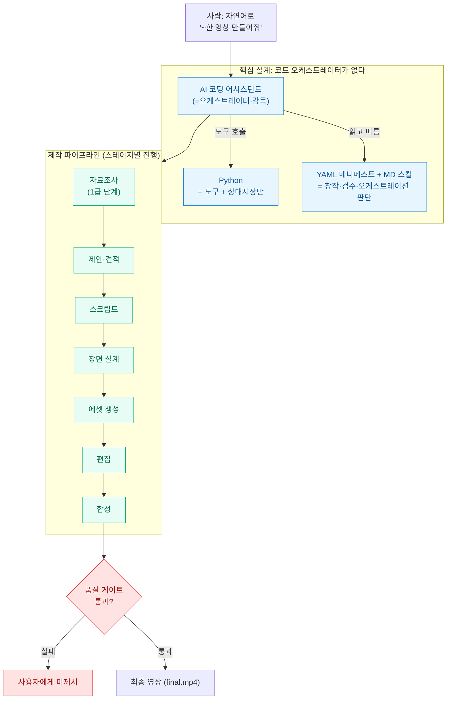
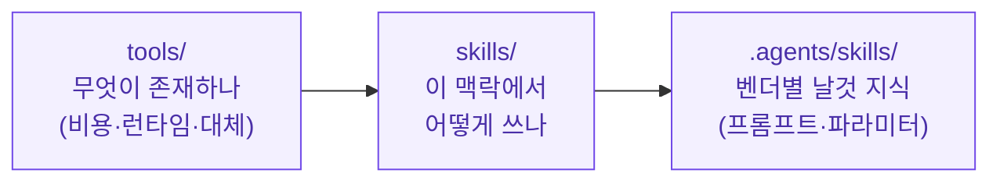
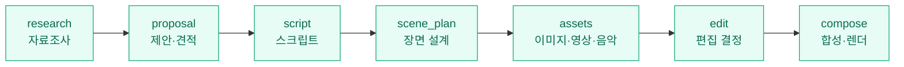
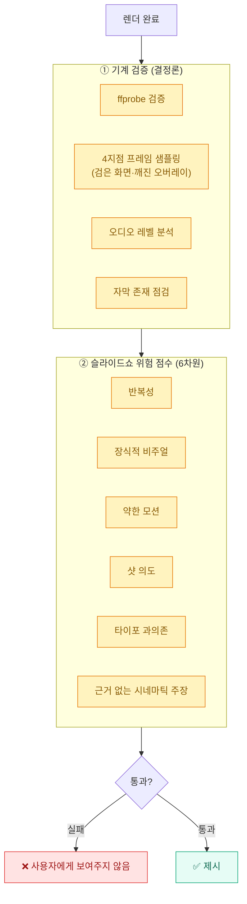
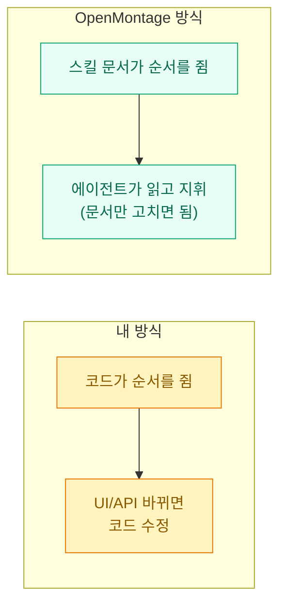

영상 자동화는 내가 한동안 붙들고 있는 주제다. [[youtube-api-mp4-srt-thumbnail-shorts-pipeline|YouTube 업로드 파이프라인]], [[capcut-vrew-srt-shorts-pipeline|CapCut·Vrew 쇼츠 파이프라인]], [[naver-clip-creator-studio-direct-upload-pipeline|네이버 클립 자동 업로드]]를 정리하면서 매번 느낀 건, 영상 한 편은 "파일 하나 만드는 일"이 아니라 **자료조사 → 스크립트 → 에셋 → 편집 → 합성 → 검증**으로 이어지는 긴 사슬이라는 거였다.

그러다 파이토치 한국 사용자 모임(PyTorch KR)에 `9bow`(박정환)님이 올린 **OpenMontage** 소개 글을 봤다. 한 줄로 줄이면 이렇다.

**"AI 코딩 어시스턴트(Claude Code·Cursor·Codex 등) 자체를 영상 제작 스튜디오의 '감독'으로 쓰는 오픈소스 시스템."**

> 그 글은 하단에 "GPT로 정리한 글이라 원문과 다를 수 있다"고 솔직히 밝혀두었다. 그래서 나는 옮겨 적기 전에 **실제 저장소(`calesthio/OpenMontage`)의 README·LICENSE·문서를 직접 확인**했다. 결론부터 말하면 설계·구조 설명은 거의 정확했고, 대신 "세계 최초"나 "12·52·500+" 같은 **숫자·마케팅 표현에서 보정이 필요**했다. 그 부분은 아래에서 ⚠️로 따로 떼어 적는다.

## 한눈에 보는 전체 구조



## 한 줄로 뭐가 다른가?

보통 자동화 도구는 "지휘하는 프로그램(오케스트레이터)"이 따로 있다. 작업 순서를 코드가 정해두고 도구를 차례로 부른다. OpenMontage의 핵심은 **그 지휘 프로그램을 없앤 것**이다.

저장소 문서에 이렇게 못 박혀 있다(직접 확인).

> *"There is no code orchestrator. Your AI coding assistant IS the orchestrator."*
> (코드 오케스트레이터는 없다. 당신의 AI 코딩 어시스턴트가 곧 오케스트레이터다.)

| 구분 | 보통의 자동화 | OpenMontage |
|---|---|---|
| 지휘 | 파이썬 코드가 순서·판단을 쥠 | **AI 코딩 어시스턴트**가 쥠 |
| 파이썬의 역할 | 오케스트레이션 + 도구 + 판단 | **도구 + 상태저장(persistence)만** |
| 창작·검수·순서 판단 | 코드에 박혀 있음 | 사람이 읽고 고칠 수 있는 **YAML 매니페스트 + 마크다운 스킬**에 있음 |

여기서 **오케스트레이터(orchestrator)** 는 *여러 도구·단계를 누가 언제 어떤 순서로 부를지 지휘하는 주체*를 말한다. 보통은 그게 코드인데, 여기선 Claude Code 같은 에이전트가 그 역할을 한다. 그래서 "지능은 코드가 아니라 스킬 문서에 있다"는 말이 나온다. 이건 내가 [[claude-code-agent-teams-orchestration|에이전트 팀 오케스트레이션]]을 정리하며 봤던 흐름과 같은 철학이다.

지식은 3계층으로 나뉜다(확인됨).



## 영상 한 편이 어떻게 만들어지나?

가장 인상적이었던 건 **자료조사(research)가 1급 단계**라는 점이다. 스크립트 한 줄 쓰기 전에 에이전트가 YouTube·Reddit·뉴스·학술 자료를 **15~25회 이상 검색**해 리서치 브리프를 만든다. 실제 파이프라인 단계명은 이렇다(GPT 요약본은 이걸 '에셋→편집→합성'으로 줄여 적었는데, 원래는 7단계다).



각 단계마다 "이 단계를 어떻게 실행하라"고 알려주는 **디렉터 스킬(director skill)** 파일이 붙어 있고, 에이전트는 그걸 읽고 도구를 쓴 뒤 스스로 검수하고, 상태를 체크포인트로 저장하고, 창작 결정 지점마다 사람의 승인을 받는다.

## 도구는 어떻게 고르나?

도구 선택이 주먹구구가 아니라는 점이 좋았다. 모든 공급자(provider)를 **7가지 기준으로 점수화**하고, 그 선택 근거를 감사 가능한 **결정 로그(decision log)** 로 남긴다. README에 가중치까지 명시돼 있다(확인).

| 기준 | 가중치 |
|---|---|
| 작업 적합성 (task fit) | 30% |
| 출력 품질 (output quality) | 20% |
| 제어 가능성 (control) | 15% |
| 안정성 (reliability) | 15% |
| 비용 효율 (cost efficiency) | 10% |
| 지연 시간 (latency) | 5% |
| 연속성 (continuity) | 5% |

합성(compose) 단계는 **3개의 렌더 런타임**을 쓴다. 이건 proposal 단계에서 하나로 잠그고, 도중에 몰래 바꾸는 걸 '거버넌스 위반'으로 금지한다(이런 규칙이 문서에 실제로 있다).

| 런타임 | 잘하는 것 |
|---|---|
| **Remotion** | React 기반 합성, 스틸→애니메이션, 차트·자막 |
| **HyperFrames** | HTML/CSS/GSAP 기반, 키네틱 타이포·프로모 |
| **FFmpeg** | 컷·이어붙이기·자막 굽기 등 후처리 |

## 어떻게 '슬라이드쇼처럼 보이는' 결과를 걸러내나?

여기가 영상 자동화의 진짜 고비다. AI로 만든 영상은 자칫 "정지 이미지를 슬쩍 움직인 슬라이드쇼"가 되기 쉽다. OpenMontage는 **두 겹의 품질 게이트**로 이걸 막는다(확인).



기계가 잡을 수 있는 건 코드로(ffprobe·프레임 샘플링), "이게 슬라이드쇼처럼 보이나"라는 판단형 점검은 6개 차원으로 점수화한다. **이 검수를 통과하지 못한 영상은 아예 사용자에게 제시되지 않는다.** 내가 자동화에서 늘 강조하는 "사람에게 가기 전에 기계 검증을 먼저 둔다"는 원칙과 정확히 같다.

## 돈 안 들이고 써볼 수 있나?

이 부분이 한국 1인 제작자에게 솔깃하다. **유료 API 키 없이도 시작할 수 있다**(확인). `make setup`이 다음을 기본으로 깔아준다.

- **Piper TTS** — 오프라인 음성 합성(내레이션)
- **Archive.org · NASA · Wikimedia Commons** — 공개 아카이브 푸티지

더 좋은 도구가 필요하면 `.env`에 키를 추가하는 식인데, 전부 **선택**이다.

| 환경변수 | 열리는 것 |
|---|---|
| `FAL_KEY` | FLUX 이미지, Veo·Kling·MiniMax 영상 |
| `SUNO_API_KEY` | 음악 생성 |
| `ELEVENLABS_API_KEY` | 고품질 음성 합성 |

설치 요구사항은 **Python 3.10+, FFmpeg, Node.js 18+, 그리고 AI 코딩 어시스턴트**다. 절차는 단순하다.

```bash
git clone https://github.com/calesthio/OpenMontage.git
cd OpenMontage
make setup
```

## 믿고 쓰기 전에 알아둘 것 (과장 걷어내기)

여기가 이 글에서 제일 신경 쓴 부분이다. 설계 설명은 정확했지만, **숫자와 마케팅 문구는 1차 출처와 대조하니 보정이 필요**했다.

| 들리는 말 | 실제 확인 결과 |
|---|---|
| "**세계 최초**의 오픈소스 에이전트형 비디오 제작 시스템" | ⚠️ **과장**. 'World's first'는 GitHub 한 줄 설명에만 있고 README 본문은 더 약한 'The first'다. 게다가 `HKUDS/ViMax`(2025-03, MIT, 1만+ stars)라는 에이전트형 오픈소스 비디오 프로젝트가 **1년 앞서** 있다. "스스로 세계 최초라고 표방한다"는 인용 정도로만 받아들이는 게 맞다. |
| "**12 파이프라인 · 52 도구 · 500+ 스킬**" | ⚠️ **저자 자기보고이고 저장소 내부에서도 숫자가 충돌**한다. 스킬은 설명엔 500+, README 본문엔 400+, 색인엔 47개. 도구는 52(설명)와 48(아키텍처 다이어그램)이 다르다. 파이프라인은 12를 표방하나 README 표엔 11개만 보인다. "구조상 약 12개 파이프라인" 정도로만 쓰는 게 안전하다. |
| "60초 영상이 **1.33달러**, 다른 건 **0.15달러**" | ⚠️ README에 그렇게 적혀 있는 건 맞지만 **저자 자기보고 수치**다. 실제 청구서·제3자 검증이 없고, 사용 시점 공급자 요금에 따라 달라진다. "비용을 낮게 만들 수 있다(저자 주장)" 수준으로 보자. |
| 라이선스 **AGPL-3.0** | ✅ 사실. 다만 AGPL은 **네트워크 카피레프트**라, 단순 배포뿐 아니라 **수정본을 웹서비스(SaaS) 형태로 제공할 때도 소스 공개 의무**가 생긴다. 상업적으로 쓸 생각이라면 이 조건을 먼저 봐야 한다. |
| 저장소 인기 | ✅ 2026-06-29 시점 스타 약 27.6k, 포크 약 3,055(변동값). 실존·활발함은 확실하다. |

오해는 말자. 프로젝트 자체는 잘 만들어졌고 설계 철학도 탄탄하다. 다만 내가 블로그에 옮길 때는 **"무엇이 만들어졌나(=신뢰 가능)"** 와 **"얼마나 최초이고 얼마나 싸냐(=자기보고·검증 불가)"** 를 갈라 적는 게 맞다고 봤다.

## 내 영상 자동화에 비춰보면

내가 만든 [[youtube-api-mp4-srt-thumbnail-shorts-pipeline|업로드 파이프라인]]들은 "도구를 손으로 엮고, 순서를 코드로 박는" 방식이었다. OpenMontage는 그 순서·판단을 **스킬 문서로 빼고 에이전트가 지휘**하게 한 점이 다르다.



내가 챙겨갈 점은 세 가지다.

1. **자료조사를 1급 단계로** — 스크립트 전에 충분히 검색·정리하는 구조는 내 SRT→블로그 [[srt-to-seo-blog-with-llm|변환 파이프라인]]에도 바로 이식할 만하다.
2. **사람에게 가기 전 기계 검증** — ffprobe·프레임 샘플링·자막 점검 같은 결정론적 게이트를 먼저 둔다.
3. **판단을 코드가 아니라 문서로** — 도구 선택 근거를 결정 로그로 남기면, 나중에 "왜 이 모델을 썼지?"를 추적할 수 있다.

물론 AGPL-3.0이라 상업적으로는 라이선스를 먼저 따져야 하고, "세계 최초"·단가 같은 표현은 그대로 믿으면 안 된다. 그걸 감안하면, **영상 제작을 '에이전트가 지휘하는 파이프라인'으로 본다는 발상 자체**는 꽤 배울 만한 사례다.

## 참고자료

- [OpenMontage (calesthio, AGPL-3.0)](https://github.com/calesthio/OpenMontage) — 이 글의 주인공 저장소
- [HKUDS/ViMax](https://github.com/HKUDS/ViMax) — 1년 앞선 에이전트형 오픈소스 비디오 프로젝트('세계 최초' 반례)
- [GNU AGPL-3.0 전문](https://www.gnu.org/licenses/agpl-3.0.en.html) — 네트워크 카피레프트(제13조) 확인
- [PyTorch 한국 사용자 모임](https://discuss.pytorch.kr/) — 9bow(박정환)님의 원 소개 글 출처

<!-- 안전: 회사 실데이터·고객/제3자 PII·API키/쿠키/토큰 없음. 외부 OSS 프로젝트 소개·팩트체크 글(합성·일반화). -->
