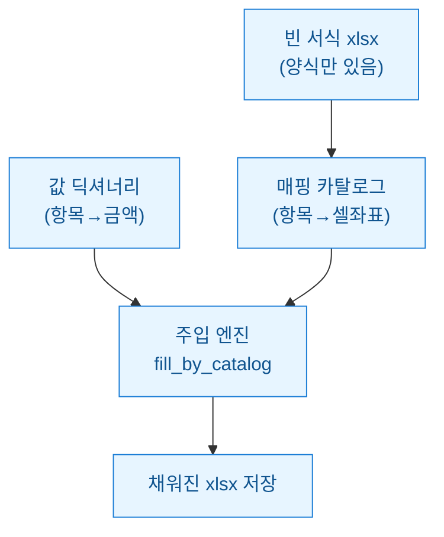
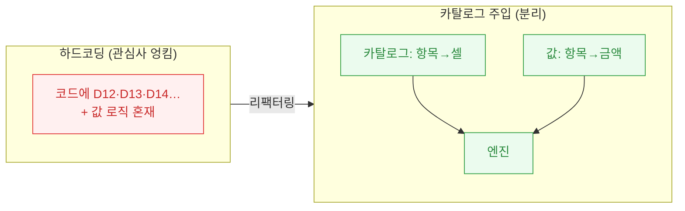
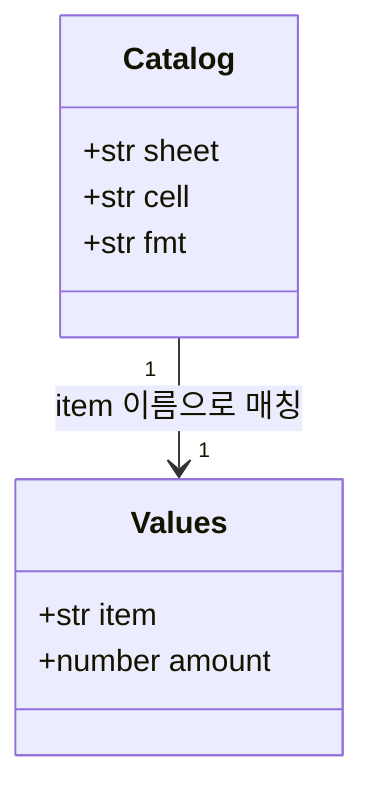

회계 자동화를 하다 보면 "빈 서식 엑셀에 값만 꽂아주는" 일이 끝없이 나온다. 감사조서 표준 양식, 세무조정계산서 틀, DSD(DART 제출용 표준 재무제표) 변환 서식까지. 처음 내가 짠 코드는 부끄럽지만 이랬다. `ws["D12"] = 매출액`, `ws["D13"] = 매출원가`… 이런 줄이 수십 개. 서식이 한 번 바뀌자 그 수십 줄을 눈으로 훑으며 좌표를 고쳤다. 그날 밤 나는 이 방식을 버리기로 했다.

이 글은 셀 좌표를 코드에 박는(하드코딩) 대신 **"어디에 무엇을 넣을지"를 데이터로 분리한 매핑 카탈로그를 주입**하는 구조로 바꾼 기록이다. 공개 DART/더미 데이터 기준이고 회계판단·투자권유가 아니다.



핵심은 **서식(빈 xlsx)·좌표지도(카탈로그)·값(딕셔너리)** 세 가지를 각각 따로 두고, 마지막에 엔진 하나가 합치는 것이다. 서식이 바뀌면 카탈로그만 고친다. 코드는 안 건드린다.

## 왜 셀 좌표 하드코딩이 나를 괴롭혔나?

하드코딩 방식의 문제는 "한 곳에 두 관심사가 엉킨다"는 점이었다. `ws["D12"] = data["매출액"]` 한 줄에는 **위치 정보(D12)**와 **값 계산 로직**이 같이 산다. 그래서 아래 셋 중 뭐가 바뀌어도 코드를 열어야 했다.

- 양식 담당자가 행을 한 줄 삽입 → 아래 좌표가 전부 밀림 → 코드 대량 수정
- 같은 값을 다른 서식에도 채워야 함 → 좌표만 다른 코드를 통째로 복붙
- 시트가 여러 개(재무상태표·손익계산서·현금흐름표) → 파일이 스파게티

특히 무서웠던 건 **행 삽입 한 번에 D12부터 D40까지 전부 한 칸씩 밀리는** 상황이었다. 눈으로 좌표를 세다 하나만 틀려도 매출원가 자리에 판관비가 들어간다. 숫자는 멀쩡히 채워지니 에러도 안 난다. 조용히 틀린 조서가 나가는 게 제일 위험했다.



## 매핑 카탈로그는 어떤 모양이어야 했나?

내가 정한 규칙은 단순하다. **카탈로그는 "논리적 항목 이름 → 물리적 셀 좌표"의 사전**이다. 값 딕셔너리는 "논리적 항목 이름 → 실제 금액"이고. 둘 다 같은 이름(키)을 공유하니 엔진은 이름으로 짝만 맞추면 된다.



카탈로그를 코드 밖(별도 파이썬 딕셔너리나 JSON, 나는 매핑 전용 xlsx를 썼다)으로 빼면 서식이 바뀌어도 데이터만 손본다. 항목마다 표시 형식(`fmt`)까지 같이 들고 다니게 해서 천 단위 콤마·괄호 음수 같은 서식도 카탈로그가 책임지게 했다.

```python
# 카탈로그: 논리 항목 -> (시트, 셀, 표시형식)
CATALOG = {
    "매출액":   {"sheet": "손익", "cell": "D12", "fmt": "#,##0"},
    "매출원가": {"sheet": "손익", "cell": "D13", "fmt": "#,##0"},
    "판관비":   {"sheet": "손익", "cell": "D15", "fmt": "#,##0"},
    "자산총계": {"sheet": "재무", "cell": "E30", "fmt": "#,##0"},
}

# 값: 논리 항목 -> 금액 (더미)
VALUES = {
    "매출액": 12_000_000_000,
    "매출원가": 7_400_000_000,
    "판관비": 2_100_000_000,
    "자산총계": 18_500_000_000,
}
```

## 주입 엔진은 얼마나 짧아지나?

엔진의 일은 딱 하나다. **카탈로그를 한 바퀴 돌며 값 딕셔너리에서 짝을 찾아 해당 셀에 쓰는 것.** 시트 접근·서식 적용·값 없는 항목 스킵까지 여기 한 곳에 모인다. 서식이 100개 항목이든 엔진 코드 줄 수는 그대로다.

```python
from openpyxl import load_workbook

def fill_by_catalog(template_path, out_path, catalog, values):
    wb = load_workbook(template_path)  # 빈 서식 로드
    missing = []
    for item, spec in catalog.items():
        if item not in values:
            missing.append(item)      # 값 빠진 항목은 기록만
            continue
        ws = wb[spec["sheet"]]
        cell = ws[spec["cell"]]
        cell.value = values[item]
        if spec.get("fmt"):
            cell.number_format = spec["fmt"]  # 표시형식도 카탈로그가 책임
    wb.save(out_path)
    return missing  # 검증용: 채우지 못한 항목 목록 반환

missing = fill_by_catalog("빈서식.xlsx", "완성.xlsx", CATALOG, VALUES)
if missing:
    print("값 없는 항목:", missing)  # 조용히 틀리는 대신 시끄럽게 알림
```

여기서 내가 제일 마음에 든 건 `missing` 반환값이다. 하드코딩 시절엔 값이 없으면 그냥 빈 셀로 나갔다. 이제는 **"짝을 못 찾은 항목을 리스트로 돌려받아" 검증**한다. 조용히 틀리는 대신 시끄럽게 실패하게 만든 것이다. 감사조서에선 이 차이가 생각보다 크다.

## 실제로 뭐가 편해졌나?

리팩터링 뒤 체감한 이점을 정리하면 이렇다.

| 상황 | 하드코딩 | 카탈로그 주입 |
|---|---|---|
| 양식에 행 삽입 | 코드 수십 줄 수정 | 카탈로그 좌표만 수정 |
| 서식 A·B 둘 다 채우기 | 코드 복붙 | 카탈로그 2개, 엔진 공유 |
| 값 누락 감지 | 빈 셀로 조용히 통과 | `missing` 리스트로 즉시 포착 |
| 표시형식 변경 | 셀마다 코드 손봄 | 카탈로그 `fmt`만 교체 |

물론 만능은 아니다. 병합 셀(merged cell)에 쓸 땐 좌상단 좌표를 카탈로그에 적어야 하고, 계산식이 든 셀을 값으로 덮으면 수식이 날아간다. 그래서 나는 카탈로그에 "쓰기 금지 셀" 표시를 하나 더 넣어 방어했다. 그래도 방향은 분명했다. **위치는 데이터로, 로직은 코드로 갈라놓으니 서식이 바뀌어도 밤을 새울 일이 없어졌다.**

다음엔 이 카탈로그를 매핑 전용 xlsx에서 읽어와 "비개발자도 좌표 지도를 직접 관리"하게 만드는 이야기를 써보려 한다. 결국 좋은 자동화는 코드를 덜 고치게 만드는 자동화였다.

*(공개 DART/더미 데이터 기준이며 회계판단·투자권유가 아니다.)*
