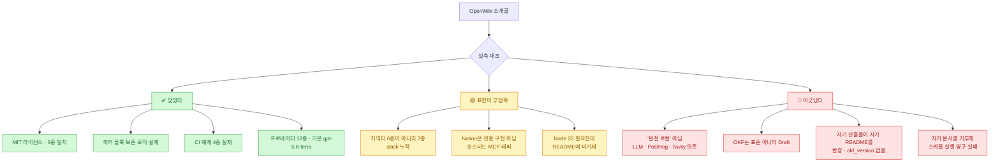
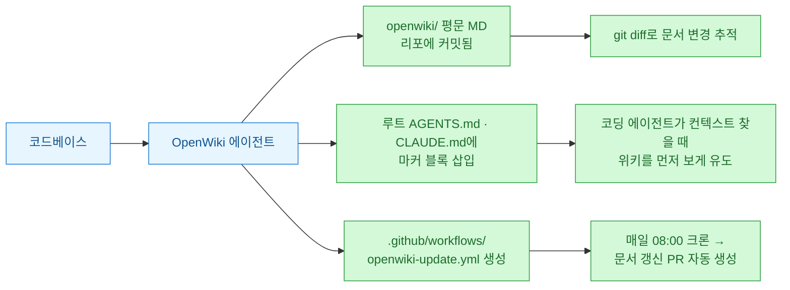
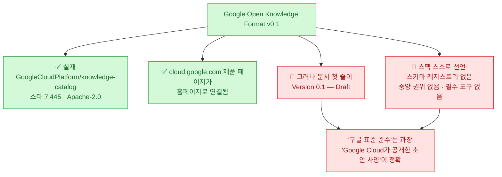
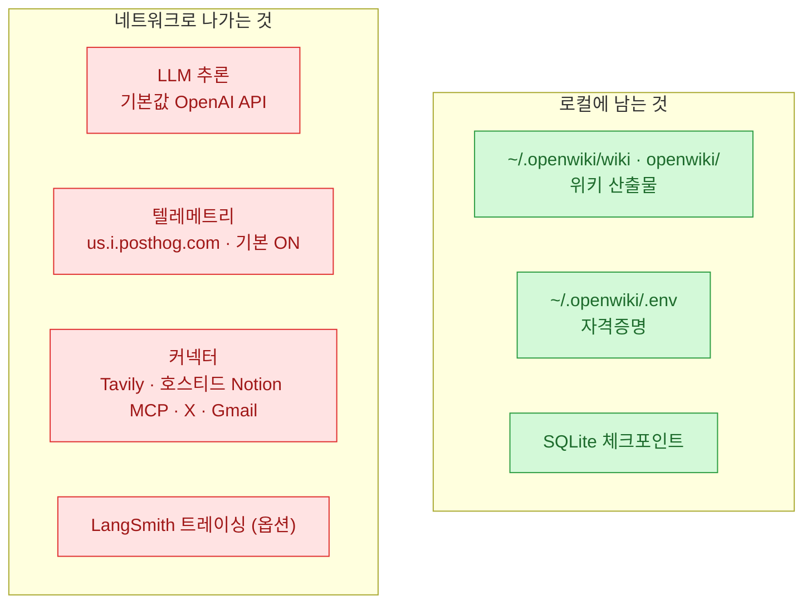

나는 평문 마크다운 지식 볼트를 몇 년째 굴리고 있다. 그래서 "**에이전트 전용 문서**"라는 포지셔닝을 보면 일단 눌러 본다. 사람이 읽을 문서는 이미 넘치는데, 에이전트가 읽을 문서는 뭐가 달라야 하는지 나도 답을 못 찾았기 때문이다.

**OpenWiki**는 LangChain이 낸 CLI다. 코드베이스나 개인 지식원을 훑어 로컬 위키를 만들고 유지한다. 소개글만 보면 꽤 그럴싸했다 — 구글 OKF 포맷 출력, 커넥터 6종, CI 자동 갱신, MIT.

그런데 [[reading-stream-and-factcheck-workflow|내 버릇]]대로 GitHub API와 소스를 직접 열어 봤더니 **소개글과 실제가 여러 군데 어긋났다.** 그중 하나는 좀 아팠다. **OKF 준수를 전면에 내건 도구가, 자기가 생성한 문서를 OKF 위반이라며 거부한다.**

확인 기준은 **2026년 7월 20일 11:20 KST**다. GitHub API·npm registry·소스 원문·오픈 이슈로 실측했다.

## 오늘 확인한 것 한눈에



## OpenWiki는 기존 문서 생성기와 뭐가 다른가?

여기가 이 도구의 진짜 아이디어다. 그리고 나는 이걸 **훔칠 만하다**고 생각했다.

TypeDoc이나 Sphinx 같은 기존 문서 생성기는 **읽기 좋은 사이트**를 만든다. 소비자가 사람이다. OpenWiki는 소비자를 에이전트로 잡고, 그 전제를 실제 배관으로 구현했다.



핵심은 두 번째 갈래다. **`AGENTS.md`와 `CLAUDE.md`에 마커 블록을 심어 코딩 에이전트의 컨텍스트 진입점을 직접 조작한다.** 기존 파일이 있으면 마커 사이만 갈아 끼우고 나머지는 보존한다.

이건 소개글 주장이 아니라 실제로 코드에 있다. `src/code-mode.ts`를 열어 확인했다.

```ts
// src/code-mode.ts:5-11
const OPENWIKI_AGENTS_SNIPPET_START = "<!-- OPENWIKI:START -->";
const OPENWIKI_AGENTS_SNIPPET_END = "<!-- OPENWIKI:END -->";
const DEFAULT_CODE_MODE_CRON = "0 8 * * *";
const CODE_MODE_AGENT_FILES = ["AGENTS.md", "CLAUDE.md"];
```

```ts
// src/code-mode.ts:59-64 — 마커 있으면 그 블록만 교체, 없으면 파일 끝에 추가
const startIndex = currentContent.indexOf(OPENWIKI_AGENTS_SNIPPET_START);
const endIndex = currentContent.indexOf(OPENWIKI_AGENTS_SNIPPET_END);
const nextContent =
  startIndex !== -1 && endIndex !== -1 && endIndex > startIndex
    ? `${currentContent.slice(0, startIndex)}${snippet}${currentContent.slice(endIndex + OPENWIKI_AGENTS_SNIPPET_END.length)}`
    : `${currentContent.trimEnd()}...${snippet}\n`;
```

✅ 자기 저장소 루트 `AGENTS.md`에도 실제 마커 블록이 들어 있다. **도그푸딩은 하고 있다.**

⚠️ 다만 구현이 단순 문자열 `indexOf` 매칭이다. 마커 문자열이 코드블록이나 인용문 안에 들어 있으면 오작동할 여지가 있다.

🔴 그리고 **마커 보호는 `AGENTS.md`·`CLAUDE.md`에만 걸린다.** `.github/workflows/openwiki-update.yml`은 조건 없이 `writeFile`로 덮어쓴다. 사용자가 손댄 CI 워크플로가 통째로 날아간다는 뜻이고, 실제로 오픈 이슈(#389)로 올라와 있다.

## 두 모드는 각각 뭘 만드나?

README와 실제 동작이 일치한 부분이다.

| | code 모드 (기본) | personal 모드 |
|---|---|---|
| 입력 | 현재 리포지토리 소스 | 커넥터로 수집한 원본 |
| 산출 | `openwiki/` + `AGENTS.md`·`CLAUDE.md` + CI 워크플로 | 개인 브레인 위키 |
| 위치 | 리포 안 | `~/.openwiki/wiki/` |
| 호출 | `openwiki`, `openwiki --init`, `--update` | `openwiki personal --init` |

설정과 자격증명은 `~/.openwiki/.env`에 모인다. 리포 전용 지침은 `openwiki/INSTRUCTIONS.md`로 두는데, 이건 생성물이 아니라서 갱신 시 덮어쓰지 않는다. 이 구분은 잘 짜여 있다.

⚠️ macOS 스케줄은 `~/Library/LaunchAgents/`에 LaunchAgent로 설치된다. **macOS 전용이라고 문서에 명시돼 있으니** "크로스플랫폼 자동 스케줄링"으로 소개하면 과장이다.

## 구글 OKF v0.1은 진짜 표준인가?

여기가 내가 제일 의심한 대목이다. "Google Open Knowledge Format"이라는 이름이 붙으면 무게가 확 실리는데, 처음 듣는 이름이었다.

**결론부터: 실재한다.** 그런데 표현을 잘못 쓰면 그대로 오보가 된다.



스펙 원문 첫머리는 이렇다.

```
# Open Knowledge Format (OKF)
**Version 0.1 — Draft**
```

그리고 본문 열 줄 안에 이런 문장이 나온다 — "**스키마 레지스트리도, 중앙 권위도, 필수 도구도 없다(no schema registry, no central authority, and no required tooling).**"

즉 이건 "구글이 정한 표준"이 아니라 **Google Cloud가 공개한 초안 사양**이다. 재밌는 건 스펙 원문 제목엔 "Google"이 아예 안 들어간다는 점이다. "Google OKF"는 OpenWiki 쪽이 붙인 수식이다. 소유 조직을 보면 부당한 표현은 아니지만, 스펙의 자칭은 아니다.

✅ OpenWiki가 OKF를 실제로 출력하는가는 **코드로 확인된다.** 검증기(`src/agent/frontmatter-validator.ts`, 211줄)가 있고, 프롬프트에 스키마 준수를 강제하며, 전용 테스트와 기존 위키를 OKF로 옮기는 마이그레이션 스킬까지 있다. 스펙의 유일한 필수 필드가 `type`인데 검증기도 정확히 그것만 필수로 잡는다.

## 그런데 왜 자기가 만든 문서를 거부하나?

여기서 이 글의 제목이 나왔다. 실측하다가 제일 놀란 지점이다.

**첫째, README의 OKF 세부 주장 두 개가 자기 저장소 산출물에서 반증된다.**

README는 "중첩 인덱스에는 프론트매터가 없고, 루트 인덱스는 `okf_version: "0.1"`을 선언한다"고 적었다. 그런데 `main` 브랜치에 커밋된 자기 위키를 열면 이렇다.

```yaml
# openwiki/index.md — 루트 인덱스인데 okf_version이 없다
---
type: Documentation Index
title: "OpenWiki"
description: "Files and subdirectories in OpenWiki."
---
```

```yaml
# openwiki/agent/index.md — 중첩 인덱스인데 프론트매터가 있다
---
type: Documentation Index
title: "Agent"
description: "Files and subdirectories in Agent."
---
```

저장소 전체를 훑어도 `okf_version`이라는 문자열은 **README와 프롬프트 소스, 딱 두 군데 산문에만** 있고 실제 산출물엔 하나도 없다.

"산출물이 오래돼서 그렇다"는 변명은 안 통한다. OKF 정렬 커밋이 7월 17일인데 이 인덱스 파일을 마지막으로 건드린 커밋은 **7월 20일**이다. 갱신 기록 파일에도 재생성 흔적이 남아 있다.

**둘째, 그리고 이게 진짜다.** 오픈 이슈 #386의 제목과 본문을 그대로 옮긴다.

> `openwiki code --update --print` fails with a validation error on files that openwiki itself generated on a prior `--init` run. **The tool rejects its own output, making automated scheduled runs permanently broken after the first run.**
> (`--update`가 openwiki 자신이 이전 `--init`에서 생성한 파일에 대해 검증 오류로 실패한다. **도구가 자기 출력을 거부해서, 첫 실행 이후 자동 스케줄 실행이 영구적으로 망가진다.**)

```
/openwiki/architecture/overview.md lacks YAML front matter.
Error: Process completed with exit code 1.
```

```mermaid
sequenceDiagram
    participant U as 사용자
    participant O as openwiki --init
    participant C as CI 크론 (매일 08:00)
    participant V as OKF 검증기
    U->>O: ① 최초 실행
    O->>O: ② openwiki/ 문서 생성
    Note over O: 일부 파일에 프론트매터 누락
    C->>V: ③ 다음날 --update 실행
    V--&>>C: ④ lacks YAML front matter · exit 1
    Note over C,V: ⑤ 이후 스케줄 실행이 계속 실패
```

✅ 정확히 말하자. **이 도구의 아이디어가 틀린 게 아니라, OKF 기능이 나흘짜리 신기능이라 아직 안 여물었다.** 검증기를 넣은 커밋이 7월 16일(v0.2.0)이고 그 다음 날 후속 수정이 두 번 났다. 이슈 #386은 7월 18일 신고돼 아직 열려 있다.

그래도 교훈은 남는다. **출력 포맷을 검증하는 도구가 자기 출력을 검증해 보지 않으면 이렇게 된다.** 나도 파서를 만들 때 늘 하는 실수다 — 생성기와 검증기를 따로 짜 놓고 왕복(round-trip) 테스트를 안 돌리는 것.

## "완전 로컬"이라는 말은 사실인가?

아니다. 이게 실측에서 걸린 가장 중요한 오해다.

README는 "local wiki", "builds a local personal brain"을 반복한다. 그런데 실제 네트워크 의존은 최소 네 갈래다.



정확한 표현은 이거다 — **"위키 산출물과 자격증명이 로컬에 저장된다"이지 "오프라인으로 동작한다"가 아니다.** 완전 로컬을 원하면 `openai-compatible` 프로바이더로 Ollama나 LM Studio를 직접 붙여야 하고, 텔레메트리는 따로 꺼야 하고, 웹 검색·Notion 커넥터는 포기해야 한다.

커넥터 얘기가 나온 김에 두 가지 더 짚는다.

- 🟡 **커넥터는 6종이 아니라 7종이다.** 실제 배열은 `git-repo`·`notion`·`x`·`google`·`web-search`·`hackernews`·**`slack`**이다. Slack은 전용 소스 파일이 있고 문서에 `openwiki auth slack`까지 나오는데, 정작 README의 커넥터 나열 문장에서 빠져 있다. **README 내부가 서로 안 맞는다.**
- 🟡 **Notion은 전용 구현이 아니다.** 독립 소스 파일 없이 범용 MCP 클라이언트로 만들어지고, 설명 자체가 "호스티드 Notion MCP 서버 경유"라고 적혀 있다. 그리고 소개글이 "Gmail 커넥터"라 부르는 것의 내부 ID는 `google`이다.

## 텔레메트리는 어디로 가나?

기본 ON이 맞다. 그리고 전송처까지 코드에 박혀 있다.

```ts
// src/telemetry/config.ts:8-11
export const DEFAULT_POSTHOG_KEY = "phc_...";
export const DEFAULT_POSTHOG_HOST = "https://us.i.posthog.com";
```

**LangChain 자체 서버가 아니라 PostHog 미국 리전**이다. 한국·EU 사용자 입장에선 짚어 둘 만하다.

수집 항목은 생각보다 절제돼 있다. 이벤트가 `openwiki_run` 하나뿐이고, 페이로드는 명령·성패·에러 클래스·모드·프로바이더·설정된 커넥터 이름(불리언)·CI 여부 정도다. 커넥터는 이름만 참/거짓으로 나가고, 사람 프로필 생성도 꺼져 있다. **파일 내용·자격증명·프롬프트·모델 출력은 안 나간다는 문서 주장은 코드와 일치한다.**

끄는 방법도 코드에 실재한다.

```bash
export OPENWIKI_TELEMETRY_DISABLED=1   # 또는
export DO_NOT_TRACK=1
```

🔴 다만 README가 흐릿하게 넘어간 게 하나 있다. **CI에서는 옵트아웃 고지가 뜨지 않는데 전송은 계속된다.** 소스 주석에 대놓고 "the notice is skipped in CI, but events are still sent in CI"라고 적혀 있다. "CI에서는 고지 없이 수집된다"가 더 정확한 설명이다.

✅ 그래도 검증 수단을 준 건 좋다. `--telemetry-file=<path>`를 주면 전송 페이로드를 로컬 JSON으로 그대로 덤프해 준다. **못 믿겠으면 직접 까 보라는 태도는 신뢰가 간다.**

## 지금 프로덕션에 써도 되나?

숫자부터 보자. 전부 GitHub API·npm registry 실측이다.

| 항목 | 실측값 (2026-07-20 11:20 KST) |
|---|---|
| 스타 | **12,474** |
| 포크 | 858 |
| **저장소 나이** | **28일** (최초 커밋 2026-06-22) |
| 총 커밋 | **154** (하루 평균 5.5) |
| 최신 버전 | **0.2.0** (2026-07-16) |
| npm 주간 다운로드 | **16,209** |
| 라이선스 | MIT (GitHub·npm·LICENSE 3중 일치) |
| 요구 Node | **22 이상** |

**28일에 스타 1만 2천.** 화력은 진짜다. 그런데 기여 분포를 보면 상위 1인이 **45%**, 상위 3인이 약 60%다. 외부 기여는 대부분 1~3커밋짜리 잔버그 수정이라 **코어 설계는 사실상 1인 주도**다. 커밋도 매일 고르게 쌓이는 게 아니라 스파이크형이고 4일 공백도 있다.

⚠️ 그리고 함정 두 개. **API의 `open_issues_count: 108`을 "이슈 108개"로 옮기면 오보다** — 이 필드는 PR을 포함한다. 실제로는 오픈 이슈 51 + 오픈 PR 57이다. 마찬가지로 API의 `watchers`는 스타와 같은 값이고, 실제 watch 인원은 **39명**이다.

🟡 실무 함정 하나 더. **`engines.node`가 조용히 20에서 22로 올라갔는데 README 설치 섹션엔 Node 버전 요구사항이 한 줄도 없다.** Node 20에서 `npm i -g openwiki` 하면 설치 단계에서 걸린다. CI 예제에만 22가 박혀 있다.

**내 판단: 지금은 "아이디어를 훔칠 대상"이지 "프로덕션에 걸 대상"이 아니다.** 자동 갱신이 첫 실행 이후 영구 실패하는 미해결 이슈가 열려 있는 상태에서 CI에 물리는 건 이르다.

## 오늘 걸러낸 것 (팩트체크 로그)

| 흔히 나올 주장 | 판정 | 실측 |
|---|---|---|
| "이슈 108개" | 🔴 **오보** | 오픈 이슈 51 + 오픈 PR 57 |
| "watcher 1만 2천" | 🔴 **오보** | watcher 39명. 12,474는 스타 |
| "구글 표준 OKF 준수" | 🔴 **과장** | OKF v0.1은 **Draft**, 스펙 스스로 "중앙 권위 없음" 선언 |
| "OKF는 없는 표준이다" | 🔴 **반대로도 오보** | GoogleCloudPlatform/knowledge-catalog에 실존(스타 7,445) |
| "루트 인덱스에 okf_version 선언" | 🔴 **자기 산출물이 반증** | 저장소 전체에 `okf_version` 값 0건 |
| "중첩 인덱스는 프론트매터 없음" | 🔴 **반증됨** | `openwiki/agent/index.md` 등에 존재 |
| "커넥터 6종" | 🟡 **7종** | `slack` 누락. README 내부 불일치 |
| "Notion 전용 커넥터" | 🟡 **범용 MCP 래퍼** | 호스티드 Notion MCP 의존 |
| "완전 로컬·오프라인" | 🔴 **오보** | LLM API + PostHog + Tavily/Notion MCP 의존 |
| "안정적 자동 갱신" | 🔴 **미해결 버그** | #386 자기 출력 거부로 스케줄 영구 실패 |
| "MIT 라이선스" | ✅ **사실** | GitHub SPDX·npm·LICENSE 3중 일치 |
| "마커 블록 보존" | ✅ **사실** | `src/code-mode.ts:59-64` 구현 확인 |
| "CI 예제 제공" | ✅ **사실** | GitHub Actions·GitLab·**Bitbucket**까지 4종 |

한 가지 덧붙이면, 자기 저장소 CI가 실제로 쓰는 모델은 README가 미는 기본값(OpenAI `gpt-5.6-terra`)이 아니라 **OpenRouter 경유 GLM 5.2**다. 오픈웨이트로 자기 문서를 굴리고 있다는 뜻인데, [[ai-llm-it-news-2026-07-20|오늘 다이제스트]]에서 허깅페이스가 포렌식을 GLM 5.2로 돌린 것과 겹쳐서 좀 웃었다.

## 그래서 내가 챙긴 것

정리하고 나니 세 개가 남는다.

- **`AGENTS.md` 마커 블록 패턴은 훔친다.** 도구를 통째로 도입하지 않아도 이 아이디어만은 지금 쓸 수 있다. 생성된 섹션을 마커로 감싸고 그 안만 갈아 끼우면, 사람이 손으로 쓴 지침과 자동 생성분이 한 파일에서 안전하게 공존한다. 내 볼트의 인덱스 파일에 바로 적용해 볼 생각이다.
- **생성기와 검증기를 짰으면 왕복 테스트를 돌린다.** OpenWiki가 자기 출력을 거부하는 버그는 기능이 부실해서가 아니라 **자기 출력을 자기 검증기에 넣어 보지 않아서** 났다. 나도 추출기·파서를 만들 때 늘 빠뜨리는 단계라 남 얘기가 아니었다.
- **"로컬"이라는 단어를 그대로 믿지 않는다.** 산출물이 로컬에 저장되는 것과 프로세스가 오프라인으로 도는 건 완전히 다른 얘기다. 다음에 로컬 도구를 볼 땐 **네트워크로 나가는 갈래부터 센다** — LLM·텔레메트리·커넥터·트레이싱. 이번엔 네 갈래였다.

28일 된 저장소에 스타 1만 2천이 붙는 걸 보면 "에이전트가 읽을 문서"라는 문제의식 자체는 확실히 시장이 있다. 다만 문제의식이 좋다는 것과 지금 CI에 물려도 된다는 건 다른 문장이다. 나는 아이디어만 챙기고 도구는 몇 달 더 지켜보기로 했다.
