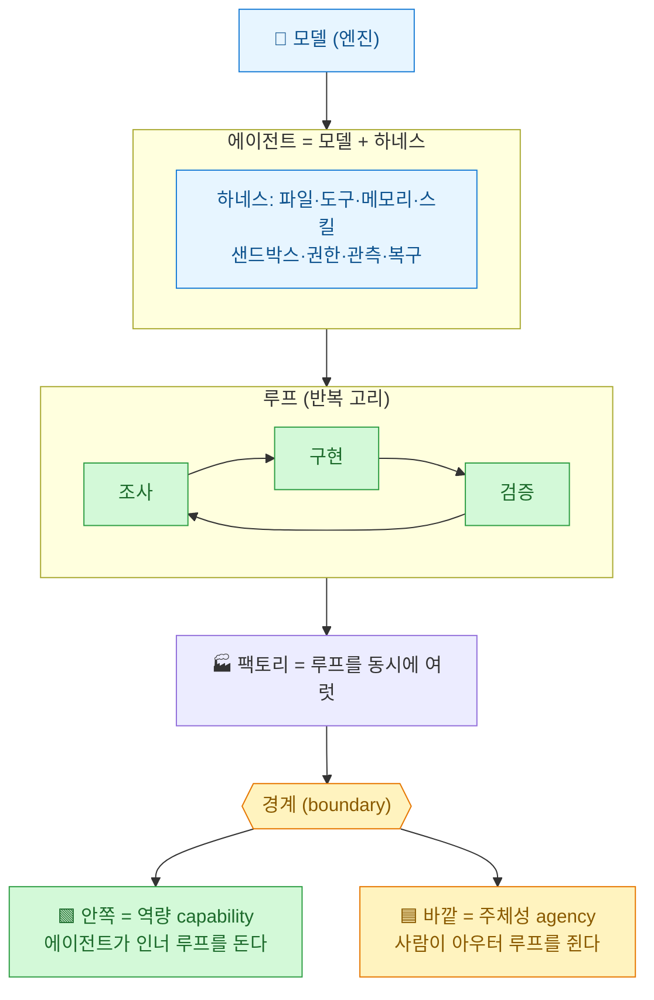
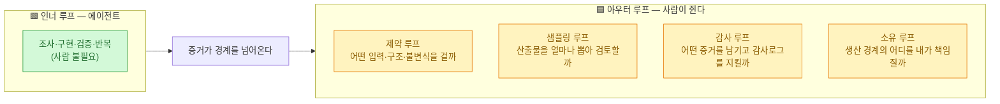
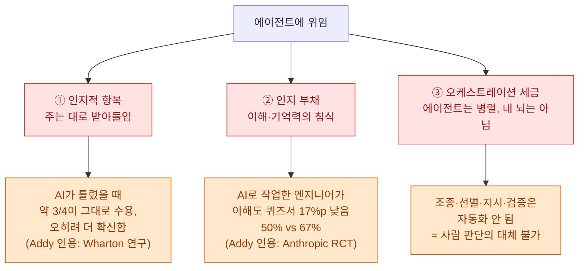
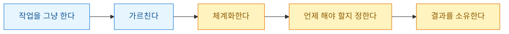
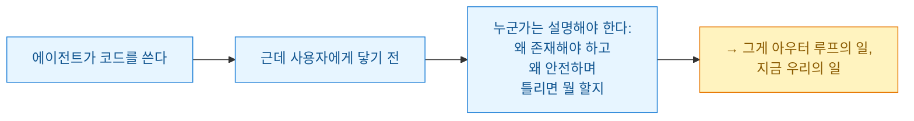

요즘 에이전틱 엔지니어링 얘기는 죄다 하네스와 루프, 플릿과 소프트웨어 팩토리로 흘러간다. 나도 [[claudedevs-getting-started-with-loops|루프 입문]]이나 [[claude-code-agent-teams-orchestration|에이전트 팀 오케스트레이션]] 같은 글로 그 결을 따라왔다. 그런데 Addy Osmani가 2026년 7월 9일 뉴스레터 *Elevate*에 올린 **"Own the Outer Loop"**를 읽고, 빠져 있던 한 조각이 딱 맞춰졌다. 그의 요지는 짧다 — **엔지니어는 아우터 루프(바깥 고리)를 소유해야 한다.** Fable이나 GPT-5.6 같은 강한 모델이 손에 들어올수록 이 말은 더 맞아떨어진다.

이 글은 그 원문을 내 언어로 다시 세운 독서 정리다. 원문이 인용한 통계는 **Addy가 든 2차 출처**임을 밝혀 옮긴다(내가 직접 검증한 1차 자료가 아니다).

## 한 장으로 보는 구조

핵심 이동은 이거다. **예전엔 사람이 실행 루프의 안쪽까지 직접 돌렸다. 이제 에이전트가 인너 실행 루프를 돌리고, 엔지니어는 아우터 루프를 소유한다.** 안쪽에 있는 건 딱 하나 — 역량(capability). 조사하고, 구현하고, 검증하고, 보고하는 능력. 바깥쪽에 있는 것도 딱 하나 — 주체성(agency). 결정하고, 검증하고, 승인하고, 소유하는 힘.

## '아우터 루프를 소유한다'는 게 정확히 뭔가?

Addy는 세 단어로 못을 박는다. 나는 이 셋이 이 글의 뼈대라고 봤다.

| 개념 | 뜻 | 내 식으로 |
|---|---|---|
| **Quality(품질)** | 시스템을 풀어놓기 전 걸어두는 모든 점검 → 그 점검이 **증거**를 만든다 | "무엇으로 확인할 것인가" |
| **Verdict(판정)** | 그 증거를 보고 내리는 **최종 생산 결정** — 낼지, 막을지, 좁힐지, 가드레일을 달지, 반려할지 | "내 이름으로 내보낼 것인가" |
| **Answerability(답변 가능성)** | 누가 물으면 **왜 그랬는지 설명할 수 있다는 보증** | "왜 그랬냐 물으면 답할 수 있는가" |

Addy의 비유가 좋았다. *"모델이 그 줄(코드)을 쓸 순 있다. 하지만 Verdict는 내 것이다. 우리 팀의 작업은 내 결정 없이는 의존 시스템에 들어가지 못한다."* 그는 자신을 **콘텐츠의 라인 프로듀서**라고 불렀다. 모델은 대사를 칠 수 있지만, 그 작품을 내 이름으로 내보낼지는 내가 정한다는 것.

## 그럼 사람은 어느 고리에 서 있어야 하나?

여기서 오해를 하나 걷어내야 한다. "사람을 루프에서 뺀다"가 아니다. **인너 루프에서 뺄 뿐, 사람은 바깥의 네 고리에 그대로 선다.**

Addy의 한 줄이 이 그림을 다 말해준다 — **"에이전트는 당신이 리뷰할 수 있는 것보다 더 많이 내보낸다(The agent can ship more than you can review)."** 그러니 희소 자원은 코드 생산이 아니다. **로그·테스트 같은 품질 신호로 뒷받침되는, 당신 자신의 핵심 판단**이다.

## 왜 지금 이 얘기가 급해졌나 — 신뢰-검증 격차

Addy가 든 수치들을 옮기면(전부 원문 인용 출처다):

- **Sonar 2026 State of Code**: 커밋된 코드의 **42%가 AI 생성 또는 상당한 AI 보조**였고, 이 비중은 정체가 아니라 더 커질 거라 봤다.
- **GitLab 2026년 6월 리포트**: 지금 병목은 리뷰와 검증이며, 더 걱정스러운 건 **거버넌스가 코드 생성 이후에야** 붙는다는 점 — 이미 리스크를 떠안고 소유권을 잃은 뒤라는 얘기다.

Addy는 이걸 **신뢰-검증 격차(trust-verification gap)**라고 불렀다. 많은 사람이 AI 코드를 여전히 어느 정도 못 믿는다고 말하면서도, **그 불신을 검증 프로세스에 일관되게 심어두는 사람은 더 적다**는 것이다. 생성 속도는 확 올렸는데 통제 속도는 그만큼 못 올린 결과다.

## 그래서 뭘 잃는가 — 세 가지 숨은 비용

이 글에서 제일 아팠던 대목. 위임에는 청구서가 딸려 온다.

- **인지적 항복(cognitive surrender)** — 위임한 순간 그 산출물은 에이전트의 것처럼 보이지만, 실은 **내 작업, 내 평판, 내 책임, 내 소프트웨어**다. Addy가 인용한 Wharton 연구에 따르면 AI가 맞을 땐 안심이지만, **틀렸을 때 거의 3/4이 그대로 받아들였고 오히려 더 확신했다.**
- **인지 부채(cognitive debt)** — 사고를 통째로 넘기면 이해가 안 쌓인다. 에이전트 계획의 시간 지평이 길어질수록 산출물과 내 이해 사이 간극이 벌어지고, 그 부채는 복리로 쌓인다. Addy가 인용한 Anthropic RCT에서, AI를 거쳐 작업한 엔지니어가 이해도 퀴즈에서 **17%포인트 낮은 점수(50% 대 67%)**를 받았다.
- **오케스트레이션 세금(orchestration tax)** — 에이전트는 쉽게 여러 개 띄우지만 내 인지 대역폭은 그렇게 병렬화되지 않는다. 최악의 행동을 막고, 주목할 산출물을 골라내고, 위험한 가정을 먼저 검증하는 일 — 전부 자동화가 안 된다. 특히 **브라운필드(레거시)**가 위험하다. 감사해야 할 시스템 동작이 코드가 아니라 **흉터(scars)에 살아 있기** 때문이다.

처방도 있다: 아키텍처 결정에서 **'주의(attention)'를 우선순위로** 두기, 워크트리·스코프·증거로 초기 계획과 실제 산출물의 결합을 느슨하게 하기, 해결 안 되는 단계는 **타임박스**로 끊기, 그리고 소프트웨어 변경은 **철저히 옵트인 권한**으로 만들기.

## 백프레셔 — 자율성은 '딱 멈출 수 있을 만큼'만

Addy는 품질을 **백프레셔(back pressure, 역압)**라고 부른다. 문자 그대로다. 에이전트에게 낼 수 있는 최대치의 자율을 주지 말고, **멈추고·조절하고·검증할 수 있을 만큼의 역압이 남는 딱 그만큼**만 자율을 준다.

다행히 우리 엔지니어링은 이미 이런 신호로 가득하다 — 타입 체크, 테스트, 훅, 샌드박스 한도, 감사 로그, 모니터. **에이전트가 이 신호들을 똑같이 뿜어내는 한, 평범한 엔지니어링이 적절한 역압을 제공한다.** 인너 루프 안에 품질 보증을 전부 넣어두면, 남는 일은 하나다 — 루프가 돌아가는 속도와 범위를 조절하는 백프레셔를 걸어 자율을 부여하는 것.

## 개발자와 엔지니어는 어떻게 갈리나?

Addy의 문장을 그대로 옮기고 싶다 — **"모두가 개발자이지만, 모두가 엔지니어인 것은 아니다."** 엔지니어링은 개발자가 더 엄격한 작업 규율을 받아들일 때 되는 것이다: 철저하고 논리적으로 건전한 추론, 제약과 트레이드오프에 대한 고려, 리스크와 노출의 인식, 그리고 **실질적 책임(accountability)**.

그는 **엣지(edge)와 시그니처(signature)**를 나눈다. *"엣지의 반감기는 한 번의 릴리스지만, 시그니처의 반감기는 커리어다."* 스킬은 레버리지를 주지만, **레버리지를 신뢰로 바꾸는 건 책임**이다. 에이전트는 정책 안에서 고르고·라우팅하고·병합하고·에스컬레이션할 수 있지만, **결과를 상속받을 수는 없다.** 결과를 물려받는 건 오직 사람이다.

## 그래서 내가 챙길 실무 한 가지 — 책임 계약서

Addy가 던진 제안 중 바로 써먹을 만한 것. **모든 코드베이스에 '책임 계약서(accountability contract)'를 붙이자**는 아이디어다. 변경이 승인될 때 이해된 체크리스트, 결정에 들어간 증거, 누가 그 변경에 책임졌는지, 그리고 변경(혹은 차단) 이후 시스템 상태를 명시하는 문서다.

내 표현으로 다시 쓰면 이렇게 세 쌍이 남는다.

| 안쪽(에이전트가 만든다) | 바깥(사람이 쥔다) |
|---|---|
| 조사·구현·검증 | 제약·샘플링·감사·소유 |
| 역량(capability) | 주체성(agency) |
| 증거(evidence) | 판정(Verdict) · 답변가능성(Answerability) |

## 한 줄로 남기면

병목이 옮겨갔다. **"이걸 만들 수 있나?"에서 "이게 존재해야 하나, 우리가 이걸 책임질 수 있나?"로.** 팩토리를 짓고, 불을 켜두고, 일을 **읽을 수 있게·검증 가능하게·소유되게** 만드는 것. 에이전트는 쓸 수 있다. 하지만 사용자에게 닿기 전에 누군가는 왜 그게 존재해야 하는지, 왜 프로덕션의 일부가 될 만큼 안전한지, 그리고 틀렸을 때 무엇을 할지 답할 수 있어야 한다. 그게 지금의 엔지니어링이다.

읽고 나니 [[anthropic-agentic-coding-returns-to-expertise|"결국 전문성으로 돌아온다"]]는 앞선 정리와 정확히 같은 방향을 가리키고 있었다. 모델이 아무리 세져도, 이름을 거는 자리는 사람 몫으로 남는다.

---

*원문: Addy Osmani, "Own the Outer Loop — Why loop engineering needs a human at the boundary", Elevate(Substack), 2026-07-09. 본문 인용 통계(Sonar 2026 42%, GitLab 2026-06, Wharton 연구, Anthropic RCT 17%p 등)는 원문이 든 2차 출처를 그대로 옮긴 것이며 내가 1차 검증한 자료가 아니다. 개념 번역과 도식은 내 재구성이다.*
