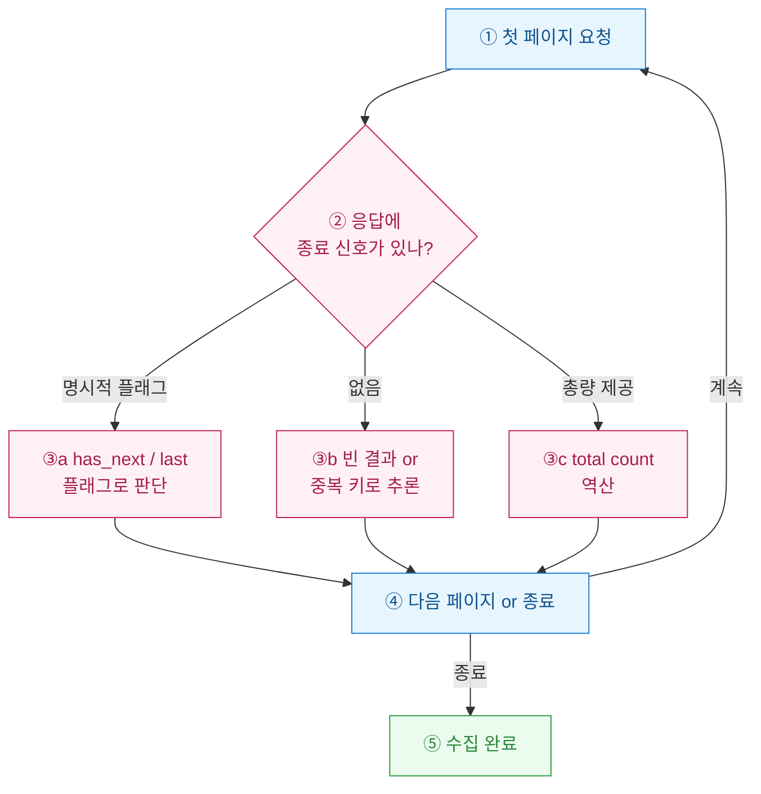

크롤러를 짜다 보면 정작 어려운 건 데이터를 뽑는 로직이 아니었다. **언제 멈출 것인가(termination condition)**가 항상 발목을 잡았다. 페이지 번호를 1씩 올리며 돌리다가, 어디서 끊어야 할지 몰라 무한 루프에 빠지거나 반대로 절반만 긁고 끝나버린 경험이 한두 번이 아니다. 오늘은 내가 실전에서 써본 종료 조건 4가지를 정리해 둔다. 어느 하나가 "정답"은 아니고, 대상 API가 어떻게 생겼느냐에 따라 골라 써야 한다.

> 아래 데이터·응답은 전부 합성 더미다. 특정 사이트의 실제 응답이 아니다.

## 종료 조건은 왜 이렇게 까다로운가?

이유는 하나다. **서버가 "이게 마지막이야"라고 친절히 알려주는 경우가 드물기 때문**이다. 어떤 API는 `has_next: false`를 주지만, 어떤 곳은 그냥 빈 배열을 던지고, 심한 곳은 마지막 페이지를 넘어가도 마지막 페이지를 계속 되돌려준다. 그래서 종료 신호를 "무엇으로 삼을지"를 먼저 정해야 한다.



## 방법 1 — 마지막 페이지 플래그, 있으면 최고 아닌가?

응답에 `has_next`, `is_last`, `total_pages` 같은 필드가 있으면 이게 가장 깔끔하다. 서버가 알려주는 대로 믿으면 되니까.

```python
def crawl_by_flag(session, url):
    page, rows = 1, []
    while True:
        r = session.get(url, params={"page": page}).json()
        rows.extend(r["items"])
        if not r.get("has_next"):   # 서버가 끝이라고 함
            break
        page += 1
    return rows
```

**함정**: 이 플래그가 거짓말을 하는 경우가 있다. 마지막 페이지인데도 `has_next: true`를 주거나(off-by-one), 캐시 때문에 옛 값이 오기도 한다. 그래서 나는 플래그를 믿되, "빈 결과가 오면 무조건 멈춘다"는 안전장치를 항상 함께 둔다. 신뢰하되 검증(trust but verify).

## 방법 2 — 빈 결과로 멈추는 게 왜 기본기인가?

플래그가 아예 없을 때 가장 보편적인 방법이다. **응답 배열이 비면 멈춘다.** 단순하고 대부분 통한다.

```python
def crawl_until_empty(session, url):
    page, rows = 1, []
    while True:
        items = session.get(url, params={"page": page}).json()["items"]
        if not items:            # 빈 배열 = 끝
            break
        rows.extend(items)
        page += 1
    return rows
```

**함정 두 개**가 있다. 첫째, 일시적 오류로 빈 배열이 올 수 있다(서버 과부하 시 빈 응답). 이걸 "끝"으로 오해하면 데이터가 잘린다. 둘째, 앞서 말한 "마지막 페이지 무한 반복" 서버는 빈 배열을 절대 안 주므로 이 방법으로는 영원히 안 멈춘다. 그래서 빈 결과 종료는 **중복 키 감지(방법 3)**와 짝지어 쓰는 게 안전하다.

## 방법 3 — 중복 키 감지는 어떤 상황을 구제하나?

"마지막 페이지를 계속 되돌려주는" 악질 서버, 그리고 실시간으로 데이터가 밀려 페이지 경계가 흔들리는 경우에 강하다. 원리는 간단하다. **이미 본 고유 키(id)가 또 나오면 멈춘다.**

```python
def crawl_by_dedup(session, url):
    page, rows, seen = 1, [], set()
    while True:
        items = session.get(url, params={"page": page}).json()["items"]
        new = [x for x in items if x["id"] not in seen]
        if not new:              # 새 항목 0개 = 같은 페이지 반복 중
            break
        for x in new:
            seen.add(x["id"])
        rows.extend(new)
        page += 1
    return rows
```

`seen` 집합이 메모리를 먹는다는 단점은 있지만, 수십만 건 규모까지는 문제없었다. 중복을 걸러주니 **자연스럽게 dedup까지 된다**는 부수 효과도 좋다.

## 방법 4 — total count 역산은 언제 신뢰할 수 있나?

응답에 `total: 4830` 같은 총량이 있으면, 페이지 크기로 나눠 마지막 페이지를 미리 계산할 수 있다.

```python
import math

def crawl_by_total(session, url, size=100):
    first = session.get(url, params={"page": 1, "size": size}).json()
    total = first["total"]
    last_page = math.ceil(total / size)   # 역산
    rows = list(first["items"])
    for page in range(2, last_page + 1):
        rows.extend(session.get(url, params={"page": page, "size": size}).json()["items"])
    return rows
```

장점은 **총 페이지 수를 미리 알아 진행률 표시가 된다**는 것. 함정은 `total`이 실시간으로 변한다는 점이다. 크롤링 중 데이터가 추가/삭제되면 역산한 마지막 페이지가 어긋난다. 그래서 total 역산도 마지막에 "빈 결과면 멈춤"을 덧붙여 오차를 흡수한다.

## 네 방법, 결국 어떻게 골라 쓰나?

| 방법 | 종료 신호 | 강한 상황 | 대표 함정 |
|---|---|---|---|
| **① 플래그(flag)** | `has_next` 등 | 서버가 명시 제공 | off-by-one·캐시 거짓말 |
| **② 빈 결과(empty)** | 빈 배열 | 플래그 없는 대부분 | 일시 오류를 끝으로 오해 |
| **③ 중복 키(dedup)** | 새 항목 0개 | 마지막 페이지 반복·실시간 변동 | `seen` 메모리 사용 |
| **④ total 역산** | 총량 ÷ 페이지 크기 | 진행률 필요 | total 실시간 변동 |

결론은 이렇다. **어느 하나만 믿지 말고 겹쳐 쓴다.** 나는 대체로 "주 신호 1개 + 빈 결과 안전장치 + 최대 페이지 상한(하드 리밋)" 세 겹으로 짠다.


마지막 하드 리밋(`if page > MAX_PAGE: break`)은 사소해 보여도 새벽에 크롤러가 무한 루프로 서버를 두드리다 IP가 차단되는 사고를 막아준 일등공신이다. 종료 조건은 "우아한 정답"보다 "무너져도 안전한 방어"가 먼저다. 이 원칙 하나만 기억해도 크롤러 야근이 절반으로 줄어든다.
