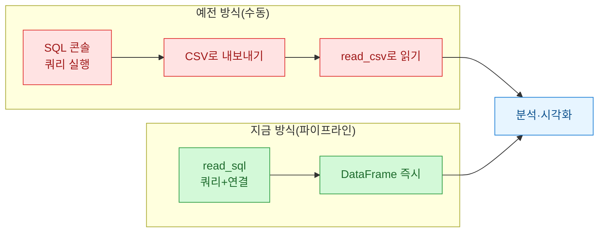
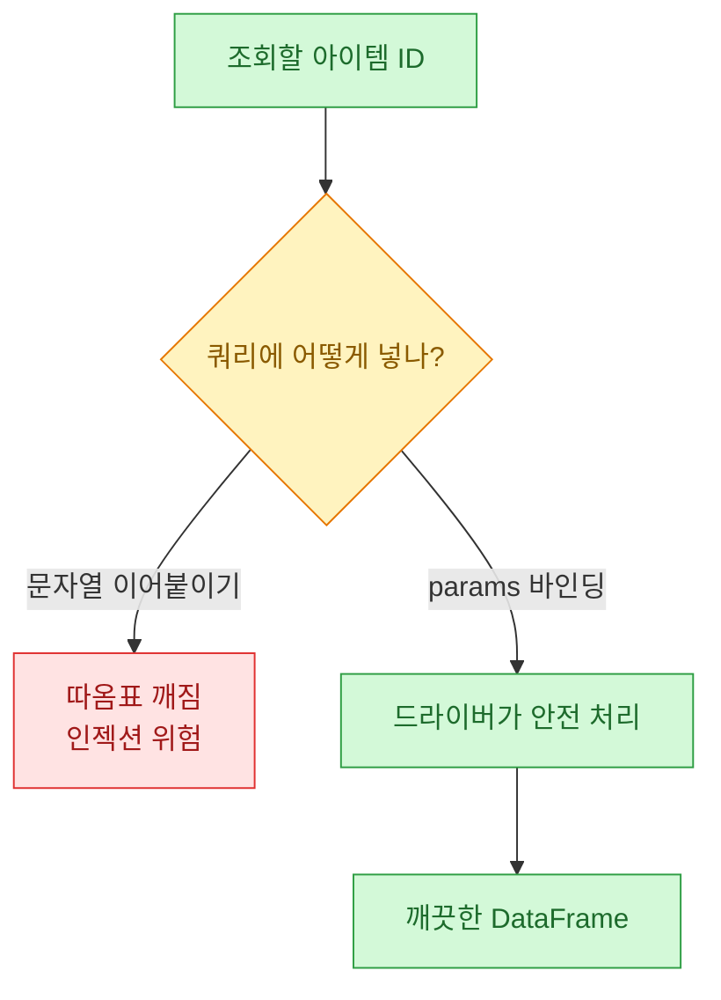

아이템 시세를 매일 들여다보는 대시보드를 만들다 보면 결국 원천 데이터가 **MSSQL(마이크로소프트 SQL 서버)** 안에 있다는 벽을 만난다. 거래 로그, 시세 스냅샷, 유저별 결제 이력이 다 거기 쌓여 있다. 처음엔 이걸 어떻게 파이썬으로 끌어오느냐가 제일 큰 고민이었다. SQL 콘솔에서 쿼리 돌려서 결과를 CSV로 떨구고, 그 CSV를 `pandas.read_csv`로 읽는 방식으로 며칠 버텼다. 그러다 이게 얼마나 위험한 습관인지 삽질하며 깨달았다.

이 글은 그 삽질의 기록이다. **`pandas.read_sql` 하나로 SQL과 분석을 한 흐름에 붙이는** 이야기다.



## 왜 CSV로 떨구면 안 됐나?

CSV 경유의 문제는 세 가지였다. 첫째, **손이 많이 간다.** 시세가 어제와 다르면 콘솔 열고 쿼리 다시 돌리고 파일 다시 저장하는 일을 반복했다. 자동화하려는데 중간에 사람 손이 낀다는 게 말이 안 됐다.

둘째, **타입이 뭉개진다.** CSV는 결국 텍스트라 거래일시가 문자열로 읽히고, 아이템 ID 앞에 붙은 0이 날아가고, 큰 정수가 실수로 바뀐다. 매번 `read_csv`에서 `dtype`, `parse_dates`를 다시 지정해야 했다.

셋째, **중간 파일이 쌓인다.** `시세_0714_최종.csv`, `시세_0714_최종_진짜.csv`... 다들 아는 그 지옥이다.

`read_sql`은 이 세 개를 한 번에 없앤다. DB에 직접 물어서 결과를 곧바로 DataFrame(판다스의 표 형태 자료구조)으로 받으니 중간 파일도, 타입 뭉개짐도 원천적으로 안 생긴다.

## read_sql, 어떻게 연결하나?

기본은 연결 객체와 쿼리 문자열만 있으면 된다. 나는 `pymssql`로 MSSQL에 붙었다. (드라이버 설치가 번거로우면 `pyodbc`도 된다.)

```python
import pandas as pd
import pymssql

conn = pymssql.connect(
    server="YOUR_SERVER",
    user="YOUR_USER",
    password="YOUR_PASSWORD",
    database="market",
)

query = "SELECT trade_dt, item_id, price, qty FROM item_trades"
df = pd.read_sql(query, conn)
print(df.shape)  # (건수, 4)
```

이걸 처음 돌렸을 때가 좀 감동이었다. 콘솔·CSV·재읽기 3단계가 한 줄로 접혔다.

## 아이템 ID를 문자열로 이어붙이면 왜 위험한가?

여기서 초보 때 제일 크게 데인 지점이다. 특정 아이템만 조회하려고 이렇게 짰었다.

```python
# 이렇게 하지 말 것
item = user_input
query = f"SELECT * FROM item_trades WHERE item_id = '{item}'"
```

문자열을 그대로 쿼리에 끼워 넣는 방식이다. 값에 따옴표나 특수문자가 섞이면 쿼리가 통째로 깨지거나, 최악엔 **SQL 인젝션(악의적 쿼리 주입)** 통로가 된다. 정답은 **파라미터 바인딩** — 값을 쿼리 본문이 아니라 별도 인자로 넘겨서 드라이버가 안전하게 끼워 넣게 하는 것이다.

```python
query = "SELECT trade_dt, item_id, price FROM item_trades WHERE item_id = %s"
df = pd.read_sql(query, conn, params=("A00317",))
```

`%s` 자리에 `params`의 값이 안전하게 들어간다. (드라이버마다 자리표시자가 달라서 `pyodbc`는 `?`, `pymssql`은 `%s`를 쓴다. 이 차이로 반나절 날렸다.)



## 결과가 수백만 건이면 메모리가 터지지 않나?

터진다. 시세 로그를 몇 달치 통으로 `SELECT` 하면 파이썬이 데이터를 전부 메모리에 올리다 프로세스가 죽었다. 이때 쓰는 게 **청크 읽기** — 결과를 한 번에 다 받지 않고 정해진 건수씩 잘라서 순차로 받는 방식이다. `chunksize`만 주면 된다.

```python
chunks = pd.read_sql(
    "SELECT trade_dt, item_id, price, qty FROM item_trades",
    conn,
    chunksize=50000,  # 5만 건씩 끊어서
)

daily_sum = []
for chunk in chunks:
    # 청크 단위로 일별 거래대금 집계 후 요약본만 보관
    g = chunk.groupby(chunk["trade_dt"].dt.date)["price"].sum()
    daily_sum.append(g)

result = pd.concat(daily_sum).groupby(level=0).sum()
```

핵심은 **원본 전체를 메모리에 쌓지 말고, 청크마다 집계해서 요약본만 남기는** 것이다. 5만 건짜리 조각은 금방 처리되고 버려지니 메모리가 일정하게 유지된다. 시세 이상탐지처럼 전 구간을 훑어야 하는 작업에서 특히 요긴했다.

## dtype는 왜 미리 지정해야 하나?

`read_sql`은 DB 타입을 판다스 타입으로 알아서 매핑해 준다. 대체로 잘 맞지만 두 군데서 어긋났다.

하나는 **아이템 ID처럼 앞자리 0이 의미 있는 코드.** 판다스가 숫자로 인식해 `00317`을 `317`로 바꿔 버린다. 다른 하나는 **NULL이 섞인 정수 컬럼.** 판다스에서 정수 컬럼에 결측이 들어오면 실수(float)로 승격돼 `qty`가 `3.0`처럼 보인다.

그래서 읽은 직후 타입을 명시적으로 못박았다.

```python
df["item_id"] = df["item_id"].astype("string")   # 코드값은 문자열로
df["qty"] = df["qty"].astype("Int64")            # 결측 허용 정수(대문자 I)
df["trade_dt"] = pd.to_datetime(df["trade_dt"])  # 시계열 인덱스용
```

`Int64`(대문자)는 판다스의 **결측 허용 정수 타입**이다. NULL을 실수로 바꾸지 않고 `<NA>`로 품는다. 시계열 이상탐지에서 수량이 실수로 떠 있으면 집계가 미묘하게 틀어지는데 이걸로 잡았다.

## 정리하면

CSV 경유를 버리고 `read_sql`로 SQL과 분석을 한 흐름에 붙이니, 매일 아침 시세 대시보드가 사람 손 없이 갱신됐다. 내가 챙긴 네 가지는 이렇다.

| 상황 | 처방 |
|---|---|
| 값을 조건에 넣을 때 | 문자열 조합 말고 `params` 바인딩 |
| 결과가 클 때 | `chunksize`로 청크 읽기 후 즉시 집계 |
| 코드값·결측 정수 | 읽은 직후 `astype`으로 dtype 못박기 |
| 날짜 | `to_datetime`으로 시계열화 |

입문 단계에서 이 네 개만 몸에 붙여도 "쿼리 결과를 분석으로 넘기는 다리"가 튼튼해진다. 다음 글에선 이렇게 끌어온 시세 데이터에 이동평균과 이상탐지(급등·급락 감지)를 얹는 이야기를 써 볼 생각이다.
