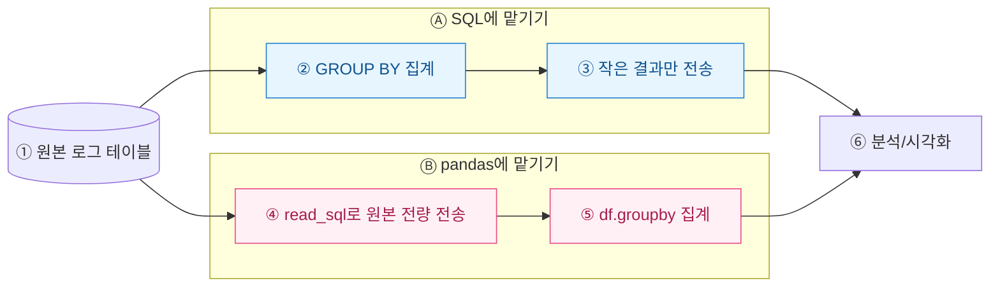
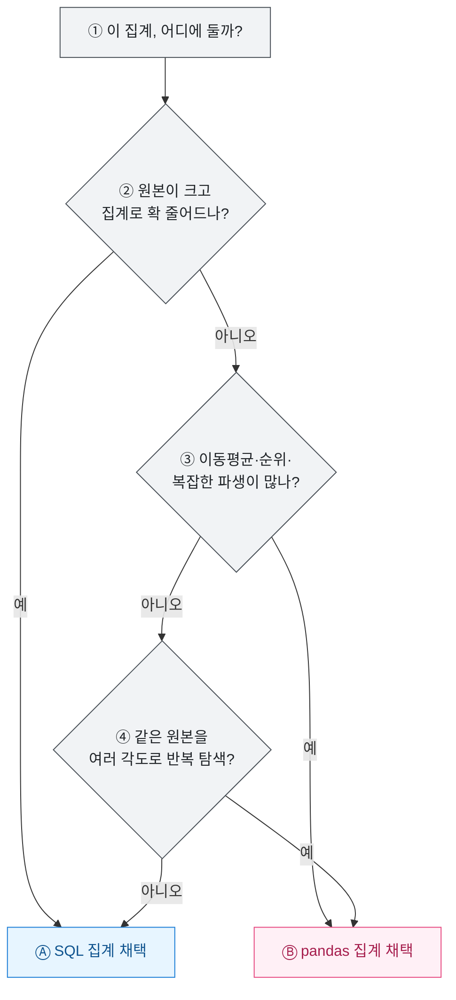

집계를 어디에 둘지는 매번 나를 망설이게 한다. DB 서버가 `GROUP BY`로 다 계산해서 줄 수도 있고, `read_sql`로 원본 행을 다 끌어와 pandas의 `groupby`로 처리할 수도 있다. 결과는 같은데 성능과 재현성은 딴판이다. 이번에 게임 일별 매출 로그를 정리하며 내 기준을 정리해 뒀다.



## 왜 "어디서 집계하나"가 성능을 가르나?

핵심은 **네트워크로 오가는 데이터의 양(volume)**이다. SQL에서 집계하면 DB가 수백만 행을 씹어서 요약된 수십 행만 넘긴다. pandas로 집계하면 그 수백만 행이 전부 파이썬 프로세스로 넘어와야 한다. 전송량과 메모리가 곧 비용이다.

| 구분 | SQL 집계 | pandas 집계(`read_sql` 후) |
| --- | --- | --- |
| **전송량(rows)** | 요약 결과만 (작음) | 원본 전량 (큼) |
| **연산 위치** | DB 서버 (인덱스·병렬 활용) | 로컬 파이썬 (단일 프로세스) |
| **메모리 압박** | 낮음 | 원본 크기만큼 |
| **재현성** | 쿼리 1개로 고정 | 파이썬 코드 흐름에 의존 |

## SQL에 맡기면 어떤 모습인가?

무거운 `GROUP BY`, 조인, 필터는 DB가 제일 잘한다. 인덱스와 병렬 처리를 공짜로 쓴다.

```sql
-- 일별·플랫폼별 결제액 요약 (더미 스키마)
SELECT
  log_date,
  platform,
  COUNT(DISTINCT user_id) AS paying_users,
  SUM(amount_krw)         AS revenue_krw
FROM purchase_log
WHERE log_date >= '2026-06-01'
GROUP BY log_date, platform
ORDER BY log_date;
```

이 쿼리는 결과가 수십 행이라, 파이썬은 그걸 받아 그리기만 하면 된다.

```python
import pandas as pd
df = pd.read_sql(query, conn)   # 이미 집계된 작은 표
df.pivot(index="log_date", columns="platform", values="revenue_krw").plot()
```

## pandas에 맡기는 게 나은 순간은 언제인가?

무조건 SQL이 정답은 아니다. 다음 경우엔 원본을 끌어와 파이썬에서 만지는 게 낫다.



이미 필터로 좁혀진 데이터라면 파이썬 탐색이 편하다. 같은 원본 데이터프레임 하나로 리텐션, 코호트, 이동평균을 이리저리 돌려볼 때는 왕복 쿼리보다 로컬 `groupby`가 빠르고 손에 붙는다.

```python
# 이미 좁혀진 원본으로 여러 각도 탐색 (더미)
df["revenue_7d_avg"] = (
    df.sort_values("log_date")
      .groupby("platform")["revenue_krw"]
      .transform(lambda s: s.rolling(7).mean())
)
```

## 내가 겪은 트러블 — "숫자가 미묘하게 달랐다"

같은 지표인데 SQL 값과 pandas 값이 어긋난 적이 있다. 원인은 **NULL 처리**였다. SQL의 `SUM`은 NULL을 무시하지만, 파이썬에서 결측을 0으로 채워 놓으면 평균 분모가 달라진다. 집계 위치를 옮길 땐 결측·타입·타임존을 반드시 한 번 맞춰봐야 한다.

| 함정 | SQL | pandas |
| --- | --- | --- |
| **결측(NULL)** | 집계에서 자동 제외 | `fillna` 여부로 결과 바뀜 |
| **정수 나눗셈** | 타입 캐스팅 필요 | float 자동 승격 |
| **타임존** | 세션 설정 의존 | `tz_localize` 명시 필요 |

## 그래서 내 기준은?

- **무거운 축소(집계·조인·필터)는 SQL**로 내려서 전송량을 줄인다.
- **탐색·복잡한 파생·반복 실험은 pandas**로 올려서 유연성을 얻는다.
- 재현성이 중요하면 집계 로직은 되도록 **쿼리 1개에 고정**해 버전 관리한다.

결국 "DB에 얼마나 맡길까"는 데이터 크기와 작업의 성격 사이 저울질이다. 나는 요즘 "일단 SQL로 최대한 줄이고, 줄어든 것만 pandas로 논다"를 기본값으로 둔다.

> 본문의 스키마·수치는 전부 더미이며, 특정 서비스의 실데이터가 아니다. 투자·회계 판단이 아닌 데이터 처리 방법론 기록이다.
