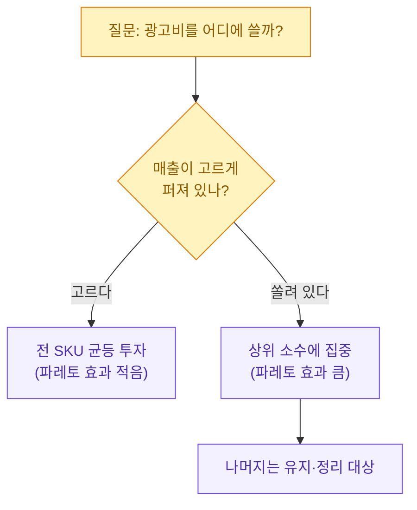
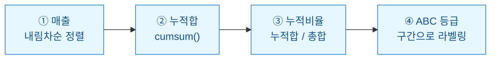
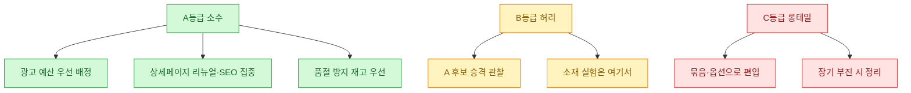

상품 수가 늘어날수록 "다 챙길 수 없다"는 게 진짜 문제로 다가온다. 광고 예산도, 상세페이지를 다시 만들 시간도 한정돼 있는데 SKU(재고관리단위, 상품의 최소 관리 단위)는 수십 종씩 늘어난다. 그럴 때 내가 매번 돌리는 게 파레토 분석이다. 이 글에서 쓰는 숫자는 전부 **합성(더미) 데이터**이고, 실제 판매 데이터가 아니라는 점을 먼저 밝혀 둔다.

## 이 글은 무엇을 다루나?


핵심은 "몇 종이 매출의 대부분을 만드는가"를 눈으로 확인하고, 그 소수에 자원을 몰아주는 결정을 데이터로 뒷받침하는 것이다.

## 파레토 법칙이 뭐고, 왜 SKU에 쓰나?

파레토 법칙은 흔히 **80/20 법칙(Pareto principle)**으로 불린다. 결과의 대부분(약 80퍼센트)이 원인의 일부(약 20퍼센트)에서 나온다는 경험칙이다. 매출로 바꿔 말하면 "상위 몇 종의 상품이 전체 매출의 큰 몫을 차지한다"는 이야기다.

80/20은 어디까지나 경험적 눈금이지 자연법칙이 아니다. 어떤 스토어는 70/30, 어떤 스토어는 90/10에 가깝다. 그래서 나는 숫자를 외우기보다 **실제 누적 곡선이 어디서 꺾이는지**를 본다.



## 합성 데이터는 어떻게 만드나?

실제 데이터를 못 쓰니 비슷한 모양의 더미를 만든다. 매출이 소수 상품에 쏠리는 현상은 로그정규분포로 흉내 내면 그럴싸하다. 상품명은 전부 가상("디자인A", "디자인B" 식)으로 둔다.

```python
import numpy as np
import pandas as pd

rng = np.random.default_rng(42)

# 합성 데이터: 상품 40종, 매출이 소수에 쏠리도록 로그정규분포 사용
n = 40
skus = [f"디자인{chr(65 + i // 10)}{i % 10}" for i in range(n)]  # 디자인A0 ~ 디자인D9
revenue = np.round(rng.lognormal(mean=6.0, sigma=1.1, size=n)) * 1000  # 원 단위

df = pd.DataFrame({"sku": skus, "revenue": revenue.astype(int)})
print(df.head())
```

이렇게 하면 몇 종은 매출이 크고 대부분은 작은, 현실과 닮은 분포가 나온다.

## 누적 비율은 어떻게 계산하나?

파레토의 핵심 계산은 세 줄이면 끝난다. ① 매출 내림차순 정렬 → ② 누적 매출 → ③ 전체 대비 누적 비율.



```python
# ① 정렬
df = df.sort_values("revenue", ascending=False).reset_index(drop=True)

# ② 누적합, ③ 누적 비율(%)
total = df["revenue"].sum()
df["cum_revenue"] = df["revenue"].cumsum()
df["cum_pct"] = df["cum_revenue"] / total * 100

# 순위와 상품 개수 비율
df["rank"] = df.index + 1
df["sku_pct"] = df["rank"] / len(df) * 100

print(df[["sku", "revenue", "cum_pct", "sku_pct"]].head(10).round(1))
```

여기서 `cum_pct`가 80퍼센트를 넘어서는 지점의 순위를 보면, "상위 몇 종이 매출의 80퍼센트를 만드는가"를 바로 읽을 수 있다.

```python
# 누적 매출 80%를 처음 넘는 지점
cut = df[df["cum_pct"] >= 80].iloc[0]
core_count = int(cut["rank"])
print(f"상위 {core_count}종 ({cut['sku_pct']:.0f}% 상품)이 매출의 80%를 담당")
```

## ABC 등급은 어떻게 나누나?

누적 비율을 구간으로 잘라 A/B/C로 라벨을 붙이면 관리가 쉬워진다. 흔히 누적 80퍼센트까지를 A, 80~95퍼센트를 B, 나머지를 C로 둔다.

| 등급 | 누적 매출 구간 | 성격 | 대응 전략 |
|------|--------------|------|-----------|
| A | 0 ~ 80% | 매출 핵심 소수 | 광고·상세페이지 최우선 투자 |
| B | 80 ~ 95% | 중간 허리 | 유지, 선별적 개선 |
| C | 95 ~ 100% | 롱테일 다수 | 정리·묶음·재고 최소화 검토 |

```python
def abc_grade(p):
    if p <= 80:
        return "A"
    elif p <= 95:
        return "B"
    return "C"

df["grade"] = df["cum_pct"].apply(abc_grade)
summary = df.groupby("grade").agg(
    종수=("sku", "count"),
    매출합=("revenue", "sum"),
).assign(매출비율=lambda x: (x["매출합"] / total * 100).round(1))
print(summary)
```

## 파레토 차트는 어떻게 그리나?

파레토 차트는 막대(개별 매출)와 꺾은선(누적 비율)을 겹쳐 그린 그림이다. 막대는 내림차순, 선은 오른쪽 위로 완만히 올라가다 평평해진다. 그 "평평해지는 지점"이 자원 배분의 경계다.

```python
import matplotlib.pyplot as plt

fig, ax1 = plt.subplots(figsize=(11, 5))
ax1.bar(df["rank"], df["revenue"], color="#4dabf7")
ax1.set_xlabel("SKU 순위")
ax1.set_ylabel("매출(원)")

ax2 = ax1.twinx()
ax2.plot(df["rank"], df["cum_pct"], color="#e8590c", marker="o", ms=3)
ax2.axhline(80, color="#adb5bd", ls="--")   # 80% 기준선
ax2.set_ylabel("누적 매출 비율(%)")
ax2.set_ylim(0, 105)

plt.title("SKU 파레토 차트 (합성 데이터)")
fig.tight_layout()
fig.savefig("pareto_sku.png", dpi=120)
```

점선(80퍼센트)과 꺾은선이 만나는 x좌표 왼쪽이 A등급 구간이다. 이 그림 한 장이면 "왜 이 상품들에 광고를 몰았나"를 비전문가에게도 30초 만에 설명할 수 있다.

## 이 결과로 무엇을 결정하나?



주의할 점도 있다. 파레토는 **과거 매출의 사진**일 뿐이다. C등급이라고 무작정 버리면, 이제 막 뜨는 신상품이나 미끼 상품(문을 열게 만드는 저마진 상품)을 오해할 수 있다. 그래서 나는 파레토 등급을 신상품 출시 기간·마진율과 함께 본다. 등급은 우선순위의 출발점이지 사형선고가 아니다.

## 한 장 요약


- 매출은 대개 소수 SKU에 쏠린다 — 그 쏠림의 정도를 누적 곡선으로 확인한다.
- 80/20은 눈금일 뿐, 곡선이 평평해지는 실제 지점으로 A/B/C를 나눈다.
- 등급은 자원 배분의 출발점이고, 신상품·마진과 함께 해석해야 오판을 피한다.
