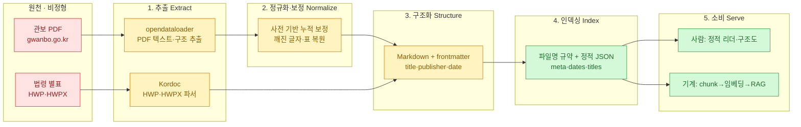
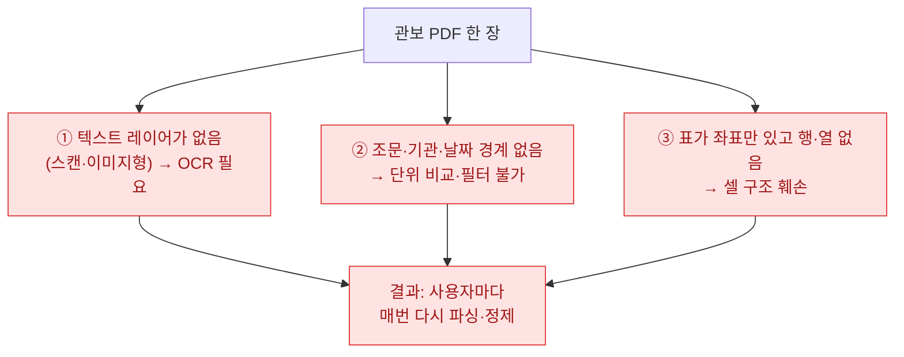
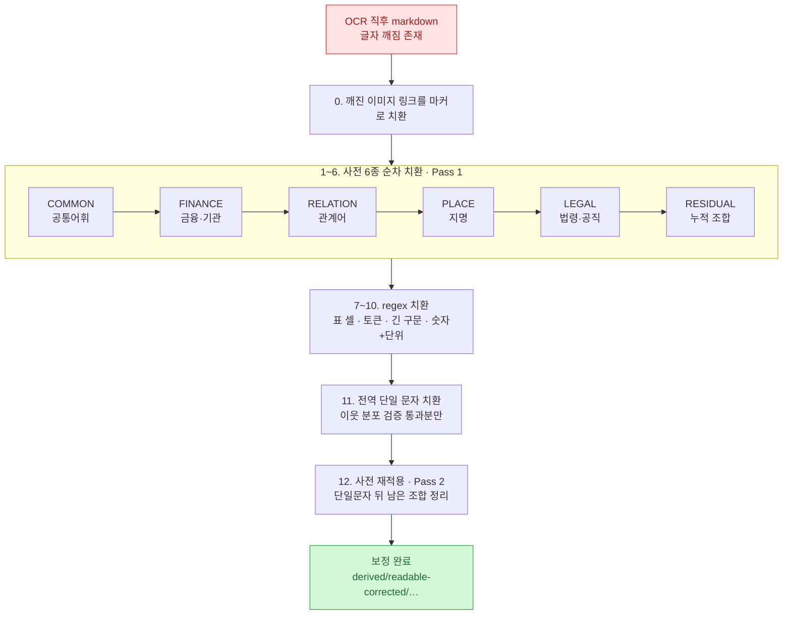
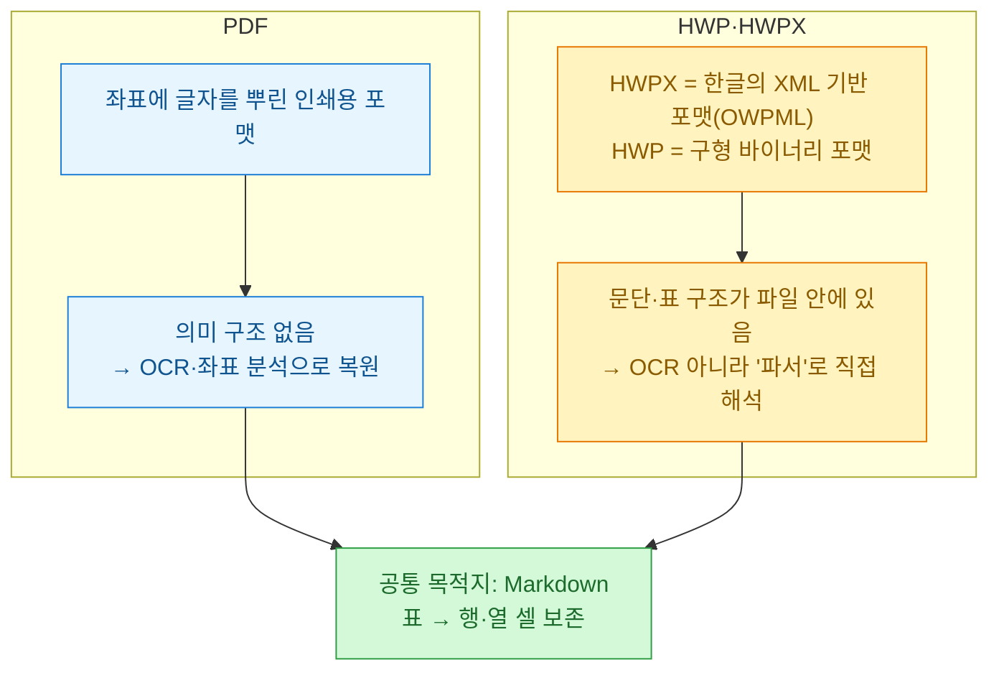
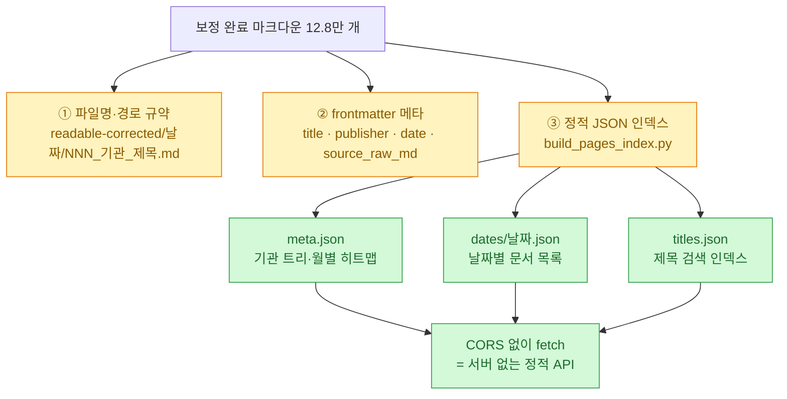
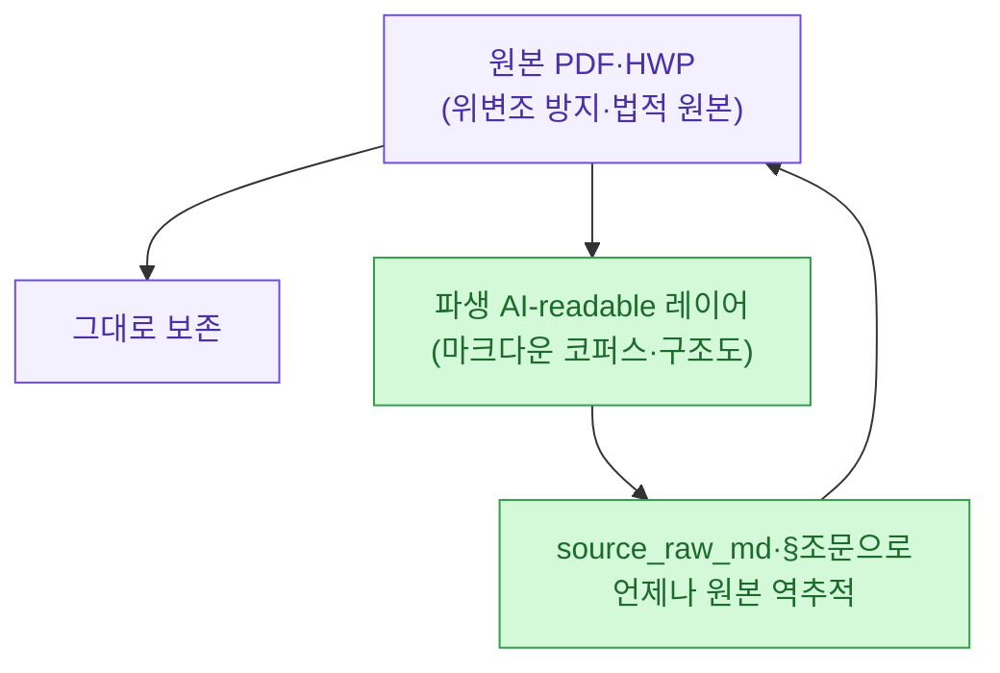

요즘 내가 가장 자주 부딪히는 벽은 "자료가 없다"가 아니라 **"자료는 공개돼 있는데 기계가 못 읽는다"**이다. DART 공시를 긁을 때도, 관보를 뒤질 때도 늘 같은 장면이었다. PDF는 열리는데 조문 단위로 비교가 안 되고, 표는 깨지고, OCR은 글자를 뭉갠다. 그래서 연구자도 기자도 공무원도 **같은 문서를 각자 또 파싱**한다. 이 전처리 비용이 매번 소비자 쪽에 전가된다.

그런데 최근 이 벽을 정면으로 부순 공무원 개발자들의 프로젝트를 세 개 봤다. 하나하나가 "비정형 문서 → 구조화 마크다운 → 인덱스"라는 같은 파이프라인의 서로 다른 조각이라, 이참에 **"대체 어떻게 파싱해서 재인덱싱했나"를 끝까지 파보기로** 했다. 마침 누가 나에게 딱 이걸 물어봤기 때문이다 — PDF를 어떻게 구조화했나, HWP·DOCX도 마크다운으로 만들었나, 인덱싱은 어떻게 했나.

먼저 오늘 해부할 세 프로젝트를 표로 세워 둔다.

| 프로젝트 | 만든 이 | 원천 포맷 | 핵심 기법 | 산출물 |
|---|---|---|---|---|
| [ai-readable 관보](https://github.com/hosungseo/ai-readable-gazette-kr) | 서호성(중앙부처 사무관) | **PDF** (전자관보) | opendataloader OCR + **사전 기반 누적 보정** | 관보 12.8만 건 MD 코퍼스 |
| [Korean Law MCP](https://news.hada.io/topic?id=27995) | chrisryugj(류 주무관) | **HWP·HWPX** (법령 별표) | 자체 파서 **Kordoc** + 법제처 Open API | 64개 법률 도구(MCP·CLI) |
| [제도 100](https://hosungseo.github.io/korea100/) | 서호성 | 법령 텍스트 | **조문 앵커링 + 스윔레인 구조화** | 제도 100개 한 장 구조도 |

세 개를 겹쳐 보면, 비정형 공공문서를 기계가 읽게 만드는 일이 **다섯 단계의 조립 라인**이라는 게 드러난다. 이 글은 그 라인을 한 칸씩 뜯는다.

## 전체 그림 — '비정형 문서 → AI-readable'은 어떤 단계를 거치나?

용어부터 하나. **비정형(unstructured) 문서**란 사람 눈엔 멀쩡한데 기계가 의미 단위(제목·조문·표의 행·셀)로 딱 잘라 쓰지 못하는 문서를 말한다. PDF·스캔본·HWP가 대표적이다. 반대로 **구조화(structured)**란 그 의미 단위에 이름표를 붙여, 프로그램이 "이건 제목, 이건 발행기관, 이건 표의 3행 2열"이라고 집어낼 수 있게 만드는 것이다.

세 프로젝트가 공통으로 밟는 길을 한 장으로 그리면 이렇다.



포인트는 **추출(1)과 구조화(3) 사이에 '정규화·보정(2)'이라는 지저분한 단계가 반드시 낀다**는 것이다. 많은 사람이 "PDF에서 텍스트만 뽑으면 되는 거 아냐?"라고 생각하는데, 진짜 일은 뽑은 다음부터다. 하나씩 보자.

## 왜 PDF는 그냥 긁으면 안 되나?

PDF는 태생이 **"화면·인쇄에 똑같이 보이게"** 하려고 만든 포맷이다. 즉 사람 눈에 보이는 배치는 완벽하지만, 그 안에는 "여기부터 제목", "이건 표" 같은 **의미 구조가 없다.** 좌표에 글자를 뿌려 놓았을 뿐이다. 그래서 세 가지가 터진다.



관보는 특히 고약하다. 발행기관이 1,600곳이 넘고(중앙부처·법원·교육청·지자체·군), 표와 별표·서식이 잔뜩 박혀 있다. `ai-readable-gazette-kr` README가 문제를 이렇게 요약한다 — **"조문 단위 비교가 어렵고, 기관·날짜·사건 단위 필터가 어렵고, OCR은 깨져 있고, 표 구조는 훼손되어 있다."** 그러니 첫 단추는 '텍스트 추출'이 아니라 **'추출 + 그 뒤의 복구'** 두 개가 세트다.

## 관보 12.8만 건: PDF를 어떻게 마크다운으로 바꿨나?

서호성 사무관의 관보 프로젝트가 실제로 쓴 변환 라인은 이렇다(README 「출처」·「보정 파이프라인」 기준).

```
행정안전부 전자관보(gwanbo.go.kr) PDF 공공데이터
      │  ① opendataloader 로 PDF 텍스트·구조 추출
      ▼
readable-final/YYYY-MM-DD/NNN_*.md   (OCR 직후, 글자 깨짐 있음)
      │  ② 사전 기반 누적 보정 (build_readable_corrected.py)
      ▼
derived/readable-corrected/YYYY-MM-DD/NNN_*.md   (사람+AI가 읽는 본체)
```

두 가지가 눈에 띈다.

첫째, **추출 도구로 `opendataloader`(한글과컴퓨터가 공개한 오픈소스)를 골랐다.** 이건 우연이 아니다. 저자는 "관보라는 공공 데이터를 다루는 작업이니 도구도 국산 오픈소스 위에서 도는 게 맞다"고 밝힌다. 실용적 이유도 있다 — 추출기 자체가 좋아지면 깨진 글자가 줄고, 그만큼 뒤에 붙는 보정 사전도 가벼워진다. **도구가 개선되면 코퍼스가 같이 개선되는 구조**를 의도한 것이다.

둘째, 결과가 **마크다운 + frontmatter**다. 각 파일 맨 위에 `title / publisher / date / source_raw_md`가 붙는다. 이 네 줄이 별것 아닌 것 같아도, 나중에 "이 문서를 그대로 잘라 임베딩→RAG에 꽂는" 일을 가능하게 하는 열쇠다(뒤의 인덱싱 절에서 다시 본다). 전체 128,403개, 1,474개 날짜 그룹, 2020-01-02 ~ 2026-04-07. Python 100%에 Mac mini M4에서 전량 재빌드가 2~3분이라는 점도 인상적이다.

## OCR이 깨뜨린 글자를 어떻게 되살렸나? — 사전 기반 누적 보정

여기가 이 프로젝트의 진짜 심장이고, "어떻게 구조화했나"의 핵심 답이다. OCR은 한글을 자주 뭉갠다. `2020년`이 `2020끄`로, `위`가 `옄`으로, `번`이 `뮈`로 튀는 식이다. 이걸 사람이 손으로 고치는 건 12.8만 건 앞에서 불가능하다. 그래서 저자는 **"깨진 패턴 → 올바른 글자" 치환 사전을 누적해서 쌓고, 한 스크립트로 전량을 훑는** 방식을 택했다.

`build_readable_corrected.py` 한 파일이 밟는 12단계 2-pass 파이프라인을 그리면 이렇다.



단계가 왜 이렇게 잘게 나뉘고 순서가 있는지가 이 설계의 묘미다. **큰 덩어리(구문·어휘)를 먼저 확정하고, 위험한 '한 글자 치환'을 맨 뒤로 미룬다.** 예컨대 `옄→위` 같은 단일 문자 치환은 강력하지만 위험하다. 아무 데나 `옄`을 `위`로 바꾸면 엉뚱한 단어를 망가뜨린다. 실제로 저자는 과거 무작정 전역 치환을 했다가 **"모친동산", "고지거모친"** 같은 과보정 사고를 냈다고 고백한다.

그래서 만든 안전장치가 두 겹이다. ⑴ 단일 문자 치환은 **이웃 글자 분포를 1,000개 넘는 샘플로 스캔해, 그 글자가 거의 한 가지 뜻으로만 수렴할 때만** 사전에 추가한다. ⑵ 충돌 가능성이 있는 규칙은 앞쪽 구문 사전(COMMON 등)에 먼저 등록하고, **Pass 2에서 사전을 한 번 더 돌려** 순서를 보장한다. 검증되지 않은 짧은 치환은 전부 '조합(compound) 단위'로만 허용한다.

실제 검증된 단일 문자 매핑(README에서 발췌)을 보면 이 노가다의 밀도가 느껴진다.

| 버전 | 매핑 | 근거 |
|---|---|---|
| v4 | 옄→위, 뮈→번, 픸→호 | 이웃 분포 단일 매핑 수렴 |
| v5 | 왴→이, 앀→외, 솤→스, 큌→테, 롴→르, 퐄→프 | 외래어·조사 일관 |
| v6 | 뵄→비 | 설비 계열 |
| v7 | 죁→직 | 직업·직물 계열 |

여기에 regex 한 방으로 대량 정정한 사례도 있다. `(\d{4})끄 → \1년` 규칙 하나가 **깨진 연도 표기 약 4만 건**을 한 번에 되살렸다. v7 시점엔 빈도 100 이상 잔존 깨짐 토큰이 786개까지 줄어 "수익 체감(diminishing returns)" 구간에 들었다고 적는다. 즉 **완벽이 아니라 '실용적으로 충분한 지점'까지 밀어붙이고, 나머지는 사전 확장 기여로 열어 둔** 것이다. 이 겸손이 오히려 신뢰를 준다.

> 배운 점 하나. 비정형 문서 정제의 승부는 화려한 모델이 아니라 **"어떤 치환을 언제 적용하느냐는 순서 설계 + 과보정을 막는 검증 규율"**에서 갈린다. LLM을 안 쓰고 사전·regex·2-pass만으로 12.8만 건을 2~3분에 처리한다는 게 그 증거다.

## HWP·HWPX는 PDF와 무엇이 다른가? — Kordoc과 법령 별표

이제 사용자가 특히 궁금해한 대목. **"HWP도 마크다운으로 만들었나?"** 답은 "그렇다, 그런데 PDF와는 완전히 다른 길로"다. 이건 두 번째 프로젝트, chrisryugj(커뮤니티에선 광진구청 류 주무관으로 알려진 공무원)의 **Korean Law MCP**가 보여준다.

법제처가 법령을 줄 때, 본문은 API로 텍스트가 오지만 **별표·별지서식은 HWP·HWPX 파일로** 딸려 온다. 문제는 HWP가 PDF보다 더 폐쇄적이라는 점이다. 차이를 한 장으로 보면 이렇다.



핵심 구분은 이거다. **PDF는 구조가 '없어서' 복원해야 하고(OCR·좌표 추론), HWPX는 구조가 파일 안에 '들어 있어서' 해석하면 된다.** HWPX는 한글의 개방형 XML 포맷(OWPML)이라 문단·표·셀이 태그로 박혀 있고, 구형 HWP는 바이너리라 레코드를 뜯어야 한다. 그래서 필요한 도구가 OCR이 아니라 **전용 파서**다.

류 주무관은 이 파서를 아예 직접 만들었다 — [`Kordoc`](https://github.com/chrisryugj/kordoc). HWP·HWPX 파일을 받아 **표와 텍스트를 마크다운으로 변환**한다. Korean Law MCP는 이걸 파이프라인에 물려, `"산업안전보건법 별표1 알려줘"` 한마디에 → 법제처에서 해당 HWPX를 자동 다운로드 → Kordoc으로 표를 마크다운화 → AI에게 바로 먹인다. Kordoc 소개 문구가 이 프로젝트의 정체성을 압축한다 — **"대한민국에서 둘째가라면 서러울 문서지옥. 거기서 7년 버틴 공무원이 만들었습니다."**

## 그럼 DOCX는? — 포맷별 파싱 전략 한 장 정리

사용자가 물은 세 번째 포맷, DOCX는 위 두 프로젝트가 직접 다루진 않는다(관보=PDF, 법령 별표=HWP/HWPX였으니까). 하지만 방법론은 그대로 확장된다. 내가 문서 추출기를 직접 굴리며 정리한 포맷별 전략을 겹쳐서 표로 세워 둔다.

| 포맷 | 성격 | 올바른 접근 | 표 처리 | 대표 도구 |
|---|---|---|---|---|
| **PDF (텍스트형)** | 좌표에 텍스트 존재 | 텍스트+좌표 추출 후 블록 재조립 | 좌표로 행·열 추론 | pdfplumber, PyMuPDF |
| **PDF (스캔형)** | 이미지뿐 | **OCR 필수** + 사전 보정 | OCR 후 표 인식 | opendataloader, Tesseract |
| **HWPX** | 개방형 XML(OWPML) | XML 파싱 | 태그에서 셀 직접 추출 | Kordoc |
| **HWP** | 구형 바이너리 | 레코드 파서 | 표 레코드 해석 | Kordoc, pyhwp |
| **DOCX** | ZIP 안 XML(OOXML) | 압축 해제 후 `document.xml` 파싱 | `<w:tbl>` 노드에서 추출 | python-docx |

여기서 관통하는 원칙이 하나 있다. **"포맷을 이겨서 텍스트를 빼내는 것"이 목표가 아니라, "모든 포맷을 공통의 구조화 마크다운으로 수렴시키는 것"이 목표다.** 입구가 PDF든 HWP든 DOCX든, 출구는 전부 `# 제목` + 문단 + `| 표 | 셀 |` 형태의 마크다운 하나로 통일한다. 그래야 그다음 단계(인덱싱·임베딩·RAG)가 입력 포맷을 신경 쓰지 않아도 된다. 내가 예전에 [[disclosure-html-to-markdown-turndown|공시 HTML을 마크다운으로 바꾸던 작업]]과 [[doc-vs-docx-format-structure|doc·docx 포맷 구조를 뜯어본 글]]에서 얻은 결론도 똑같았다.

## '재인덱싱'은 정확히 무엇을 말하나?

이제 마지막 퍼즐, **indexing**. 사용자가 "재인덱싱해서 만들었다는 게 뭐냐"를 물었는데, 관보 프로젝트를 보면 인덱싱이 **세 겹**으로 되어 있다.



**① 파일명이 곧 인덱스다.** `derived/readable-corrected/YYYY-MM-DD/NNN_기관_제목.md` 규약 덕에, 경로만 보고도 날짜·순번·기관·제목이 나온다. 폴더 구조 자체가 1차 색인이다.

**② frontmatter가 메타 인덱스다.** 앞서 본 `title / publisher / date / source_raw_md` 네 줄. RAG(검색증강생성 — 문서를 잘게 쪼개 임베딩해 두고, 질문에 맞는 조각을 찾아 LLM에 먹이는 방식)를 붙일 때 이 메타가 필터·출처표시로 그대로 쓰인다. README가 제시하는 소비 코드가 딱 그 그림이다.

```python
from pathlib import Path
import re

ROOT = Path('derived/readable-corrected')
fm_re = re.compile(r'^---\n(.*?)\n---\n', re.DOTALL)

for md in ROOT.rglob('*.md'):
    text = md.read_text(encoding='utf-8')
    m = fm_re.match(text)
    body = text[m.end():] if m else text
    yield {'date': md.parent.name, 'inst': md.name.split('_')[1], 'body': body}
    # → 그대로 chunk → 임베딩 → RAG 인덱싱
```

**③ 정적 JSON이 검색 인덱스다.** `build_pages_index.py`가 전량을 훑어 `meta.json`(기관 트리·히트맵), `dates/YYYY-MM-DD.json`(날짜별 목록), `titles.json`(제목 검색)을 뽑는다. 전부 **정적 파일**이라 DB도 서버도 없이 브라우저가 바로 `fetch`한다 — CORS 제한도 없다. 말하자면 **"서버 없는 API"**다. 이 인덱스 빌더 안에서 기관 분류도 손본다. 예컨대 처음엔 `화천군`을 상위 `강원도`로 뭉개던 걸, `derive_publisher()`로 **광역+기초를 결합(`강원도 화천군`)**해 1,426개였던 기관이 1,639개로 세분화됐다. 인덱싱이 단순 나열이 아니라 **분류 품질 그 자체**라는 걸 보여주는 대목이다.

정리하면 '재인덱싱'은 **"흩어진 원본을 일정한 규약(경로·메타·JSON)으로 다시 줄 세워, 사람은 화면으로 찾고 기계는 fetch로 찾게 만드는 것"**이다. 단순히 파일을 마크다운으로 바꾸는 걸 넘어, **찾을 수 있게** 만드는 단계다.

## 구조화의 끝판왕 — 제도 100은 왜 '한 장 구조도'인가?

세 번째 프로젝트, 서호성 사무관의 [제도 100](https://hosungseo.github.io/korea100/)은 이 파이프라인의 **최종 소비 형태**를 보여준다. 텍스트가 일단 구조화되면, 그 위에 사람용 화면은 얼마든지 다양하게 만들 수 있다 — 관보 코퍼스가 딛고 설 "아래층"이라면, 제도 100은 그 위에 세운 "전망대"다.

여기선 제도 하나(예: 환경영향평가)를 줄글이 아니라 **스윔레인(swimlane) 구조도**로 편다. 행위자별 가로 레인 × 단계별 세로 게이트(G0~G7) × 절차 노드가 격자를 이루고, 보완이 필요하면 이전 게이트로 되돌아가는 **회귀 루프**까지 그린다.


그런데 진짜 핵심은 시각화가 아니다. **각 절차 노드가 실제 법 조문에 앵커링(anchoring)**돼 있다는 점이다. 예를 들어 '평가서 초안 확정' 노드엔 `§ 환경영향평가법 제25조제1항`이 붙고, 이 제도 하나에만 **55개 조문이 대조·확인**됐다고 표시된다. 사이트 전체로는 100개 제도, 1,574개 절차 노드, **3,725건 조문 인용 대조**다.

이게 왜 중요할까. AI에게 "환경영향평가 절차 알려줘"라고 물으면 그럴듯한 소설(할루시네이션)을 쓸 수 있다. 하지만 **모든 노드가 조문에 묶여 있으면, 주장마다 출처가 따라붙어 검증이 가능**해진다. 앞의 관보 코퍼스가 `source_raw_md`로 원본 PDF를 가리킨 것과 정확히 같은 철학이다 — **"주장에는 출처를, 파생본 옆엔 원본을."**

## 이 방식이 왜 신뢰를 만드나? — 2단 구조와 원본 우선

세 프로젝트를 관통하는 태도를 마지막으로 짚고 싶다. 관보 프로젝트 README의 원칙이 이걸 다섯 줄로 못박는다.

> source first · readable second · hype never · trust over dashboard · archive over campaign

핵심은 **"PDF를 없애자"가 아니라 "PDF는 원본으로 두고 그 위에 AI-readable 레이어를 한 층 더 올리자"**는 2단 구조다. 원본을 지우지 않으니 위변조 우려가 없고, 파생본이 틀려도 언제든 원본으로 돌아가 대조할 수 있다. 심지어 원천 관보는 저작권법 제7조상 '보호받지 못하는 저작물'이라, 파생 코퍼스까지 CC0 수준으로 공공에 헌납했다. **"외부 비공개 의존성 없음 — 누구든 처음부터 같은 결과를 재현할 수 있다."**



## 나는 여기서 무엇을 배웠나

솔직히 이 세 프로젝트가 부러웠다. 나도 DART 공시를 [[dart-ipo-financial-data-pipeline|재무 데이터 파이프라인으로 엮고]], [[disclosure-html-to-markdown-turndown|공시 HTML을 마크다운으로 정제]]하며 같은 벽을 여러 번 넘었기 때문이다. 그 경험에서 이번 해부로 다시 확인한 것 세 가지.

1. **추출보다 보정이 본체다.** "PDF에서 텍스트 뽑았다"는 시작일 뿐, 승부는 깨진 글자를 되살리는 사전·regex·순서 설계에서 난다. 그리고 그건 LLM 없이도 된다.
2. **포맷이 다르면 도구가 다르다.** PDF=OCR, HWP/HWPX=전용 파서, DOCX=OOXML 파싱. 하지만 **출구는 하나의 구조화 마크다운으로 통일**해야 그다음이 편하다.
3. **구조화의 값은 '검증 가능성'에 있다.** frontmatter의 `source_raw_md`, 제도 100의 §조문 앵커 — 파생물이 항상 원본을 가리키게 만들면, 그때 비로소 AI가 그 데이터를 '믿고' 쓸 수 있다.

"투명성의 다음 단계는 더 많은 공개가 아니라, 같은 것을 기계가 읽을 수 있게 만드는 것"이라는 서호성 사무관의 문장에 오래 밑줄을 그었다. 공개는 이미 됐다. 이제 필요한 건 **읽을 수 있게 만드는 노가다와, 그 노가다를 재현 가능하게 열어 두는 태도**다. 나도 내 볼트와 공시 도구에 이 2단 구조와 조문 앵커링을 더 밀어붙여 볼 생각이다.

> 오늘 같이 올린 글 — [[ai-llm-it-news-2026-07-12|2026년 7월 12일 AI·LLM·IT 이슈 정리]] · 일상 한 조각 [[daily/machines-are-the-new-moat|기계를 배워야 한다]].

## 참고자료

- ai-readable 관보(서호성): [GitHub 저장소](https://github.com/hosungseo/ai-readable-gazette-kr) · [라이브 리더](https://hosungseo.github.io/ai-readable-gazette-kr/) · [GeekNews 소개](https://news.hada.io/topic?id=28684)
- Korean Law MCP(chrisryugj): [GeekNews 소개](https://news.hada.io/topic?id=27995) · [Kordoc HWP·HWPX 파서](https://github.com/chrisryugj/kordoc)
- 제도 100(서호성): [사이트](https://hosungseo.github.io/korea100/) · [환경영향평가 구조도 예시](https://hosungseo.github.io/korea100/model/environmental-impact-assessment/)
- 원천 데이터: [행정안전부 전자관보(gwanbo.go.kr)](http://gwanbo.go.kr/) · [법제처 Open API](https://open.law.go.kr/LSO/openApi/guideResult.do)
- 관련(내 글): [[disclosure-html-to-markdown-turndown|공시 HTML→마크다운]] · [[doc-vs-docx-format-structure|doc·docx 포맷 구조]] · [[dart-ipo-financial-data-pipeline|DART 재무 파이프라인]] · [[codebase-memory-mcp-knowledge-graph|코드베이스를 지식 그래프로]]

<!-- 안전: 회사 실데이터·고객/제3자 PII·API키/쿠키/토큰 없음. 외부 오픈소스 프로젝트(공개 저장소·공개 자기소개)를 요약·논평하고 1차 출처(GitHub README·GeekNews) 링크. 기술 서술은 각 저장소 README·소개글에 명시된 내용에 근거하며, 포맷별 일반 전략은 방법론으로 구분해 표기. -->
