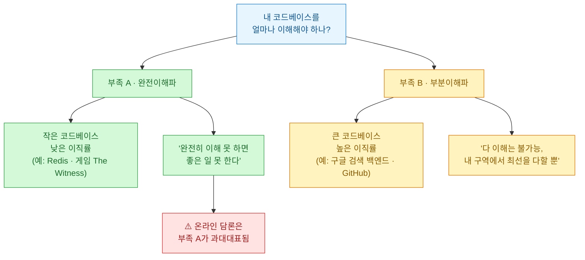
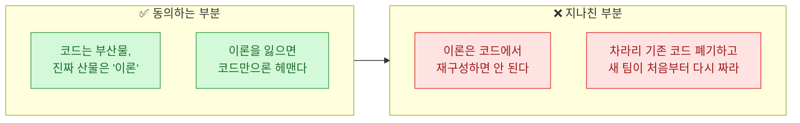
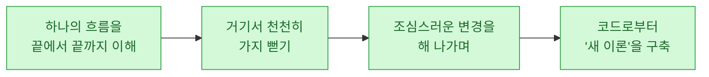
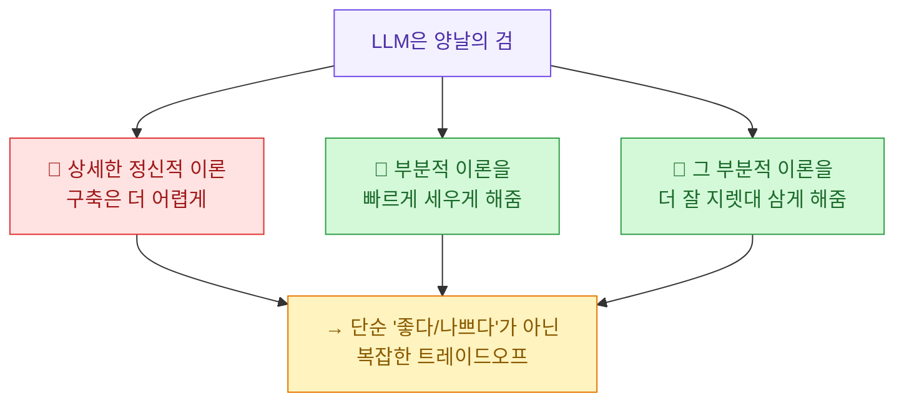
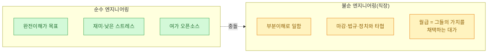
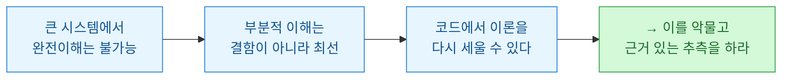

남이 짜 놓고 떠난 코드를 물려받아 본 적 있는가. 문서는 없고, 짠 사람은 퇴사했고, 그런데 그게 지금도 돌아가고 있다. 나는 데이터·자동화 일을 하면서 이런 코드를 여러 번 떠안았다. 그때마다 마음 한구석이 불편했다 — "나는 이 코드를 완전히 이해하지 못한 채 손대고 있다." 이게 프로답지 못한 걸까?

Sean Goedecke가 2026년 7월 11일 쓴 글 [In defense of not understanding your codebase](https://www.seangoedecke.com/in-defense-of-not-understanding-your-codebase/)는 정확히 이 불편함에 답한다. 결론부터 옮기면 이렇다 — **충분히 큰 시스템에서 부분적 이해는 결함이 아니라 최선이다.** 오늘은 이 글을 내 식으로 정리하고, 내 경험을 얹어 본다.

## 소프트웨어 엔지니어는 두 부족으로 갈린다

Goedecke는 먼저 판을 둘로 가른다.

두 부족은 방법·관행·문화가 다른 **별개의 프로그래밍 방식**이다. 그런데 문제는 온라인 소프트웨어 담론에서 **부족 A(완전이해파)가 과대대표**된다는 점이다.

왜 그럴까? Goedecke는 각주에서 짚는다 — 오픈소스 엔지니어가 자기 일을 블로그로 쓰는 데 더 적극적이고, 순수 엔지니어링 콘텐츠가 더 인상적으로 보이며(큰 사유 시스템은 '조율 문제'가 대부분이라 자랑거리가 덜 화려하다), 오픈소스는 합법적으로 글로 쓸 수 있지만 사유 시스템은 그러기 어렵다. 게다가 큰 코드베이스는 맥락이 너무 많아 글로 옮기는 것 자체가 사실상 불가능하다.

그래서 **"당연히 코드베이스를 완전히 이해해야지"라는 목소리가 인터넷에 더 크게 울린다.** Goedecke는 여기 맞서 부족 B를 변호한다.

## Naur의 '이론 구축'은 어디까지 맞고, 어디서 지나쳤나?

완전이해파의 가장 세련된 논거가 Peter Naur의 유명한 논문 [Programming as Theory Building](https://pages.cs.wisc.edu/\~remzi/Naur.pdf)(1985)이다. Goedecke도 이 논문을 좋아한다. 나도 좋아한다. 핵심 주장은 이렇다.

> 프로그래머가 프로그램을 만들 때, **코드는 사실 부산물**이고 진짜 만들고 있는 건 '프로그램에 대한 이론(theory of the program)'이다.

'이론'이란 무슨 일이 왜 일어나는지에 대한 직관적 감각이고, 코드나 문서로는 부분적으로만 담긴다. 그래서 Naur는 이렇게 말한다 — 코드를 잃어도 이론이 있으면 쉽게 다시 짤 수 있지만, **이론을 잃으면(팀이 100% 교체되면) 코드가 남아 있어도 헤맨다.**

여기까진 Goedecke도, 나도 동의한다. 문제는 Naur가 **한 발 더 나간** 지점이다.

Naur는 "문서만으로 이론을 재확립하는 건 엄밀히 불가능하므로, **기존 프로그램 텍스트는 폐기하고 새 팀에게 문제를 처음부터 다시 풀 기회를 줘야 한다**"고 말한다. Goedecke는 여기서 딱 잘라 말한다 — **큰 회사에서 유능하게 일해 본 사람은 이 대목이 명백히 틀렸음을 안다.**

## Naur가 틀린 첫 번째 이유 — 큰 시스템은 처음부터 다시 못 짠다

이유가 두 개다. 첫째는 실현 가능성이다.

**사용자가 있는 충분히 큰 시스템은 수천 개의 기묘한 예외와 quirk를 품고 있다.** 이걸 전부 다시 구현하는 건 그 시스템을 속속들이 아는 팀조차 불가능하다. 저글링할 게 너무 많다.

그래서 성공하는 재작성은 항상 같은 모양을 띤다.

Goedecke의 논리가 날카롭다. **"큰 시스템을 재작성한다"는 건 실은 "옛 시스템에 수많은 변경을 가한다"는 뜻이다.** 옛 시스템을 바꿀 수 없다면, 그걸 새것으로 갈아치우는 것도 당연히 불가능하다. Naur가 말한 "폐기하고 새로 짜라"는 애초에 성립하지 않는다.

## Naur가 틀린 두 번째 이유 — 죽은 코드는 되살아난다

둘째는 관찰된 사실이다. **버려진 시스템은 늘 되살아난다.**

수억 줄의 코드와 수천 명의 엔지니어가 있는 회사에서, 어떤 코드베이스에 그걸 아는 사람이 아무도 안 남는 일은 드물지 않다. 몇 명이 안 좋은 타이밍에 퇴사하거나, 코드베이스가 1년쯤 방치되면 그렇게 된다. Goedecke는 이렇게 쓴다 — 남의 팀이 하는 것도 봤고, **내가 직접 버려진 코드베이스를 떠안아 파악하고 효과적으로 다룰 수 있는 지점까지 끌어올린 적도 있다.**

방법은 정해져 있다.

시간은 걸리지만, **코드로부터 이론을 다시 세우는 건 가능하다.** 이게 Naur의 "코드에서 이론을 재구성하면 안 된다"를 정면으로 반박한다.

여기서 이 글의 진짜 핵심 문장이 나온다.

> 충분히 큰 코드베이스에서는 **모두가 틀린 이론을 가지고 일한다.** 현대 소프트웨어 시스템의 결정적 특징은, 누구도(심지어 팀 전체도) 머릿속에 담을 수 없을 만큼 크다는 것이다. 아무도 전부를 이해하지 못한다.

그래서 유능하려면 **부분적으로만 맞는 이론으로 일하는 법**을 익혀야 한다. 확신이 안 서는 부분이 있어도, 완벽하게 이해한 누군가가 와서 답을 줄 때까지 기다릴 수 없다. Goedecke의 표현이 좋다 — **"당신이 유능한 엔지니어라면, 그 사람은 바로 당신이다."** 이를 악물고 가장 근거 있는 추측을 하고, 그 결과를 감당하는 것. 그게 일이다.

> ⚠️ Naur를 너무 몰아세우진 말자. Goedecke도 단서를 단다 — 1985년의 '큰 프로그램'은 오늘의 몇 자릿수 아래였을 수 있다. Naur가 든 예가 **20만 줄짜리 산업 모니터링 프로그램**과 **컴파일러**였는데, 1987년 GCC 첫 버전이 약 10만 줄, 2015년 GCC는 1,400만 줄을 넘었다. 10\~20만 줄(게다가 기존 테스트를 재사용할 수 있다면)을 다시 짜는 건 비교적 수월하다. 100만, 200만 줄은 전혀 그렇지 않다. **즉 Naur가 틀렸다기보다, 그의 전제(프로그램 크기)가 시대와 함께 무너졌다**고 읽는 게 공정하다.

## 그럼 '이론 구축'은 버려야 할 가치인가?

아니다. 여기서 Goedecke는 균형을 잡는다. **이론 구축은 여러 가치 중 하나일 뿐, 절대선이 아니다.**

먼저 LLM 얘기. 사람들은 흔히 "LLM은 이론 구축을 방해하니까 나쁘다"고 단순하게 말한다. Goedecke는 이게 지나치게 단순하다고 본다.

LLM을 제쳐두더라도, "내 이론을 방해하는 건 뭐든 나쁘다"는 주장은 우습다. 이론 유지를 어렵게 만드는 것들의 목록을 보라 — **이건 사실상 정상적인 소프트웨어 개발 그 자체다.**

| 이론 유지를 방해하는 것 | 그런데 이걸 없앨 수 있나? |
|---|---|
| 남들이 내 코드베이스에 코드를 쓰는 것 | 협업 자체를 없앨 순 없다 |
| 접근성·개인정보보호 같은 법적 필수 기능 | 법을 어길 순 없다 |
| 동료가 퇴사하거나 팀을 옮기는 것 | 이직의 자유를 막을 순 없다 |
| 보안 패치를 위한 버전 업그레이드 | 안 하면 뚫린다 |
| 라이브러리·의존성을 들여오는 것 | 다 직접 짤 순 없다 |

결국 "코드베이스의 이론 유지"는 성능·법적 준수·속도처럼 **여러 값 중 하나**다. 어떤 땐 그게 가장 중요해서 다른 걸 희생하고, 어떤 땐 속도나 법규를 위해 그걸 내준다.

## '순수'와 '불순' 엔지니어링, 그리고 월급의 의미

Goedecke가 마지막에 던지는 통찰이 나는 제일 오래 남았다.

거의 모든 엔지니어, 특히 '순수' 엔지니어는 자기 소프트웨어의 정확한 정신적 모델을 유지하고 싶어 한다. 그게 **더 재밌고, 덜 스트레스받고, '진짜 엔지니어링'처럼 느껴지기** 때문이다. 많은 이가 여가에 오픈소스를 하는 이유도 그거다 — 작은 코드베이스를 혼자 붙들고 완전한 Naur 이론을 유지하는 그 쾌감. 잘못된 게 아니다.

**하지만 직장에서 당신은 일을 하라고 돈을 받는다.** 다르게 말하면, **그들의 엔지니어링 가치 집합을 채택하라고 돈을 주는 것**이다. 아무리 성능을 아껴도 마감을 위해 느린 코드를 써야 할 때가 있듯, 코드베이스의 이론을 유지하는 것도 똑같은 종류의 타협 대상이다.

Goedecke는 소프트웨어 업계에서 반복되는 많은 논쟁이 **"완전이해 문화 vs 부분이해 문화"의 충돌**에서 온다고 본다. 온라인에서 "코드베이스도 제대로 이해 못 하고 짜냐"는 훈수가 유독 매서운 이유가 여기 있다 — 그 훈수는 대개 작은 코드베이스에서 완전이해를 누리는 부족의 목소리다.

## 나는 어디에 서 있나

솔직히 나는 오래 부족 A에 죄책감을 느껴 왔다. 남의 자동화 스크립트, 인수인계 없이 떠안은 리포트 파이프라인, 짠 사람이 사라진 SQL 뭉치 — 그걸 **완전히 이해하지 못한 채 고쳐 쓰는 나 자신이 어설프게 느껴졌다.**

이 글은 그 죄책감의 상당 부분이 **잘못된 기준에서 왔음**을 짚어 줬다. 내가 다루는 대부분의 실무 코드베이스는 애초에 한 사람이 머릿속에 다 담을 수 있는 물건이 아니다. 그렇다면 "완전이해 후 착수"는 도달 불가능한 목표를 세워 놓고 스스로를 자책하는 일에 가깝다.

내가 이 글에서 챙긴 실무 원칙 셋.

- **하나의 흐름을 끝에서 끝까지** 먼저 뚫어라. 전체를 훑기 전에 한 줄기를 완주하는 게 이론의 씨앗이다.
- **부분적 이론으로 확신 있게 움직여라.** 완벽한 이해자가 올 때까지 기다리면 아무것도 못 한다. 근거 있는 추측 + 조심스러운 변경 + 결과 감당.
- **이론 유지를 절대선으로 두지 마라.** 마감·법규·협업·보안은 이론을 흔들지만, 그것들도 다 지켜야 할 값이다. 저울질이 일이지, 한쪽만 붙드는 게 프로가 아니다.

그리고 LLM. 나는 이 도구가 **부분적 이론을 빠르게 세워 주는 쪽**의 힘을 크게 느낀다. 낯선 코드에 던져 넣고 "이 흐름 끝에서 끝까지 설명해"라고 시키면, 예전 같으면 반나절 걸릴 '첫 줄기 완주'가 30분으로 준다. 물론 그 대가로 상세한 정신적 모델은 덜 남는다. Goedecke 말대로 양날의 검이다 — **다만 큰 코드베이스에서 애초에 완전한 이론이 불가능하다면, "빠른 부분이론"이라는 칼날이 훨씬 값지다.**

## 한 문장으로

Naur는 "이론을 잃으면 코드를 버려라"고 했지만, 현실의 큰 시스템에서는 그럴 수도 없고 그럴 필요도 없다. **코드는 이론을 다시 길러 내는 토양**이고, 부분적으로만 맞는 지도를 들고도 우리는 목적지에 닿는다. 다 이해하지 못한 채 손대는 당신 — 어설픈 게 아니라, 큰 시스템에서 원래 그렇게 일하는 것이다.

---

*원문: Sean Goedecke, [In defense of not understanding your codebase](https://www.seangoedecke.com/in-defense-of-not-understanding-your-codebase/) (2026-07-11). 인용·요지는 원문에 귀속하며, 해석과 실무 적용은 내 관점이다. 참고: Peter Naur, Programming as Theory Building (1985).*
