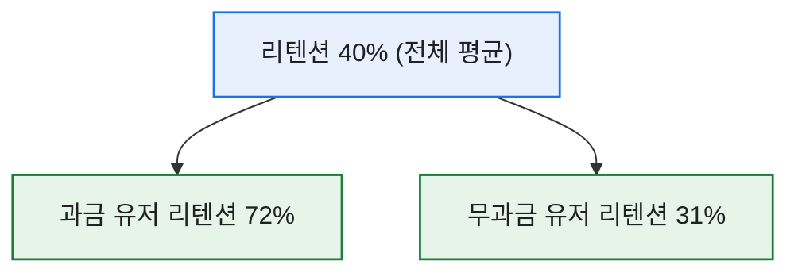
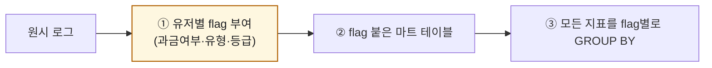

# 과금/무과금 flag 한 컬럼이 분석을 바꾼다

> 데이터 분석에서 가장 값싼데 가장 효과가 큰 작업이 뭐냐고 물으면, 나는 주저 없이 **'플래그 컬럼 하나 잘 심기'** 라고 답한다. 과금/무과금 같은 분류 플래그를 쿼리 초반에 붙여두면, 그 뒤의 모든 지표가 갑자기 두 배로 말을 하기 시작한다. 컬럼 하나가 분석의 해상도를 바꾸는 경험을, 나는 이 flag에서 처음 했다.

## 플래그가 왜 그렇게 강력한가?

평균 하나로 보던 지표가, 플래그를 기준으로 갈리는 순간 '누구의 이야기인지'가 드러난다.



전체 40%라는 숫자는 사실 아무에게도 해당하지 않는 유령 값이었다. 과금 유저는 72%로 끈끈하고, 무과금은 31%로 흘러나간다 — 이 둘을 알면 '무과금을 어떻게 첫 결제로 넘길까'라는 진짜 질문이 생긴다.

## 플래그는 어느 단계에서 심나?

핵심은 **가능한 한 앞쪽(쿼리 초반)에서** 플래그를 만들어 두는 것이다. 그래야 뒤의 모든 집계가 그 플래그를 그대로 쓸 수 있다.



## SQL로는 어떻게 심나?

결제 이력 유무로 플래그를 만드는 건 `CASE` 한 줄이면 된다. (합성 스키마)

```sql
-- 유저 차원 테이블에 과금 플래그를 미리 심어둔다
SELECT
    u.user_id,
    CASE WHEN p.user_id IS NOT NULL THEN 1 ELSE 0 END AS is_paying,   -- 과금 flag
    u.join_type
FROM users AS u
LEFT JOIN (
    SELECT DISTINCT user_id FROM purchase_log
) AS p ON p.user_id = u.user_id;
```

이렇게 `is_paying` 을 한 번 심어 마트 테이블에 저장해두면, 이후 리텐션·접속시간·콘텐츠 이용률 무엇을 집계하든 `GROUP BY is_paying` 한 줄만 붙이면 세그먼트 분석이 된다. 플래그를 매번 새로 계산하지 않는 게 재사용의 핵심이다.

## 플래그는 하나로 끝내지 않는다

과금/무과금은 시작일 뿐이다. 나는 보통 몇 개의 축을 함께 심었다.

| 플래그 | 값 예시 | 쓰임 |
|---|---|---|
| `is_paying` | 0 / 1 | 과금 저변·전환 분석 |
| `join_type` | 신규/복귀/기존 | 코호트 분석 |
| `pay_tier` | 소액/중액/고액 | 과금 구간별 이탈·쏠림 |

## 오늘의 기록

돌아보면 내 분석이 한 단계 깊어진 지점은 늘 '새 플래그를 심었을 때'였다. 화려한 모델이 아니라, `CASE WHEN` 한 줄이 분석의 눈을 밝혀줬다. 데이터는 잘게 나눌수록 말을 한다 — 단, 나누는 기준을 미리 손에 쥐고 있어야 한다. 그 기준을 컬럼으로 박아두는 습관이, 내 쿼리를 리포트에서 의사결정 도구로 바꿔줬다.

*합성 스키마·수치 기준입니다. 실제 게임·회사의 테이블 구조나 데이터와 무관합니다.*
