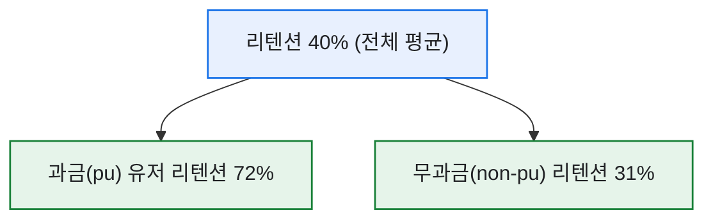
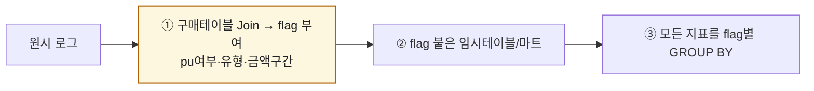
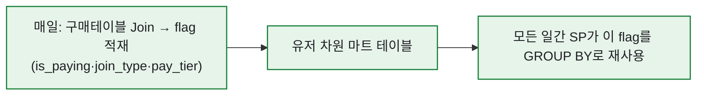

# 과금/무과금 flag 한 컬럼이 분석을 바꾼다

> 데이터 분석에서 가장 값싼데 가장 효과가 큰 작업이 뭐냐고 물으면, 나는 주저 없이 **'플래그 컬럼 하나 잘 심기'** 라고 답한다. 콘텐츠 분석을 하든 매출 분석을 하든, 결국 마지막엔 **구매 테이블을 Join해 pu / non-pu flag**를 붙이는 순간 그림이 완성됐다. 그 flag 하나가 모든 지표를 두 배로 말하게 만들었다. (수치·구조는 일반화한 합성 기준이다.)

## 플래그가 왜 그렇게 강력한가?

평균 하나로 보던 지표가, 플래그 기준으로 갈리는 순간 '누구의 이야기인지'가 드러난다.



전체 40%라는 숫자는 사실 아무에게도 해당하지 않는 유령 값이었다. 과금 유저는 72%로 끈끈하고 무과금은 31%로 흘러나간다 — 이 둘을 알면 '무과금을 어떻게 첫 결제로 넘길까'라는 진짜 질문이 생긴다. 콘텐츠 획일화 분석에서 "무과금 비중이 올라갔다"를 잡아낸 것도, 이 flag가 있었기에 가능했다.

## 플래그는 어느 단계에서 심나?

핵심은 **가능한 한 앞쪽(추출 초반)에서** 플래그를 만들어 두는 것이다. 그래야 뒤의 모든 집계가 그대로 쓴다.



나는 반복 추출을 **임시테이블(#)** 에 flag까지 심어 적재해두고, 그 뒤 리텐션·이용률·재구매율을 전부 `GROUP BY flag`로 뽑았다. 플래그를 매번 새로 계산하지 않는 게 재사용의 핵심이다.

## SQL로는 어떻게 심나?

결제 이력 유무로 flag를 만드는 건 `CASE` 한 줄이면 된다.

```sql
-- 유저 차원에 pu/non-pu flag를 미리 심어둔다
SELECT
    u.user_id,
    CASE WHEN p.user_id IS NOT NULL THEN 1 ELSE 0 END AS is_paying,   -- pu flag
    u.join_type,                                                       -- 신규/복귀/기존
    p.pay_tier                                                         -- 금액 구간
FROM users AS u
LEFT JOIN (
    SELECT user_id, MAX(pay_tier) AS pay_tier
    FROM purchase_log GROUP BY user_id
) AS p ON p.user_id = u.user_id;
```

`is_paying`을 한 번 심어 마트에 저장해두면, 이후 무엇을 집계하든 `GROUP BY is_paying` 한 줄로 세그먼트 분석이 된다.

## 플래그는 하나로 끝내지 않는다

pu/non-pu는 시작일 뿐이다. 나는 보통 몇 개 축을 함께 심었다.

| 플래그 | 값 예시 | 쓰임 |
|---|---|---|
| `is_paying` | 0 / 1 | 과금 저변·전환 분석 |
| `join_type` | 신규/복귀/기존 | 코호트·매출 시뮬레이션 |
| `pay_tier` | 소액/중액/고액 | 과금 구간별 이탈·쏠림 |

이 세 축을 교차하면 "신규이면서 무과금인 층의 리텐션", "기존·고액 과금층의 재구매율" 같은 질문이 전부 쿼리 한 줄로 풀렸다.

## 이 flag를 어떻게 자동화하고 재사용했나?

플래그의 진짜 힘은 '한 번 심어 두고 계속 쓴다'에 있었다. 나는 flag를 매번 계산하지 않고, **일간 마트 테이블에 심어 적재**해뒀다.



이렇게 해두면, 리텐션 SP도·이용률 SP도·재구매율 SP도 전부 같은 flag를 끌어다 세그먼트별로 뽑는다. 플래그를 마트에 한 번 박아두는 것과, 매 분석마다 다시 계산하는 것은 운영 비용에서 하늘과 땅 차이였다.

그리고 유의미한 세그먼트 지표라고 판단되면, 이걸 **BI팀과 협업해 대시보드로 배포**했다. 내가 손으로 `GROUP BY is_paying`을 돌리던 게, 팀 누구나 보는 상시 지표로 승격되는 것이다. 결국 '플래그 하나 잘 심기'는 단발 분석이 아니라 **재사용 가능한 자산을 만드는 일**이었다.

## 오늘의 기록

돌아보면 내 분석이 한 단계 깊어진 지점은 늘 '새 플래그를 심었을 때'였다. 화려한 모델이 아니라 `CASE WHEN` 한 줄, 구매테이블 Join 한 번이 분석의 눈을 밝혀줬다. 데이터는 잘게 나눌수록 말을 한다 — 단, 나누는 기준을 미리 손에 쥐고 컬럼으로 박아둬야 한다. 그 습관이 내 쿼리를 리포트에서 의사결정 도구로 바꿨다.

*실제 세그먼트 분석 경험을 바탕으로 하되, 스키마·수치는 일반화한 합성 기준입니다.*
