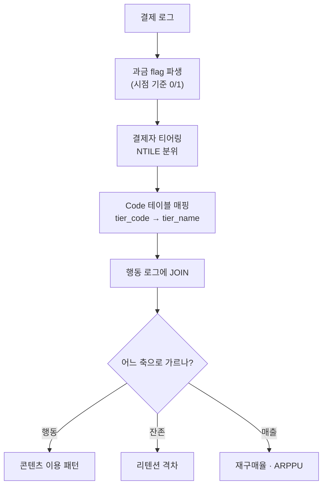
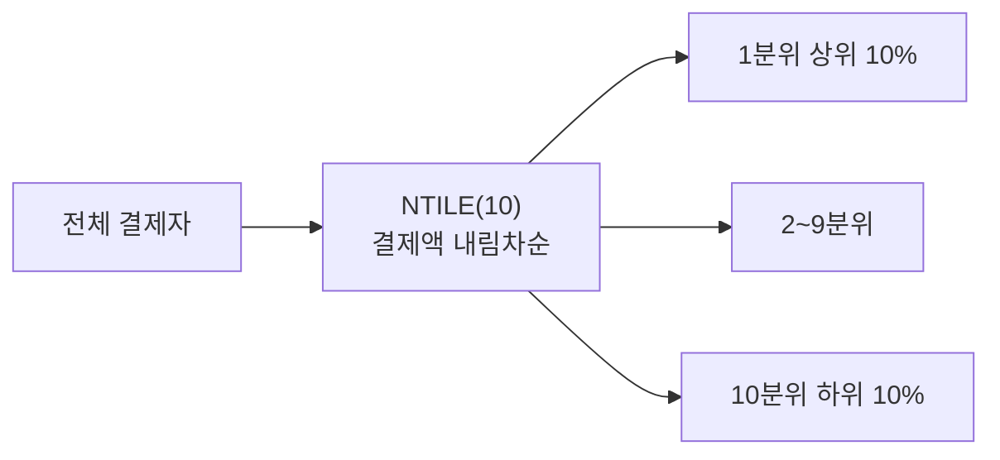
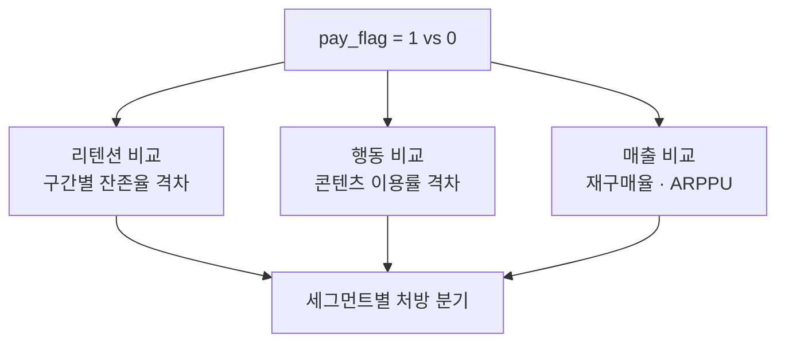

지난 글(픽률 분석)에서 "과금/무과금 플래그 하나가 다음 분석의 열쇠가 된다"고 썼다. 처음부터 잘 설계했던 건 아니다. 초반엔 결제 로그가 있으면 1, 없으면 0 — 딱 그 정도로만 썼다. 그러다 "어제는 무과금이었는데 오늘 플래그가 왜 1이냐"는 질문에 말문이 막히면서, 플래그도 설계가 필요하다는 걸 깨달았다.

이 글은 그 시행착오를 정리한 것이다. 결제 여부라는 단순한 축을 어떻게 다듬어야 행동·잔존·매출 분석에 깊이를 더할 수 있는지, 방법론만 — 실제 스키마·금액은 빼고 — 담았다.



## 과금/무과금 플래그, 그냥 0/1이면 충분한가?

처음엔 충분하다고 생각했다. 결제 테이블에 `user_id`가 한 번이라도 찍혔으면 과금, 아니면 무과금 — 이렇게 유저 테이블에 플래그를 **저장**해뒀다. 문제는 여기서 시작됐다. 과금 여부는 유저 속성이 아니라 **시간에 따라 바뀌는 상태**다. 저장된 플래그는 언제 갱신되나? 배치가 하루 늦으면 어제 분석에 오늘 결제한 유저가 섞인다.

그래서 플래그를 테이블에 **저장하지 않고**, 분석 시점(`@as_of_date`)마다 그 시점까지의 결제 이력으로 **매번 파생**시키는 쪽으로 방향을 바꿨다.

```sql
-- 개념 예시(합성). 실제 스키마 아님.
-- 분석 기준일까지의 결제 이력으로 과금 flag를 매번 파생
WITH pay_flag AS (
    SELECT
        u.user_id,
        CASE WHEN EXISTS (
            SELECT 1 FROM purchase_log p
            WHERE p.user_id = u.user_id
              AND p.pay_date <= @as_of_date
        ) THEN 1 ELSE 0 END AS is_payer
    FROM users u
)
SELECT is_payer, COUNT(*) AS user_cnt
FROM pay_flag
GROUP BY is_payer;
```

저장된 컬럼이 아니라 **매번 계산되는 조건절**로 다루니, "어느 시점 기준 과금자냐"는 질문에 항상 명확히 답할 수 있게 됐다. 이 기준이 흔들리면 뒤에 나오는 모든 세그먼트 분석이 같이 흔들린다.

## 결제자 안에서도 다 같은 결제자인가?

과금/무과금 이분법은 출발점일 뿐이다. 실무에서는 과금구간별 PU 분포 — 결제액 기준 10단위·4분위로 결제자를 다시 쪼개는 작업을 자주 돌렸다. 상위 10%와 하위 90%는 게임을 대하는 태도 자체가 다르기 때문이다.



```sql
-- 개념 예시(합성). 결제액 기준 10분위 티어링
SELECT
    a.user_id,
    a.total_amt,
    NTILE(10) OVER (ORDER BY a.total_amt DESC) AS pay_tier
FROM (
    SELECT user_id, SUM(amount) AS total_amt
    FROM purchase_log
    WHERE pay_date <= @as_of_date
    GROUP BY user_id
) a;
```

이렇게 분위별 min/max/avg 결제액을 뽑아보면, "과금 유저" 한마디로 뭉뚱그렸던 집단이 사실 전혀 다른 세그먼트였다는 게 드러난다. 상위 분위와 하위 분위에 서로 다른 BM 대응이 필요한 이유다.

## 플래그를 매직넘버 대신 Code 테이블로 관리해야 하는 이유는?

`pay_tier`가 1이면 최상위, 10이면 최하위 — 이걸 쿼리마다 숫자로 박아 넣으면, 반년 뒤 "3이 뭐였더라"부터 헤매게 된다. 여러 SP(Stored Procedure)와 리포트가 같은 기준을 공유한다면 더 위험하다. 그래서 티어 숫자를 **Code(Enum) 테이블**로 분리해 관리했다.

```sql
-- 개념 예시(합성). 매직넘버 대신 Code 테이블
CREATE TABLE payment_tier_code (
    tier_code   TINYINT      PRIMARY KEY,   -- NTILE 결과값
    tier_name   VARCHAR(20)  NOT NULL,      -- 'top10' / 'mid' / 'bottom10' ...
    description VARCHAR(100)
);

SELECT t.tier_name, COUNT(DISTINCT s.user_id) AS payer_cnt
FROM   segment s
JOIN   payment_tier_code t ON t.tier_code = s.pay_tier
GROUP  BY t.tier_name;
```

라벨을 코드로 빼두면 티어 기준이 바뀌어도 **Code 테이블 한 줄만 손보면** 모든 쿼리·SP가 따라간다. 매직넘버를 흩뿌리는 것과 한곳에서 정의를 관리하는 것 — 이 차이가 나중에 재작업 범위를 크게 가른다.

## 이 플래그 하나를 다른 분석에 join하면 뭐가 달라지나?

`is_payer`·`pay_tier`는 그 자체로 끝이 아니다. **다른 분석 테이블에 join하는 키**로 쓸 때 값어치가 나온다.



지난 픽률 글의 신규 영웅 픽률 상승에 이 flag를 얹으면 "픽은 하는데 무과금 비중이 높은 콘텐츠"와 "과금 비중이 높은 콘텐츠"가 갈린다. 같은 이용률 숫자라도 유저층이 다르면 BM 우선순위가 달라진다. 신규/복귀/기존 유형 축(직전 글)에 과금 flag를 더하면, "무과금 신규는 잘 남는데 과금 신규는 이탈이 빠르다" 같은, 유형 축 하나만으로는 안 보이던 조합도 드러난다.

## 정리 — flag는 설계 대상이지 부산물이 아니다

- 과금/무과금 flag는 **저장값**이 아니라 **시점 기준 파생값**으로 다뤄야 정확하다.
- 결제자 내부도 **NTILE 티어링**으로 한 번 더 쪼개면 세그먼트가 촘촘해진다.
- 티어 숫자는 **Code(Enum) 테이블**로 분리해야 유지보수·재사용이 된다.
- 완성된 flag는 행동·잔존·매출 등 **다른 모든 분석에 join하는 공통 키**로 써야 진짜 값어치가 나온다.

플래그 하나 잘 설계해두면, 그 뒤로 만드는 모든 분석이 "그 유저층 안에서는 어떤데?"라는 한 겹 더 깊은 질문에 답할 수 있다. 다음 글에서는 이 flag를 코호트에 얹어 과금 이탈을 조기에 잡아내는 방법을 정리한다.

- 방법론·합성 스키마 레시피: [github.com/DBhyeong/game-data-recipes](https://github.com/DBhyeong/game-data-recipes)
