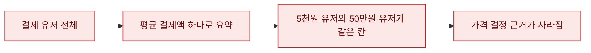
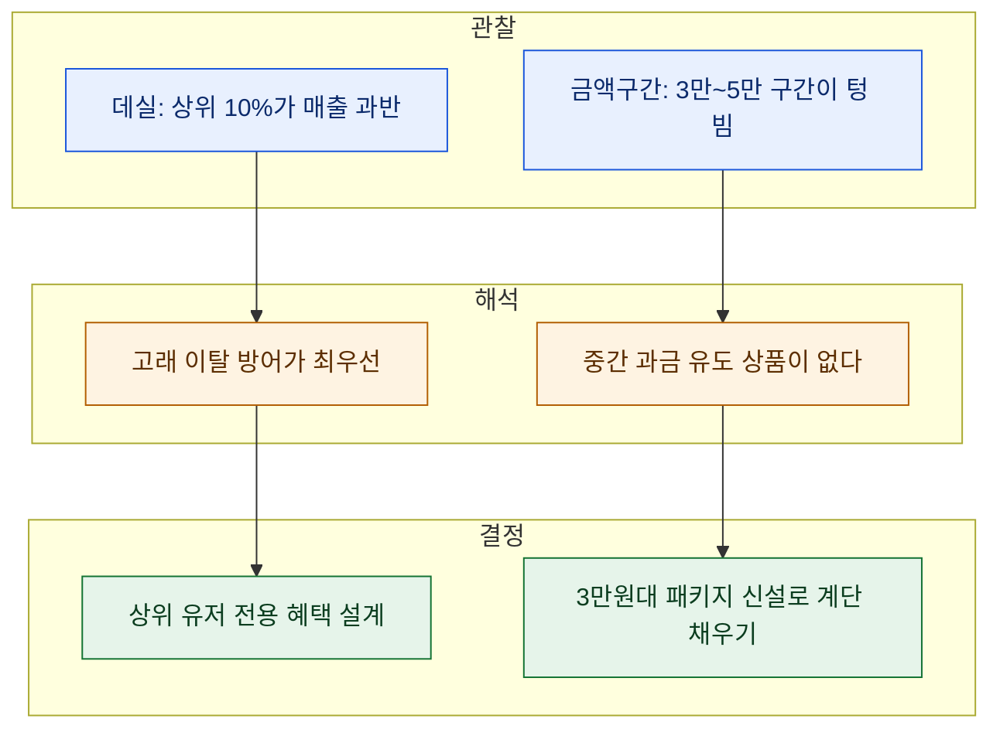

# 과금 구간별 분포로 'BM 밸런싱' 근거 만들기

> BM 회의에서 제일 많이 나온 말이 "이 가격이면 부담스럽지 않을까요?"였다. 근데 부담스러운지 아닌지를 **아무도 숫자로 말하지 못했다.** 결제 유저가 실제로 얼마씩 쓰는지 분포를 안 보고 상품 가격을 정하고 있었던 거다. 그래서 과금 분포를 두 각도로 갈라 봤다. (아래 데이터·테이블명은 전부 합성이다. 실무 방법만 옮겼다.)

## BM 밸런싱은 왜 늘 감으로 흘렀나?

문제는 하나였다. **"결제 유저"를 한 덩어리로 봤다는 것.** 평균 결제액(ARPPU) 하나로 뭉뚱그리면, 월 5천 원 쓰는 사람과 50만 원 쓰는 사람이 같은 칸에 들어간다. 그 평균으로 상품 가격을 정하니 아무도 만족 못 하는 가격이 나왔다.



해법은 **분포를 보는 것**이다. 두 가지 방법을 겹쳐 썼다. 하나는 상대(데실), 하나는 절대(금액 구간).

## 방법 1 — 결제 유저를 금액순 10등분한다 (데실)

먼저 유저별 월 결제액을 합치고, 많이 쓴 순서로 **10등분(decile)** 한다. SQL의 `NTILE(10)`이 이 일을 한 줄로 해준다.

```sql
-- 합성 예시: 유저별 월 결제액을 구해 상위→하위 10등분
SELECT
    ntile,
    COUNT(DISTINCT user_id)      AS pu,          -- 구간별 결제자 수
    MIN(spend)                   AS min_spend,
    MAX(spend)                   AS max_spend,
    SUM(spend)                   AS total_spend  -- 구간별 매출
FROM (
    SELECT
        user_id,
        SUM(price) AS spend,
        NTILE(10) OVER (ORDER BY SUM(price) DESC) AS ntile
    FROM   billing            -- (합성 테이블명)
    WHERE  pay_date BETWEEN '2024-09-01' AND '2024-09-30'
    GROUP  BY user_id
) t
GROUP BY ntile
ORDER BY ntile;
```

여기에 구간별 **중앙값**을 같이 뽑으면 그림이 선명해진다. `PERCENTILE_DISC(0.5)`로 각 데실의 중앙 결제액을 본다. 평균은 상위 이상치에 끌려가지만, 중앙값은 "그 구간의 보통 사람"을 보여준다.

결과를 합성 숫자로 그리면 대개 이렇게 나온다.

| 데실 | 결제자 비중 | 이 구간이 만든 매출 비중 |
|---|---|---|
| 1 (최상위 10%) | 10% | 약 55~65% |
| 2~3 | 20% | 약 20~25% |
| 4~10 (하위 70%) | 70% | 약 15% 안팎 |

**상위 10%가 매출의 절반을 넘긴다** — 게임 과금의 전형적인 파레토다. 이 한 장이 "고래 유저 이탈이 왜 치명적인가"를 설명한다.

## 방법 2 — 절대 금액 구간으로 다시 센다

데실은 비율이라 "구체적으로 얼마짜리 상품이 비었나"는 안 보인다. 그래서 **절대 금액 버킷**으로 한 번 더 센다. `CASE WHEN`으로 금액대를 잘라 각 구간의 결제자 수를 세는 방식이다.

```sql
SELECT
    COUNT(DISTINCT user_id)                                                          AS total_pu,
    COUNT(DISTINCT CASE WHEN spend >= 1     AND spend < 5500   THEN user_id END)      AS "~5천원",
    COUNT(DISTINCT CASE WHEN spend >= 5500  AND spend < 11000  THEN user_id END)      AS "5천~1만",
    COUNT(DISTINCT CASE WHEN spend >= 11000 AND spend < 33000  THEN user_id END)      AS "1만~3만",
    COUNT(DISTINCT CASE WHEN spend >= 33000 AND spend < 55000  THEN user_id END)      AS "3만~5만",
    COUNT(DISTINCT CASE WHEN spend >= 55000 AND spend < 110000 THEN user_id END)      AS "5만~10만",
    COUNT(DISTINCT CASE WHEN spend >= 110000                    THEN user_id END)     AS "10만이상"
FROM (
    SELECT user_id, SUM(price) AS spend
    FROM   billing
    WHERE  pay_date BETWEEN '2024-09-01' AND '2024-09-30'
    GROUP  BY user_id
) t;
```

포인트는 **버킷 경계를 상품 가격에 맞추는 것**. 5,500원, 11,000원, 33,000원… 실제 판매 중인 패키지 가격 언저리로 자르면, "이 가격대 위로 넘어가는 유저가 급감하는 지점"이 바로 보인다.

## 그래서 이게 왜 BM 밸런싱 근거가 되나?

두 그림을 겹치면 결정이 데이터로 바뀐다.



"3만원대 상품 하나 넣자"는 말이, 이제 **"3만~5만 구간에 결제자가 거의 없으니 계단을 하나 놓자"**가 된다. 회의가 취향 싸움에서 근거 싸움으로 바뀐다. 그게 이 분포 두 장의 값어치다.

## 정리 — 분포는 '누가 얼마 쓰나'를 계단으로 보여준다

| 도구 | 보는 것 | BM에 주는 근거 |
|---|---|---|
| `NTILE(10)` 데실 | 상대적 매출 집중도 | 어느 층을 지켜야 하나 |
| `CASE WHEN` 금액 버킷 | 절대 가격대별 인원 | 어느 가격대가 비었나 |
| `PERCENTILE_DISC` 중앙값 | 구간의 '보통 사람' | 평균 왜곡 걷어내기 |

> 평균 하나로는 아무것도 못 정한다. 결제 유저를 **계단으로 펼쳐 놓는 순간**, 다음에 무엇을 팔지가 스스로 드러난다.

*합성 데이터로 재현한 방법론 글입니다. 특정 게임의 실제 수치·구조와 무관합니다.*
