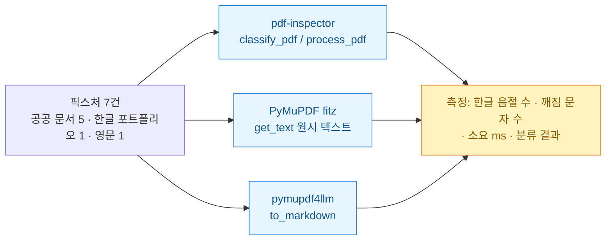
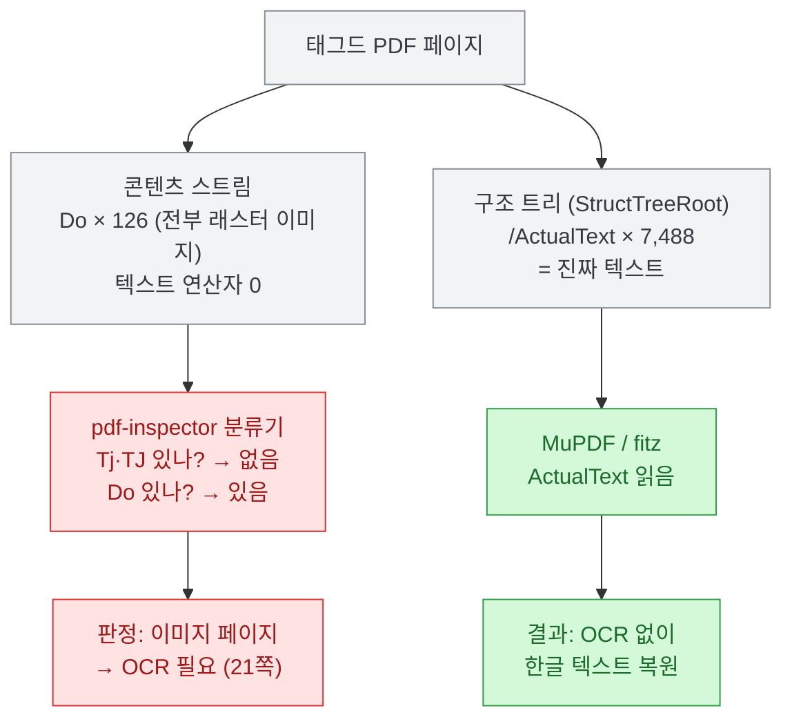
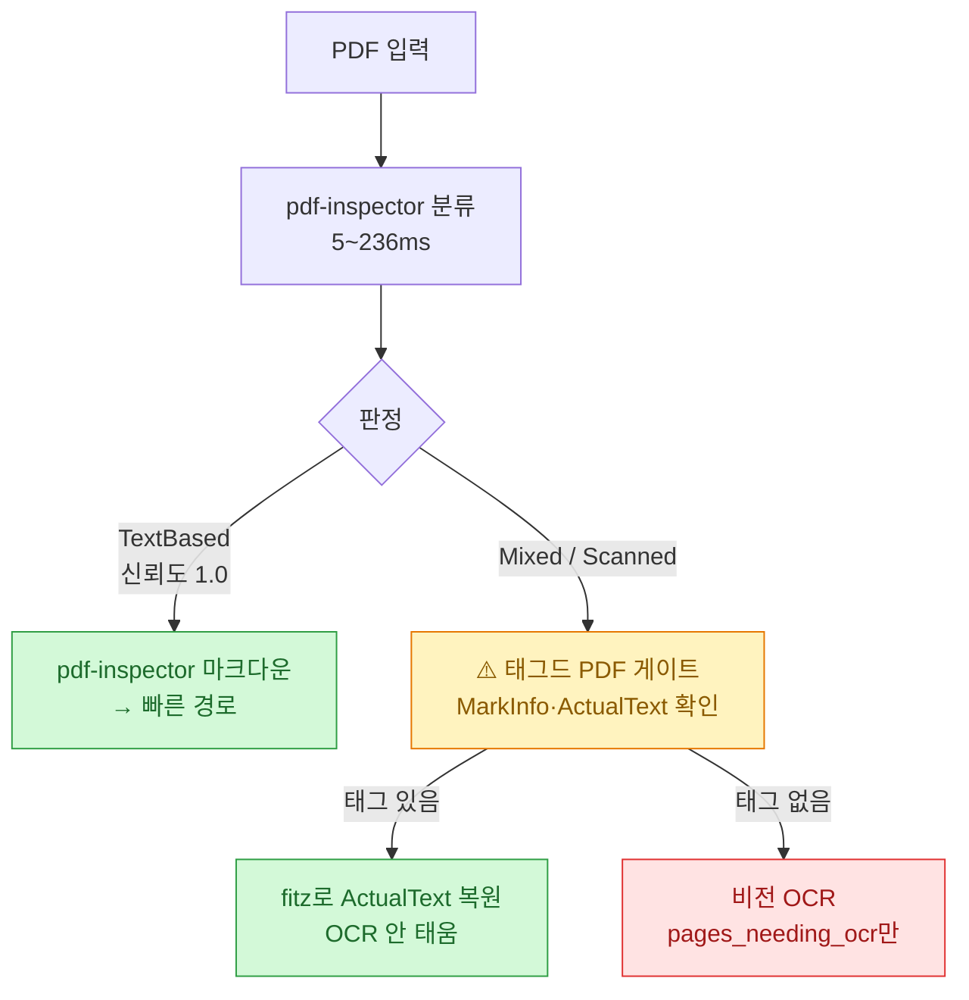

[[pdf-inspector-ocr-routing-rust|지난 글]]을 이렇게 끝냈다.

> ⚠️ 단 검증 없이 붙이진 않겠다. **벤치마크 말뭉치가 한국어 문서를 얼마나 담고 있는지 모른다.** (…) **한글 PDF·HWP 변환본에서 직접 재 봐야 안다.**

그래서 쟀다. 결론부터 말하면 **대체로 합격인데 한 군데서 확실히 무너졌다.** 그리고 재는 과정에서 **내가 만든 지표가 나를 속일 뻔한 일**이 있어서 그것도 같이 적는다.

## 어떻게 쟀나?



**픽스처**는 공개 문서만 골랐다. 공공기관 보도자료 3건(4\~12페이지), 공공기관 해설서 1건(**539페이지**, 7.1MB), 공공기관 별첨 1건(12페이지), 그리고 내 포트폴리오 PDF 1건(28페이지)과 영문 책 1건(108페이지)을 베이스라인으로 넣었다.

**비교 대상 선정이 중요했다.** 처음엔 `fitz.get_text()`와 붙였는데, 이건 **불공정한 비교**다. fitz는 원시 텍스트만 뽑고 pdf-inspector는 제목·표·목록까지 잡아 마크다운으로 만든다. 벤치마크 표에 있던 상대는 **pymupdf4llm**(fitz 위에 마크다운 변환을 얹은 것)이니 그걸 깔아서 다시 쟀다.

측정 지표는 **한글 음절 수**(U+AC00\~U+D7A3)와 **깨짐 문자 수**(U+FFFD 치환문자, 사적사용영역)로 잡았다. 이유는 뒤에서 설명한다.

## 설치부터 사실이 하나 갈렸다

지난 글에서 나는 **버전을 0.1.6**이라고 적었다. `Cargo.toml`에 그렇게 쓰여 있었으니까. 그런데 실제로 깔아 보니 다르다.

```
pip install pdf-inspector
→ pdf_inspector-0.2.5-cp38-abi3-win_amd64.whl
```

| 채널 | 버전 |
|---|---|
| **PyPI** | **0.2.5** (릴리스 8개, `requires-python >=3.8`) |
| crates.io | **0.1.6** (다운로드 13,173) |
| GitHub `Cargo.toml` | **0.1.6** |

⚠️ **파이썬 바인딩(0.2.5)이 Rust 크레이트(0.1.6)보다 앞서 있다.** 지난 글의 "0.1.6"은 크레이트 기준으로는 맞지만, `pip`로 쓰는 사람이 받는 건 0.2.5다. 정정해 둔다.

✅ 반면 지난 글에서 "소개 글은 maturin으로 빌드하라지만 **PyPI에 있으니 `pip install`이 먼저**"라고 했던 건 맞았다. Rust 툴체인 없이 그냥 깔린다.

그리고 설치하고 나서 보니 **API가 README보다 넓다.**

```python
['classify_pdf', 'classify_pdf_bytes', 'detect_pdf', 'detect_pdf_bytes',
 'extract_pages_markdown', 'extract_text', 'extract_text_in_regions',
 'extract_text_with_positions', 'process_pdf', ...]
```

`extract_text_in_regions`(좌표 영역만 뽑기), `PageOcrReasons` 같은 건 README에 없다. 문서보다 물건이 크다.

## 결과 하나: 한글은 안 깨진다

가장 궁금했던 것부터. **CID 폰트 ToUnicode CMap 지원이 한국어에서 실제로 작동하나?**

한다. 그것도 아주 잘.

| 문서 | 페이지 | pdf-inspector 음절 | pymupdf4llm 음절 | **회수율** | pdfi 깨짐 |
|---|---|---|---|---|---|
| 공공 별첨 | 12 | 6,615 | 6,297 | **1.05** | 0 |
| **공공 해설서** | **539** | **238,487** | 238,382 | **1.00** | **0** |
| 공공 보도자료 A | 12 | 2,775 | 2,735 | **1.01** | 0 |
| 공공 보도자료 B | 4 | 2,030 | 2,030 | **1.00** | 0 |
| 공공 보도자료 C | 12 | 2,791 | 2,686 | **1.04** | 0 |

**539페이지짜리 정부 해설서에서 238,487 대 238,382.** 0.04% 차이다. 보도자료 B는 2,030 대 2,030으로 **정확히 같다.** 그리고 **깨짐 문자가 전부 0이다.**

회수율이 1.00을 넘는 건 pdf-inspector가 더 많이 뽑아서가 아니라, 표를 마크다운 표로 재구성하면서 셀 텍스트가 정리돼 들어간 영향으로 보인다. 어느 쪽이든 **한글 손실은 없다.**

내가 걱정했던 시나리오 — 한글이 `?????`나 `□□□`로 나오는 것 — 는 **텍스트 기반 한글 PDF에서는 일어나지 않았다.** 이건 명확한 합격이다.

## 결과 둘: 속도는 벤더 주장보다 오히려 크다

여기서 좀 놀랐다.

| 문서 | 페이지 | pdf-inspector | pymupdf4llm | **배수** |
|---|---|---|---|---|
| 공공 보도자료 B | 4 | **51ms** | 1,663ms | **33배** |
| 공공 별첨 | 12 | **100ms** | 3,070ms | **31배** |
| 공공 보도자료 A | 12 | **436ms** | 11,219ms | **26배** |
| **공공 해설서** | **539** | **1,507ms** | **66,383ms** | **44배** |
| 영문 책 | 108 | **125ms** | 14,748ms | **118배** |

**539페이지 문서를 1.5초에 마크다운으로 만든다.** 같은 문서에 pymupdf4llm은 66초를 쓴다.

벤더 벤치마크는 200개 문서에 4초 대 18초, 즉 **4.5배**라고 했다. 내 손에서는 **26\~118배**가 나왔다. 벤더가 자기 도구를 재면 대개 부풀리기 마련인데, **여기선 반대로 보수적으로 적은 셈**이다.

⚠️ **다만 이 숫자를 그대로 믿으면 안 된다.** 내가 깐 pymupdf4llm은 **1.28.0**인데, 설치할 때 `pymupdf_layout`과 `onnxruntime`을 같이 끌고 왔다. 레이아웃 분석이 붙으면서 무거워졌을 가능성이 크다. **벤더가 벤치마크를 돌린 시점의 pymupdf4llm과 내 것이 같은 물건이 아닐 수 있다.** 그러니 "26\~118배"는 내 환경의 숫자이지 보편 상수가 아니다.

**그리고 반대 방향의 사실도 있다.** 처음에 `fitz.get_text()`(원시 텍스트)와 붙였을 때는 **fitz가 2\~3배 빨랐다.**

| 문서 | pdf-inspector(마크다운) | fitz(원시 텍스트) |
|---|---|---|
| 공공 해설서 539p | 1,325ms | **655ms** |
| 공공 보도자료 A | 492ms | **165ms** |

즉 **원시 텍스트만 필요하면 fitz가 낫다.** pdf-inspector가 압도하는 건 **마크다운 구조화가 필요할 때**다. 시간을 잡아먹는 건 파싱이 아니라 마크다운 레이어이고, pymupdf4llm은 거기서 무너지는데 pdf-inspector는 안 무너진다. 이게 이 도구의 진짜 자리다.

## 결과 셋: 한 군데서 확실히 무너졌다

내 포트폴리오 PDF 하나가 완전히 다른 결과를 냈다.

| 항목 | pdf-inspector | pymupdf4llm |
|---|---|---|
| 한글 음절 | **500** | 729 |
| 회수율 | **0.69** | — |
| **깨짐 문자** | **448** | **0** |
| 분류 | **mixed** (신뢰도 0.7) | — |
| **OCR 필요 페이지** | **28쪽 중 21쪽** | — |

추출된 텍스트를 보면 상태가 이렇다.

```
용사의 네리스 롱보우 95 2 용사의 네리스 메이스 95 4 용��1�리스1브레슬릿
```

`용사의 네리스 브레슬릿`이 `용��1�리스1브레슬릿`이 됐다. 그리고 마크다운 앞부분은 이 지경이다.

```
#,,,,
•
•
•
• • • •
||•|
|---|---|
|•|•|
```

**불릿만 남은 껍데기다.** 같은 파일에서 pymupdf4llm은 **깨짐 0**으로 멀쩡히 뽑았다.

### 왜 그런지 파봤다

이게 이번 실측에서 제일 재밌었던 부분이다. 분류기가 21개 페이지를 "OCR 필요"라고 했는데, **fitz는 그 페이지들에서 텍스트를 뽑고 있었다.** 앞뒤가 안 맞아서 콘텐츠 스트림을 열었다.

```
/P <</MCID 0/Lang (en-US)>> BDC q
80.929 0 0 809.9 -32.216 0.10138 cm
/Image353 Do Q
EMC
```

**텍스트 연산자가 하나도 없다.** `Tj`도 `TJ`도 `BT`도 `Tf`도 전부 0이고, `Do`(XObject 호출)만 126개다. 그 XObject들은 확인해 보니 진짜 `/Subtype /Image`, 즉 래스터 이미지였다.

그런데 fitz는 그 페이지에서 한글 523자를 뽑는다. 어디서 오는 걸까. 문서 카탈로그를 열었더니 답이 있었다.

```
/Lang (ko-KR)
/StructTreeRoot 4888 0 R
/MarkInfo << /Marked true >>
```

**태그드 PDF**였다. 그리고 전체 객체를 훑어 보니 **`/ActualText`가 7,488개** 들어 있었다.



**화면에 보이는 건 전부 이미지로 구워졌고, 진짜 텍스트는 접근성 구조 트리에 남아 있는 문서**다. 파워포인트나 디자인 툴로 만든 자료를 PDF로 내보내면 흔히 이렇게 된다. 태그를 남기니 스크린 리더는 읽을 수 있는데, 콘텐츠 스트림만 보면 그냥 이미지 덩어리다.

**그래서 pdf-inspector의 분류기는 자기 규칙대로는 정확히 동작했다.** README에 적힌 알고리즘이 "`Tj`/`TJ`(텍스트 연산자)와 `Do`(이미지 연산자)를 찾는다"이고, 그걸 그대로 했다. 텍스트 연산자가 없으니 이미지 페이지라고 답한 거다. **틀린 게 아니라 안 보는 것이다.**

문제는 **그 판정에 돈이 붙는다**는 점이다. 이 문서를 파이프라인에 넣으면 **21페이지가 유료 OCR로 간다.** 텍스트는 파일 안에 이미 있는데.

그리고 아이러니한 게 하나 더 있다. **같은 라이브러리의 추출기는 XObject를 따라 들어간다**(README에 `xobjects → Form XObject text`라고 적혀 있다). 그래서 추출은 500음절이나마 했다. **분류기와 추출기가 같은 문서를 두고 다른 말을 한다.**

⚠️ **공정하게 짚자.** 이건 설계 트레이드오프지 게으름이 아니다. 구조 트리를 읽으려면 문서를 훨씬 많이 로드해야 하고, 그러면 "539페이지를 236ms에 분류"라는 이 도구의 존재 이유가 사라진다. **속도에는 값이 있고, 이게 그 값이다.** 다만 그 값을 내가 알고 내야 한다.

## 내 지표가 나를 속일 뻔했다

이 얘기를 꼭 적고 싶었다.

처음에 나는 **한글 비율**(한글 음절 ÷ 전체 알파벳)로 품질을 재려 했다. 그랬더니 이런 표가 나왔다.

| 문서 | pdf-inspector | pymupdf4llm |
|---|---|---|
| 공공 보도자료 A | **0.926** | **0.512** |
| 공공 보도자료 C | **0.926** | **0.541** |

읽자마자 결론이 튀어나왔다. **"pymupdf4llm이 한글을 절반이나 깨뜨리는구나."** 기사 제목까지 머릿속에 떠올랐다.

그런데 출력을 열어 봤다.

```
###### <mark>주식</mark> 4,136억원
(전월 대비 6.0%↓, 전년 동월 대비 10.8%↑)
```

**깨진 게 하나도 없었다.** 치환문자 0개, 한글 멀쩡. 비율이 낮았던 이유는 pymupdf4llm이 **`<mark>` 같은 HTML 태그를 더 많이 뱉기 때문**이었다. 태그 하나에 라틴 문자가 8개씩 붙으니 분모가 커진 거다.

**내 지표가 마크업을 품질로 착각했다.** 그래서 지표를 **한글 음절 절대수 + 깨짐 문자 수**로 바꿨다. 마크업에 무관한 값이라 그제야 진짜가 보였다 — 회수율 1.00\~1.05, 깨짐 0.

만약 첫 표만 보고 글을 썼으면 나는 오늘 **없는 결함을 고발하는 글**을 발행했을 거다. 요 며칠 남의 소개 글에서 수치 오류를 세 건 잡았는데, **내 손에서도 똑같은 일이 벌어질 뻔했다.** 남의 숫자를 의심하는 만큼 내 숫자도 의심해야 한다는 게 오늘의 진짜 교훈이다.

## 그래서 붙일 건가?

**붙인다. 단 조건부로.**



**결론은 이렇다.**

- ✅ **텍스트 기반 한글 PDF에는 그냥 쓴다.** 회수율 1.00, 깨짐 0, 539페이지 1.5초. 정부 보도자료·해설서처럼 내가 자주 다루는 문서가 정확히 이 범주다.
- ✅ **분류기는 앞단에 세운다.** 5\~236ms면 공짜나 다름없고, `pages_needing_ocr`로 페이지 단위 라우팅이 된다.
- 🔴 **단 "OCR 필요" 판정을 그대로 믿지 않는다.** Mixed/Scanned가 나오면 **태그드 PDF인지 먼저 확인**하는 게이트를 하나 끼운다. `/MarkInfo`와 `/ActualText`만 보면 되고, 그러면 21페이지를 헛되이 OCR에 태우는 일이 없다.
- ⚠️ **원시 텍스트만 필요한 경로에는 fitz를 남긴다.** 거기선 fitz가 2\~3배 빠르다.

지난 글에서 "교체가 아니라 앞단 추가"라고 썼는데, 재보고 나니 그 결론은 유지되고 **단서가 하나 붙었다.** 앞단에 세우되 **분류 결과를 검증 없이 신뢰하진 않는다.** 라우터를 믿되 라우터의 사각지대를 알고 쓴다는 뜻이다.

## 재현하려면

측정 코드는 단순하다. 픽스처만 자기 걸로 바꾸면 된다.

```python
import time, pdf_inspector, pymupdf4llm

def syllables(s):
    return sum(1 for c in s if '가' <= c <= '힣')

def broken(s):
    return sum(1 for c in s if c == '�')

t0 = time.perf_counter()
r = pdf_inspector.process_pdf("문서.pdf")
ms = (time.perf_counter() - t0) * 1000

print(r.pdf_type, r.confidence, r.pages_needing_ocr)
print("한글 음절:", syllables(r.markdown or ""))
print("깨짐:", broken(r.markdown or ""))
print("소요 ms:", round(ms))
```

**⚠️ 비율 말고 절대수로 재라.** 마크업이 분모를 오염시킨다. 내가 당했다.

그리고 태그드 PDF 게이트는 이걸로 충분하다.

```python
import fitz
doc = fitz.open("문서.pdf")
cat = doc.xref_object(doc.pdf_catalog())
tagged = "/StructTreeRoot" in cat and "/Marked true" in cat.replace(" ", " ")
# tagged 이면서 분류가 Scanned/Mixed면 → OCR 전에 fitz로 먼저 시도
```

---

*측정 환경: Windows 11 · Python 3.11.5 · pdf-inspector **0.2.5**(PyPI) · PyMuPDF 1.28.0 · pymupdf4llm 1.28.0 · 2026-07-15. 픽스처는 공개 공공기관 문서 5건과 본인 포트폴리오 1건, 영문 서적 1건. 속도 수치는 단일 실행 기준이며 pymupdf4llm 1.28은 `pymupdf_layout`·`onnxruntime`을 동반 설치해 벤더 벤치마크 시점 버전과 다를 수 있다. 지난 글 [[pdf-inspector-ocr-routing-rust]]의 "버전 0.1.6"은 crates.io·Cargo.toml 기준이며, PyPI는 0.2.5임을 이 글에서 정정한다.*
