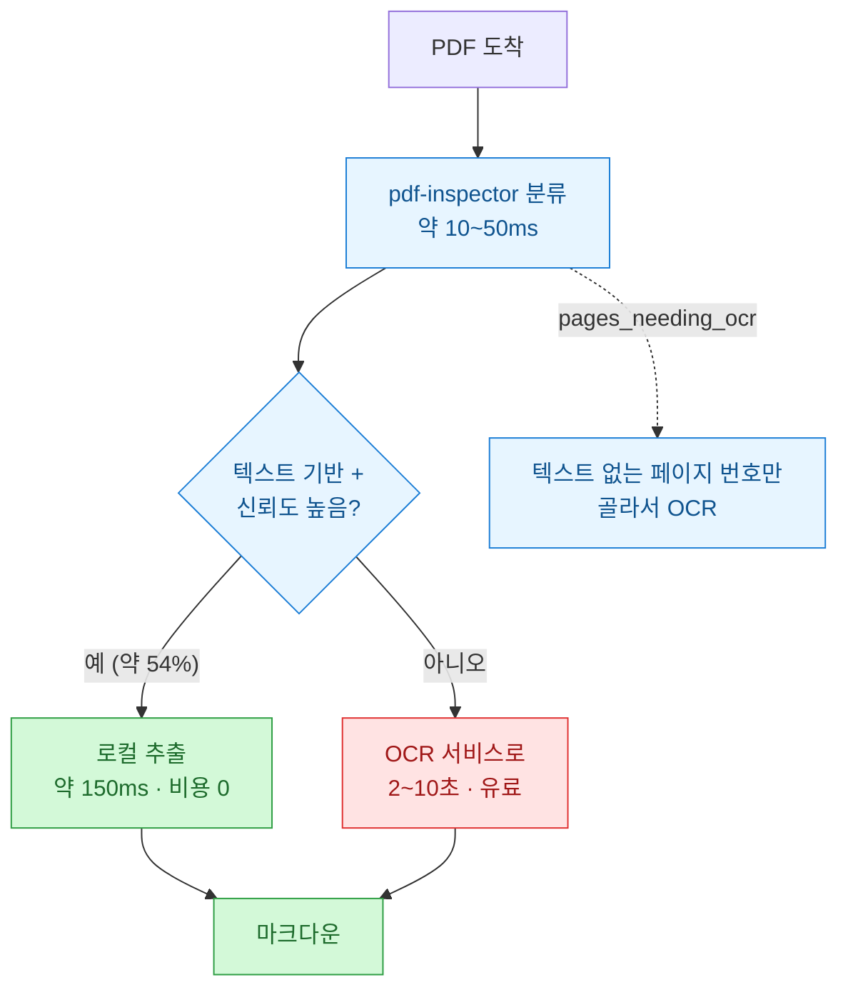
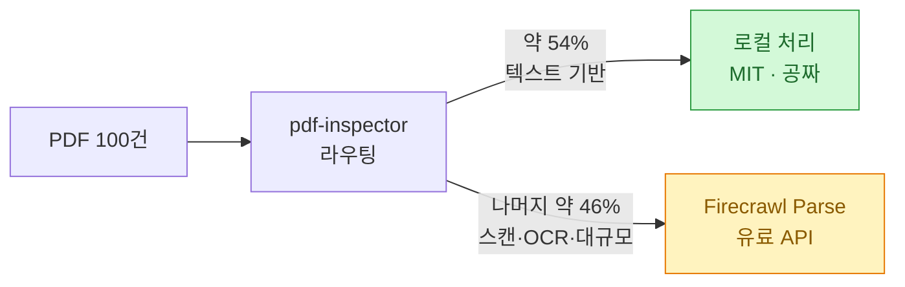

[PyTorch 한국 사용자 모임](https://discuss.pytorch.kr/t/pdf-inspector/11226)에서 보고 열었는데, 이번엔 남 얘기가 전혀 아니었다. **벤치마크 표에 내가 쓰는 도구가 두 개나 있었기 때문이다.**

**pdf-inspector**는 Firecrawl이 만든 Rust 라이브러리다([firecrawl/pdf-inspector](https://github.com/firecrawl/pdf-inspector), MIT). PDF가 텍스트 기반인지 스캔본인지 **밀리초 안에 판별**하고, 텍스트 기반이면 OCR 없이 바로 마크다운으로 뽑는다.

먼저 결론. **발상은 정확하고 물건도 살아 있다.** 앞서 살펴본 [[adala-autonomous-data-labeling-agent|Adala]]가 릴리스는 멈추고 master만 도는 상태였던 것과 달리, 이건 **오늘도 커밋이 들어왔다**. 다만 소개 글을 그대로 믿으면 곤란한 대목이 하나 있고, 이 공짜 라이브러리가 나를 어디로 태워 보내는지도 같이 봐야 한다.

## 이건 파서가 아니라 라우터다

이 도구의 핵심은 추출이 아니라 **분류**다. 그리고 분류의 목적은 **라우팅**이다.



문제 정의가 좋다. **모든 PDF를 OCR로 보내는 파이프라인은 이미 글자가 들어 있는 문서에까지 돈과 몇 초를 낸다.** 보고서·논문·인보이스·계약서는 대개 텍스트가 이미 박혀 있는데도 말이다. Firecrawl 주장으로는 그런 게 **약 54%**다.

분류 방식이 영리하다. 문서를 통째로 로드하지 않고, **xref 테이블과 페이지 트리만 파싱한 뒤 콘텐츠 스트림에서 텍스트 연산자(`Tj`/`TJ`)와 이미지 연산자(`Do`)의 존재만 확인**한다. 그래서 300페이지가 넘어도 밀리초로 끝난다.

내가 제일 쓸모 있다고 본 건 따로 있다. **`pages_needing_ocr`** — 텍스트가 없는 페이지 번호 목록을 돌려준다. 문서 전체를 통으로 OCR에 던지는 대신 **필요한 페이지만 골라 보낼 수 있다.** 스캔 몇 장이 섞인 200페이지 보고서에서 이건 비용이 두 자릿수로 갈린다.

검사 범위도 조절된다.

| 전략 | 동작 |
|---|---|
| `EarlyExit` (기본) | 전 페이지를 훑되 텍스트 아닌 첫 페이지에서 중단 |
| `Full` | 조기 종료 없이 전체 검사 — Mixed와 Scanned를 정확히 가름 |
| `Sample(n)` | 균등 분포 n개 페이지만 |
| `Pages(vec)` | 지정한 페이지만 |

그리고 **폰트 인코딩이 깨진 경우를 자동으로 표시**해서, 호출하는 쪽이 "이 문서는 그냥 OCR로 돌리자"고 판단할 수 있게 한다. 이게 실무에서 은근히 중요하다. 텍스트가 있긴 한데 깨져서 나오는 PDF가 제일 골치인데, 그걸 조용히 뱉지 않고 신고한다는 뜻이다.

## 벤치마크는 이긴 건가?

여기부터는 조심해서 읽어야 한다. **Firecrawl이 자기 도구를 재는 벤더 벤치마크**다.

opendataloader-bench 말뭉치(200개 PDF) 기준, OCR·ML을 안 쓰는 직접 추출 엔진끼리 비교한 표다.

| 엔진 | 종합 | 읽기 순서 | 표 | 제목 | 속도(200개) |
|---|---|---|---|---|---|
| **pdf-inspector** | 0.83 | 0.89 | **0.66** | 0.74 | **4초** |
| **opendataloader** | **0.84** | **0.91** | 0.49 | 0.74 | 11초 |
| pymupdf4llm | 0.73 | 0.89 | 0.40 | 0.41 | 18초 |
| markitdown | 0.58 | 0.88 | 0.00 | 0.00 | 8초 |

표를 그대로 읽으면 이렇다. **종합은 opendataloader가 이겼다(0.84 vs 0.83). 읽기 순서도 opendataloader가 이겼다(0.91 vs 0.89).** pdf-inspector가 이긴 건 **표 감지(0.66 vs 0.49)와 속도(4초 vs 11초)**고, 제목은 동점(0.74)이다.

README 표현은 이렇다.

> Overall lands within 0.01 of opendataloader at roughly 2.5× the speed.

**틀린 말은 아닌데, 진 걸 비긴 것처럼 쓴 문장이다.** 0.01 차이면 사실상 동급이라는 주장은 합리적이지만, 어쨌든 종합 1위는 상대다.

⚠️ 그리고 소개 글에 **수치 오타가 하나 있다.** 읽기 순서를 **0.88**로 적었는데 **README 원문은 0.89**다. 0.01이라 사소해 보이지만, 하필 이 표에서 0.01은 종합 순위를 가른 폭이다.

다만 **공정하게 짚을 것도 있다.** 두 가지가 이 벤치마크의 신뢰도를 올린다.

- **말뭉치가 남의 것이다.** opendataloader-bench는 이름 그대로 **경쟁 상대인 opendataloader가 만든 벤치마크**다. 자기 입맛에 맞는 데이터를 고른 게 아니다.
- **README에 "Where we lag" 섹션이 있다.** 읽기 순서가 뒤진다는 걸, 그리고 표 구조는 시각 레이아웃을 보는 OCR 엔진에 못 미친다는 걸 먼저 적었다.

정리하면 나는 이렇게 읽었다. **"제일 빠른 직접 추출 엔진이고, 표를 제일 잘 잡고, 종합은 사실상 opendataloader와 동급."** 그 정도면 충분히 좋은 성적이다. 굳이 이겼다고 쓸 필요가 없었는데 싶다.

참고로 OCR·ML 엔진(docling·marker·mineru)은 같은 말뭉치에서 종합 0.83\~0.88인데 **2분에서 180분**이 걸린다. pdf-inspector가 4초로 그 하단(0.83)에 닿는다는 게 진짜 세일즈 포인트다.

## ⚠️ "의존성은 lopdf 하나"는 사실인가?

이게 오늘 잡은 제일 큰 건이다.

소개 글은 이렇게 적었다.

> PDF 파싱을 위한 **lopdf 하나 외에는 외부 의존성이 없습니다.**

README 원문은 이렇다.

> **Lightweight** — Pure Rust, no ML models, no external services. **Single dependency on `lopdf` for PDF parsing.**

그래서 `Cargo.toml`을 열었다.

```toml
[dependencies]
pyo3 = { version = "0.25", ..., optional = true }   # 선택(파이썬 바인딩)

lopdf = { version = "0.41.0", features = ["rayon"] }
thiserror = "2.0"
rayon = "1.10"
log = "0.4"
env_logger = "0.11"
regex = "1.10"
once_cell = "1.19"
unicode-normalization = "0.1"
ttf-parser = "0.25"
```

**선택 의존성(pyo3)을 빼도 9개다.** "lopdf 하나 외에는 외부 의존성이 없다"는 명백히 사실이 아니다.

무슨 일이 일어난 건지는 보인다. README는 **"Single dependency on lopdf **for PDF parsing**"**이라고 **한정어를 달았다.** "PDF 파싱이라는 작업에 한해서는 의존성이 lopdf 하나"라는 좁은 주장이다. 그런데 그 문장이 하필 **"Lightweight"** 항목 아래 놓여 있어서, 읽는 사람이 "이 라이브러리는 의존성이 하나뿐"으로 받아들이기 딱 좋다. 소개 글이 정확히 그렇게 옮겼다.

그리고 **그 좁은 주장마저 완전히 깔끔하진 않다.** 목록에 **`ttf-parser`**가 있다. 주석에 용도가 적혀 있다.

```toml
# TrueType font parsing (for Identity-H CID font cmap extraction)
ttf-parser = "0.25"
```

**PDF 안에 박힌 폰트를 파싱하는 크레이트다.** 폰트 파싱을 PDF 파싱의 일부로 볼 거냐 아니냐는 말장난에 가깝고, 어느 쪽이든 "파싱 의존성 하나"라는 인상과는 거리가 있다.

⚠️ **오해는 말자. 9개는 Rust 기준으로 전혀 무겁지 않다.** `thiserror`·`log`·`regex`·`once_cell`은 사실상 표준 유틸이고, ML 모델도 외부 서비스도 없다는 건 진짜다. **가볍다는 주장 자체는 맞다.** 틀린 건 "의존성이 하나"라는 숫자다. 이걸 근거로 "그럼 감사(audit)할 표면이 lopdf뿐이겠네"라고 판단하면 어긋난다.

## 공짜 라이브러리는 나를 어디로 태워 보내나?

이건 흠이 아니라 구조 얘기다. 공식 랜딩 페이지에 대놓고 적혀 있다.

> **Two ways to parse** — Run the classifier locally for text-based PDFs; hand the scanned, OCR, and at-scale work to Firecrawl.
> **Firecrawl Parse · hosted API** ... The downstream route for everything local parsing can't reach.

즉 이 라이브러리는 **라우터**고, 라우터가 "로컬로 못 한다"고 판정한 트래픽의 **기본 목적지가 Firecrawl의 유료 API**다.



"OCR이 필요 없는 54%의 청구서를 아끼세요"를 뒤집으면 **"나머지 46%는 저희한테 주세요"**다. 잘 설계된 퍼널이고, 나는 이게 나쁘다고 보지 않는다. 오히려 **정직한 편**이다. 숨기지 않고 랜딩 페이지에 섹션으로 박아 뒀으니까.

다만 알고 쓰는 것과 모르고 쓰는 건 다르다. MIT라 **46%를 내 OCR로 보내도 아무 문제가 없다.** 라이브러리는 라우팅 신호(`pdf_type`·`confidence`·`pages_needing_ocr`)를 돌려줄 뿐이고, 그걸 어디로 보낼지는 내가 정한다. **퍼널의 존재를 알고 있으면 그냥 좋은 공짜 도구다.**

## 내 툴킷에 뭘 가져오나?

여기가 내가 이 글을 쓴 진짜 이유다. **벤치마크 표에 내 도구가 두 개 있다.**

나는 [[pdf-toolkit-opendataloader-engine-and-vision-ocr|문서 추출 툴킷]]에 **opendataloader 엔진**을 붙여 놨고, PDF는 상황에 따라 **PyMuPDF(fitz)** 계열로 뽑는다. 표에서 종합 1위(opendataloader)와 3위(pymupdf4llm)가 정확히 그 둘이다. 즉 이 표는 남의 성적표가 아니라 **내 파이프라인의 성적표**이기도 하다.

그래서 읽히는 게 명확했다.

| 내 현재 | pdf-inspector가 주는 것 |
|---|---|
| opendataloader로 추출(종합 0.84, 200개 11초) | 종합 0.83인데 **4초** — 2.5배 |
| 표 추출이 아쉬울 때가 있었음 | **표 0.66** — opendataloader 0.49보다 확연히 높음 |
| 비전 OCR 폴백을 **사람이 판단**해서 태움 | **`pages_needing_ocr`로 페이지 단위 자동 라우팅** |
| 깨진 인코딩은 결과 보고 눈치챔 | **인코딩 이상을 자동 플래그** |

**그래서 결론은 교체가 아니라 앞단 추가다.** opendataloader를 걷어낼 이유는 없다. 종합 점수가 더 높고 읽기 순서도 낫다. 대신 **파이프라인 맨 앞에 분류기를 하나 세우는 게** 맞겠다.

```
PDF 들어옴
  → pdf-inspector로 분류 (약 20ms)
      → TextBased면: 빠른 경로(pdf-inspector 또는 기존 엔진)
      → Mixed면: pages_needing_ocr 페이지만 비전 OCR
      → Scanned면: 통째로 비전 OCR
```

지금 내 툴킷의 약점이 정확히 여기다. **비전 OCR로 넘길지를 사람이 결과 보고 판단한다.** 그걸 20ms짜리 분류기가 대신하면, 특히 **관보처럼 텍스트 페이지와 스캔 페이지가 섞인 문서**에서 낭비가 크게 준다. `pages_needing_ocr` 하나만으로도 붙일 값이 있다.

⚠️ 단 검증 없이 붙이진 않겠다. **벤치마크 말뭉치가 한국어 문서를 얼마나 담고 있는지 모른다.** CID 폰트(Type0/Identity-H) ToUnicode CMap 해석을 지원한다고 명시돼 있어서 한글이 아예 안 될 이유는 없어 보이지만, **한글 PDF·HWP 변환본에서 직접 재 봐야 안다.** 내 손에 있는 실제 문서로 opendataloader와 붙여 보는 게 먼저다.

## 써 보려면

설치는 세 갈래 전부 열려 있다.

```
# Rust
cargo add pdf-inspector

# Python
pip install pdf-inspector

# Node.js
npm install @firecrawl/pdf-inspector
```

파이썬은 세 줄이면 끝난다.

```python
import pdf_inspector

result = pdf_inspector.process_pdf("document.pdf")
print(result.pdf_type)   # "text_based", "scanned", "image_based", "mixed"
print(result.markdown)   # 마크다운 문자열 또는 None
```

CLI도 같이 깔린다.

```
# PDF를 마크다운으로
pdf2md document.pdf

# 특정 페이지만
pdf2md document.pdf --select-pages 1,3,5-10

# 타입 감지 + 레이아웃 분석(표·단)을 JSON으로
detect-pdf document.pdf --analyze --json
```

⚠️ 소개 글은 파이썬 설치를 `maturin`으로 빌드하라고 안내하는데, 그건 **소스에서 개발용으로 빌드할 때** 얘기다. README 뱃지에 **PyPI가 걸려 있으니 `pip install pdf-inspector`가 먼저**다. 굳이 Rust 툴체인을 깔 필요 없다.

---

*출처: [PyTorch 한국 사용자 모임 소개 글](https://discuss.pytorch.kr/t/pdf-inspector/11226) · 저장소 [firecrawl/pdf-inspector](https://github.com/firecrawl/pdf-inspector)(MIT) · 공식 사이트 firecrawl.github.io/pdf-inspector. 스타 1,584 · 포크 144 · 열린 이슈 14 · 버전 0.1.6 · 저장소 생성 2026-02-06 · 마지막 푸시 2026-07-15 — 전부 2026-07-15 기준 GitHub API로 확인했다. `Cargo.toml`·`README.md` 원문 대조로 소개 글과 다른 대목(읽기 순서 0.88→0.89, 단일 의존성 주장)은 ⚠️로 표시했다. 벤치마크는 Firecrawl 자체 측정이다.*
