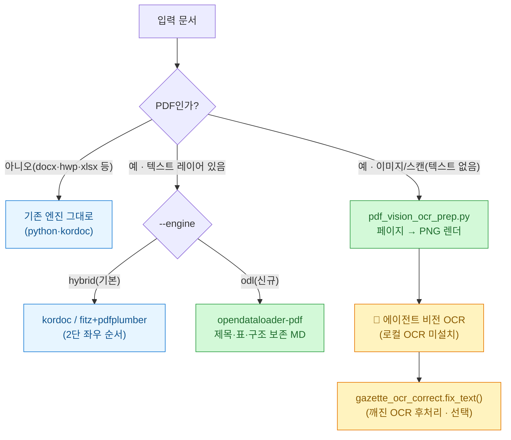
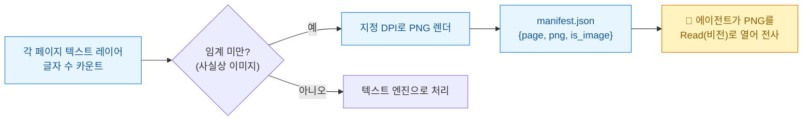
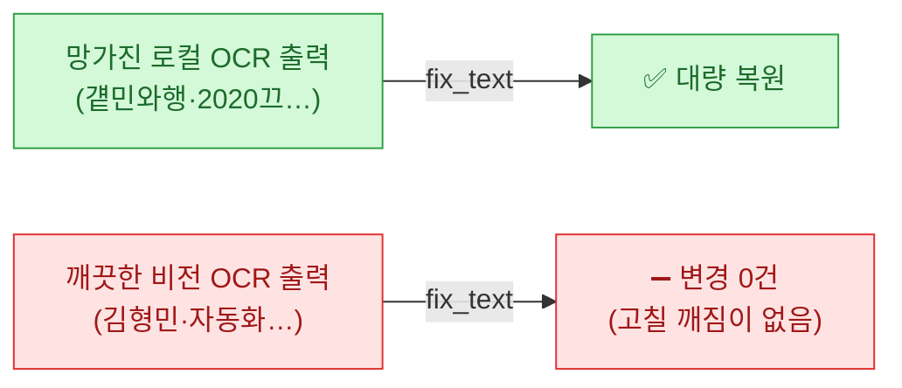

며칠 전 [[parsing-korean-public-docs-pdf-hwp-to-markdown-reindexing|관보 12.8만 건을 AI가 읽게 만든 프로젝트]]를 정리하면서 두 가지가 눈에 밟혔다. 하나는 PDF 추출에 쓴 **opendataloader**(한컴 오픈소스), 다른 하나는 OCR이 뭉갠 글자를 되살리는 **보정사전**이다. "이거 내 [[doc-extraction-toolkit|문서 추출 툴킷]]에 붙이면 쓸 만하겠는데?" 싶어서 오늘 실제로 붙였다. 그 기록이다.

## 오늘 한 일 — 한 장 요약



세 가지를 붙였다 — ① PDF 텍스트 엔진에 **opendataloader** 추가, ② 이미지/스캔 PDF용 **비전 OCR** 경로, ③ 관보 **보정사전** 모듈. 하나씩 적는다.

## ① opendataloader를 PDF 엔진으로 붙이기

기존 `extract_any.py`의 PDF 경로는 **PyMuPDF+pdfplumber 하이브리드**였다. 2단 좌우 순서엔 강하지만, 복잡한 표·구조가 많은 문서엔 아쉬웠다. opendataloader는 결정론적·로컬로 **제목·표·리스트 구조를 보존한 마크다운**을 뽑는다(벤치 상위, LLM 불필요). 그래서 대체가 아니라 **선택 엔진**으로 얹었다.

```python
def _pdf_odl(path):
    """opendataloader-pdf(JVM) → 구조화 마크다운. 제목·표·리스트 보존."""
    import tempfile, glob, opendataloader_pdf
    with tempfile.TemporaryDirectory() as td:
        opendataloader_pdf.convert(input_path=[path], output_dir=td,
                                   format="markdown", quiet=True)
        mds = glob.glob(os.path.join(td, "*.md"))
        if not mds:
            raise RuntimeError("opendataloader: markdown 산출 없음")
        return open(mds[0], encoding="utf-8").read()
```

호출은 `--engine odl` 플래그(기본은 기존 `hybrid`라 회귀 없음).

```bash
# 텍스트 PDF를 opendataloader로 추출
python extract_any.py book.pdf --engine odl --meta
# <<extract ext=.pdf engine=pdf-odl(opendataloader) chars=130769>>
```

실제로 108페이지 기술서를 넣으니 **4.2초**에 제목(`#`)·표(`| … |`)·목차까지 구조 그대로 나왔다. 전제조건은 하나 — **JVM(Java 11+)**. 각 `convert()`가 JVM 프로세스를 띄우므로 대량은 한 번에 배치하는 게 좋다.

> ⚠️ 주의: opendataloader든 기존 하이브리드든 **텍스트 레이어를 읽는다**. 스캔본·PPT export처럼 글자가 이미지로만 박힌 PDF는 텍스트가 안 나온다. 그래서 ②번이 필요하다.

## ② 이미지/스캔 PDF — 로컬 OCR 대신 '내 비전'으로

여기서 선택이 갈렸다. 보통은 Tesseract 같은 **로컬 OCR**을 깐다. 그런데 나는 에이전트(Claude Code)로 이 파이프라인을 굴린다. 그러면 **OCR 엔진을 따로 설치할 것 없이, 페이지를 이미지로 렌더해 에이전트가 자기 '비전'으로 직접 읽으면 된다.** 로컬 OCR보다 한글 인식도 깔끔하다.

그래서 만든 게 `pdf_vision_ocr_prep.py` — **판정 + 렌더**만 하는 준비기다.



핵심 판정 로직은 단순하다 — 페이지의 텍스트 레이어 글자 수가 임계(기본 20자) 미만이면 '이미지 페이지'로 보고 PNG로 렌더한다.

```python
layer = (page.get_text("text") or "").strip()
is_image = len(layer) < min_chars       # 텍스트 레이어가 비면 = 스캔/이미지
if is_image or all_pages:
    page.get_pixmap(matrix=fitz.Matrix(dpi/72, dpi/72)).save(png)
```

**테스트.** 텍스트 레이어를 지운 합성 스캔 PDF를 넣었더니 `image_pages: 1`로 정확히 감지·렌더했다. 그리고 그 PNG를 내가 비전으로 열어 전사한 결과가 이랬다(발췌):

```
## 01. 자동화를 통한 효율적인 업무 개선
- SQL, Python, Excel, Excel VBA 툴을 통해 자동화하여 효율적인 업무 진행을 …
## 02. 문제 해결을 위한 끈기, 열정 및 비즈니스 전략 마인드
- IT, 게임, 이커머스, 마케팅 등 다양한 분야에서 데이터 분석 및 지표 성과 …
```

한글이 **깨짐 없이 깨끗하게** 나왔다. 이 점이 ③번의 결론으로 이어진다.

## ③ 관보 OCR 보정사전을 모듈로 이식 — 그리고 정직한 결론

관보 프로젝트의 진짜 심장은 **OCR이 뭉갠 글자를 되살리는 사전**이었다(`걭민와행→국민은행`, `2020끄→2020년` 식). 이걸 `gazette_ocr_correct.py`로 이식했다. 라이선스가 **MIT**라 저작권 고지를 유지하는 조건으로 가져올 수 있었고, `NOTICE.md`에 출처를 박았다.

```python
from gazette_ocr_correct import fix_text
# 망가진 OCR 입력
fix_text("걭민와행 접삌괰업와행 2020끄 본외과의 가계")
# → "국민은행 저축은행 2020년 본인과의 관계"
```

6개 사전 434개 항목 + 단일문자 치환 + 2-pass가 정확히 복원한다. **그런데** — 이걸 ②번의 **깨끗한 비전 OCR 출력**에 적용해 보면?



내 비전 OCR 결과에 `fix_text`를 돌렸더니 **변경 라인 0건**이었다. 당연하다 — 이 사전은 '망가진 글자를 고치는' 용도인데, 비전 OCR엔 고칠 깨짐이 애초에 없다. 게다가 이 사전은 **특정 상용 OCR의 오류 패턴**에 맞춰 누적된 것이라, 엔진이 다르면 깨진 글자 모양도 달라 잘 안 맞는다.

> 그래서 내 결론은 이렇다. **보정사전은 "로컬 OCR을 쓸 때의 후처리 안전망"으로만 둔다.** 비전 OCR을 쓰는 한 이 사전은 사실상 no-op다. 좋은 도구를 무조건 파이프라인에 욱여넣는 게 아니라, **어떤 입력에 무엇이 실제로 작동하는지**를 테스트로 갈라 두는 것 — 이게 [[own-the-outer-loop-human-at-the-boundary|아우터 루프]]에서 말한 '증거로 판정한다'의 실전 버전이다.

## 최종 라우팅 — 입력별로 무엇을 쓰나

| 입력 | 엔진 | 비고 |
|---|---|---|
| docx·pptx·xlsx·xls·txt | python 네이티브 | 기존 유지 |
| hwp·hwpx·hwpml | **kordoc**(Node) | 기존 유지, 이미 설치됨 |
| PDF(텍스트, 표·구조 많음) | **opendataloader** `--engine odl` | 신규, 구조 보존 |
| PDF(텍스트, 2단 레이아웃) | hybrid(fitz+pdfplumber) | 기존 유지 |
| PDF(이미지·스캔) | **비전 OCR**(PNG 렌더→에이전트 전사) | 신규, 로컬 OCR 불필요 |
| 깨진 로컬 OCR 출력 | `gazette_ocr_correct.fix_text` | 선택 안전망(MIT) |

붙이고 나서 든 생각. 도구를 늘리는 것보다 중요한 건 **"이 입력엔 이 도구, 저 입력엔 저 도구"를 증거로 나눠 두는 것**이었다. opendataloader는 텍스트 PDF 구조에, 비전 OCR은 이미지 페이지에, 보정사전은 깨진 로컬 OCR에 — 각자 자리를 정직하게 지킬 때 툴킷이 신뢰를 준다.

---

*도구 출처: opendataloader-pdf(한컴, `github.com/opendataloader-project/opendataloader-pdf`) · 보정사전 원본 ai-readable-gazette-kr(Hosung Seo, MIT, `github.com/hosungseo/ai-readable-gazette-kr`). 코드·라우팅은 내 툴킷(`tools/extractors/`)에 맞춘 재구성이며, 테스트 수치는 이 PC 실측이다. 회사 실무 문서·PII는 대상에서 제외한다.*
