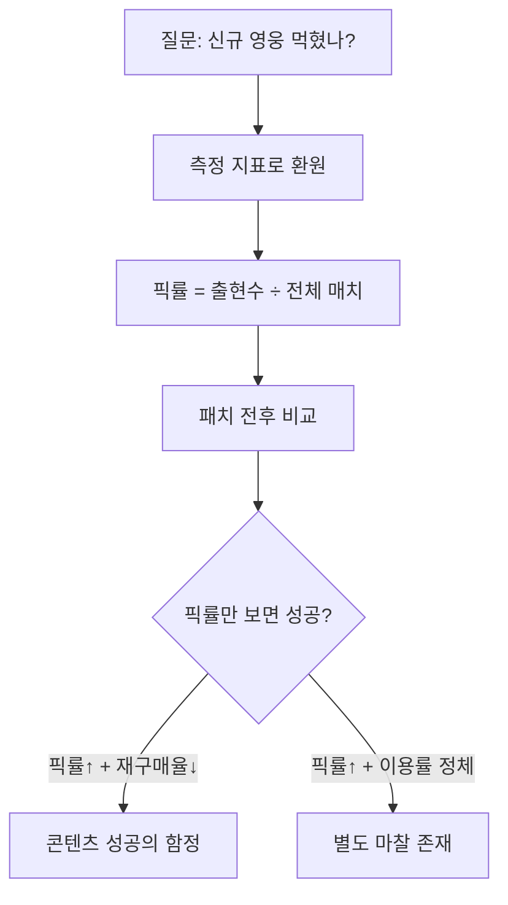
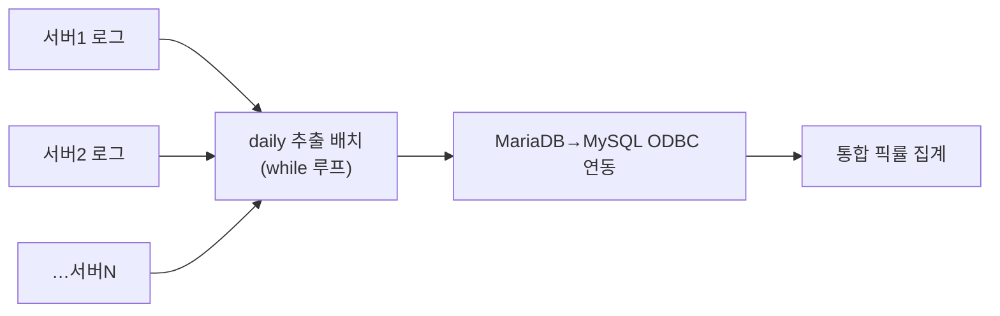
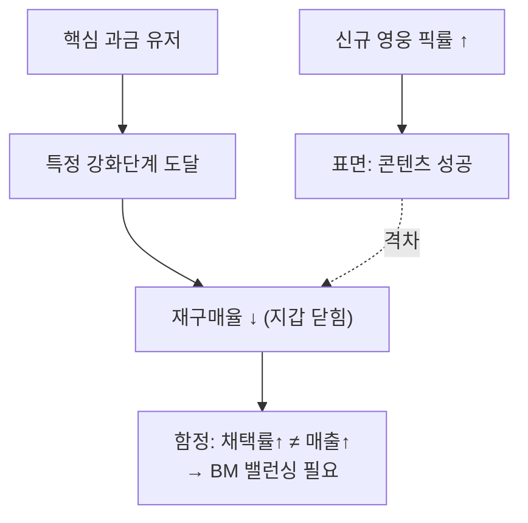

기획팀에서 가장 자주 받은 질문은 늘 비슷했다. "이번 신규 영웅, 유저가 쓰긴 쓰냐?" 이 질문은 그대로는 답할 수 없다. "쓴다/안 쓴다"는 느낌이지 데이터가 아니기 때문이다. 그래서 분석가가 처음 하는 일은 답을 내는 게 아니라 **질문을 측정 가능한 지표로 환원**하는 것이다. 여기서 그 지표가 **픽률**이었다.

이 글은 킹스레이드에서 신규 콘텐츠 패치의 영향을 분석하던 방식을 — 게임 내부 명칭·수치는 빼고 — 방법론 중심으로 정리한 것이다.



## 픽률은 정확히 어떻게 계산하나?

픽률의 정의 자체는 단순하다.

```
픽률 = 해당 영웅 출현수 ÷ 전체 매치(플레이) 수
```

한 판 한 판의 로그에서 "이 영웅이 덱/파티에 들어갔는가"를 세고, 그걸 전체 판수로 나눈다. 신규 영웅이 나온 뒤 이 비율이 얼마나 뛰는지를 패치 전후로 비교하면, 채택 여부가 숫자로 나온다. 내 경우엔 신규 영웅 픽률이 패치 전후로 **약 70% 상승**했다. 신규 영웅 자체는 명백히 먹힌 것이다.

계산은 간단하지만, 실무에서 발목을 잡는 건 **데이터가 흩어져 있다는 점**이었다. 서비스가 여러 서버로 나뉘어 운영되면(내 경우 6개 서버), 픽률 하나 뽑는 데도 서버별 로그를 다 긁어 합쳐야 한다.



매일 도는 daily 추출 잡을 while 루프로 돌리고, 서버마다 다른 DB(MariaDB·MySQL 등)를 **ODBC로 연동**해 한곳에 모았다. 여기에 유저마다 **과금/무과금 플래그**를 붙여두면, "누가 이 영웅을 픽했나"를 과금 성향까지 나눠 볼 수 있다. 이 플래그 하나가 다음 분석의 열쇠가 된다.

## 픽률이 올랐으면 성공이라고 끝내도 되나?

여기서 "70% 올랐으니 성공"으로 끝내면 분석가가 아니다. 진짜 신호는 픽률 **단독**이 아니라 픽률과 다른 지표의 **격차**에서 나온다.

같은 패치에서 나는 두 가지를 함께 봤다.

- **신규 콘텐츠(던전) 이용률**: 약 20% 상승 — 유입은 됐지만 픽률 상승폭(70%)에 비하면 약했다.
- **플레이 형태(솔로 vs 파티)**: 신규 던전에서 **솔플 선호 약 73%**.

영웅은 사고 싶은데(픽률 70%↑) 던전은 픽률만큼 안 돈다(이용률 20%↑). 이 **격차**가 "던전 자체에 마찰이 있다"는 가설을 만들었고, 솔플 73%라는 숫자가 결정타였다. 파티 매칭을 전제로 설계된 던전인데 대다수가 혼자 돌고 있었다는 뜻 — 즉 **파티 난이도·매칭·보상 밸런스 이슈**로 좁혀진 것이다.

## '픽률은 올랐는데 매출은 빠지는' 역설은 왜 생기나?

콘텐츠 채택률(픽률)과 매출이 항상 같은 방향으로 움직이지는 않는다. 나는 픽률이 오른 패치에서 오히려 핵심 과금 지표가 꺾이는 경우를 봤다.

과금 유저를 따라가 보니, 특정 강화 단계(예: 핵심 장비 일정 단계 도달) **이후로 재구매율이 큰 폭으로 하락**했다. 신규 영웅은 많이 픽되는데, 정작 돈을 쓰던 유저들은 목표를 달성하고 나서 지갑을 닫은 것이다.



이게 "콘텐츠 성공의 함정"이다. 픽률이라는 표면 지표만 보면 성공인데, 재구매율이라는 과금 지속성 지표를 겹쳐 보면 매출 이탈의 씨앗이 보인다. 그래서 픽률은 반드시 **재구매율·과금 구간 분포 같은 지속성 지표와 짝지어** 봐야 한다.

## 그래서 분석의 결론은 무엇이어야 하나?

분석의 결론은 "성공/실패" 판정이 아니라 **문제의 위치를 특정**하는 것이다. 픽률 70% 상승과 이용률 20% 상승의 격차, 솔플 73%, 강화 단계 이후 재구매율 하락 — 이 조각들을 모으면 "밸런싱이 필요한 지점"이 구체적인 좌표로 찍힌다. 기획팀은 이걸 받아 던전 난이도와 보상·BM 구조를 손봤다.

정리하면 이렇다.

- 픽률 = **출현수 ÷ 전체 매치**. 흩어진 서버 로그는 daily 배치 + ODBC로 통합.
- 픽률 **단독**은 위험하다. **이용률·솔플 비율·재구매율**과의 **격차**에서 인사이트가 나온다.
- 채택률↑ ≠ 매출↑. 픽률과 재구매율을 겹쳐 보면 "콘텐츠 성공의 함정"이 보인다.
- 분석의 목적은 판정이 아니라 **밸런싱 좌표를 특정**하는 것.

지표 한 줄이 아니라 지표 사이의 격차를 읽는 것 — 이게 도메인 안에서 데이터를 보는 감각이다. 다음 글에서는 이 "재구매율 하락"을 **과금 이탈 조기경보**로 만드는 코호트 분석을 정리한다.

- 방법론·합성 스키마 레시피: [github.com/DBhyeong/game-data-recipes](https://github.com/DBhyeong/game-data-recipes)
