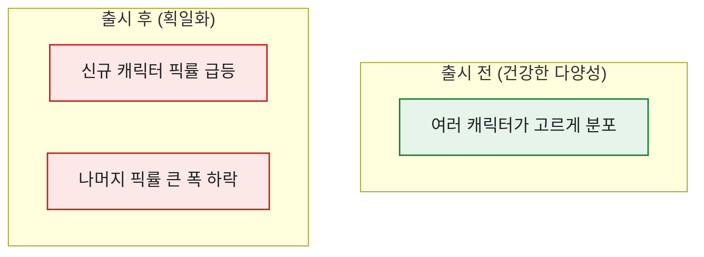

# 신규 콘텐츠 후 '획일화'를 픽률로 잡아내기

> 신규 캐릭터가 나오면 커뮤니티에서 늘 나오는 말이 있다. "이제 다 똑같은 덱만 쓴다." 한 신규 콘텐츠 패치 뒤, 내가 직접 플레이하며 느낀 것도, SNS·오픈채팅·카페에서 올라온 VOC도 같았다 — **특정 캐릭터만 너무 강하고, 덱이 획일화되어 신규 캐릭터 수요가 떨어진다.** 체감은 분명한데, 그걸 기획팀에 가져가려면 숫자가 필요했다. 그때 손에 잡은 게 **픽률(pick rate)** 이다. (게임명·수치는 일반화한 합성 기준이다.)

## VOC를 어떻게 가설로 바꿨나?

나는 항상 이 순서로 움직였다. **직접 플레이 + VOC → 가설 → 로그 검증.**


가설이 '느낌'에서 '검증 대상'으로 바뀌는 순간, 데이터가 할 일이 정해진다.

## 픽률은 무엇을 재나?

정의는 간단하다. 내가 쓴 기준은 **"해당 캐릭터를 픽해서 그 콘텐츠를 1회 이상 플레이한 비율"** 이었다.

```
픽률 = 해당 캐릭터 출현 매치 수 ÷ 전체 매치 수
```

그런데 픽률 하나만 봐선 '쏠림'이 안 보인다. 획일화를 재려면 **분포 전체의 모양**을 봐야 한다.



실제로 신규 캐릭터의 픽률이 **약 70% 수준까지 급등**했고, 그 덱만 꾸려지면서 다른 캐릭터들의 픽률이 큰 폭으로 빠졌다. 체감이 숫자로 확정된 순간이었다.

## 획일화를 어떻게 숫자로 확정하나?

하나의 신호만으론 반박당하기 쉬워서, 세 가지를 같이 봤다.

| 신호 | 보는 법 | 획일화면 |
|---|---|---|
| **최고 픽률** | 1위 캐릭터의 픽률 | 급등 |
| **상위 집중도** | 상위 3개 픽률 합 | 급등 |
| **유효 선택지 수** | 픽률 5% 넘는 캐릭터 개수 | 급감 |

셋이 같은 방향을 가리키면 "체감상 똑같아졌다"는 반박 불가능한 사실이 된다.

## 실제로는 어떻게 추출했나?

방법도 남겨둔다. 서버가 여러 개(예: 6개)로 흩어져 있어서, **서버별 daily 로그를 반복문(while)으로 추출**하고, MariaDB·MySQL을 **ODBC로 MS-SQL에 연동**해 한곳에 모았다. 반복 추출·정제는 **임시테이블(#)** 에서 돌렸고, 픽률 계산 전에 **기획팀의 콘텐츠 Code 테이블(Enum)** 로 캐릭터 코드를 의미로 풀었다. 픽률 자체는 window 함수로 한 번에 뽑았다.

```sql
SELECT
    character_id,
    COUNT(*)                                   AS appear_cnt,
    1.0 * COUNT(*) / SUM(COUNT(*)) OVER ()      AS pick_rate
FROM match_pick_log
WHERE match_date BETWEEN '2026-06-01' AND '2026-06-14'
GROUP BY character_id
ORDER BY pick_rate DESC;
```

출시 전/후 두 기간으로 나눠 나란히 놓으면 위 세 신호가 자동 계산된다.

## 분석이 밸런싱 제안으로 어떻게 이어졌나?

픽률로 획일화를 확정한 다음이 진짜 중요했다. 숫자는 시작일 뿐, 그게 액션으로 이어져야 분석의 값이 산다. 내가 밟은 경로는 이랬다.


특히 조심한 건 **획일화가 신규 캐릭터 수요를 떨어뜨린다**는 점이었다. 다 똑같은 덱만 쓰면, 다음 신규 캐릭터가 나와도 살 이유가 약해진다. 그래서 이 분석은 단순히 "밸런스가 깨졌다"가 아니라 "지금 손 안 대면 다음 매출까지 위험하다"는 메시지로 이어졌다.

그리고 밸런스를 조정한 뒤엔 같은 픽률·유효 선택지 수를 다시 재서, 다양성이 회복됐는지 확인하는 폐루프를 돌렸다. 이 사이클을 통해 콘텐츠 이용률을 끌어올린 게 실제 성과였다. 픽률이라는 한 줄짜리 지표가, 이렇게 밸런싱 의사결정의 출발점이 됐다.

## 오늘의 기록

이 분석을 기획팀에 가져갔을 때, "느낌"이 "상위 픽률 급등 + 유효 선택지 급감"이라는 문장으로 바뀌자 회의의 결이 달라졌다. 밸런스 논의가 취향 싸움에서 데이터 대화로 옮겨간 거다. 다만 픽률이 올랐다고 다 좋은 것도 아니었다 — 픽률은 올랐는데 매출은 빠지는 역설이 곧 따라왔는데, 그건 다음 글에서.

*실제 콘텐츠 픽률 분석 경험을 바탕으로 하되, 게임명·수치·내부 구조는 일반화한 합성 기준입니다.*
