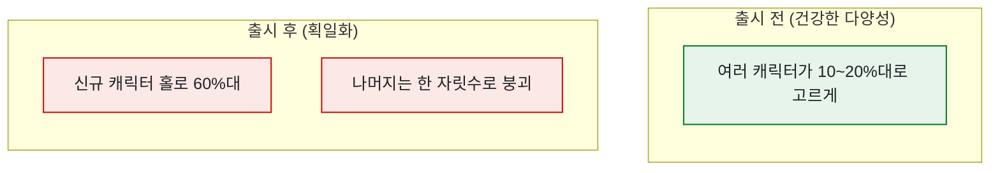

# 신규 콘텐츠 후 '획일화'를 픽률로 잡아내기

> 신규 캐릭터가 나오면 커뮤니티에서 늘 나오는 말이 있다. "이제 다 똑같은 덱만 쓴다." 체감은 분명한데, 그걸 기획팀에 가져가려면 숫자가 필요했다. 그때 손에 잡은 게 **픽률(pick rate)** 이다. 출현 횟수를 전체로 나눈, 단순하지만 강력한 한 줄짜리 지표다.

## 픽률은 무엇을 재나?

정의는 간단하다. 특정 대상이 얼마나 자주 '선택'됐는지의 비율이다.

```
픽률 = 해당 캐릭터(덱) 출현 매치 수 ÷ 전체 매치 수
```

그런데 픽률 하나만 봐선 '쏠림'이 안 보인다. 획일화를 재려면 **분포 전체의 모양**을 봐야 한다.



## 획일화를 어떻게 숫자로 확정하나?

나는 세 가지를 같이 봤다. 하나만으로는 반박당하기 쉬웠기 때문이다.

| 신호 | 보는 법 | 획일화면 |
|---|---|---|
| **최고 픽률** | 1위 캐릭터의 픽률 | 급등 (예: 20%→62%) |
| **상위 집중도** | 상위 3개 픽률 합 | 급등 (예: 45%→85%) |
| **유효 선택지 수** | 픽률 5% 넘는 캐릭터 개수 | 급감 (예: 12개→4개) |

세 신호가 같은 방향을 가리키면, "체감상 똑같아졌다"는 이제 반박 불가능한 사실이 된다.

## SQL로는 어떻게 뽑나?

출현 로그를 캐릭터별로 세고 전체로 나누면 끝이다. (합성 스키마)

```sql
SELECT
    character_id,
    COUNT(*)                                   AS appear_cnt,
    1.0 * COUNT(*) / SUM(COUNT(*)) OVER ()      AS pick_rate
FROM match_pick_log
WHERE match_date BETWEEN '2026-06-01' AND '2026-06-14'
GROUP BY character_id
ORDER BY pick_rate DESC;
```

`SUM(COUNT(*)) OVER ()` 로 전체 매치 대비 비율을 한 번에 구하는 게 포인트다. 이걸 출시 전/후 두 기간으로 나눠 나란히 놓으면 위 표의 세 신호가 자동으로 계산된다.

## 오늘의 기록

이 분석을 처음 기획팀에 가져갔을 때, "느낌"이 "픽률 상위 3종 합 85%, 유효 선택지 12→4"라는 문장으로 바뀌자 회의의 결이 달라졌다. 밸런스 논의가 취향 싸움에서 데이터 대화로 옮겨간 거다. 다만 픽률이 올랐다고 다 좋은 것도, 다 나쁜 것도 아니다 — 픽률은 올랐는데 매출은 빠지는 역설도 있었는데, 그건 다음 글에서.

*합성 데이터·스키마 기준입니다. 실제 게임·회사 데이터와 무관합니다.*
