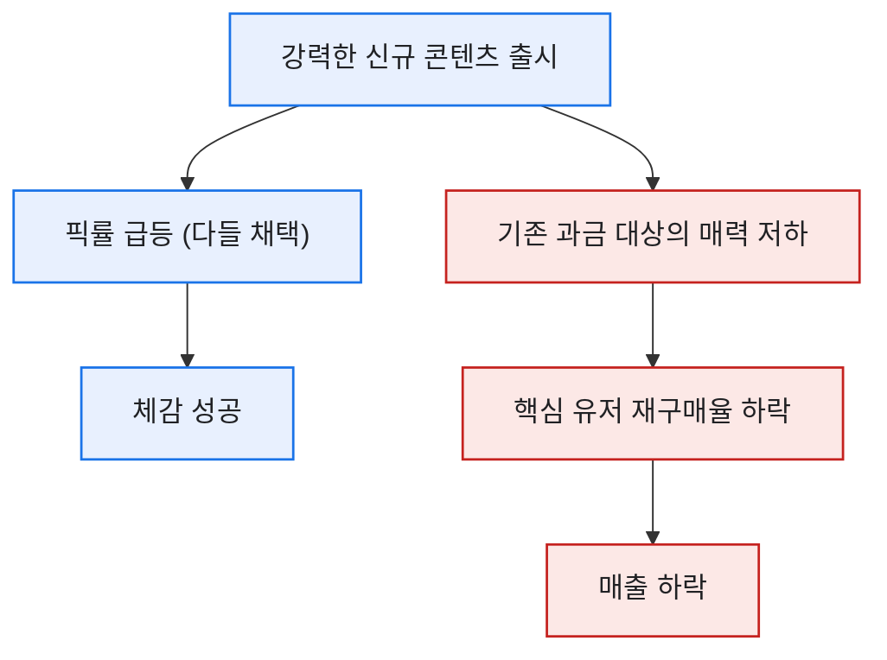
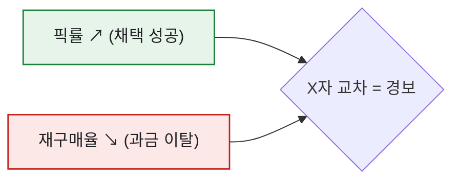

# 픽률은 올랐는데 매출은 빠졌다 — 콘텐츠 성공의 함정

> 신규 캐릭터가 픽률 1위를 찍었다. 채택률로만 보면 완벽한 성공이었다. 그런데 2주 뒤 매출 리포트를 열었을 때 나는 한참을 멍하니 있었다. **핵심 과금 유저의 재구매가 눈에 띄게 꺾여 있었다.** 채택은 성공, 매출은 실패. 이 역설을 이해하는 데 꽤 오래 걸렸고, 그 과정을 합성 데이터로 복원해본다.

## 어떻게 픽률과 매출이 따로 놀 수 있나?

핵심은 **'무료로 나눠준 콘텐츠가 인기 있으면, 사람들은 굳이 돈을 안 쓴다'** 는 데 있다.

무료(또는 저가) 신규 캐릭터가 너무 강하면, 그동안 돈 주고 키우던 캐릭터의 가치가 상대적으로 떨어진다. 채택률은 오르지만, 지갑을 열 이유는 오히려 줄어든 것이다.

## 데이터로는 무엇이 어긋났나?

두 지표를 같은 시간축에 겹쳐 놓자 그림이 분명해졌다. (합성 수치)

| 시점 | 신규 캐릭터 픽률 | 핵심 과금 유저 재구매율 |
|---|--:|--:|
| 출시 전 | — | 48% |
| 출시 +1주 | 55% | 41% |
| 출시 +2주 | 63% | **32%** |

픽률 곡선은 우상향, 재구매율 곡선은 우하향. **두 선이 X자로 벌어지는 순간**이 바로 '채택 성공, 매출 실패'의 신호였다.

## 그래서 다음엔 무엇을 바꿨나?

교훈은 명확했다. **콘텐츠 성과는 픽률(채택)과 매출(재구매)을 반드시 짝으로 봐야 한다.** 하나만 보면 축하하다가 뒤통수를 맞는다. 이후 신규 콘텐츠 출시 리포트에는 항상 두 곡선을 나란히 넣었고, 무료 콘텐츠의 강함이 과금 상품의 가치를 잠식하지 않도록 '출시 강도'를 조절하는 논의를 사전에 붙였다.

## 오늘의 기록

이 케이스는 나에게 '좋아 보이는 숫자를 의심하라'는 걸 뼈저리게 가르쳤다. 픽률 1위라는 화려한 지표 뒤에서 매출이 조용히 새고 있었으니까. 하나의 지표는 이야기의 반쪽일 뿐이다. 성공을 선언하기 전에 늘 '그럼 이건 어떻게 됐지?' 하고 반대편 지표를 열어보는 습관은, 이날의 멍한 오후에서 시작됐다.

*합성 데이터 기준의 재구성입니다. 실제 게임·회사의 콘텐츠나 수치와 무관합니다.*
