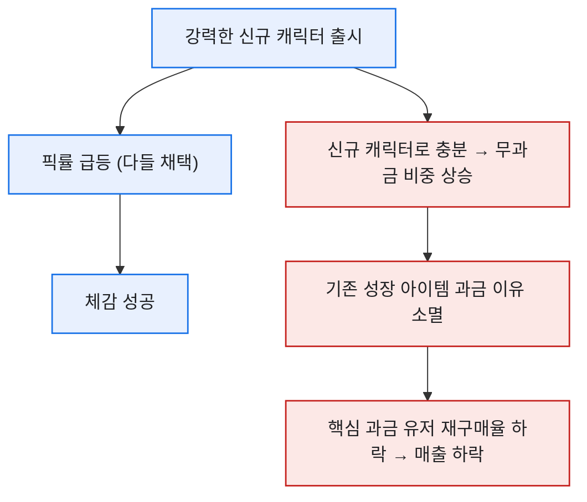
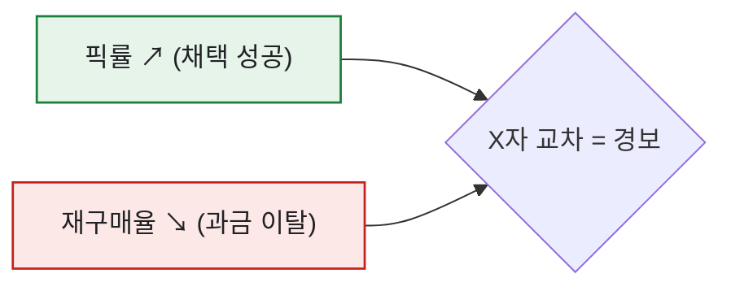
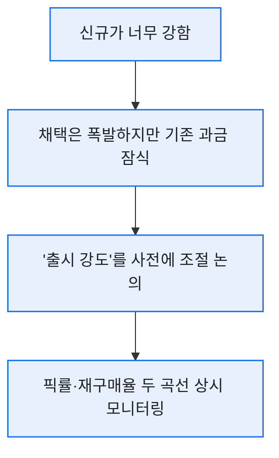

# 픽률은 올랐는데 매출은 빠졌다 — 콘텐츠 성공의 함정

> 신규 캐릭터가 픽률 약 70%를 찍었다. 채택률로만 보면 완벽한 성공이었다. 그런데 얼마 뒤 과금 데이터를 열었을 때 나는 한참을 멍하니 있었다. **핵심 과금 유저의 재구매가 눈에 띄게 꺾여 있었다.** 채택은 성공, 매출은 실패. 이 역설을 이해하는 데 꽤 걸렸고, 그 과정을 일반화해 복원한다. (게임명·수치는 합성 기준이다.)

## 어떻게 픽률과 매출이 따로 놀 수 있나?

핵심은 **'강한 신규 콘텐츠가 인기 있으면, 사람들은 굳이 기존 성장에 돈을 안 쓴다'** 는 데 있었다.

신규 캐릭터가 너무 강하면, 그동안 돈 주고 키우던 캐릭터·성장 아이템의 가치가 상대적으로 떨어진다. 채택률은 오르지만, 지갑을 열 이유는 오히려 줄어든 것이다. 실제로 신규 캐릭터 출시 후 **무과금 유저 비중이 올라갔고**, 특정 성장 아이템을 이미 높은 단계까지 키운 소수 계정만 남았다.

## 데이터로는 무엇이 어긋났나?

두 지표를 같은 시간축에 겹쳐 놓자 그림이 분명해졌다. 특정 성장 아이템을 **최초로 2단계까지 강화한 시점 이후**, 그 계정층의 재구매가 꺾였다.

| 시점 | 신규 캐릭터 픽률 | 핵심 과금 유저 재구매율 |
|---|--:|--:|
| 출시 전 | — | 48% |
| 출시 +1주 | 55% | 41% |
| 출시 +2주 | 70% | **32%** |

픽률 곡선은 우상향, 재구매율 곡선은 우하향. **두 선이 X자로 벌어지는 순간**이 '채택 성공, 매출 실패'의 신호였다.

특히 이탈이 두드러진 건 **월평균 중간 과금대(예: 몇만 원 규모) 유저층**이었다. 최상위 고래도, 무과금도 아닌 이 층이 먼저 흔들렸다. 이유를 뜯어보니 이렇다 — 최상위 고래는 어차피 계속 쓰고, 무과금은 원래 안 쓴다. 반면 중간 과금대는 '가성비'로 결제하던 층이라, 신규 캐릭터 하나로 충분해지는 순간 지갑을 가장 먼저 닫는다. 그래서 콘텐츠 하나의 매출 영향을 볼 땐, 총매출이나 최상위 고래가 아니라 **이 중간층의 재구매율**을 제일 예민하게 봐야 했다.

여기서 flag의 힘이 또 나온다. 구매 테이블을 Join해 **결제 여부(pu/non-pu)와 금액 구간**을 미리 심어뒀기 때문에, "신규 콘텐츠 출시 이후 중간 과금대의 재구매율이 어떻게 변했나"를 쿼리 한 줄로 뽑을 수 있었다. 세그먼트를 미리 준비해두지 않았다면 이 역설의 진짜 범인을 찾지 못했을 것이다.

## 그래서 다음엔 무엇을 바꿨나?

교훈은 명확했다. **콘텐츠 성과는 픽률(채택)과 재구매율(매출)을 반드시 짝으로 봐야 한다.** 하나만 보면 축하하다 뒤통수를 맞는다. 이후 신규 콘텐츠 리포트엔 늘 두 곡선을 나란히 넣었고, **무료·저가 신규의 강함이 기존 과금 상품의 가치를 잠식하지 않도록 '출시 강도'를 조절**하는 논의를 사전에 붙였다. 밸런싱의 필요성을 데이터로 제기한 것이다.

## 출시 강도는 어떻게 조절 논의했나?

이 역설을 겪은 뒤로, 나는 신규 콘텐츠를 '얼마나 강하게 낼지'가 밸런스 문제이자 **매출 문제**라는 걸 데이터로 말하기 시작했다.

- 무료·저가 신규가 **기존 과금 상품의 가치를 얼마나 잠식하는지**를 출시 전에 가늠하고,
- 출시 후엔 **픽률과 재구매율 두 곡선을 나란히 상시 모니터링**해서, X자로 벌어지기 시작하면 바로 밸런싱 타이밍을 제기했다.

핵심은 '채택률만 보는 성공 판정'을 폐기한 것이다. 픽률 1위는 화려하지만, 그 뒤에서 재구매가 빠지고 있으면 그건 절반의 성공이다. 콘텐츠의 성패는 **채택(픽률)과 매출(재구매율)의 균형**으로 판단해야 한다는 걸, 이 케이스가 팀의 공용 언어로 만들어줬다.

## 오늘의 기록

이 케이스는 나에게 '좋아 보이는 숫자를 의심하라'는 걸 뼈저리게 가르쳤다. 픽률 1위라는 화려한 지표 뒤에서 매출이 조용히 새고 있었으니까. 하나의 지표는 이야기의 반쪽일 뿐이다. 성공을 선언하기 전에 늘 '그럼 반대편 지표는?'을 열어보는 습관은, 이날의 멍한 오후에서 시작됐다.

*실제 콘텐츠 과금 분석 경험을 바탕으로 하되, 게임명·수치는 일반화한 합성 기준입니다.*
