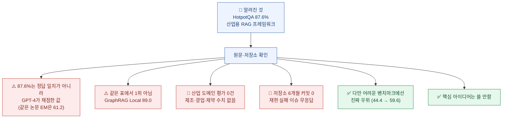
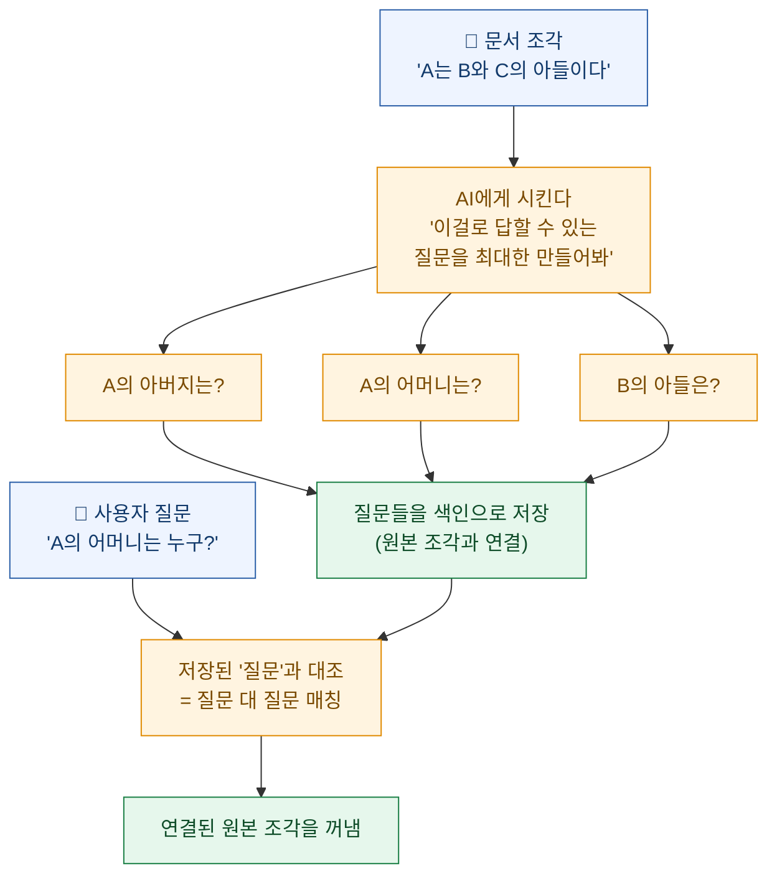
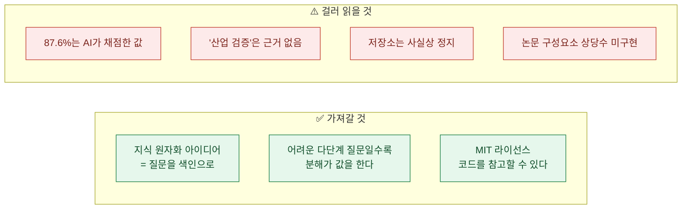

기업 자료로 AI에게 질문하는 시스템을 만들어본 사람이라면 알 것이다. **데모는 잘 되는데 실무 자료를 넣으면 무너진다.**

Microsoft Research Asia가 이 문제를 겨냥해 내놓은 게 **PIKE-RAG**다. 이름부터 야심 차다 — *전문 지식과 추론 근거를 함께 강화한 생성*(sPecIalized KnowledgE and Rationale Augmented Generation).

소개 글마다 앞장서는 숫자가 있다.

> **HotpotQA 87.6% · 2WikiMultiHopQA 82.0% · MuSiQue 59.6%**

87.6%면 대단해 보인다. 그래서 원문을 열어봤다. 그리고 **이 숫자를 읽는 방법이 생각과 많이 달랐다.**

먼저 밝혀두면, 이 글은 PIKE-RAG를 깎아내리려는 게 아니다. **아이디어 하나는 정말 가져다 쓸 만하다.** 다만 그 아이디어와 홍보 문구는 구분해서 읽어야 한다.

## 한 장 요약



## 87.6%는 누가 채점한 숫자인가

이게 첫 번째이자 가장 중요한 확인이다.

논문이 쓴 **정확도(Acc)** 는 우리가 흔히 생각하는 "정답과 일치했는가"가 아니다. 원문을 그대로 옮긴다.

> "we introduced a novel evaluation metric employing GPT-4. In this process, GPT-4 acts as an evaluator…"
> (우리는 **GPT-4를 활용하는 새로운 평가 지표를 도입**했다. 이 과정에서 GPT-4가 평가자 역할을 한다…)

**AI가 AI의 답을 채점한다.** 그리고 저장소에 그 채점 기준 문구가 그대로 있는데, 꽤 관대하다.

> "An answer is treated as correct if **the meaning of any label is expressed** in the answer. **Redundant expression in answer is allowed.**"
> (정답 라벨 중 **어느 하나의 의미라도 답변에 표현되어 있으면** 정답으로 처리한다. 답변에 **불필요한 표현이 섞여 있어도 허용**한다.)

같은 논문에 **정답 일치(Exact Match)** 도 함께 실려 있다. 나란히 놓으면 이렇다.

| 벤치마크 | 정답 일치(EM) | **GPT-4 판정(Acc)** | 차이 |
|---|---|---|---|
| HotpotQA | 61.2 | **87.6** | **+26.4** |
| 2WikiMultiHopQA | 66.8 | **82.0** | +15.2 |
| MuSiQue | 46.4 | **59.6** | +13.2 |

**같은 답을 두고 채점 방식만 바꿨는데 26포인트가 벌어진다.**

두 지표 다 나름의 쓸모가 있다. 정답 일치는 표현이 조금만 달라도 0점을 주니 지나치게 엄격하고, AI 판정은 의미가 통하면 맞다고 해주니 사람 감각에 가깝다. **문제는 이 둘을 구별하지 않고 "정확도 87.6%"라고만 옮길 때다.** 다른 논문의 정답 일치 수치와 나란히 놓으면 비교가 성립하지 않는다.

논문이 이 지표의 신뢰성을 뒷받침하는 근거는 딱 한 문장이다.

> "Upon manual inspection of a sample set, the judgments rendered by GPT-4 demonstrate complete agreement with human evaluators."
> (표본을 수작업으로 검토한 결과, GPT-4의 판정은 인간 평가자와 **완전히 일치**했다.)

**몇 개를 봤는지, 평가자가 몇 명인지, 일치도를 어떻게 쟀는지는 없다.** 오늘 다이제스트에서 다룬 것과 같은 형태다 — **숫자 없는 주장**이다.

## 같은 표에서 1위였나?

아니었다. 논문의 HotpotQA 결과표를 그대로 옮긴다.

| 방법 | 정답일치 | F1 | **GPT-4 판정** |
|---|---|---|---|
| 검색 없이 단계적 추론 | 32.60 | 43.94 | 53.60 |
| **기본 RAG** | 56.80 | 72.67 | **82.60** |
| 자문자답 + 검색 | 47.20 | 64.24 | 82.20 |
| **GraphRAG (로컬)** | 0.00 | 10.66 | **89.00 ← 최고** |
| **PIKE-RAG** | **61.20** | **76.26** | 87.60 (2위) |

두 가지가 눈에 띈다.

**① PIKE-RAG는 이 지표에서 2위다.** GraphRAG가 89.00으로 위에 있다.

**② 그런데 그 GraphRAG는 F1이 10.66이다.** 정답 일치는 아예 0.00이다.

**F1 10.66짜리 방법이 "정확도 89%"를 받는다**는 게 이 지표의 성격을 잘 보여준다. 답을 길게 늘어놓으면 그 안에 정답 의미가 들어가고, 관대한 채점자는 맞다고 해준다. **정답 일치와 F1로 보면 PIKE-RAG가 확실히 낫다.**

그리고 논문 스스로 이렇게 적었다.

> 검색을 사용하는 모든 방법이 **80%를 넘었고, 그 사이 차이는 미미하다**.

**기본 RAG가 이미 82.60**이다. 87.6의 실질 증분은 5포인트 남짓이다.

## "산업용"인데 산업 평가가 없다

여기가 이 검증에서 가장 크게 걸린 지점이다.

논문과 저장소는 **제조·광업·제약** 같은 산업 현장을 겨냥한다고 반복해서 말한다. 저장소 README에는 이렇게 적혀 있다.

> "PIKE-RAG has been **tested and significantly improved question answering accuracy** in fields such as **industrial manufacturing, mining, and pharmaceuticals.**"
> (PIKE-RAG는 **산업 제조, 광업, 제약** 등의 분야에서 **테스트되었으며 질의응답 정확도를 크게 개선**했다.)

**그런데 그 도메인의 정량 평가가 논문에 한 건도 없다.**

논문의 전체 평가 목록은 이렇다.

| 평가한 것 | 도메인 |
|---|---|
| HotpotQA · 2WikiMultiHopQA · MuSiQue | **위키피디아 기반 일반 상식** |
| 중국 법률 벤치마크 | 법률 |
| 호주 법률 QA(AI가 합성한 문항) | 법률 |

제조·광업·제약은 **서론과 문제 정의에서 동기를 설명할 때만** 등장한다. 논문의 "실제 사례 연구" 절도 산업 사례가 아니라 **위키 기반 멀티홉 문항 3건의 정성 분석**이다.

**더 결정적인 건, 같은 저장소의 다른 문서가 정반대로 말한다는 점이다.** 책임 있는 AI 관련 문서에 이렇게 적혀 있다.

> "PIKE-RAG was developed for **research purposes** and is **not intended for real-world industrial applications** without further testing and development."
> (PIKE-RAG는 **연구 목적**으로 개발되었으며, 추가 검증과 개발 없이는 **실제 산업 적용을 의도하지 않는다**.)

**같은 저장소 안에서 README와 투명성 문서가 충돌한다.** 하나는 "산업 현장에서 검증됐다"고 하고, 하나는 "산업 적용을 의도하지 않는다"고 한다.

어느 쪽을 믿어야 할까. **평가 데이터가 있는 쪽**이다. 그리고 산업 도메인 평가 데이터는 없다.

## 저장소는 살아 있나?

따라 써보려는 사람에게는 이게 실질적으로 더 중요하다.

| 항목 | 확인 결과 |
|---|---|
| 라이선스 | ✅ **MIT** (자유롭게 사용 가능) |
| 별 | 약 2,459개 |
| **최근 6개월 커밋** | 🔴 **0건** (최근 1년 통틀어 1건, 그마저 README 링크 수정) |
| 릴리스 | 초기 1개뿐, 첨부 파일 없음 |
| 미해결 PR | 로컬 모델 지원 PR이 **약 16개월째 미머지** |
| 재현 실패 이슈 | 🔴 **무응답 상태로 종료** |
| 파이썬 버전 | 명시 없음, 의존성 버전 고정도 없음 |

그리고 **논문에 나오는 구성요소 상당수가 코드에 없다.** 논문은 문서·코퍼스·정제 지식을 잇는 **이종 그래프**를 핵심으로 설명하는데, 저장소 174개 파일 중 그래프 관련 파일은 **1개**뿐이다. 난이도 분류의 L3(예측)·L4(창의) 파이프라인도 구현돼 있지 않다.

이용자들이 이슈로 정확히 이 점을 지적했지만 답변이 없다. 메인테이너가 다른 이슈에서 *"이 저장소는 알파 버전"* 이라고 답한 기록이 있다.

## 재현은 됐나?

**공개된 재현 시도는 하나뿐이고, 결과가 뒤집혔다.**

한 사용자가 오픈 모델로 HotpotQA를 돌린 결과를 이슈에 올렸다.

```
기본 RAG          F1 72.35   ← 가장 높음
자문자답+청크      F1 54.16
PIKE-RAG(원자분해) F1 48.25
```

**기본 RAG가 PIKE-RAG를 24포인트 앞섰다.** 메인테이너가 "설정을 확인해보라"고 답했고, 사용자가 로그를 제시하며 정상임을 보였지만 **그 뒤로 답변이 없다.**

백본 모델이 논문과 다르다는 점(GPT-4가 아닌 오픈 모델)은 감안해야 한다. 하지만 그 자체가 신호이기도 하다 — **GPT-4 없이는 재현되지 않을 수 있다는 뜻**이기 때문이다.

**Microsoft 자체 저장소의 수치도 논문보다 낮다.**

| 벤치마크 | 논문 | 저장소 README | 차이 |
|---|---|---|---|
| HotpotQA (EM/F1) | 61.2 / 76.26 | 59.3 / 74.0 | −1.9 / −2.3 |
| **MuSiQue** (EM/F1) | 46.4 / 56.62 | **41.5 / 51.6** | **−4.9 / −5.0** |

그리고 **논문의 87.6/82.0/59.6은 저장소 어디에도 재현돼 있지 않다.** 저장소 표에는 그 열 자체가 없다.

## 그럼 좋은 건 없나 — 아이디어 하나는 정말 쓸 만하다

여기까지 읽으면 부정적으로만 보이는데, 그렇지 않다. **핵심 아이디어 하나는 내가 당장 써보고 싶을 만큼 좋다.**

### 지식 원자화 — 문서를 "질문"으로 색인한다

보통 문서 검색은 **문서 조각을 그대로 저장**해두고, 질문이 들어오면 비슷한 조각을 찾는다. 그런데 **저장된 문장과 사람이 던지는 질문은 생김새가 다르다.**

- 문서: "A는 B와 C의 아들이다."
- 질문: "A의 어머니는 누구인가?"

뜻은 이어지는데 표현이 다르다. 그래서 검색이 어긋난다.

PIKE-RAG의 해법이 재밌다. **저장할 때 AI에게 "이 조각으로 답할 수 있는 질문들을 만들어봐"라고 시켜서, 그 질문들을 색인으로 쓴다.**



**질문을 질문끼리 맞춘다.** 문장과 질문을 맞추는 것보다 훨씬 잘 맞는다. 표현 형식이 같으니까.

이건 오늘 정리한 [맥락 보강 검색](contextual-retrieval-rag-chunking-explained)과 문제의식이 같다. 둘 다 **"저장하기 전에 한 번 손보면 검색이 좋아진다"** 는 얘기다. 다만 손보는 방식이 다르다.

| 기법 | 저장 전에 무엇을 붙이나 |
|---|---|
| 맥락 보강 검색 | **이 조각이 어디서 왔는지** 한 줄 |
| 지식 원자화 | **이 조각으로 답할 수 있는 질문들** |

**둘은 배타적이지 않다.** 같이 쓸 수 있다.

### 어려운 문제에서는 실제로 우위가 있다

숫자를 공정하게 보면, PIKE-RAG의 실질 기여는 **가장 어려운 벤치마크**에서 나온다.

| 벤치마크 | 기본 RAG | PIKE-RAG | 증분 |
|---|---|---|---|
| HotpotQA (쉬움) | 82.60 | 87.60 | +5.0 |
| 2Wiki (중간) | 62.80 | 82.00 | +19.2 |
| **MuSiQue (어려움)** | **44.40** | **59.60** | **+15.2** |

**쉬운 문제에서는 차이가 별로 없고, 어려운 문제에서 벌어진다.** 논문 자신도 HotpotQA를 *"가장 덜 어려운"* 것으로 표현했다.

이게 방향으로는 옳다. **여러 단계를 거쳐야 답이 나오는 질문**일수록 "질문을 쪼개서 필요한 지식을 단계적으로 모으는" 접근이 값을 한다.

## 그래서 어떻게 읽어야 하나

정리하면 이렇다.



**"이걸 그대로 도입하자"는 아니고, "이 아이디어를 내 시스템에 옮겨보자"가 맞는 결론이다.**

실제로 저장소를 그대로 쓰려면 파이썬 버전도 안 적혀 있고 의존성도 고정돼 있지 않아서 설치부터 막힌다. 미해결 이슈가 그 얘기다. 반면 **지식 원자화는 개념이 단순해서 어떤 검색 시스템에도 얹을 수 있다.**

## 내가 챙긴 것

이 건에서 배운 게 숫자보다 **읽는 순서**였다.

나는 처음에 "87.6%"를 보고 감탄했다. 그런데 확인 순서를 이렇게 밟으니 그림이 완전히 달라졌다.

**① 그 숫자를 누가 어떻게 쟀나** → AI가 채점했고, 기준이 관대했다
**② 같은 표에서 1위인가** → 아니었다
**③ 그 주장을 뒷받침하는 데이터가 있나** → "산업 검증"은 근거가 없었다
**④ 코드가 살아 있나** → 6개월 커밋 0건
**⑤ 남이 재현했나** → 유일한 시도에서 뒤집혔다

**다섯 질문 다 원문과 저장소에 답이 있었다.** 숨겨져 있지도 않았다. 그냥 아무도 안 열어본 것이다.

그리고 이 다섯을 통과하지 못했다고 해서 가치가 없는 것도 아니다. **지식 원자화라는 아이디어는 이 다섯 질문과 무관하게 좋다.** 숫자를 걷어내고 나서야 그게 더 잘 보였다.

---

## 참고

- Jinyu Wang 외, *"PIKE-RAG: sPecIalized KnowledgE and Rationale Augmented Generation"* (arXiv:2501.11551, v1 2025-01-20 / v4 2025-03-12). 저자 전원 Microsoft Research Asia. 논문이 스스로 **"technique report"** 로 표기 — 동료심사 논문이 아니다
- 다만 **원자화·분해 기법 자체는 ICML 2025 포스터로 동료심사를 통과**했다(별도 제목). 87.6/82.0/59.6이라는 수치를 담은 기술보고서는 통과하지 않았다
- 저장소 — `github.com/microsoft/PIKE-RAG`, **MIT 라이선스**
- 실험 조건: 각 데이터셋 **개발셋에서 500문항 무작위 추출**, 그 문항에 딸린 지문만으로 검색 코퍼스 구성, 백본 GPT-4
- ⚠️ **논문에 한계(Limitations) 섹션이 없다.** 결론 다음이 곧바로 참고문헌이다
- 본문의 수치·인용문은 모두 논문 원문·저장소 문서에서 직접 확인한 것이며, 원문에 없는 수치는 어떤 형태로도 추정하지 않았다

*⚠️ 벤치마크 점수는 백본 모델·코퍼스 크기·채점 방식이 모두 같을 때만 비교할 수 있다. 이 글의 비교표는 전부 **같은 논문 안의 같은 조건** 수치끼리 놓은 것이다.*
