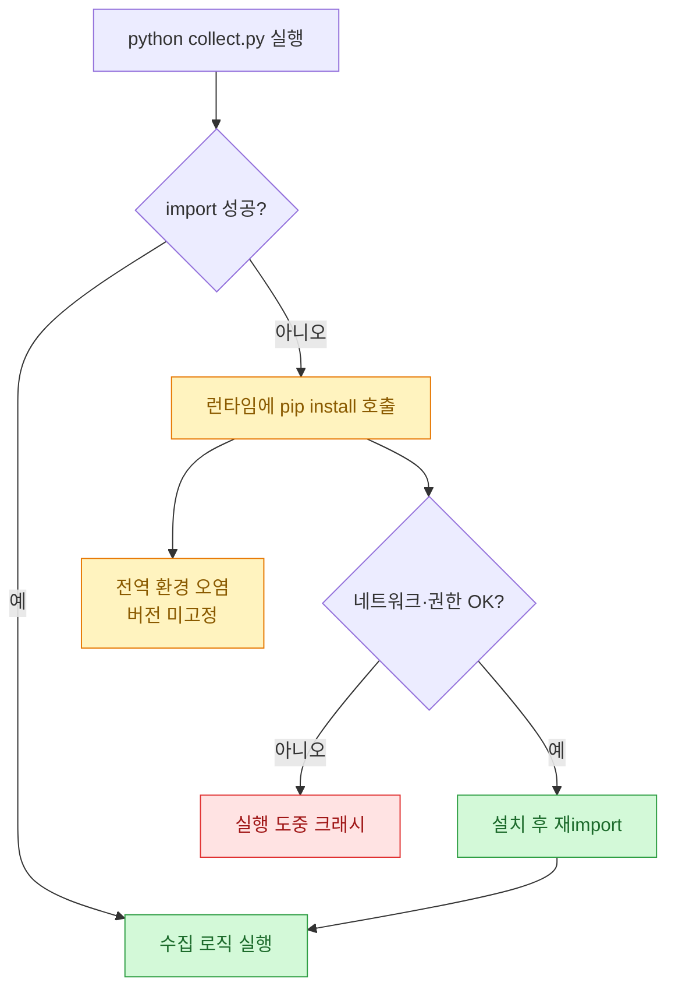
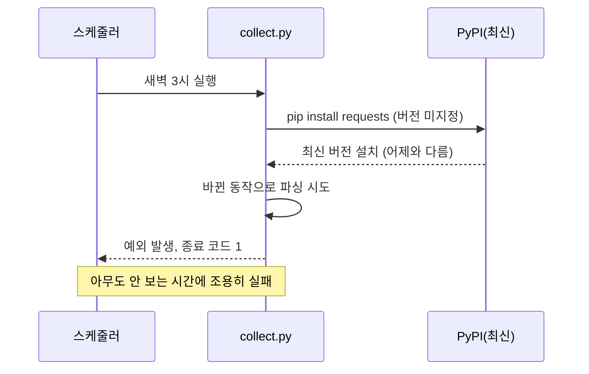
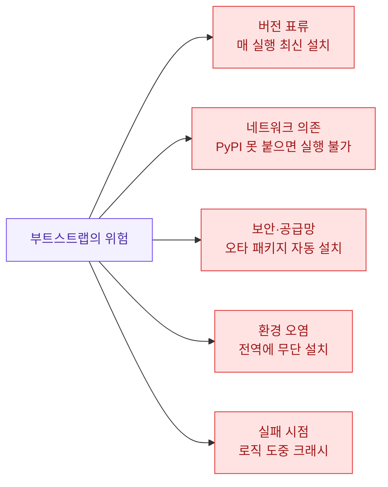
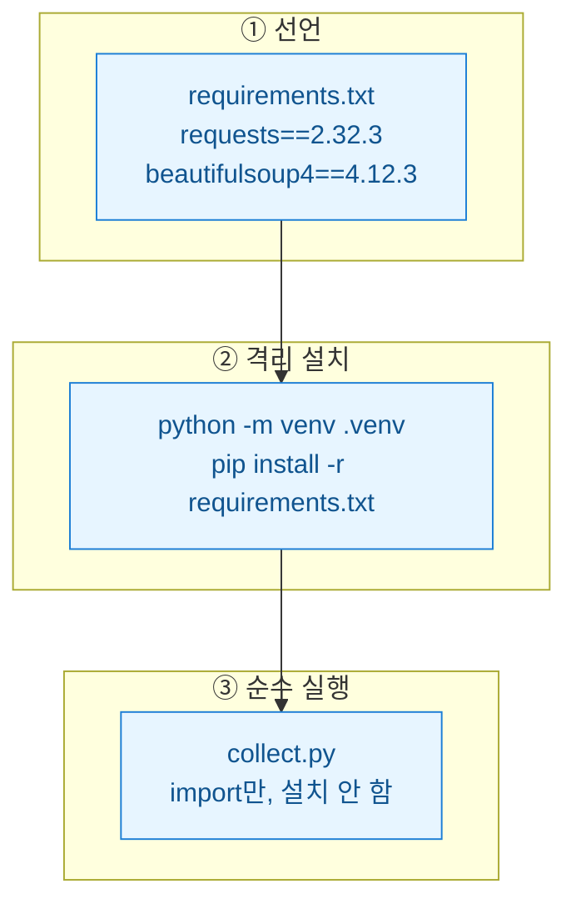
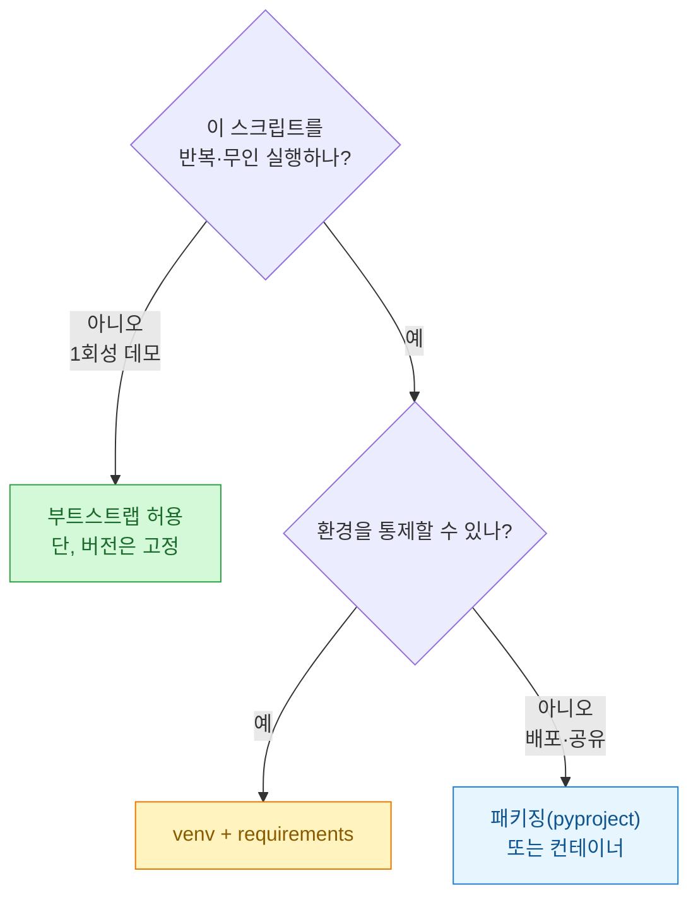
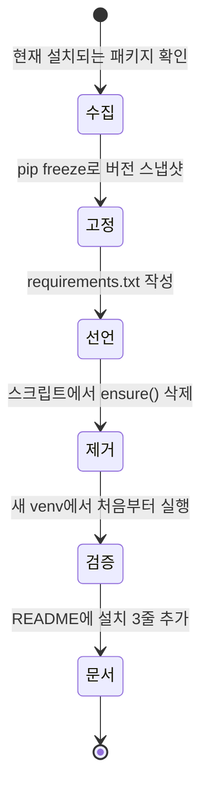
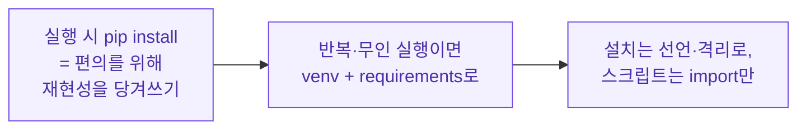

몇 년 전 내가 짠 수집 스크립트를 오랜만에 열어봤다. 맨 위에 이런 게 있었다. "실행하면 알아서 `requests`랑 `bs4`를 깔아주는" 로직. 그때는 스스로 똑똑하다고 생각했다. 남한테 파일 하나만 던져주면 아무 준비 없이 돌아가니까. 그런데 지금 다시 보니, 이건 편한 만큼 조용히 위험을 쌓아두는 패턴이었다. 오늘은 이 "실행 시 pip install" 부트스트랩 패턴이 왜 매력적이고, 왜 결국 손절해야 하는지를 정리한다.

> 이 글의 모든 코드·수치·로그는 **합성(더미) 데이터**다. 실제 사내 스크립트나 거래처 환경과는 무관하다.

## 그래서 그 "부트스트랩"이 뭔데?

말은 거창하지만 실체는 단순하다. import가 실패하면 그 자리에서 pip를 호출해 패키지를 깔고 다시 import하는 코드다.

```python
import importlib
import subprocess
import sys

def ensure(pkg, import_name=None):
    """pkg가 없으면 즉석에서 설치한다 (안티패턴 예시)."""
    name = import_name or pkg
    try:
        return importlib.import_module(name)
    except ImportError:
        subprocess.check_call([sys.executable, "-m", "pip", "install", pkg])
        return importlib.import_module(name)

requests = ensure("requests")
bs4 = ensure("beautifulsoup4", "bs4")
```

겉보기엔 친절하다. `python collect.py` 한 방이면 아무 환경에서나 돌아가는 것처럼 보인다. 문제는 이 친절함이 어디에 비용을 떠넘기는지가 보이지 않는다는 데 있다.

전체 그림을 먼저 도식으로 깔아둔다.



핵심은 오른쪽 아래다. 잘 풀리면 그냥 넘어가지만, 안 풀리면 **수집 로직 한복판에서** 터진다.

## 왜 이게 처음엔 그렇게 매력적으로 보일까?

솔직히 이유가 있어서 이렇게들 짠다. 나도 그랬고. 장점을 인정하지 않으면 왜 위험한지도 설명이 안 된다.

| 매력 포인트 | 실제로 무엇을 없애주나 | 숨은 청구서 |
| --- | --- | --- |
| 파일 하나만 전달 | "가상환경 만드세요" 안내가 필요 없음 | 받는 사람이 뭐가 깔리는지 모름 |
| 준비 단계 제로 | README·설치 문서가 없어도 굴러감 | 재현성·기록이 사라짐 |
| "일단 돌아감" | 데모·1회성 스크립트에서 빠름 | 오래 쓰면 버전 표류(drift) 누적 |

정리하면, 부트스트랩은 **오늘의 편의를 위해 내일의 재현성을 당겨쓰는** 구조다. 일회성 데모라면 이 거래가 남는 장사일 수 있다. 하지만 스케줄러에 올라가 매일 도는 수집기라면 얘기가 완전히 달라진다.

## 오래 쓰면 구체적으로 뭐가 터지나?

가장 아픈 건 "버전 표류"다. 버전을 고정하지 않으니 어제 돌던 스크립트가 오늘 라이브러리 업데이트 한 번에 깨진다. 무인 스케줄이라면 새벽에 조용히 실패하고, 아침에야 로그를 뒤진다.



문제는 이 한 가지가 아니다. 실패 지점을 유형별로 나눠 보면 이렇다.



특히 세 번째, 보안 문제가 은근히 무섭다. `ensure("beatifulsoup4")` 처럼 오타가 나면, 그 이름의 악성 패키지가 PyPI에 존재할 경우 **자동으로** 설치해버린다. 사람이 눈으로 확인하는 단계가 없어서다. 전역 파이썬에 설치되면 다른 스크립트까지 영향을 받는다.

## 그럼 대안은? venv + requirements가 기본값

해법은 새로울 게 없다. 예전부터 있던 정석이다. 의존성을 **선언**하고, 격리된 곳에 **고정 설치**하고, 스크립트는 그냥 import만 한다. 세 가지를 분리하는 게 핵심이다.



먼저 버전을 박아둔 선언 파일을 만든다. 실무에서는 `pip freeze`로 지금 잘 도는 조합을 그대로 떠서 고정하는 게 편하다.

```text
# requirements.txt (합성 예시)
requests==2.32.3
beautifulsoup4==4.12.3
lxml==5.2.2
```

그다음 가상환경을 만들고 거기에만 설치한다. 전역을 건드리지 않으니 다른 프로젝트와 충돌하지 않는다.

```bash
python -m venv .venv
# Windows
.venv\Scripts\activate
# macOS / Linux
source .venv/bin/activate

pip install -r requirements.txt
```

이제 스크립트는 담백해진다. 설치 로직이 통째로 사라지고, import 실패는 "환경 준비가 안 됐다"는 **명확한 신호**가 된다. 새벽에 몰래 최신 버전을 깔다 깨지는 대신, 실행 초입에서 대놓고 멈춘다.

```python
# collect.py — 설치 책임을 지지 않는다
import sys

try:
    import requests
    from bs4 import BeautifulSoup
except ImportError as e:
    sys.exit(
        f"의존성 미설치: {e.name}. "
        "'.venv 활성화 후 pip install -r requirements.txt'를 먼저 실행하세요."
    )

def fetch_titles(url: str) -> list[str]:
    # 합성 예시: 실제 대상 사이트가 아니다
    html = requests.get(url, timeout=10).text
    soup = BeautifulSoup(html, "lxml")
    return [h.get_text(strip=True) for h in soup.select("h2.title")]
```

실패가 로직 한복판이 아니라 문 앞에서 일어나는 것, 이 차이가 운영에서는 꽤 크다.

## 두 방식을 나란히 놓으면 차이가 분명해진다

말로만 하면 감이 안 오니 표로 붙여둔다.

| 항목 | 실행 시 pip install | venv + requirements |
| --- | --- | --- |
| 재현성 | 매 실행 결과 다를 수 있음 | 고정 버전으로 동일 재현 |
| 실패 시점 | 수집 로직 도중 | 실행 초입(명확) |
| 네트워크 | 매 실행 PyPI 필요 | 최초 1회만 |
| 보안 | 오타 패키지 자동 설치 위험 | 선언 파일 리뷰 가능 |
| 전역 환경 | 오염됨 | 격리됨 |
| 전달 편의 | 파일 하나면 끝 | README 한 줄 필요 |

부트스트랩이 이기는 칸은 맨 아래 "전달 편의" 딱 하나다. 그 한 칸 때문에 나머지를 다 내주는 셈이다.

## 그래도 부트스트랩이 정당한 순간은 없나?

아예 없다고 말하면 거짓말이다. 상황을 나눠 판단하면 된다.



정 즉석 설치를 써야 한다면 최소한 버전만은 박아라. `ensure("requests")`가 아니라 `ensure("requests==2.32.3")`처럼. 그것만으로도 "매 실행 최신"이라는 가장 큰 위험은 막는다. 하지만 이건 어디까지나 임시방편이고, 반복 실행되는 순간 venv로 옮기는 게 맞다.

## 옛 스크립트를 지금 옮긴다면 순서는?

내가 실제로 그 오래된 스크립트를 정리했던 순서를 일반화하면 이렇다.



여기서 놓치기 쉬운 게 "검증" 단계다. 반드시 **비어 있는 새 가상환경**에서 처음부터 돌려봐야 한다. 기존 전역에 이미 깔린 패키지가 있으면, 정작 requirements에 빠진 의존성을 못 잡아낸다. 깨끗한 환경에서 한 번 성공해야 진짜 재현 가능한 상태다.

## 한 줄 요약



- 부트스트랩은 1회성 데모에서만 남는 장사다. 그마저도 버전은 고정하자.
- 반복·무인 실행 스크립트라면 의존성을 선언(requirements)하고 격리(venv)하는 게 기본값이다.
- 실패는 로직 한복판이 아니라 문 앞에서 나게 만들어라. 그게 새벽에 조용히 죽는 스크립트를 막는 길이다.
