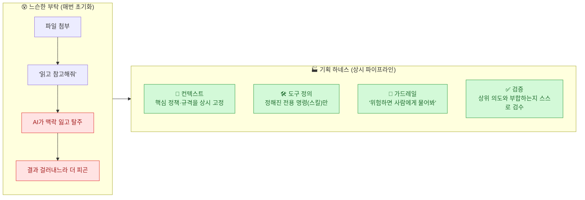
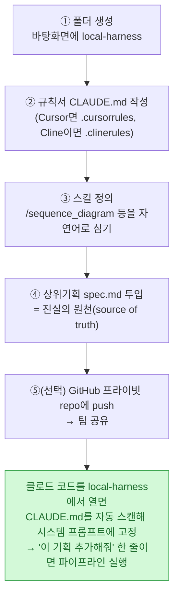
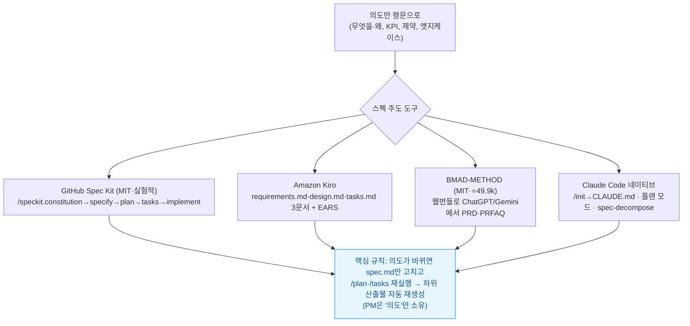
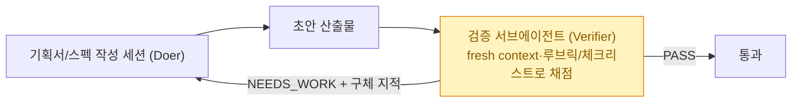

> **하네스 3부작** — **① 기획 하네스: 혼자 상세기획 자동화(이 글)** · ② [[design-md-claude-design-portable-design-system|디자인 하네스: DESIGN.md 한 장]] · ③ [[claude-tag-multiplayer-agents|팀 하네스: Claude Tag]]

며칠 전 읽은 뉴스레터(Product Makers Note 19호) 한 대목이 계속 남았다. 한 기획자가 상위기획은 AI로 똑똑하게 짜놓고, **상세기획 단계에서 시퀀스 다이어그램 화살표 꼬인 걸 붙잡고** 멘탈이 바스러지고 있는데, 옆자리 개발자가 툭 던졌다는 말.

> "왜 상위기획은 AI로 잘 짜놓고, 상세기획은 손노가다로 해요? 그리고 클로드한테 그냥 생으로 일을 시키니까 애가 자꾸 삼천포로 빠지죠. **기획자용 '하네스' 하나 깔면 끝날 일인데.**"

데이터·마케팅 자동화를 혼자 굴려 온 나도 정확히 같은 지점에서 시간을 버려 왔다. 상위기획(무엇을·왜)까진 AI가 잘 도와주는데, **상세기획(어떻게)**으로 내려가면 "이 문서 참고해서 수정해줘"라고 던질 때마다 AI가 맥락을 잃고 엉뚱한 소설을 쓴다. 그걸 걸러내느라 오히려 더 피곤하다. 이 글은 그 문제를 **하네스**로 끝내는 법이다.

## 기획 하네스가 뭔가? — 느슨한 부탁 vs 통제된 공장

챗GPT 창에 기획서(md)를 첨부하며 "읽고 다음 상세기획 짜줘"라고 하는 건, **똑똑한 인턴에게 "매뉴얼 대충 읽고 눈치껏 해봐"라고 부탁하는 느슨한 대화**일 뿐이다. 인턴은 금세 매뉴얼을 까먹고 자기 생각을 섞어 사고를 친다.

하네스는 이 느슨한 대화를 **통제된 자동화 공장**으로 바꾼다. AI가 딴짓 못 하게 **폴더 안에 가드레일과 장비를 물리적으로 깔아주는** 방식이다.

기획 하네스는 이 **네 가지 기둥**을 책임진다 — **컨텍스트·도구 정의·가드레일·검증.** 파일 하나 던지는 게 '변덕에 기댄 일회성 부탁'이라면, 하네스는 **AI를 내 폴더에 가두고 언제 켜도 같은 고품질을 뱉게 하는 절대적 파이프라인**이다.

## 그냥 파일 첨부랑 뭐가 다른가?

네 가지가 비교 불가능하게 다르다.

| | 파일 첨부(프롬프팅) | 기획 하네스 |
|---|---|---|
| **파이프라인** | 매번 "이 파일 읽어, 저 규칙 참고해" 애원 | 시스템에 세팅돼 **상시 대기**, 구구절절 안 해도 규칙 인지 |
| **실행** | 대화창에 코드만 뱉고 끝 | **File I/O 권한**으로 `spec.md`·`flow.mermaid`를 폴더에 직접 생성·수정 |
| **팀 자산** | 개인 프롬프트를 메모장에 들고 다님 | 폴더째 GitHub에 올려 **팀 전체가 공유**("이 폴더 받아 클로드 코드 켜면 우리 규격대로") |
| **자동화** | 단계마다 새로 지시 | 툭 던지면 **CLAUDE.md의 파이프라인을 기계처럼** 밟음 |

## 10분 만에 만드는 법

거창한 코딩이 필요 없다. **폴더 하나 + 규칙 파일 하나**면 그 자체로 하네스다.

뉴스레터의 실전 예가 좋았다 — 메모 앱에 '댓글 기능'을 추가한다고 할 때, CLAUDE.md에 `/sequence_diagram`(백엔드 로직 시각화) → `/user-flow`(유저 플로우) → `/make-html`(HTML 프리뷰 배포) **3단계 워크플로를 자연어로 정의**해 두면, "댓글 기능 추가할 거야" 한 줄에 클로드가 선 안 꼬인 Mermaid 시퀀스와 촘촘한 유저 플로우를 자동으로 구워낸다. 하네스 없이 했다면 "이제 시퀀스 그려줘" → 복사 → 뷰어에 붙여넣기 → "이제 유저플로우 그려줘"의 **지루한 프롬프트 핑퐁**이었을 일이다.

## 진짜 무기는 '스킬'이다

하네스가 "업무를 실행하는 큰 틀"이라면, **스킬(Skill)은 그 안에서 호출되는 전문 기능**이다. 뉴스레터가 든 예시에 내가 조사한 실제 도구를 붙이면 이렇게 된다:

| 스킬(예시) | 역할 | 실제로 붙일 수 있는 도구 |
|---|---|---|
| `/split-requirements` | 큰 기능을 세부 요구사항으로 분해 | **EARS 표기**(When/While/If…then 6패턴)로 모호성 제거 |
| `/sequence_diagram` | 백엔드 로직을 Mermaid로 | **claude-mermaid MCP**(라이브 프리뷰·SVG/PNG 내보내기, MIT) |
| `/user-flow` | 사용자 플로우 시각화 | Mermaid·D2·Excalidraw MCP(편집 가능 캔버스) |
| `/logic-check` | 예외·엣지케이스 생성 | **adversarial 리뷰어 스킬**(냉소적 페르소나로 숨은 가정 폭로) |
| `/release-note` | 개발팀 공유용 요약 | **release-kit**(`/changelog`·`/release-notes`, git·PR 분석) |
| `/deploy-jira` | 각 파트에 Jira 배정 | **Atlassian Rovo MCP**·**Linear MCP**(자연어로 "이 노트로 이슈 5개") |

스킬은 `.claude/skills/<name>/SKILL.md`에 자연어 시스템 프롬프트로 정의하면, description이 매칭될 때 클로드가 **자동 위임**한다. `/deploy-jira`의 경우, "스펙 diff → 티켓화"를 한 방에 하는 전용 도구는 아직 없고 **MCP 쓰기 툴 + 자연어 지시로 조립**하는 게 실무다(예: `Make five Jira issues from these notes`).

## 여기서 더 나아가면: 스펙 주도 개발(SDD)

이 "의도만 쓰고 나머지는 AI가"라는 발상은 2025~26년 **스펙 주도 개발(Spec-Driven Development)**이라는 이름으로 정착했다. **코드가 아니라 명세(spec)를 '진실의 원천'으로** 삼는다. PM에게 유용한 도구가 여럿이다:

특히 **GitHub Spec Kit**은 `specify init --integration claude`로 시작해 `/speckit.constitution`(바뀌지 않는 원칙) → `/speckit.specify`(무엇/왜만, 기술스택 언급 금지) → `/speckit.plan` → `/speckit.tasks`(병렬 가능 태스크는 `[P]` 마킹) → `/speckit.implement`로 흐른다. 비개발 PM에겐 **BMAD의 웹번들**(정액 구독 ChatGPT·Gemini에서 PRD·PRFAQ 작성 후 IDE로 이관)이나 **Kiro**(EARS 표기로 요구사항 정형화)가 진입장벽이 더 낮다.

> ⚠️ 균형을 위해 짚는다. (1) **GitHub Spec Kit은 스스로를 'experimental'로 명시**한다 — 프로덕션 표준이 아니다. (2) 스타 수는 직접 확인된 것만 쓰면 **BMAD-METHOD ⭐49,913(2026-07-01)**이고, 2차 가이드의 다른 수치(OpenSpec 5.2만 등)는 미검증이다. (3) Kiro의 'SMT 솔버 모순 탐지' 같은 표현은 벤더 마케팅으로 독립 검증 안 됐다. (4) **대다수 SDD 도구는 결국 '코드 생성'이 목표**라, 순수 '기획 문서화'로의 전용은 PM들이 차용하는 초기 단계다. 마크다운·CLI·브랜치 개념을 요구해 완전 비기술자에겐 여전히 문턱이 있다.

## 가장 중요한 기둥: 검증 (그리고 pi-subagents)

네 기둥 중 실무에서 가장 자주 빠뜨리는 게 **검증**이다. 그런데 여기 함정이 있다 — **LLM에게 자기 작업을 채점하게 하면 무조건 후하게 준다.** Anthropic도 "자기평가 편향 때문에, 회의적으로 튜닝한 **별도 평가자**를 두는 게 자기비판보다 훨씬 잘 된다"고 밝혔다. 이게 **Doer-Verifier(maker≠checker)** 하네스다.

핵심 트릭 하나 — **검증 서브에이전트에게는 `Write`/`Edit` 도구를 주지 않는다.** `.claude/agents/evaluator.md`에서 `tools: Read, Grep`만 허용하면, **검사자가 산출물을 못 고치는 분리가 구조적으로 강제**된다. 통과 조건(예: 수용기준 전부 충족)을 만족할 때까지 `/goal` 루프로 자동 반복시키면 품질 게이트가 완성된다. 예외·엣지케이스는 **adversarial 리뷰어**(냉소적 페르소나)나 두 모델을 논쟁시키는 방식으로 뽑아낸다("입력이 비면? 사용자가 12개 언어면?").

이 '검증·병렬'을 코딩 에이전트 수준에서 가장 깔끔하게 구현한 게 오늘 같이 나온 **pi-subagents(⭐2.4k, MIT 계열 오픈소스)**다. Pi 코딩 에이전트(마리오 제크너/earendil-works의 오픈소스 — *Anthropic Claude CLC가 아니다*)가 작업을 자식 세션에 위임한다:

- **내장 8종** — scout(정찰)·researcher·planner·worker·reviewer·context-builder·oracle(2차 의견)·delegate
- **6단계 수락 게이트** — `auto → none → attested → checked → verified → reviewed` (완료의 '증거 수준'을 단계로 관리)
- **git worktree 격리** — 병렬 자식이 같은 파일 편집 시 충돌 방지(각자 HEAD에서 분기한 독립 worktree)
- **재귀 깊이 기본 2단계 + child safety** — 무한 중첩 방지, 자식은 부모 권한을 그대로 못 받음

수락 게이트의 `verified`·`reviewed`가 정확히 하네스의 **검증 기둥**이고, 이 사상은 [[claude-tag-multiplayer-agents|3부(팀 하네스)]]의 Doer-Verifier와 그대로 이어진다. `pi install npm:pi-subagents` 한 줄로 깔고 자연어로 "reviewer로 이 diff 검토해"라 쓴다.

## 마크다운 하네스의 한계 — 비주얼

솔직한 한계 하나. 마크다운의 시각 도구는 **볼드·헤더·불릿이 전부**라, 색·픽셀·공간관계 같은 **비주얼 UX는 텍스트 하네스로 근사할 수밖에 없다.** 뉴스레터도 "예쁜 와이어프레임 같은 UX 영역은 클로드 코드만으론 어렵다"고 인정했다. 시퀀스·유저플로우 같은 **로직**은 이 기획 하네스로 자동화되지만, **화면이 어떻게 보이느냐**는 다른 하네스가 필요하다.

그 답이 **DESIGN.md와 Claude Design** — 바로 [[design-md-claude-design-portable-design-system|2부(디자인 하네스)]]다.

## 내 일에 적용한다면

| 내 작업 | 기획 하네스 적용점 |
|---|---|
| 마케팅·콘텐츠 기획 | 브랜드 정책·톤을 `CLAUDE.md`에 **컨텍스트로 고정**, 캠페인 스펙을 `spec.md` 단일 원천으로 |
| 반복 산출물 | 시퀀스·플로우·요약을 **스킬**로 정의(자연어 한 줄 → 파이프라인) |
| 데이터 요구사항 | `/split-requirements` + **EARS 표기**로 모호성 제거 |
| 품질 | **maker≠checker** — 검증 서브에이전트에 `Write` 제거, `/goal` 루프로 게이트 |
| 팀 확장 | 폴더를 GitHub에 올려 공유([[claude-tag-multiplayer-agents|3부]]로 이어짐) |

혼자 폴더에 하네스를 까는 이 이야기는, **비주얼([[design-md-claude-design-portable-design-system|2부]])**과 **팀([[claude-tag-multiplayer-agents|3부]])**으로 확장되고, 마지막엔 "그렇게 자동화하면 우리는 우리 시스템을 여전히 이해하나?"라는 [[the-coming-loop-armin-ronacher-harness-critique|불편한 질문(에필로그)]]으로 닫힌다.

## 참고자료

- [Product Makers Note 19호 — 기획 하네스로 완성하는 상세기획 워크플로 자동화](https://news.hada.io/topic?id=30870)
- [GitHub — github/spec-kit (Spec Kit)](https://github.com/github/spec-kit)
- [Amazon Kiro](https://kiro.dev/) · [EARS 표기법](https://alistairmavin.com/ears/)
- [GitHub — bmad-code-org/BMAD-METHOD](https://github.com/bmad-code-org/BMAD-METHOD)
- [GitHub — veelenga/claude-mermaid (라이브 프리뷰 MCP)](https://github.com/veelenga/claude-mermaid)
- [Atlassian Rovo MCP](https://github.com/atlassian/atlassian-mcp-server) · [Linear MCP](https://linear.app/docs/mcp)
- [Anthropic Engineering — Harness design for long-running application development](https://www.anthropic.com/engineering)
- [GitHub — nicobailon/pi-subagents](https://github.com/nicobailon/pi-subagents)

<!-- 안전: 회사 실데이터·고객/제3자 PII·API키/쿠키/토큰 없음. 공개 뉴스레터·저장소·문서 기반 정리 + 벤더 주장/스타수 팩트체크. -->
