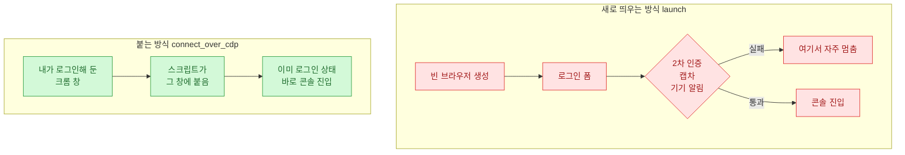
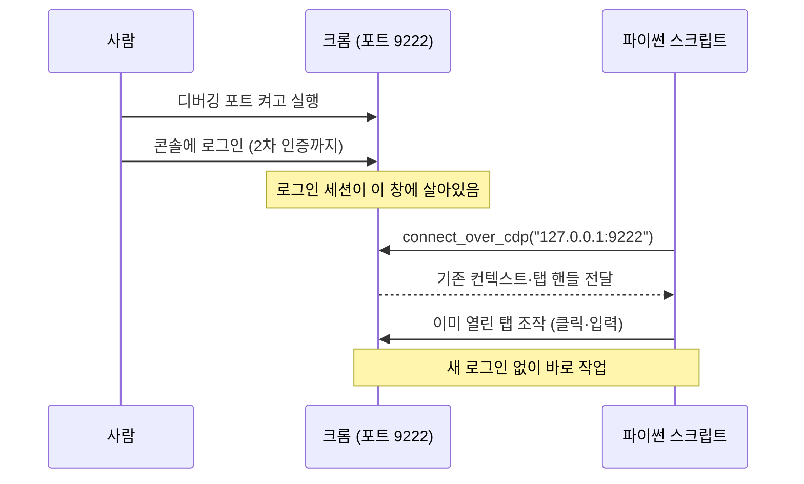
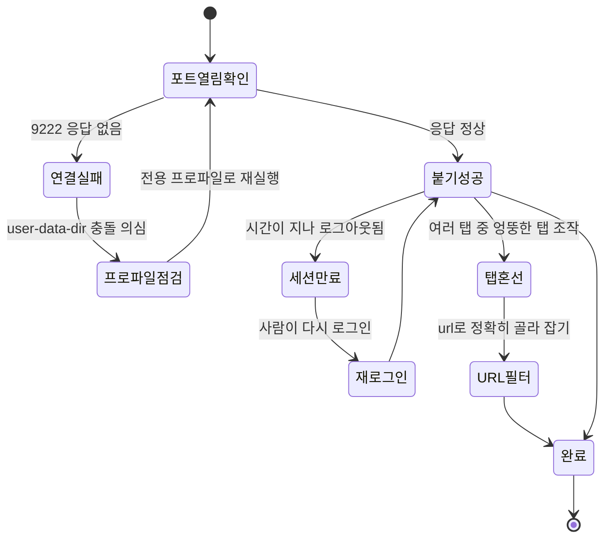
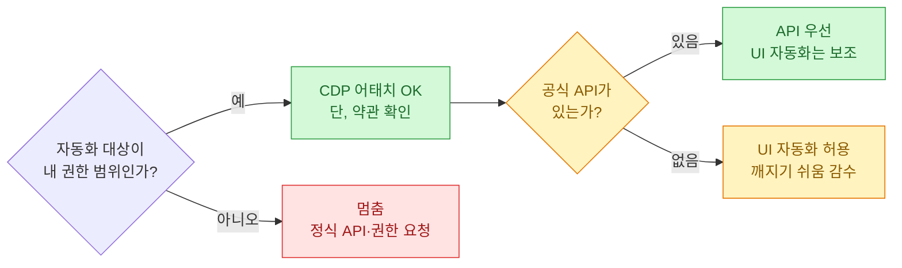
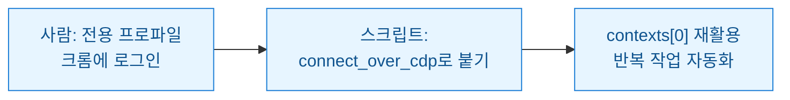

무인 자동화를 짜다 보면 항상 같은 벽에 부딪힌다. 로그인이다. 검색엔진 관리 콘솔 같은 페이지는 아이디·비밀번호에 2차 인증, 캡차, "새 기기에서 로그인했어요" 알림까지 겹쳐서, 스크립트가 매번 새 브라우저를 띄우는 순간 첫 화면부터 막혀버린다. 내가 오래 쓴 우회는 조금 다르다. 스크립트가 브라우저를 새로 띄우지 않고, **내가 이미 로그인해 둔 크롬 창에 그대로 붙는다.** 이게 CDP(Chrome DevTools Protocol) 어태치 방식이다.

이 글은 그 패턴의 원리와 셋업, 그리고 겪었던 함정을 정리한 회고다. 코드와 수치는 전부 **합성(더미) 예시**이고, 특정 회사의 실제 계정·콘솔·데이터와는 무관하다.

## 새 브라우저를 띄우는 방식은 왜 자꾸 막히나?

우리가 흔히 쓰는 `playwright.chromium.launch()`는 **깨끗한 새 브라우저**를 하나 만든다. 쿠키도 없고, 로그인 세션도 없고, 확장도 없는 무균실 같은 상태다. 테스트에는 좋지만, 로그인 뒤에서만 보이는 콘솔을 다루려면 매 실행마다 로그인 관문을 통과해야 한다.



핵심 차이는 한 줄로 요약된다. launch는 세션을 **새로 만들고**, connect는 세션을 **빌려 쓴다.** 로그인이라는 사람 손이 꼭 필요한 단계를 사람이 한 번 해두고, 반복 작업만 스크립트에 맡기는 구조다.

## CDP로 "붙는다"는 게 정확히 무슨 뜻인가?

크롬은 디버깅 포트를 열어둘 수 있다. `--remote-debugging-port=9222` 옵션으로 크롬을 켜면, 그 크롬은 `127.0.0.1:9222`에서 자기 내부를 조종할 수 있는 창구를 하나 연다. 이게 CDP다. 원래는 개발자 도구가 브라우저와 대화하려고 쓰는 통로인데, Playwright도 같은 통로로 들어갈 수 있다.



포인트는 `connect_over_cdp`가 **새 브라우저를 만들지 않는다**는 점이다. 이미 돌아가는 크롬 프로세스에 손잡이를 거는 것뿐이다. 그래서 그 크롬이 들고 있던 로그인 세션, 쿠키, 열린 탭이 스크립트 쪽에서 그대로 보인다.

## 실제 셋업은 어떻게 하나?

두 단계다. ① 디버깅 포트를 연 크롬을 실행하고 ② 스크립트로 붙는다. 윈도우에서 크롬을 전용 프로파일로 띄우는 예시는 이렇다. 실제 경로·포트는 환경마다 달라지니 값은 예시로 본다.

```powershell
# 디버깅 포트를 연 크롬을 별도 프로파일로 실행 (합성 예시)
Start-Process "chrome.exe" -ArgumentList @(
  "--remote-debugging-port=9222",
  "--user-data-dir=C:\cdp-profile\auto"
)
```

전용 `--user-data-dir`을 쓰는 이유가 있다. 평소 쓰는 크롬과 프로파일이 겹치면 디버깅 포트가 제대로 안 열리거나, 이미 실행 중인 크롬 때문에 새 옵션이 무시되는 일이 잦다. 자동화 전용 프로파일을 하나 파두고 거기서만 콘솔에 로그인해 두는 편이 훨씬 안정적이었다.

그다음 파이썬에서 붙는다.

```python
from playwright.sync_api import sync_playwright

CDP_URL = "http://127.0.0.1:9222"

def open_console_page(target_hint="console"):
    """이미 로그인된 크롬에 붙어 원하는 탭 핸들을 돌려준다. (합성 예시)"""
    with sync_playwright() as p:
        browser = p.chromium.connect_over_cdp(CDP_URL)

        # 붙은 크롬에는 이미 컨텍스트가 있다. 새로 만들지 말 것.
        if not browser.contexts:
            raise RuntimeError("붙을 컨텍스트가 없음 — 크롬이 포트를 안 열었을 수 있음")
        context = browser.contexts[0]

        # 열린 탭 중에서 원하는 탭을 고르거나, 없으면 새 탭을 연다
        page = None
        for pg in context.pages:
            if target_hint in pg.url:
                page = pg
                break
        if page is None:
            page = context.new_page()
            page.goto("https://example.com/console")  # 합성 URL

        print("현재 URL:", page.url)
        return page

if __name__ == "__main__":
    open_console_page()
```

`launch`를 쓸 때와 결정적으로 다른 지점은 `browser.contexts[0]`이다. 붙는 방식에서는 컨텍스트를 **내가 만드는 게 아니라 이미 있는 걸 꺼내 쓴다.** 여기서 습관적으로 `new_context()`를 부르면 로그인 안 된 빈 컨텍스트가 생겨서, 붙은 의미가 사라진다.

## launch와 connect, 언제 뭘 쓰나?

둘은 경쟁 관계가 아니라 용도가 다르다. 표로 정리하면 선택이 쉬워진다.

| 상황 | launch (새로 띄우기) | connect_over_cdp (붙기) |
| --- | --- | --- |
| 로그인 불필요한 공개 페이지 | 적합 | 과함 |
| 2차 인증·캡차가 있는 콘솔 | 매번 막힘 | 적합 |
| CI 서버에서 완전 무인 실행 | 적합 | 사람이 로그인해 둬야 함 |
| 세션 재활용이 핵심 | 세션 없음 | 세션 그대로 |
| 재현성·격리(테스트) | 깨끗해서 좋음 | 상태가 섞일 수 있음 |

정리하면, **로그인 관문이 사람 손을 요구하는데 그 뒤 작업은 반복적일 때** 붙는 방식이 빛난다. 반대로 완전 무인 서버에서 밤새 돌려야 한다면, 사람이 로그인 세션을 유지해 줄 수 없으니 서비스 계정이나 정식 API 같은 다른 길을 봐야 한다.

## 실제로 뭘 자동화했나 (합성 시나리오)

로그인 뒤 콘솔에서 하는 일은 대개 비슷하다. 목록을 훑고, 입력창에 값을 넣고, 버튼을 누르고, 결과를 읽는다. 아래는 가상의 "콘솔에서 항목 상태를 읽어 표로 남기는" 흐름이다. 데이터는 전부 더미다.

```python
def collect_rows(page):
    """콘솔 표에서 행을 읽어 딕셔너리 리스트로 (합성 데이터)"""
    page.wait_for_selector("table.items tbody tr", timeout=15000)
    rows = []
    for tr in page.query_selector_all("table.items tbody tr"):
        cells = tr.query_selector_all("td")
        rows.append({
            "name": cells[0].inner_text().strip(),
            "status": cells[1].inner_text().strip(),
            "updated": cells[2].inner_text().strip(),
        })
    return rows

# 실행 결과 예시 (더미)
# [{'name': '항목-A', 'status': '정상',   'updated': '2026-07-14'},
#  {'name': '항목-B', 'status': '검토중', 'updated': '2026-07-13'},
#  {'name': '항목-C', 'status': '대기',   'updated': '2026-07-12'}]
```

여기서 얻는 이점은 "사람이 매일 손으로 콘솔을 열어 표를 눈으로 확인하던 일"을 스크립트가 대신한다는 것이다. 그런데 로그인이 걸림돌이었을 뿐인데, 그 걸림돌만 CDP 어태치로 걷어내니 나머지는 평범한 Playwright 조작으로 풀린다.

## 어떤 함정이 있었나?

편한 만큼 조용히 깨지는 지점이 여럿 있었다. 원인과 대처를 상태 흐름으로 정리했다.



특히 자주 만난 세 가지다.

- **포트가 안 열림.** 이미 평소 크롬이 떠 있으면 디버깅 옵션이 무시된다. 전용 프로파일로 별도 실행해야 포트가 실제로 열린다.
- **세션 만료.** 붙는 방식의 본질적 약점이다. 사람이 로그인해 둔 세션이 만료되면 스크립트도 같이 죽는다. 무인 장시간 실행에는 근본적으로 안 맞는다.
- **탭 혼선.** 붙은 크롬에 탭이 여러 개면 엉뚱한 탭을 조작한다. `url in pg.url`로 대상 탭을 정확히 골라 잡는 습관이 필요했다.

## 이 방식은 안전하고 정당한가?

기술이 되는 것과 해도 되는 것은 다르다. CDP 어태치는 **어디까지나 내 계정, 내 브라우저, 내가 권한을 가진 콘솔**에 대해서만 써야 한다. 남의 세션에 붙거나, 서비스 약관이 자동화를 금지한 화면을 우회하는 용도로 쓰면 곤란하다.



그리고 이 방식은 UI에 기댄 자동화라 본질적으로 **깨지기 쉽다.** 콘솔 화면 구조가 바뀌면 셀렉터가 다 어긋난다. 공식 API가 있다면 그쪽이 훨씬 견고하다. CDP 어태치는 "API가 없거나 부족한 화면을, 내 권한 안에서, 한시적으로 자동화"할 때 꺼내는 카드로 보는 게 맞다.

## 한 줄 정리



- 로그인은 사람이 한 번, 반복은 스크립트가 매번 — 그 경계선을 CDP 어태치가 그어준다.
- `launch`는 세션을 새로 만들고 `connect_over_cdp`는 있는 세션을 빌린다. `contexts[0]`을 재활용하는 게 핵심이다.
- 편하지만 세션 만료·UI 변경에 약하다. 내 권한 안에서, 약관을 확인하고, 공식 API가 없을 때 보조 수단으로만 쓰자.
