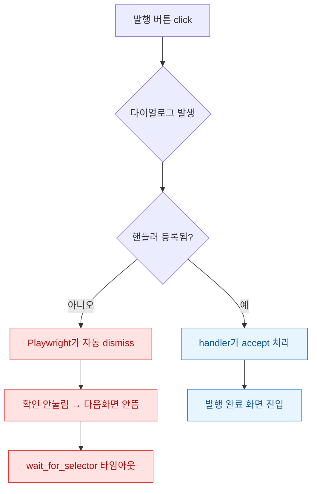
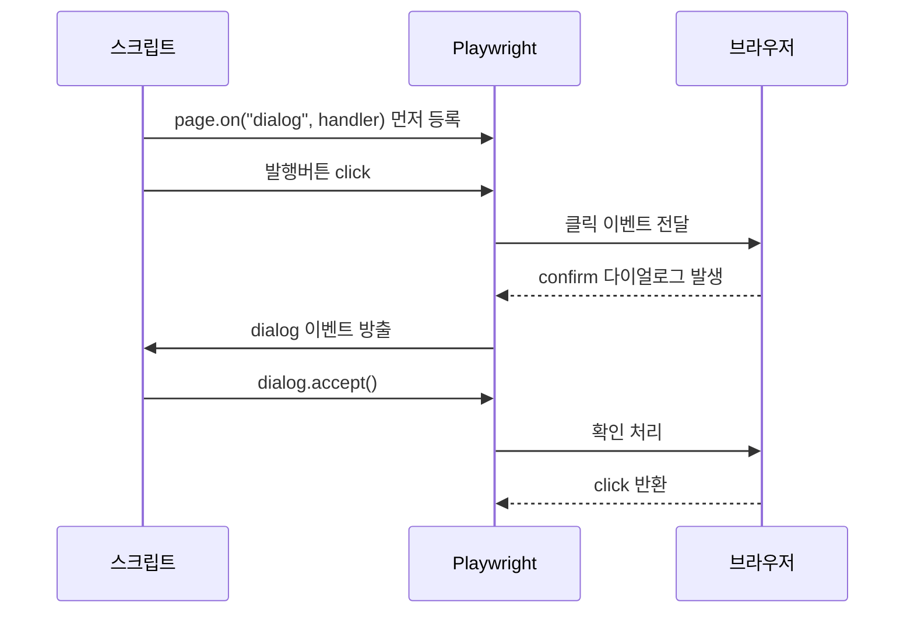
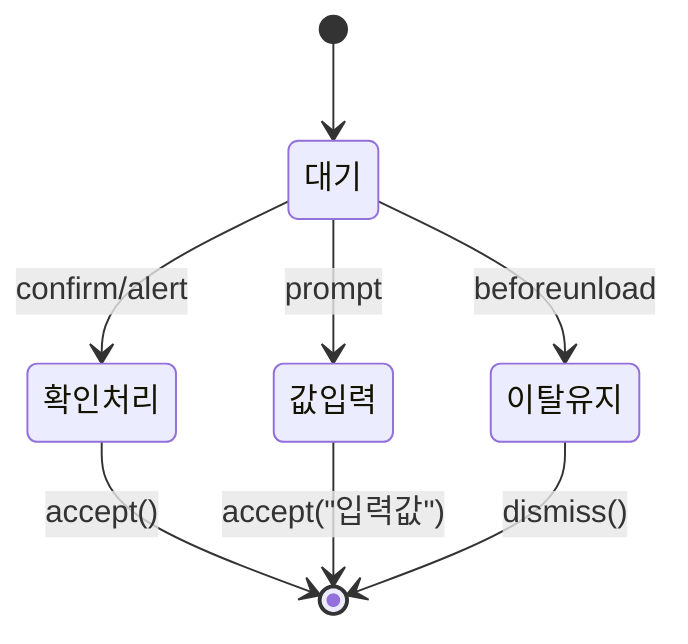

네이버·티스토리에 글을 자동으로 올리는 Playwright 스크립트를 돌리다 보면 꼭 한 번씩 만나는 벽이 있다. 로컬에서 `headless=False`(브라우저 창을 띄우고 보는 모드)로 볼 땐 멀쩡히 발행되던 게, 야간 배치로 `headless=True`(창 없이 백그라운드)로 돌리면 발행 버튼 근처에서 스크립트가 그냥 멈춰버린다. 로그를 봐도 에러가 아니라 그냥 타임아웃. 처음엔 셀렉터(요소를 찾는 주소)가 틀린 줄 알고 며칠을 헤맸다. 범인은 발행 버튼을 누르는 순간 튀어나오는 `confirm`("정말 발행하시겠습니까?") 다이얼로그였다.

Playwright는 이 브라우저 네이티브 다이얼로그를 **누가 처리하겠다고 미리 손을 들지 않으면 자동으로 취소(dismiss)** 해버린다. 그래서 확인 버튼이 눌리지 않고, 다음 액션이 뜨지 않는 화면을 기다리다 타임아웃이 나는 것이다. 오늘은 이 다이얼로그를 이벤트 핸들러로 한 번에 다스리는 패턴을 정리한다.

## 왜 발행 버튼만 누르면 스크립트가 멈췄나?

먼저 전체 그림부터. 문제가 어디서 갈라지는지 한눈에 보면 이렇다.



핵심은 이거다. `alert`·`confirm`·`beforeunload`(페이지 이탈 경고) 같은 다이얼로그는 DOM 요소가 아니라 **브라우저가 직접 그리는 창**이다. 그래서 평소 쓰던 `page.click("확인")`으로는 잡을 수 없다. Playwright는 이걸 `dialog`라는 별도 이벤트로 흘려보낸다. 그 이벤트를 안 받으면 기본값으로 취소해버린다.

## click 직전에 잡으려는 순서 문제는 왜 생기나?

두 번째로 삽질한 지점. "그럼 버튼 누르고 나서 다이얼로그를 잡으면 되겠네"라고 생각했는데 아니었다. 다이얼로그는 `click`이 반환되기 **전에** 뜬다. 즉 click 자체가 다이얼로그가 닫힐 때까지 블록될 수 있다. 시간순으로 보면 이렇다.



그래서 **핸들러 등록이 반드시 click보다 앞서야** 한다. 순서만 지키면 나머지는 단순하다.

## handle_dialog 패턴은 실제로 어떻게 쓰나?

동기 API 기준 합성 예시다. 실제 서비스명·계정은 다 더미로 바꿨다.

```python
from playwright.sync_api import sync_playwright

def publish_post(page, title, body):
    # ① 핸들러를 click보다 먼저 등록한다
    def on_dialog(dialog):
        print(f"[dialog] type={dialog.type} msg={dialog.message}")
        # confirm/alert는 accept, 이탈경고(beforeunload)만 dismiss
        if dialog.type == "beforeunload":
            dialog.dismiss()
        else:
            dialog.accept()  # confirm의 "확인" 누르기

    page.on("dialog", on_dialog)

    page.fill("#title", title)
    page.fill("#editor", body)

    # ② 이제 눌러도 다이얼로그가 자동 처리된다
    page.click("button.publish")
    page.wait_for_selector("text=발행 완료", timeout=15000)
```

여기서 `page.on`은 페이지가 살아있는 동안 계속 듣는 **상시 핸들러**다. 한 페이지에서 여러 번 발행하거나 예상 못한 alert가 중간에 껴도 다 받아낸다. 반대로 딱 한 번만 잡고 싶으면 `page.once("dialog", ...)`를 쓴다.

한 가지 주의. `dialog.accept()`는 **핸들러 안에서 동기적으로** 불러야 한다. 핸들러 밖으로 dialog 객체를 빼돌려서 나중에 처리하려 하면 이미 자동 dismiss된 뒤라 `accept()`가 먹지 않는다. 이게 두 번째로 오래 잡아먹은 함정이었다.

## prompt 입력값이나 특정 문구만 골라 처리하려면?

`prompt` 다이얼로그(입력창이 딸린 것)는 `accept()`에 값을 넣어준다. 그리고 다이얼로그 종류·문구에 따라 분기하면 상태를 이렇게 다룰 수 있다.



```python
def on_dialog(dialog):
    if dialog.type == "prompt":
        dialog.accept("자동입력값")      # 입력창에 값 채워 확인
    elif "임시저장" in dialog.message:
        dialog.dismiss()                # 임시저장 팝업은 무시
    else:
        dialog.accept()
```

메시지 문구로 걸러내는 게 특히 유용했다. 발행 확인은 accept, 페이지 나갈 때 "저장 안 된 변경사항" 경고는 dismiss처럼 **성격이 다른 팝업을 한 핸들러에서 갈래로 나눠** 처리할 수 있다.

## 그래서 뭐가 남았나?

정리하면 세 줄이다. 첫째, 브라우저 네이티브 다이얼로그는 DOM이 아니라 `dialog` 이벤트로 잡는다. 둘째, 핸들러는 **반드시 click보다 먼저** 등록한다. 셋째, `accept`/`dismiss`는 핸들러 안에서 즉시 부른다.

이 패턴을 넣고 나서 야간 배치가 조용해졌다. 예전엔 "왜 이 글만 안 올라갔지" 하고 아침마다 로그를 뒤졌는데 이제는 예상 못한 alert가 껴도 핸들러가 알아서 넘긴다. OSMU(한 번 쓴 글을 여러 채널에 뿌리는 것)로 네이버·티스토리 양쪽에 자동 발행할 때, 플랫폼마다 확인 팝업 문구가 다른 것도 메시지 분기 하나로 흡수된다.

다음엔 이 다이얼로그 핸들러를 파일 업로드 다이얼로그(이건 또 `file_chooser` 이벤트라 결이 다르다)와 묶어서, 이미지까지 자동으로 붙이는 발행 파이프라인으로 확장해볼 생각이다.
