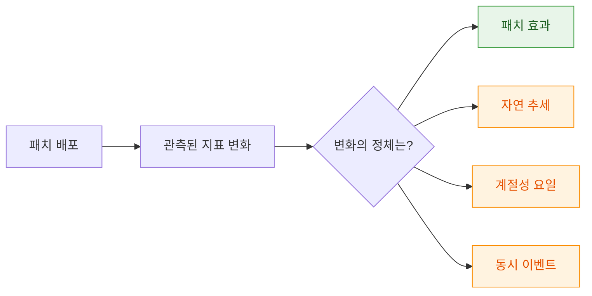
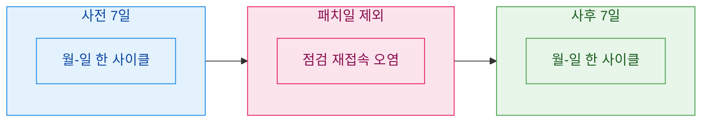
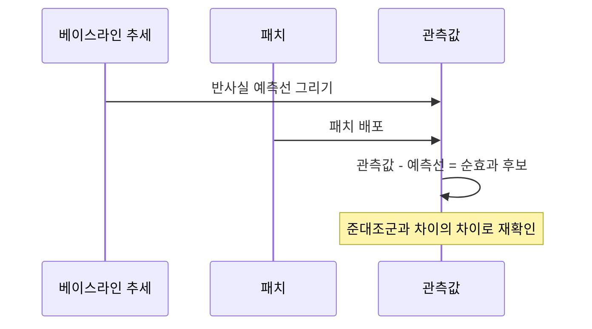

> "A/B 테스트 돌리면 되잖아요?" — 라이브 게임에선 그 한 문장이 종종 통하지 않는다. 그럴 때 남는 무기가 사전·사후 비교다.

패치 노트가 올라간 다음 날, 나는 늘 같은 질문을 받는다. "이번 밸런스 패치, 효과 있었어요?" 실험실이라면 유저를 절반씩 나눠 한쪽만 패치를 주고 비교하면 끝이다. 그런데 라이브 게임은 그게 안 된다. 서버 하나에 모두가 같이 산다. 어제까지 구버전을 쓰던 유저가 오늘 아침 강제 업데이트로 전부 신버전이 된다. 실험군과 대조군이 시간축 위에서만 갈린다. 이걸 어떻게 "신뢰성 있게" 읽을까. 오늘은 내가 라이브 지표를 볼 때 쓰는 사전·사후(pre-post) 비교 설계를 정리해 둔다.

(먼저 못 박아둔다. 이 글의 게임·수치·지표는 전부 설명용으로 지어낸 합성 더미다. 특정 회사·게임·실데이터와 무관하다.)

## A/B를 못 쓰는데 왜 하필 사전·사후일까?

A/B 테스트의 힘은 "같은 시점, 다른 처치"에 있다. 같은 날씨, 같은 이벤트, 같은 요일 밑에서 두 집단을 비교하니까 외부 요인이 자동으로 상쇄된다. 사전·사후는 이 힘을 포기한다. 대신 "같은 집단, 다른 시점"을 본다. 문제는 시점이 다르면 세상도 같이 변한다는 것이다.

라이브 게임에서 A/B가 막히는 이유는 대략 이렇다.

| 상황 | 왜 A/B가 어려운가 |
| --- | --- |
| 밸런스·시스템 전역 패치 | 한 서버 안에서 일부만 신버전을 줄 수 없음 |
| 경제/재화 구조 변경 | 유저 간 거래로 처치가 서로 오염됨 |
| 소규모 유저풀 | 반씩 쪼개면 표본이 작아 검정력이 떨어짐 |
| 이미 배포 완료 | "돌아가서 실험 설계"가 불가능, 로그만 남음 |

그래서 사후적으로라도 최선을 다해 비교하는 설계가 필요하다. 핵심 목표는 하나다. 패치가 만든 변화와, 어차피 일어났을 변화를 갈라내는 것.

D만 남기고 E·F·G를 걷어내는 게 이 설계의 전부다.

## 비교 창은 어떻게 잡아야 공정할까?

가장 흔한 실수는 "패치 전날 하루"와 "패치 다음 날 하루"를 맞대는 것이다. 게임 지표는 요일을 심하게 탄다. 금요일 저녁과 화요일 낮의 DAU는 패치가 없어도 다르다. 그래서 나는 비교 창을 이렇게 정렬한다.

- 사전 창과 사후 창의 길이를 똑같이 맞춘다(예: 각각 7일).
- 요일 구성을 맞춘다. 7일씩이면 월화수목금토일이 양쪽에 한 번씩 들어와 요일 효과가 상쇄된다.
- 패치 당일은 버린다. 업데이트 점검·강제 재접속으로 지표가 튀는 "오염일"이라 양쪽 어디에도 넣지 않는다.
- 신규 유입 급변 구간(대형 마케팅·콜라보)이 창에 걸리면 창을 옮기거나 해당 코호트를 분리한다.

창 길이는 지표의 성격에 맞춘다. 리텐션처럼 코호트가 성숙해야 값이 나오는 지표는 관측 기간을 더 길게 잡아야 하고(D7 리텐션을 보려면 최소 7일은 지나야 한다), 접속·매출 같은 일단위 지표는 7일 창으로도 충분한 편이다.

## 세그먼트를 안 나누면 왜 진실이 숨을까?

전체 평균만 보면 종종 아무 일도 없어 보인다. 그런데 쪼개 보면 정반대의 움직임이 서로를 상쇄하고 있던 경우가 많다. 이걸 심슨의 역설(Simpson's paradox)이라고 부른다. 부분에서는 다 오르는데 전체 평균은 그대로거나 떨어지는, 얄궂은 현상이다.

그래서 사전·사후 비교는 반드시 세그먼트를 고정한 채로 한다. 내가 습관처럼 나누는 축은 이렇다.

| 세그먼트 축 | 왜 보나 |
| --- | --- |
| 결제 여부(과금/비과금) | 패치가 지갑을 여는지, 접속만 늘리는지 구분 |
| 신규 vs 기존 코호트 | 신규 유입 급증이 평균을 착시로 끌어올릴 수 있음 |
| 활동 등급(라이트/헤비) | 헤비 유저 이탈은 소수라도 매출 타격이 큼 |
| 콘텐츠/직업/모드별 | 밸런스 패치는 특정 직업 픽률만 흔드는 경우가 많음 |

같은 유저 집단을 사전에도 사후에도 추적하는 게 이상적이다. 사전 창에 이미 있던 유저만 골라 그들의 사후 행동을 보면, 신규 유입이라는 교란을 원천적으로 뺄 수 있다. 이걸 "고정 코호트(fixed cohort)"라고 부른다. 밸런스 패치라면 픽률·승률 같은 콘텐츠 지표를 직업별 도수분포로 펼쳐 보는 것도 필수다. 평균 승률은 그대로여도, 특정 직업 픽률이 한쪽으로 쏠렸다면 그게 바로 패치가 만진 지점이다.

## 그 변화가 정말 패치 때문일까 — 자연 추세를 어떻게 뺄까?

여기가 사전·사후 설계의 심장이다. 지표는 패치가 없어도 스스로 오르내린다. 신작 초기라면 자연 감소 추세(감쇠)가 깔려 있고, 시즌 막바지라면 접속이 서서히 빠진다. 이 "어차피 갔을 길"을 빼지 않으면 패치 효과를 과대·과소평가한다.

내가 쓰는 세 가지 보정 장치.

1. 베이스라인 추세 외삽. 사전 여러 주의 추세선을 그어 "패치가 없었다면 사후에 어디쯤이었을까"를 반사실(counterfactual)로 그린다. 실제 사후값이 그 선보다 위/아래로 벗어난 폭이 효과의 후보다.
2. 준대조군(quasi-control). 패치의 영향을 안 받는 다른 지표·모드·지역을 대조군처럼 쓴다. 예를 들어 특정 직업만 건드린 패치라면, 손대지 않은 직업군을 대조로 놓고 두 집단의 변화 차이를 본다. 두 시계열의 "차이의 차이"를 보는 이 발상이 이중차분(difference-in-differences)이다.
3. 이벤트 겹침 점검. 패치와 같은 날 출석 이벤트·할인이 붙었다면, 매출 상승분이 패치 몫인지 할인 몫인지 분리가 안 된다. 이럴 땐 결론을 유보하고 겹치지 않는 지표로 우회한다.

한 줄로 줄이면 이렇다. 효과 = (사후 관측) − (패치가 없었을 때의 예측). 앞의 항만 보고 놀라거나 안심하지 않는 게 핵심이다.

## 결론을 내리기 전, 마지막에 무엇을 자문하나?

숫자가 예쁘게 나와도 나는 바로 보고하지 않는다. 진단검사에서 빌려온 두 잣대로 스스로를 검문한다. 감응도(민감도)와 특이도다.

- 감응도 점검: 진짜 효과가 있었다면 이 설계가 그걸 잡아낼 만큼 창과 표본이 충분한가? 표본이 작으면 실제 변화도 노이즈에 묻힌다.
- 특이도 점검: 효과가 없었는데도 우연히 커 보일 여지는 없나? 요일·이벤트·이상치 하나에 휘둘린 결과는 아닌가?

실무 체크리스트로 정리하면 이렇다.

| 점검 항목 | 통과 기준(예시) |
| --- | --- |
| 비교 창 요일 정렬 | 사전·사후 요일 구성 동일 |
| 패치일 오염 제거 | 점검·재접속일 제외 |
| 세그먼트 고정 | 과금/코호트/모드별 각각 비교 |
| 자연 추세 보정 | 반사실 예측선 대비로 판단 |
| 준대조군 확인 | 미영향 집단과 차이의 차이 |
| 이벤트 겹침 | 동시 프로모션 없음 확인 |
| 표본 충분성 | 세그먼트별 최소 관측 수 확보 |

이 표를 다 통과해야 나는 "패치 효과로 보인다"라고 말한다. 하나라도 걸리면 "이 데이터로는 단정할 수 없다"가 정직한 답이다. 데이터 분석가의 신뢰는, 화려한 결론보다 이 유보를 제때 말할 수 있느냐에서 갈린다고 나는 믿는다.

## 마무리

사전·사후 비교는 A/B의 완벽한 대체재가 아니다. 시간이라는 교란을 완전히 제거하지 못하기 때문이다. 하지만 라이브 게임처럼 실험군을 나눌 수 없는 현실에서, 창을 공정하게 정렬하고·세그먼트를 고정하고·자연 추세를 빼고·준대조군으로 되짚으면, "느낌"과 "지어낸 성공담" 사이에서 훨씬 단단한 근거를 만들 수 있다. 오늘 정리한 순서는 결국 하나의 문장으로 수렴한다. 관측된 변화에서 어차피 일어났을 변화를 빼라. 남는 것이 패치가 세상에 실제로 더한 몫이다.

다음엔 이 설계를 SQL로 옮겨, 고정 코호트와 이중차분을 쿼리 한 벌로 뽑는 레시피를 정리해 볼 생각이다.

## 참고자료

- [[game-metrics-7-definitions]] — DAU·리텐션·ARPPU 등 기본 지표 정의부터
- [[cohort-m1-retention-sql]] — 고정 코호트를 SQL로 잡는 법
- [[game-data-sql-recipes-retention-ltv]] — 리텐션·LTV를 윈도우 함수로 뽑는 레시피
- [[retention-curve-beyond-m1]] — 리텐션 곡선을 D1 너머로 읽기
- [[revenue-simulation-dau-pu-arppu]] — 매출을 DAU × PU% × ARPPU로 분해하기
- 예제 코드 모음: [github.com/DBhyeong/game-data-recipes](https://github.com/DBhyeong/game-data-recipes)

<!-- 안전: 합성/더미 데이터, 회사·실데이터·PII 없음. -->
