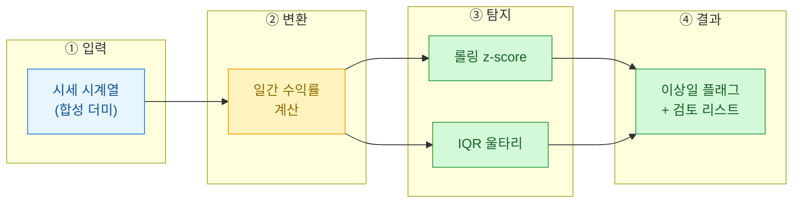
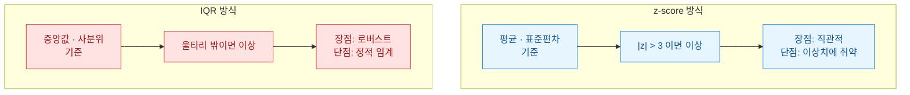
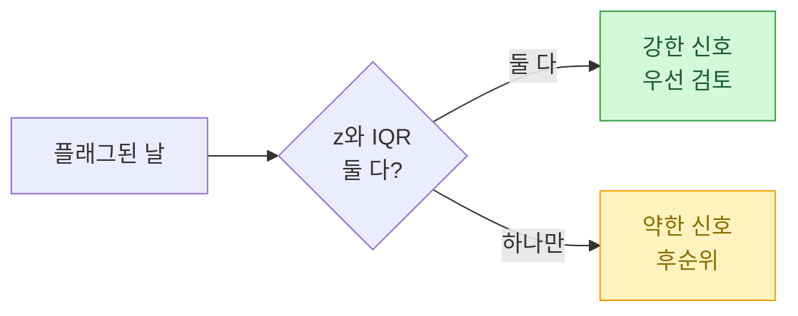

> 공개·더미 데이터 기준의 학습용 예제다. 투자권유나 회계판단이 아니며, 실제 매매 판단에 그대로 쓰지 말 것.

매일 시세 데이터를 들여다보다 보면 결국 눈이 먼저 피로해진다. "어제 이거 좀 튀지 않았나?" 하는 감각을 매번 사람이 확인하는 건 낭비다. 그래서 나는 가장 단순한 규칙부터 자동화하기로 했다. 오늘 정리하는 건 통계 입문서 첫 장에 나오는 두 도구, **z-score**와 **IQR**로 급등락일을 플래그하는 방법이다.



## 왜 원시 가격이 아니라 수익률을 봐야 하나?

가격 자체는 추세를 타기 때문에 "얼마나 튀었나"를 재기에 부적절하다. 1만 원짜리의 500원 변동과 100만 원짜리의 500원 변동은 전혀 다른 사건이다. 그래서 **일간 수익률(daily return)**, 즉 전일 대비 변화율로 바꿔서 스케일을 통일한다.

| 구분 | 원시 가격 | 일간 수익률 |
|------|-----------|-------------|
| 스케일 | 종목마다 제각각 | 비율로 통일 |
| 추세 영향 | 큼 (계속 상승/하락) | 작음 (등락률만) |
| 이상탐지 적합성 | 낮음 | 높음 |

```python
import numpy as np
import pandas as pd

# 합성 시세: 완만한 추세 + 노이즈에 인위적 급등락 3개 주입
rng = np.random.default_rng(42)
n = 200
base = 10000 + np.cumsum(rng.normal(0, 40, n))
price = base.copy()
for spike_day in (60, 120, 180):
    price[spike_day] *= rng.choice([1.08, 0.90])  # +8% 또는 -10% 충격

df = pd.DataFrame({"price": price})
df["ret"] = df["price"].pct_change()  # 일간 수익률
```

## z-score와 IQR은 어떻게 다른가?

두 방법 모두 "가운데에서 얼마나 멀리 떨어졌나"를 재지만 기준자가 다르다. **z-score**는 평균과 표준편차를 쓴다. 계산이 쉽지만 이상치 자체가 평균과 표준편차를 오염시키는 약점이 있다. **IQR(사분위 범위)**은 중앙값과 사분위수를 쓰기 때문에 극단값에 훨씬 둔감하다(로버스트하다).



핵심 임계 규칙을 표로 정리하면 이렇다.

| 방법 | 이상 판정 조건 | 로버스트성 |
|------|----------------|------------|
| z-score | `|z| > 3` (보통 3σ) | 낮음 |
| IQR | `Q1 - 1.5·IQR` 미만 또는 `Q3 + 1.5·IQR` 초과 | 높음 |

## 시계열엔 왜 '롤링' z-score가 필요한가?

전체 기간 평균으로 z-score를 내면, 시장 변동성이 시기마다 다르다는 사실을 무시하게 된다. 조용하던 구간과 출렁이던 구간을 같은 잣대로 재는 셈이다. 그래서 최근 N일 창(window)으로만 평균·표준편차를 계산하는 **롤링(rolling) z-score**를 쓴다.

```python
# 롤링 z-score (최근 20일 창 기준)
win = 20
roll_mean = df["ret"].rolling(win).mean()
roll_std = df["ret"].rolling(win).std()
df["z"] = (df["ret"] - roll_mean) / roll_std
df["flag_z"] = df["z"].abs() > 3

# IQR 울타리 (전체 수익률 분포 기준)
q1, q3 = df["ret"].quantile([0.25, 0.75])
iqr = q3 - q1
low, high = q1 - 1.5 * iqr, q3 + 1.5 * iqr
df["flag_iqr"] = (df["ret"] < low) | (df["ret"] > high)

# 둘 중 하나라도 걸리면 검토 대상
suspects = df[df["flag_z"] | df["flag_iqr"]]
print(suspects[["price", "ret", "z"]])
```

## 실무에서 걸린 함정 세 가지

돌려보니 교과서대로 되지 않는 지점이 있었다. 기록해 둔다.

| 함정 | 증상 | 대응 |
|------|------|------|
| 창 크기 편향 | 창이 너무 짧으면 정상 변동도 이상으로 잡힘 | window를 20\~30일로 넉넉히 |
| 표준편차 0 | 값이 안 움직인 구간에서 z가 `inf`/`NaN` | 0 나눗셈 방지 처리 |
| 이중 카운트 | z와 IQR이 같은 날을 중복 플래그 | `OR`로 합집합, 사유 라벨 분리 |

특히 두 번째, 변동이 없던 구간에서 표준편차가 0이 되어 z-score가 `inf`로 튀는 문제는 조용히 결과를 오염시킨다. 나는 `roll_std`가 0에 가까우면 해당 날을 판정 제외로 돌리는 안전장치를 넣었다.



## 그래서 무엇이 남았나?

두 기법 다 "정답 탐지기"는 아니다. **급등락 후보를 사람 대신 좁혀주는 1차 필터**일 뿐이다. z-score와 IQR이 동시에 가리키는 날은 신뢰도가 높고, 하나만 걸린 날은 눈으로 한 번 더 본다. 이 단순한 규칙 하나로 매일 200줄을 훑던 일이 서너 개 후보를 확인하는 일로 줄었다.

다음 단계로는 계절성이나 거래량까지 결합한 다변량 이상탐지(예: Isolation Forest)로 넘어갈 수 있다. 하지만 그 전에, 평균·중앙값 수준의 이 두 도구부터 손에 익히는 게 순서라고 본다. 가장 단순한 게 가장 오래 쓰인다.
