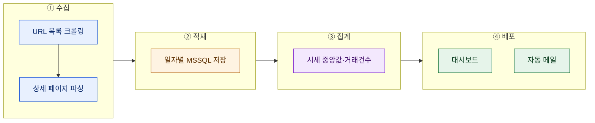
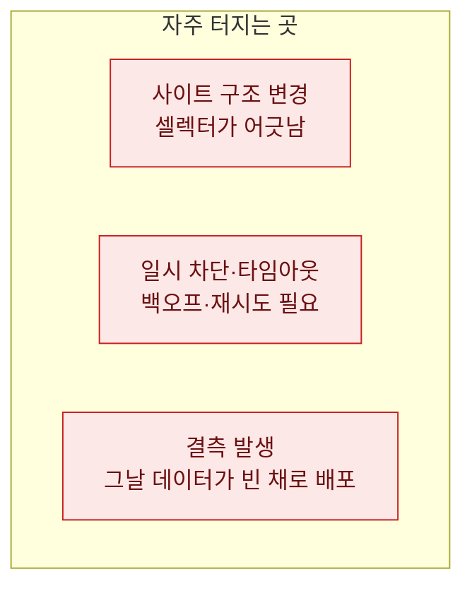

# 시세 모니터링 파이프라인 전체 구조

> 게임 아이템 현금 시세를 매일 들여다봐야 할 일이 있었다. 처음엔 크롤러 하나 짜면 될 줄 알았다. 근데 "매일, 안정적으로, 추세까지" 보려니 크롤링은 전체의 4분의 1이었다. 수집한 걸 어디에 쌓고, 어떻게 집계하고, 누구에게 보여줄지가 진짜였다. 그 엔드투엔드 구조를 정리한다. (대상 사이트는 '거래 중개 사이트'로 일반화했고, 아래는 합성 예시다. 수집 대상의 robots·약관·호출 한도를 지키는 선에서만 다뤘다.)

## 크롤러 하나로는 왜 '모니터링'이 안 되나?

크롤러는 스냅샷 한 장을 준다. 그런데 시세 모니터링은 **시간축**이 핵심이다. 오늘 15만 원이라는 사실보다, "지난주 12만 원에서 올랐다"가 의사결정을 만든다. 그러려면 매일 같은 방식으로 찍은 데이터가 한곳에 쌓여야 하고, 쌓인 걸 집계해 추세로 바꿔야 하고, 그 추세가 사람 눈앞까지 배달돼야 한다.



이 네 칸을 하나씩 뜯어보자.

## 시작 전에 — robots·약관·레이트리밋부터

코드보다 먼저 확인할 게 있다. 대상 사이트의 `robots.txt`가 해당 경로 수집을 막는지, 이용약관이 자동 수집을 금지하는지, 그리고 어느 정도 호출 빈도가 상대 서버에 부담을 주는지다. 나는 요청 사이에 충분한 간격(예: 1~2초)을 두고, 실패 시 지수 백오프로 물러나며, 하루 총 호출을 스스로 제한하는 걸 기본으로 깐다. 시세 모니터링은 상대 서비스를 이기는 게임이 아니라, 공존하며 관찰하는 일이다.

## ① 수집은 왜 2단계로 나눴나?

한 번에 목록 페이지를 열어 상세까지 다 긁으면 편할 것 같지만, 실무에선 **URL을 먼저 다 모으고, 상세는 나중에** 돌리는 2단계가 훨씬 안정적이다.


이유는 셋이다. 첫째, **재시도가 쉽다** — 상세 파싱이 중간에 죽어도 URL 목록이 남아 있으니 실패한 것만 다시 돌린다. 둘째, **페이지네이션과 상세를 분리**하니 각 단계 로직이 단순해진다. 셋째, 목록은 빠르게 훑고 상세는 천천히 도는 식으로 **속도를 따로 조절**할 수 있다. 목록 크롤링에서 페이지네이션은 "다음 페이지 버튼이 사라지거나, 결과가 비거나, 직전 페이지와 동일하면 중단" 같은 복수 종료 조건을 함께 걸어야 무한 루프에 안 빠진다.

## ② MSSQL 적재 — 멱등성이 핵심

수집한 데이터를 매일 테이블에 넣을 때 가장 중요한 건 **같은 날 두 번 돌려도 중복이 안 쌓이는 것**이다. `(수집일자, 아이템, 서버)`를 키로 삼아 있으면 갱신, 없으면 삽입하는 upsert(MERGE)로 처리한다.

```sql
-- 합성 예시: 일자별 시세 스냅샷 upsert
MERGE  price_daily AS tgt
USING  (SELECT :d AS snap_date, :item AS item, :server AS server,
               :median AS median_price, :cnt AS trade_cnt) AS src
ON     (tgt.snap_date = src.snap_date AND tgt.item = src.item AND tgt.server = src.server)
WHEN MATCHED THEN
    UPDATE SET median_price = src.median_price, trade_cnt = src.trade_cnt
WHEN NOT MATCHED THEN
    INSERT (snap_date, item, server, median_price, trade_cnt)
    VALUES (src.snap_date, src.item, src.server, src.median_price, src.trade_cnt);
```

이렇게 해두면 배치가 실패해 재실행되든, 하루에 두 번 돌든 데이터가 깨끗하다. 원시 매물(개별 판매글)은 별도 테이블에 쌓아두고, 위 스냅샷은 집계 결과만 담는 식으로 층을 나누면 나중에 재집계도 자유롭다.

## ③ 집계 — 평균이 아니라 중앙값과 거래건수

시세를 집계할 때 평균을 쓰면 터무니없는 매물(0원 미끼, 자릿수 오타) 하나에 휘청인다. 그래서 **중앙값**으로 대표 시세를 잡고, 시장의 활발함은 **거래건수(또는 매물 수)** 로 따로 본다. 두 숫자가 함께 움직이는지 엇갈리는지가 신호다. 시세는 오르는데 거래건수가 급감하면 "호가만 오르고 실거래는 마른" 상태일 수 있다.

이상치 제거는 간단하게 사분위 범위(IQR) 밖을 걷어내거나, 상·하위 몇 %를 잘라내는 트림 방식이면 충분하다. 과하게 정교한 필터보다, 매일 같은 규칙으로 일관되게 자르는 게 추세 관찰엔 더 낫다.

## ④ 배포 — 쌓아만 두면 아무도 안 본다

마지막이 제일 자주 빠진다. 집계까지 해놓고 DB에만 두면 아무도 안 본다. 나는 두 경로로 내보냈다. 하나는 **대시보드**(집계 테이블을 BI 도구에 연결해 시세·거래건수 추이 카드), 하나는 **자동 메일**(매일 아침 요약 표와 전일 대비 변화를 관계자에게 발송). 대시보드는 깊게 파는 사람용, 메일은 안 들어와도 눈에 띄게 하는 용도다. 파일이 필요하면 집계 결과를 CSV로 떨궈 드라이브에 자동 업로드해두면 공유가 편하다.

## 그래도 깨질 때 — 파이프라인의 약한 고리



가장 흔한 건 대상 페이지의 구조가 바뀌어 파서가 빈손으로 돌아오는 것이다. 이땐 "수집 건수가 평소의 절반 이하면 경보"처럼 **양 기반 헬스체크**를 걸어두면 조용한 실패를 잡는다. 결측일은 대시보드에서 0으로 찍혀 추세를 왜곡하니, 값 없음과 진짜 0을 구분해 표시하는 게 좋다.

## 정리 — 크롤링은 파이프라인의 입구일 뿐

| 단계 | 핵심 결정 |
|---|---|
| 수집 | 2단계(URL→상세)로 재시도 가능하게 |
| 적재 | 일자·아이템 키로 멱등 upsert |
| 집계 | 평균 말고 중앙값 + 거래건수 |
| 배포 | 대시보드(탐색) + 메일(알림) 이원화 |

> 크롤러를 짜는 건 하루면 된다. 그걸 **매일 믿을 수 있는 파이프라인**으로 만드는 게 나머지 한 달이다. 그리고 그 한 달이 "데이터 좀 만질 줄 안다"와 "데이터로 굴러가게 만든다"를 가른다.

*합성 예시로 재현한 방법론 글입니다. 특정 서비스의 실제 구조·데이터와 무관하며, 수집은 대상의 robots·약관·호출 한도를 준수하는 범위에서만 다뤘습니다.*
