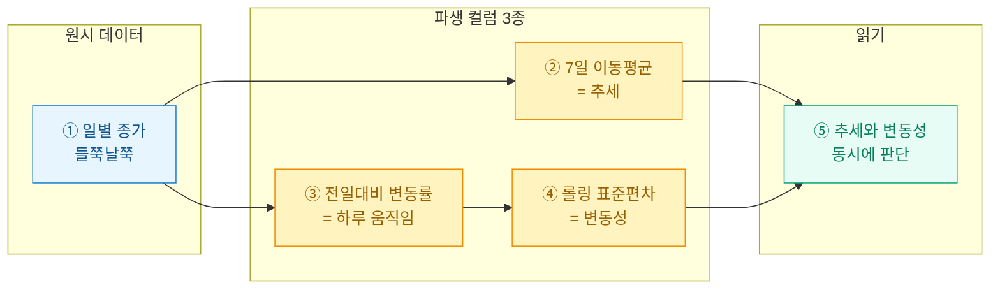
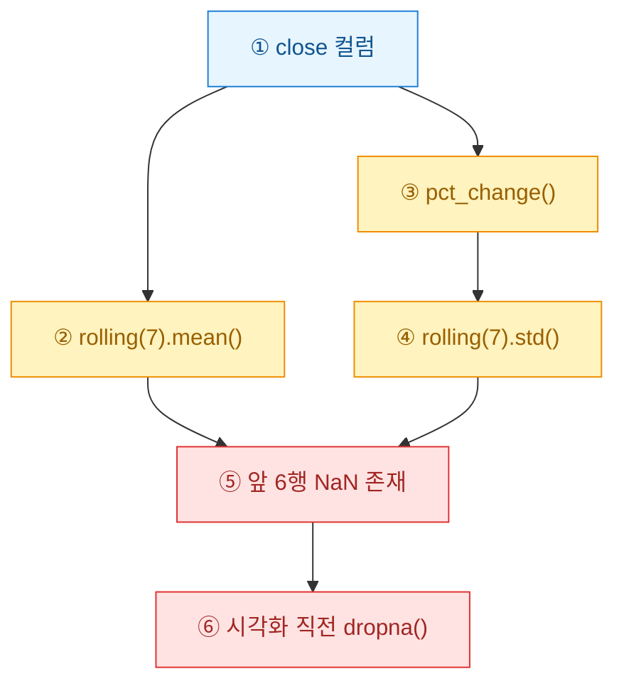

> 공개·더미 데이터 기준의 예시이며, 투자 권유나 회계 판단이 아니다. 여기 나오는 숫자는 전부 합성이다.

원시 시세만 놓고 보면 그냥 오르락내리락하는 선이다. 어제보다 올랐는지, 요즘 흔들림이 심해졌는지 눈으로는 잘 안 잡힌다. 나는 이럴 때 컬럼 세 개를 얹는다. **이동평균(moving average)**으로 추세를, **전일대비 변동률(daily return)**로 하루치 움직임을, **롤링 표준편차(rolling std)**로 변동성을 본다. 오늘은 이 최소 레시피를 정리해 둔다.

## 왜 원시 시세만으로는 부족한가?



원시 종가는 정보가 날것이다. 하루하루의 숫자는 노이즈가 크고, "지금 우상향인가?"라는 질문에 답을 못 준다. 파생 컬럼은 이 날것을 세 가지 관점으로 정리해 준다. 정리하면 이렇다.

| 컬럼 | 무엇을 보나 | 계산 한 줄 | 반응 속도 |
|---|---|---|---|
| 이동평균 | 추세 방향 | 최근 N일 평균 | 느림(부드러움) |
| 전일대비 변동률 | 하루 움직임 | (오늘−어제)/어제 | 즉각 |
| 롤링 표준편차 | 변동성 크기 | 최근 N일 변동률의 표준편차 | 중간 |

## 합성 시세는 어떻게 만드나?

실데이터를 붙이기 전에 나는 항상 더미로 파이프라인을 먼저 굳힌다. 랜덤워크(random walk)면 충분하다. 하루치 변동을 누적해 종가 곡선을 만든다.

```python
import numpy as np
import pandas as pd

rng = np.random.default_rng(42)
days = pd.date_range("2025-01-01", periods=180, freq="D")

# 하루치 로그수익률을 정규분포에서 뽑아 누적 → 랜덤워크 종가
steps = rng.normal(loc=0.0005, scale=0.02, size=len(days))
close = 100 * np.exp(np.cumsum(steps))   # 시작가 100원 가정

df = pd.DataFrame({"date": days, "close": close}).set_index("date")
print(df.head(3))
```

`loc`는 아주 약한 우상향 드리프트, `scale`은 하루 변동 폭이다. 이 두 개만 만져도 잔잔한 시세와 요동치는 시세를 마음대로 흉내 낼 수 있다.

## 파생 컬럼 3개는 어떻게 얹나?

pandas의 `rolling`과 `pct_change` 두 함수면 끝난다.

```python
# ① 7일 이동평균: 최근 7일 평균으로 곡선을 부드럽게
df["ma7"] = df["close"].rolling(window=7).mean()

# ② 전일대비 변동률: 어제 대비 몇 % 움직였나
df["ret"] = df["close"].pct_change()

# ③ 롤링 표준편차: 최근 7일 변동률의 흔들림 = 변동성
df["vol7"] = df["ret"].rolling(window=7).std()

print(df.tail(3).round(4))
```

주의할 함정 하나. `rolling(7)`은 앞 6행이 `NaN`이다. 창(window)을 채울 데이터가 아직 없어서다. 이걸 모르고 곧바로 평균이나 그래프를 그리면 앞부분이 비어 당황한다. 나는 분석 단계에선 그냥 두고(정직한 결측), 시각화 직전에만 `dropna()`로 잘라낸다.



## 이 세 숫자를 어떻게 읽나?

숫자를 뽑았으면 해석이 남는다. 내가 실제로 대시보드를 만들 때 쓰는 판단 규칙을 표로 정리해 둔다.

| 신호 | 관찰 | 해석 |
|---|---|---|
| 종가 > 이동평균 | 가격이 평균 위 | 단기 상승 우위 |
| 종가 < 이동평균 | 가격이 평균 아래 | 단기 하락 우위 |
| 이동평균 기울기 상승 | ma7이 우상향 | 추세가 살아 있음 |
| 롤링 표준편차 급등 | vol7이 평소의 2배 | 변동성 확대, 조심 구간 |

핵심은 **추세(이동평균)와 변동성(표준편차)을 따로 보지 않는 것**이다. 가격이 오르는데 변동성도 같이 치솟으면 "오르긴 하는데 불안한 상승"이다. 반대로 이동평균이 완만히 우상향하면서 변동성이 낮으면 그게 가장 편한 구간이다. 원시 시세 한 줄로는 절대 안 보이던 이 대비가, 컬럼 세 개를 얹는 순간 표 한 장으로 드러난다.

## 정리하면

`rolling`, `pct_change` 두 함수와 컬럼 세 개. 이게 시계열 분석의 밑바닥 레시피다. 여기서 N을 7일에서 30일로 바꾸거나, 표준편차 대신 이동평균 두 개(단기·장기)의 교차를 얹는 식으로 확장하면 그게 바로 흔히 보는 시세 지표들이 된다. 나는 새 시계열을 받으면 늘 이 세 컬럼부터 붙여 놓고 시작한다. 날것을 읽을 수 있는 형태로 바꾸는 가장 싼 비용이라서다.
