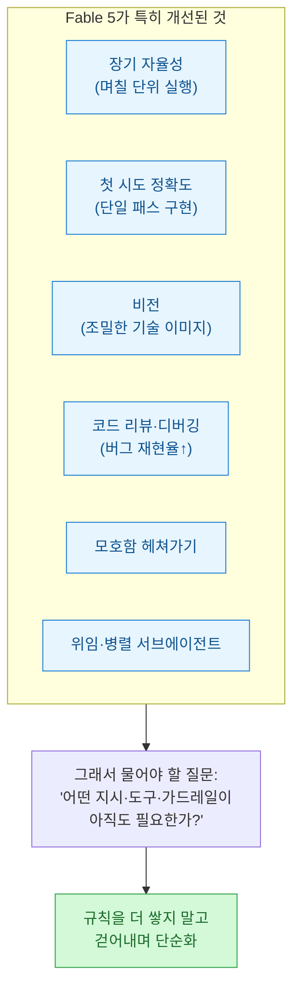
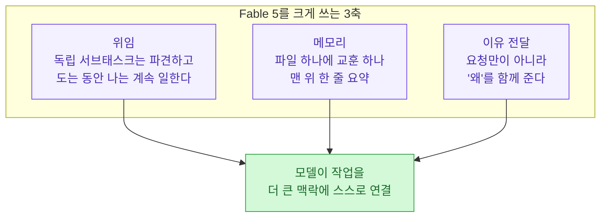
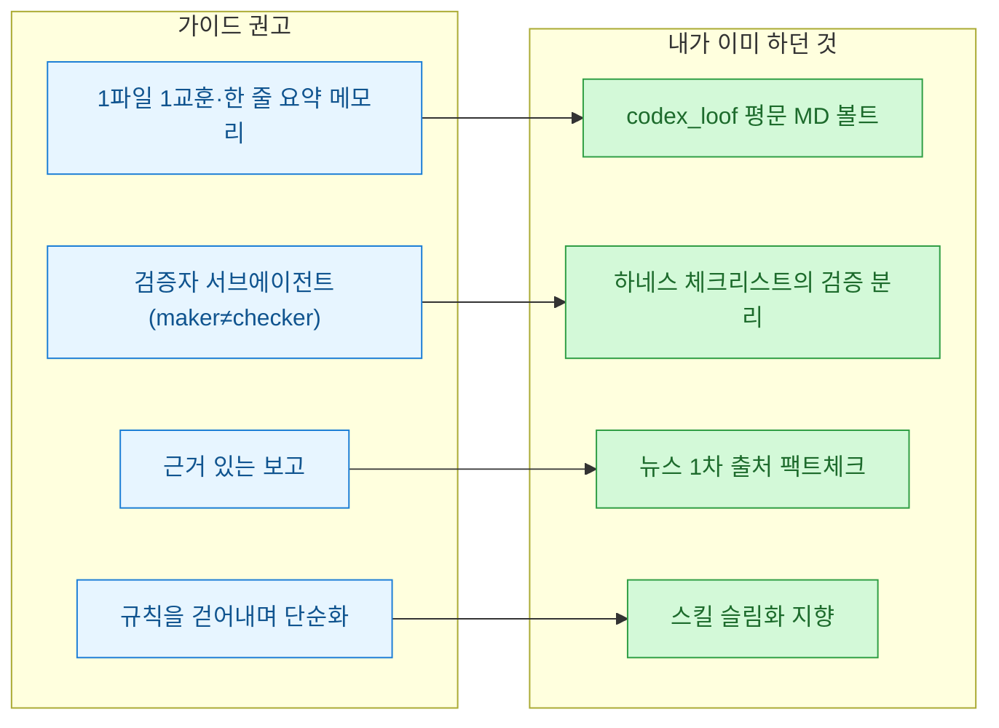

내가 매일 쓰는 모델의 '사용설명서'를 만든 쪽이 직접 냈다. Anthropic이 Claude Fable 5와 Mythos 5를 공개하면서 [공식 프롬프팅 가이드](https://docs.anthropic.com/en/docs/build-with-claude/prompt-engineering/prompting-claude-fable-5)를 같이 내놨는데, PyTorch KR 피드에서 보고 원문까지 읽었다. 흥미로운 건 톤이다. "새 기능 쓰는 법"이 아니라, **"그동안 쌓아 올린 규칙 중 상당수를 이제 걷어내라"**는 역설적인 이야기였다.

기준일은 **2026년 7월 3일 KST**. 공식 docs(프롬프팅 가이드 + 모델 소개 문서)를 1차 출처로 정리하고, 내 볼트·하네스에 뭘 바꿀지까지 붙였다.

## 왜 프롬프트를 '다시' 써야 하나?

한 줄로 요약하면 이렇다 — **모델이 유능해질수록 프롬프트는 짧고 목적 지향적이어야 한다.** 이전 모델(Opus 4.8)을 붙들려고 만든 장황한 규칙이 Fable 5에선 오히려 성능을 깎는다는 것이다. Anthropic이 정리한 개선 영역은 단순 벤치 상승이 아니라, 전부 **프롬프트를 손봐야 하는 행동 변화**와 직결된다.



먼저 짚어둘 실무 주의 하나. Fable 5는 **공격적 사이버 보안·생명과학·요약된 사고과정 추출**을 겨냥한 안전 분류기를 상시 돌린다. 선의의 보안 연구나 생명과학 작업도 걸릴 수 있고, 그러면 응답이 `stop_reason: "refusal"`로 돌아온다. 자동 우회가 필요하면 **Opus 4.8로 폴백**을 걸면 된다. (참고로 스펙은 컨텍스트 100만 토큰·출력 최대 12.8만 토큰, 가격은 100만 토큰당 입력 10달러·출력 50달러, 2026년 6월 9일 출시. Mythos 5는 같은 능력에 분류기만 뺀 제한 배포판이다.)

## effort는 어떻게 고르나?

가장 실무적인 손잡이가 **effort(노력 수준)**다. 지능·지연·비용의 균형을 조절한다. Anthropic의 권장은 명확했다.

| effort | 언제 |
|---|---|
| **high** | 기본값. 대부분의 작업 |
| **xhigh** | 능력이 특히 중요한 워크로드 |
| **medium / low** | 일상적·대화형 작업 |

핵심 반전은 이거다 — **Fable 5는 낮은 effort에서도 종종 이전 모델의 xhigh를 넘어선다.** 작업이 완료되긴 하는데 필요 이상으로 오래 끌면, 주저 없이 effort를 낮추면 된다.

부작용도 있다. 일상적 작업을 high로 돌리면 요청하지도 않은 정리·리팩터링까지 하는 경향이 생긴다. 이걸 막는 지시가 가이드에 그대로 실려 있었다.

```text
Don't add features, refactor, or introduce abstractions beyond what the
task requires. A bug fix doesn't need surrounding cleanup ... Only validate
at system boundaries (user input, external APIs). Don't use feature flags
or backwards-compatibility shims when you can just change the code.
```

버그 하나 고치는 데 주변 코드까지 청소하지 말고, 일어날 수 없는 시나리오에 방어 코드를 넣지 말고, **시스템 경계(사용자 입력·외부 API)에서만 검증하라**는 원칙이다. 실무에서 특히 유용하다.

## 긴 자율 실행을 어떻게 믿나?

Fable 5의 진짜 가치는 몇 시간씩 도는 자율 실행에서 나오는데, 바로 거기서 새로운 신뢰성 문제가 생긴다. 가이드는 네 가지 안전장치를 제시했다.


**① 근거 있는 보고**가 가장 인상적이었다. 긴 실행에선 모델이 "실제로 한 일"과 "했다고 말하는 일"이 어긋날 수 있는데, 보고 전에 각 주장을 도구 결과와 대조하게 하니 **일부러 허위 보고를 유도한 테스트에서도 조작된 보고가 거의 사라졌다**고 한다.

```text
Before reporting progress, audit each claim against a tool result from this
session. Only report work you can point to evidence for; if something is not
yet verified, say so explicitly. Report outcomes faithfully: if tests fail,
say so with the output; if a step was skipped, say that.
```

**③ 조기 종료 방지** 리마인더의 마지막 문장이 특히 실용적이다 — *"턴을 끝내기 전에 마지막 문단을 확인하라. 그게 계획·분석·질문·다음 단계 목록, 혹은 아직 안 한 일에 대한 약속이라면, 지금 도구 호출로 그 일을 하라."* 사람이 안 지켜보는 자율 파이프라인에서 "이제 X를 실행하겠습니다"만 남기고 멈추는 걸 막는다.

## 짧은 지시 한 줄로 조종한다

이전 모델에선 원하는 행동을 하나하나 이름 붙여 열거해야 했다. Fable 5는 지시 따르기가 좋아져서 **짧은 지시 한 줄**로 대부분 조종된다. 예를 들어 장황함을 잡는 데는 패턴을 나열하는 대신 간결성 지시 하나면 된다.

```text
Lead with the outcome. Your first sentence after finishing should answer
"what happened" or "what did you find" ... Being readable and being concise
are different things, and readability matters more.
```

여기서 눈여겨볼 대목은 **"읽기 쉬운 것과 간결한 것은 다르며, 읽기 쉬움이 더 중요하다"**는 구분이다. 출력을 짧게 만드는 올바른 방법은 문장을 조각내거나 `A → B → 실패` 같은 화살표 사슬로 압축하는 게 아니라, **포함할 내용을 선별**하는 것이라고 못 박는다. 멈춤(checkpoint) 지시도 마찬가지로 한 문단이면 된다 — *"파괴적·되돌릴 수 없는 행동, 실제 범위 변경, 사용자만 줄 수 있는 입력일 때만 멈춰라."*

## 위임·메모리·이유, 이 셋은 왜 묶이나?

세 가지가 결국 "모델을 더 큰 그림에 연결하는" 같은 원리다.



**메모리**가 특히 남 얘기 같지 않았다. 거창한 인프라도 필요 없고, Markdown 파일 하나면 된다는 거다 — *"파일 하나에 교훈 하나, 맨 위에 한 줄 요약. 정정과 확인된 접근법을 왜 중요했는지와 함께 기록하되, 저장소·대화에 이미 있는 건 저장하지 말고, 새로 만들기보다 기존 노트를 갱신하고, 틀린 노트는 삭제하라."* 이건 사실상 **내가 codex_loof 볼트를 굴려온 방식과 글자 그대로 같다.**

**이유 전달**은 짧은 템플릿 하나로 정리됐다 — *"나는 [누구]를 위해 [더 큰 작업]을 하고 있고, 그들에게는 [이 출력이 가능하게 하는 것]이 필요하다. 그 점을 염두에 두고: [요청]."*

## send_to_user 도구는 왜 따로 만드나?

오래 도는 비동기 에이전트를 굴릴 때, **턴을 끝내지 않고도 사용자에게 정확히 그대로 보여야 할 내용**(초안·구체 수치 진행 업데이트·루프 중 질문에 대한 직접 답)이 생긴다. 이때 `send_to_user` 도구를 만든다. 원리가 깔끔하다 — **도구의 입력값이 곧 표시할 메시지이고, 도구 입력은 절대 요약되지 않으니 내용이 손실 없이 도착**한다.


주의점 둘. (1) **도구만 정의해선 부족**하다 — 시스템 프롬프트에 유도 문구를 안 넣으면 Fable 5는 이 도구를 거의 안 부른다. (2) 반대로 **서술·내부 추론을 이 도구로 흘려보내면 안 된다.** 과호출하면 도구의 목적 자체가 무너진다.

## 스캐폴딩은 뭘 바꾸나? (특히 조심할 한 가지)

가이드는 프롬프트 문구를 넘어 실행 구조(스캐폴딩) 차원의 변경 넷을 권했다.

| 변경 | 요지 |
|---|---|
| 난이도 최상단에서 시작 | 이전 모델에 맡기던 것보다 **더 어려운 작업**을 골라 직접 범위 잡게 하기 |
| 자기 검증을 명시적으로 | 자기 비판보다 **신선한 컨텍스트의 검증자 서브에이전트**가 낫다 |
| 기존 프롬프트·스킬 리팩터링 | 이전 모델용 스킬은 종종 **지나치게 규범적**이라 품질을 깎는다 → 걷어내기 |
| 추론 재현 지시 금지 | ⚠️ 아래 별도 |

마지막 항목이 특히 조심스럽다. **"생각을 그대로 보여줘/받아써/설명해"류의 지시**는 Fable 5에서 `reasoning_extraction` 거부 범주를 촉발하고, 그 결과 Opus 4.8로의 폴백이 늘어난다. 마이그레이션할 때 기존 스킬·시스템 프롬프트에서 "show your thinking" 류를 걷어내야 한다는 것. 추론 가시성이 필요하면 그 대신 **구조화된 thinking 블록**을 읽고, 진행 상황은 `send_to_user`로 노출하라고 한다.

## 그래서 내 볼트·하네스엔 뭘 바꾸나?

읽는 내내 묘했다. 이 가이드의 권고 상당수가 **내가 이미 굴리고 있던 것**과 겹쳤기 때문이다.



바꿀 것도 분명해졌다. **첫째, 오래된 스킬의 과잉 규칙을 감사한다** — 이전 모델을 붙들려고 넣은 장황한 지시가 지금은 짐이다. **둘째, 하네스에서 "생각을 그대로 재현하라"류 지시를 찾아 뺀다**(reasoning_extraction 폴백 방지). **셋째, 타임아웃·비동기 확인 같은 인프라를 먼저 손본다** — 긴 실행이 기본값이 되었으니.

이건 앞서 적은 [[fable5-from-instructing-agents-to-designing-loops|지시에서 목표로, 루프를 설계하는 법]]과 [[fable5-maker-checker-separation-setup|만드는 쪽 ≠ 검사하는 쪽]] 일기의 연장선이다. 그때 감으로 잡았던 것들을, 이번엔 만든 쪽이 문서로 확인해 준 셈이다.

## 마이그레이션 체크리스트

가이드를 관통하는 한 원칙 — **모델이 유능해질수록 프롬프트는 짧고 목적 지향적이어야 한다.**

| 영역 | 이전(Opus 4.8) | Fable 5 |
|---|---|---|
| 지시 방식 | 원하는 행동을 하나하나 열거 | 짧은 의도 지시 한 줄로 조종 |
| 실행 시간 | 대체로 짧은 동기 실행 | 몇 분~몇 시간, 비동기 확인 전제 |
| effort | 항상 최대치 | high 기본, 일상은 medium/low로 충분 |
| 검증 | 자기 비판 위주 | 신선한 컨텍스트의 검증자 서브에이전트 |
| 진행 보고 | 모델 요약 신뢰 | 도구 결과 대조 후 근거 있는 보고만 |
| 스킬·프롬프트 | 규칙을 계속 추가 | 불필요한 규칙을 걷어내며 단순화 |
| 추론 노출 | 자유롭게 재현 요청 | 재현 지시 금지, thinking 블록 활용 |

Fable 5로의 전환은 단순한 모델 교체가 아니라 **하네스와 프롬프트를 다시 설계할 기회**다. 그리고 그 첫 단추는, 이전 모델을 붙들려고 만든 장황한 규칙을 **용기 있게 걷어내는 것**이었다.

## 참고자료

- [Anthropic — Prompting Claude Fable 5 (공식 프롬프팅 가이드)](https://docs.anthropic.com/en/docs/build-with-claude/prompt-engineering/prompting-claude-fable-5)
- [Anthropic — Introducing Claude Fable 5 and Claude Mythos 5 (스펙·가격·가용성)](https://docs.anthropic.com/en/docs/about-claude/models/fable-5)
- [PyTorch KR — Claude Fable 5 프롬프팅 가이드 소개 (9bow/박정환, 2026-07-03)](https://discuss.pytorch.kr/)

<!-- 안전: 회사 실데이터·고객/제3자 PII·API키/쿠키/토큰 없음. Anthropic 공식 문서(공개) 기반 정리. mermaid 라벨에 꺾쇠 없음. -->
