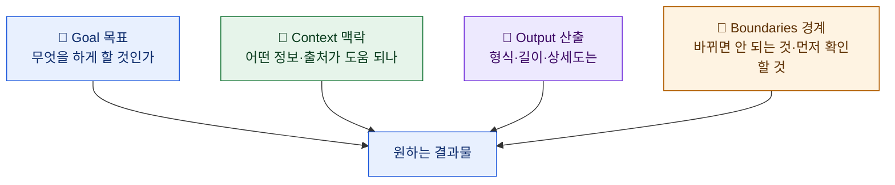
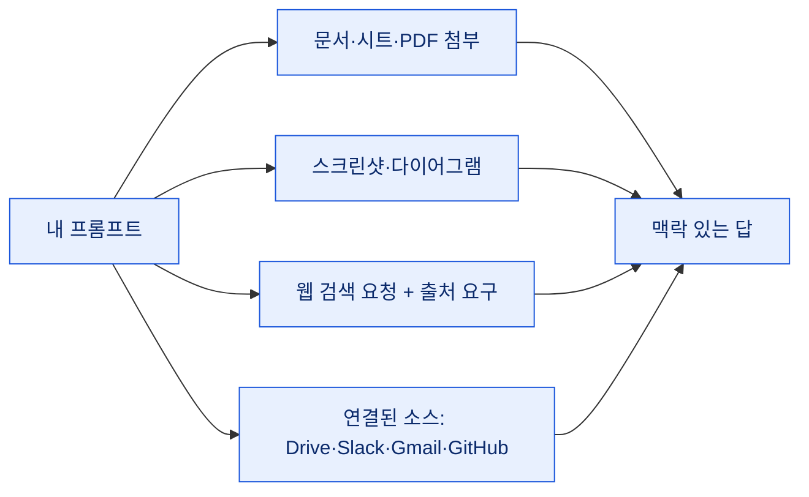
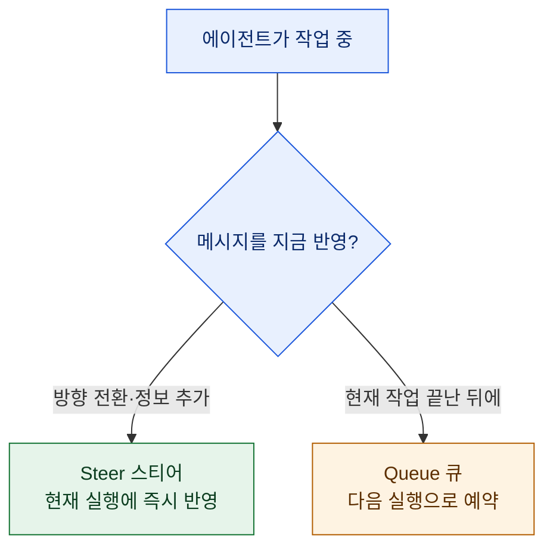
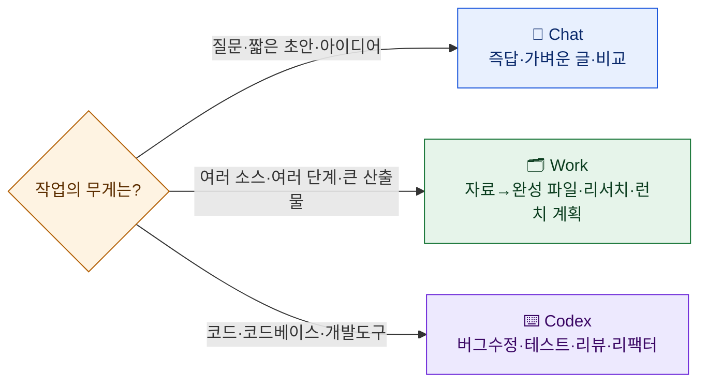

# 좋은 프롬프트는 문법이 아니라 '결과'를 말한다

> 나는 하루에도 수십 번 AI에게 뭔가를 시킨다. 데이터 요약, 카피 초안, 코드 수정, 리서치. 그런데 초보 때 착각했던 게 하나 있다 — "프롬프트에는 뭔가 마법의 공식이 있을 것"이라는 생각. `역할: 너는 전문가야. 제약: ... 출력형식: ...` 같은 틀에 끼워 맞춰야 잘 나온다고 믿었다. OpenAI가 최근 정리한 프롬프팅 가이드를 읽으며 그 착각이 깨졌다. 결론부터 말하면, 프롬프트는 **특별한 문법이 아니라 내가 원하는 결과를 내 말로 설명하는 것**이다. 이 글은 그 가이드를 데이터·마케팅 일을 하며 매일 AI를 쓰는 내 관점에서 다시 정리한 것이다. (도구는 ChatGPT를 예로 들지만, 원리는 Claude든 Codex든 어떤 에이전트에도 그대로 옮겨진다.)

## 프롬프트에 공식이 필요할까?

가이드가 가장 먼저 강조하는 건 힘 빼기다. 프롬프트는 질문일 수도, 지시일 수도, 목표일 수도 있다. **기술적인 문법도, 딱딱한 공식도 필요 없다.** 그냥 내 말로 시작하고, 답을 본 뒤, 후속 메시지로 다듬어 나가면 된다.

짧은 프롬프트로 충분한 경우가 대부분이다. 문제는 **크고 중요한 작업**이다. "이번 캠페인 회고를 임원 보고용으로 만들어줘" 같은 건 한 줄로 던지면 십중팔구 엉뚱하게 나온다. 이럴 때만, 중요한 요소를 골라 넣으면 된다.

## 큰 작업의 뼈대 네 가지 — Goal·Context·Output·Boundaries

가이드는 큰 작업에 붙일 네 가지를 제시한다. 나는 앞글자를 따 **GOCB**로 외웠다.

| 요소 | 묻는 것 | 내 실무 예 |
|---|---|---|
| **Goal(목표)** | AI가 무엇을 해야 하나? | "이 회의록을 팀용 짧은 업데이트로" |
| **Context(맥락)** | 어떤 정보·출처가 도움 되나? | "첨부한 3분기 리포트를 근거로" |
| **Output(산출)** | 형식·길이·상세도는? | "결정사항과 다음 단계를 맨 앞에, 한 페이지로" |
| **Boundaries(경계)** | 뭐가 그대로여야 하나? 뭘 먼저 확인? | "승인된 날짜·예산 숫자는 건드리지 말 것" |

핵심은 **"도움이 되는 것만 넣는다"**는 태도다. 네 칸을 억지로 다 채울 필요도, 정해진 순서를 지킬 필요도 없다. 짧은 질문엔 Goal 하나로 끝이고, 복잡한 산출물일수록 나머지를 붙인다.

## 왜 '단계'가 아니라 '결과'를 말해야 하나?

이게 이 가이드에서 제일 크게 와닿은 대목이다. 우리는 자꾸 **"이렇게 하고, 저렇게 하고"** 하는 절차를 나열하려 한다. 그런데 AI에게는 대개 **결과부터 말하는 게** 낫다.

> ❌ "먼저 데이터를 정렬하고, 그다음 필터를 걸고, 그다음 평균을 내고, 표로 만들고..."
> ✅ "이 지출 내역을 계획 대비 실제로 비교한 표로 만들고, 차이가 10% 넘는 항목을 강조해줘."

절차 자체가 중요할 때(예: 반드시 이 순서로 처리해야 하는 규정된 워크플로)만 과정을 설명한다. 그 외에는 AI가 **검색하고, 비교하고, 접근법을 스스로 조정할 여지**를 남겨두는 편이 결과가 좋다. 청중이나 형식이 결과물을 바꾼다면 그건 함께 말해준다 — "누가 읽는지"가 "무엇을 만들지"를 좌우하니까.

## 맥락은 어떻게 붙이나?

결과를 바꿀 수 있는 정보만, 그것도 **"이 자료에서 뭘 가져가라"**를 짚어 붙인다. 그냥 파일을 던지는 것과, "이 스프레드시트에서 3분기 전환율만 봐"라고 짚어주는 건 결과가 다르다.

- **파일 첨부**: 요약·비교·변환·파일 생성이 필요할 때 문서·시트·발표자료·PDF를 붙인다.
- **이미지**: 시각 맥락이 중요할 때 스크린샷·도표를 넣되, **어느 부분이 핵심인지 짚는다**. 이미지 하나에 의존하지 말고.
- **웹 검색**: 답이 최신 정보에 달렸으면 검색을 요청하고, 확인이 필요하면 **출처를 요구**한다.
- **연결된 소스(플러그인)**: Drive·Slack·Gmail·GitHub 같은 곳에 접근이 있으면, **어디를 봐서 뭘 찾을지**만 지정한다. 모든 검색을 일일이 지시할 필요는 없다. 특정 플러그인을 콕 집으려면 입력창에 `@`를 친다.

여기서 개인화 팁 하나. **여러 대화에 두루 적용될 취향**(말투·기본 형식 같은)은 설정의 개인화(custom instructions)에 넣고, **이번 작업에만 필요한 세부**는 프롬프트에 넣는다. 매번 반복 설명하지 않으려는 것이다.

## 경계(Boundaries)가 진짜 사고를 막는다

마케팅·데이터 일을 하다 보면, AI가 **엉뚱한 걸 바꿔서 결과물 전체를 못 쓰게** 만드는 순간이 제일 아프다. 승인된 예산 숫자를 슬쩍 반올림한다든가, 초안만 원했는데 메일을 보낼 것처럼 써버린다든가. 경계는 바로 이런 사고를 막는 **몇 안 되는 필수 지시**다.

가이드가 든 예시들이 그대로 실전용이다.

- "승인된 날짜와 예산 수치는 **그대로 둘 것**."
- "제공한 자료만 사용하고, 빠진 정보는 지어내지 말고 **표시**할 것."
- "추천은 명시된 예산 안에서만."
- "메시지는 **초안으로만** 준비하고, **보내지 말 것.**"

포인트는 **한두 개의 가장 중요한 경계에 집중**하는 것이다. AI의 모든 단계를 통제하려 들면 오히려 프롬프트가 무거워진다. "틀리면 결과물을 통째로 버려야 하는 지점"과 "사람에게 영향 가기 전에 내가 검토하고 싶은 지점", 딱 그 두 가지만 경계로 박아두면 된다.

## 결과를 바로 쓸 수 있게 만들려면?

내가 **그 결과물을 어떻게 쓸지**를 말해주면, AI가 길이·상세도·구성을 알아서 맞춘다.

- "임원이 회의 전에 훑을 수 있는 **한 페이지 요약**으로. 결정과 다음 단계를 맨 앞에."
- "이 메모를 결정사항·담당자·기한이 담긴 **후속 메일**로."
- "계획 대비 실제 지출 **표**로, 10% 넘는 차이는 강조."

그리고 중요한 작업일수록 **마지막 점검**을 시킨다. "모든 액션 아이템에 담당자와 기한이 있는지 확인해줘", "검증 못 한 정보는 표시해줘" 같은 식으로. 물론 그 뒤에 **내 눈으로 다시 보는 것**이 마지막 관문이다. AI의 self-check는 나를 대체하는 게 아니라 내 검토를 가볍게 해주는 것이다.

## 첫 프롬프트는 완벽할 필요가 없다

이게 힘 빼기의 완성이다. 첫 프롬프트를 완벽하게 쓰려고 붙들 필요가 없다. 결과를 보고, **원하는 변경만 콕 집어** 후속으로 말하면 된다.

> "도입부를 더 직설적으로, 근거는 그대로 두고, 추천을 배경 설명 위로 올려줘."

빠진 출처를 추가하거나, 방향을 틀거나, 다른 대안을 요청하거나, 상세도를 바꾸는 걸 **처음부터 다시 시작하지 않고** 할 수 있다.

### Steering과 Queuing — 일하는 중에 끼어들기

특히 Codex처럼 **이미 작업 중인 에이전트**에게는, 끝나기를 기다리지 않고 메시지를 더 보낼 수 있다. 두 가지 방식이 있다.

- **Steer(스티어)**: 지금 실행에 메시지를 끼워 넣는다. 방향을 바꾸거나, 빠뜨린 세부를 더하거나, 새 정보를 줄 때. (Codex CLI에선 작업 중 `Enter`)
- **Queue(큐)**: 다음 실행을 위해 저장해둔다. 지금 작업이 끝난 뒤에 처리돼야 할 후속 지시일 때. (Codex CLI에선 `Tab`)

데스크톱 앱이라면 이 기본 동작을 설정에서 고를 수 있고, 큐에 쌓인 메시지는 보내기 전에 편집·재정렬·삭제가 된다. 참고로 음성 받아쓰기(desktop에서 `Ctrl+M`)로 말해서 입력창에 옮긴 뒤 손으로 다듬는 방법도 있다.

## Chat · Work · Codex — 언제 무엇을?

같은 프롬프팅 원리라도, 작업의 무게에 따라 쓰는 표면이 다르다.

**Chat**은 질문·아이디어·초안·일상 결정에 쓴다. 원하는 결과부터 말하고, 답이 바뀔 때만 세부를 더한다.
- "투자 안 해본 사람에게 복리를 설명해줘. 구체적 예 하나로, 금융 용어는 정의해가며."
- "이 초대를 정중히 거절하는 이메일 초안. 120자 이내, 다음을 기약하는 여지 남기고."
- "두 요금제를 국제출장 잦은 1인 기준으로 표 비교하고, 하나 추천 + 트레이드오프 설명."

**Work**는 여러 소스를 엮고, 여러 단계를 거치고, 정보를 바꾸거나, 큰 산출물을 만들 때다. 결과를 묘사하고 → 원본 자료를 주고 → 청중을 정하고 → 검토 방법을 말한다. 시간 많이 드는 반복 작업, 재사용할 완성 파일에 특히 값어치가 있다.
- "첨부한 분기 리포트로 임원용 브리프 + 6장 슬라이드를 만들어줘. 결정 세 가지를 앞에, 사실과 내 분석을 구분하고, 각 숫자를 출처 파일에 매어줘. 브리프와 슬라이드가 서로 어긋나지 않는지 확인하고."

**Codex**는 코드·코드베이스·개발도구를 다룰 때다. 원하는 동작을 이름 붙여 말하고, 관련 코드나 재현 절차를 짚고, 지켜야 할 제약을 남기고, **어떻게 검증할지**를 말한다.

## Codex 실전 프롬프트 몇 가지

내가 Codex(그리고 비슷하게 Claude Code)로 자주 쓰는 패턴을, 가이드 예시에 맞춰 정리하면 이렇다.

- **코드베이스 이해**: "선택한 코드로 요청이 어떻게 흐르는지 설명해줘. 각 모듈 책임 요약 + 어디서 뭘 검증하는지 + 바꿀 때 주의할 함정 한두 개. 그다음 흐름을 번호 매긴 단계로, 관련 파일 목록도."
- **버그 수정**: 고수준 설명보다 **재현 절차와 제약**이 더 중요하다. "재현: 1) `npm run dev` 2) /settings 3) 토글 저장 4) 새로고침하면 리셋됨. 제약: API 형태 바꾸지 말 것, 수정 최소로, 가능하면 회귀 테스트 추가. 먼저 로컬에서 재현한 뒤 패치를 제안하고 체크를 돌려줘."
- **테스트 작성**: "이 함수의 유닛 테스트를 다른 테스트 관례를 따라 작성해줘. 해피패스 + 엣지케이스."
- **로컬 코드 리뷰**: 작업 트리를 커밋/PR 전에 한 번 더 보는 용도. "엣지케이스와 보안 이슈에 집중해서 리뷰해줘." (수정 후 다시 리뷰해 해결 확인.)
- **긴 리팩터는 클라우드로 위임**: 로컬에서 접근법을 설계(`/plan`)하고, 승인 후 지속 목표(`/goal`)를 걸고, 마일스톤 단위 구현을 클라우드 작업으로 넘긴다. 병렬로 돌려두고 diff만 검토하는 그림.
- **GitHub PR 리뷰**: PR에 `@codex review`(또는 "보안 취약점 위주로 리뷰") 코멘트로 브랜치를 로컬에 안 받고도 피드백을 받는다.

멀티스텝 작업이라면 앱 입력창에 `/plan`을 먼저 쳐서 **편집 전에 접근법을 제안**받고, 그 계획을 검토·수정한 뒤 실행에 들어가는 흐름이 안전하다. IDE 확장은 열린 파일을 자동으로 맥락에 넣고, CLI는 경로를 직접 언급하거나 `@`로 파일을 붙인다.

## 정리 — 내 표준 프롬프트 한 장

가이드가 마지막에 든 "완성형 프롬프트" 예시가 GOCB를 한 문단에 자연스럽게 녹인 좋은 본보기라, 내 식으로 옮겨 적어둔다.

> **[Goal]** 월요일 리더십 회의용 한 페이지 프로젝트 현황 업데이트를 만들어줘.
> **[Context]** Drive의 최신 프로젝트 계획과 Slack 채널의 결정·업데이트를 참고해서.
> **[Output]** 리더십이 내려야 할 결정과 다음 단계를 앞에, 진행상황·리스크·담당자·기한을 요약해서.
> **[Boundaries]** 승인된 날짜·예산 수치는 그대로 두고, 상충하거나 빠진 정보는 표시하고, 아무것도 발행·전송하지 말 것.
> **[Check]** 끝내기 전에 모든 다음 단계에 담당자와 기한이 있는지 확인해줘.

Goal·Context·Output·Boundaries를 덮고, 모든 단계를 시시콜콜 적지 않으면서 마지막 점검까지 요청한다. 나는 이 한 장을 템플릿으로 두고, 작업마다 필요한 칸만 채워 쓴다.

돌아보면, 결국 프롬프팅 실력은 **문법을 외우는 게 아니라 내가 원하는 결과를 정직하게 그리는 능력**이더라. AI에게 잘 설명하는 연습은, 사실 내 머릿속의 결과물을 먼저 또렷하게 만드는 연습이었다.

---

**출처·확인**: OpenAI의 프롬프팅 가이드(Chat·ChatGPT Work·Codex를 위한 프롬프트 작성법)를 읽고, 데이터·마케팅 실무 관점에서 재정리했다. 제품별 기능(ChatGPT Work, Codex의 `/plan`·`/goal`·`/review`, steering/queuing, `@codex review`)은 OpenAI 문서 기준이며, 세부 UI·단축키는 버전에 따라 달라질 수 있으니 최신 도움말을 함께 확인하길 권한다. GOCB 원리 자체는 도구를 가리지 않는다.

<!-- 안전: 회사 실데이터·고객/제3자 PII·API키/쿠키/토큰 절대 금지. 과거 작업은 합성·일반화. -->
