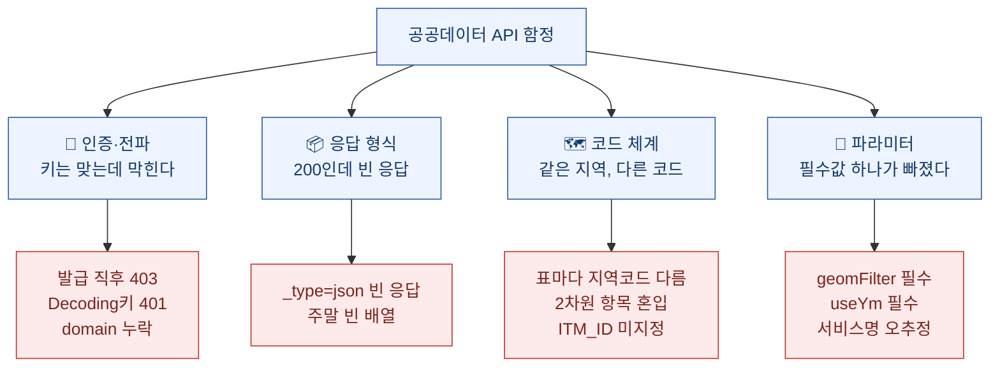
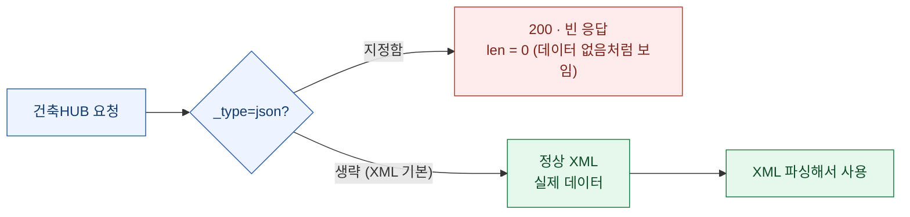

한국 공공데이터 API는 **"연결되는 것"과 "제대로 된 값이 나오는 것"이 다르다.** 키를 발급받아 요청을 보내면 대개 HTTP 200이 온다. 그런데 본문은 비어 있거나, 엉뚱한 지역 숫자거나, 지난달과 비교하면 -92% 같은 허수다. 며칠에 걸쳐 한국은행·부동산원·V-World·data.go.kr을 코드로 붙이며 실제로 걸려 넘어진 함정 13개를 정리했다. **정부 API 문서엔 대개 안 나오지만, 붙여 보면 반드시 만난다.**

> ⚠️ 아래는 **공개된 정부 오픈데이터 API**를 붙이며 겪은 기술 기록이다. API 키는 전부 `.env`에 두고 본문엔 값을 싣지 않는다. 서비스 코드·엔드포인트는 각 기관 공식 문서에 공개된 것들이다.

## 함정을 성격별로 나누면

## 인증·전파 — 키는 맞는데 막힌다

**① 발급 직후 403 Forbidden (키 오류 아님).** data.go.kr에서 API를 활용신청하고 바로 호출하면 평문 `403 Forbidden`이 온다. XML도 아니고 그냥 게이트웨이 차단이다. 처음엔 키가 틀린 줄 알았는데, **API별 활성화가 전파되는 데 시간이 걸리는** 것이었다. 실제로 발급 직후엔 12개 실거래가 서비스 중 5개만 되다가, 수 분 뒤 12개 전부 열렸다. → **키를 의심하기 전에 수 분\~수 시간 기다렸다 재시도.**

**② Decoding 키를 그대로 쓰면 401.** data.go.kr은 키를 Encoding본과 Decoding본 2종으로 준다. Decoding본에는 `+`, `==` 같은 문자가 들어 있는데, 이걸 **인코딩 없이 URL에 붙이면 401**이다. → `.env`엔 Decoding본을 넣고, 코드에서 `encodeURIComponent`로 감싼다. 그러면 Encoding본과 동일한 결과가 된다.

**③ V-World는 요청마다 domain이 필요하다.** V-World API는 발급 시 등록한 도메인을 매 요청 파라미터로 요구한다. 로컬 개발이면 `domain=localhost`를 붙여야 통과한다. 빠뜨리면 인증 오류다.

## 응답 형식 — 200인데 빈 응답

**④ 건축HUB에서 `_type=json`을 주면 빈 응답이 온다.** 이게 오늘의 가장 얄궂은 함정이었다. 건축물대장·폐쇄말소·건물에너지 서비스는 `_type=json`을 지정하면 **HTTP 200에 본문 길이 0**을 반환한다. 오류도 아니고 그냥 빈칸이다.

→ **`_type`을 생략(XML 기본)하고 XML을 파싱**해야 데이터가 나온다. "데이터 없음"과 "형식 때문에 빈 응답"을 구분하지 못하면 몇 시간을 날린다. 나는 여기서 한참 헤맸다.

**⑤ 환율 API는 주말·공휴일에 빈 배열을 준다.** 수출입은행 환율은 영업일 데이터라, 토·일·공휴일 날짜로 요청하면 정상 200에 빈 배열이 온다. → **최근 7일을 역순으로 훑어 가장 가까운 영업일**을 잡는 폴백을 넣었다.

## 코드 체계 — 같은 '서울'인데 표마다 다르다

부동산원 R-ONE에서 가장 많이 넘어졌다. 통계표가 738개인데, **표마다 지역과 항목을 가리키는 코드 체계가 제각각**이다.

**⑥ 항목 코드(ITM_ID)를 안 주면 값이 섞인다.** 거래량 표에서 `ITM_ID`를 지정하지 않으면 '동호수'와 '면적' 같은 서로 다른 항목이 한 응답에 섞여 나온다. 그걸 그대로 월 비교하면 **전월 대비 -92% 같은 허수**가 튀어나온다. → 항목을 고정(예: 동호수)해서 요청.

**⑦ 같은 '서울'인데 표마다 지역코드가 다르다.** 이게 정말 헷갈렸다. 아파트 가격지수 표의 서울 코드와, 아파트 평균가 표의 서울 코드와, 연립 지수 표의 서울 코드가 **전부 다르다.** 한 표에서 통하던 코드를 다른 표에 넣으면 엉뚱한 지역이 나온다. 실제로 "서울 평균가"라고 받은 게 알고 보니 인천이었다. → 표마다 항목 목록(분류) API를 먼저 호출해 **그 표의 지역코드를 확인**하고 매핑을 만든다.

**⑧ 카탈로그의 데이터 종료연도가 부정확하다.** 표 목록에 "2024년까지"라고 적혀 있어도 실제로는 2026년 5\~6월 데이터가 들어 있다. 게다가 페이지 1번이 **최신이 아니라 오래된 순**이라, 앞에서부터 받으면 옛날 값을 최신인 줄 안다. → 목록 메타를 믿지 말고 **조회 기간 창(시작\~종료)을 명시**해 최신 구간을 직접 지정.

**⑨ 한국은행 연체율은 2차원 표다.** ECOS의 은행 연체율 표는 '대출 종류 × 은행 종류'의 2차원이다. 한 축만 지정하면 여러 값이 섞여 나온다. → 항목 코드를 **1차·2차 둘 다** 지정해야 원하는 칸 하나가 나온다.

**⑩ 대출행태 서베이는 항목 접두가 표마다 다르다.** 같은 서베이인데 '태도'·'신용위험'·'수요' 표의 항목 코드 접두가 서로 다르다. 하나의 규칙으로 파싱하면 나머지 표에서 전부 빈 값(정보 없음)이 된다. → 표별로 접두를 분기.

## 파라미터 — 필수값 하나가 빠졌다

**⑪ V-World 데이터 API는 공간 필터가 필수다.** 필지 조회 같은 데이터 API는 `geomFilter`(예: `POINT(x y)`) 없이 부르면 범위 오류가 난다. 좌표를 점 필터로 반드시 넣어야 한다.

**⑫ 건물에너지는 사용연월(useYm)이 필수다.** 건물에너지(전기·가스) 조회는 지역·필지만으로는 건수 0이 온다. **사용연월(YYYYMM)**을 필수로 넣어야 값이 나온다. 참고로 단독주택·소규모 공동주택 등은 애초에 제외 대상이라, 없는 게 정상인 경우도 있다.

**⑬ 건축HUB 서비스명은 이름으로 추측하면 틀린다.** 건축물대장이 `BldRgstHubService`라고 해서 주택인허가를 `HsPmsService`로 추측했더니 404였다. 실제로는 `HsPmsHubService`이고, 폐쇄말소는 `ShtRgstHubService`다(`ClosBrHubService`가 아니다). → **공식 명세(Swagger)의 정확한 서비스명·오퍼레이션명**을 그대로 쓴다.

## 전체 한 장 정리

| # | 시스템 | 함정 | 해결 |
|---|---|---|---|
| ① | data.go.kr | 발급 직후 403 | 전파 지연 — 수 분 뒤 재시도 |
| ② | data.go.kr | Decoding 키 401 | `encodeURIComponent`로 감싸기 |
| ③ | V-World | domain 누락 | 요청마다 `domain` 지정 |
| ④ | 건축HUB | `_type=json` 빈 응답 | `_type` 생략(XML)+파싱 |
| ⑤ | 수출입은행 | 주말 빈 배열 | 7일 역순 폴백 |
| ⑥ | 부동산원 | 항목 미지정 시 혼입 | `ITM_ID` 고정 |
| ⑦ | 부동산원 | 표마다 지역코드 다름 | 표별 코드맵 확인 |
| ⑧ | 부동산원 | 종료연도 부정확·역순 | 기간 창으로 조회 |
| ⑨ | 한국은행 | 연체율 2차원 | 항목코드 1·2 모두 |
| ⑩ | 한국은행 | 서베이 접두 상이 | 표별 접두 분기 |
| ⑪ | V-World | 공간 필터 필수 | `geomFilter` POINT |
| ⑫ | 건축HUB | 에너지 useYm 필수 | 사용연월 지정 |
| ⑬ | 건축HUB | 서비스명 오추정 | 공식 명세 그대로 |

## 관통하는 교훈

열세 개를 겪고 나니 공통점이 보인다.

- **HTTP 200은 성공이 아니다.** 정부 API는 형식 문제·전파 지연·빈 배열을 전부 200으로 감싼다. 응답 코드가 아니라 **본문의 실제 내용**으로 성공을 판정해야 한다. (`_type=json` 빈 응답이 대표적이다.)
- **문서보다 명세, 명세보다 실측.** 서비스명·필수 파라미터·코드 체계는 이름으로 추측하면 반드시 틀린다. 공식 Swagger를 그대로 쓰고, 그래도 안 되면 붙여 보며 확인한다.
- **'같은 이름'을 믿지 말 것.** 같은 '서울', 같은 '2024년'이 표마다 다른 것을 가리킨다. 코드 체계는 표 단위로 재확인한다.

이 함정들을 넘고 나니, 주소 하나로 공시가격·실거래가·건축물대장을 잇는 연결이 비로소 안정적으로 돌기 시작했다. 그 연결 구조 자체는 [따로 정리](/blog/korean-public-data-realestate-api-linking)해 뒀다.
