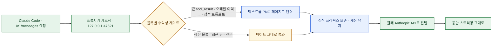
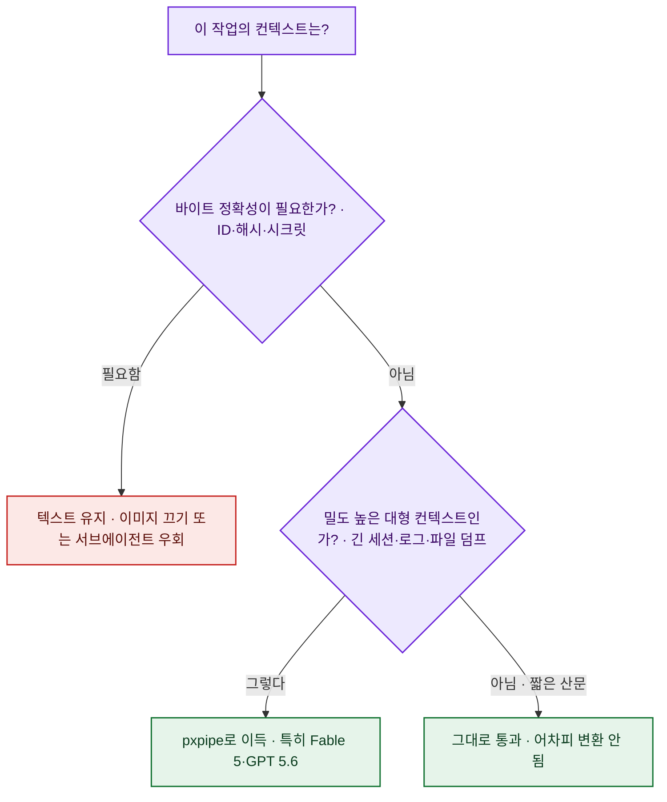

# pxpipe — 컨텍스트를 이미지로 보내 Claude Code 토큰을 줄이는 프록시

> 나는 매일 Claude Code를 돌리면서 [[claude-code-context-window-token-optimization|컨텍스트 창과 토큰 비용]]을 계속 신경 쓴다. 긴 세션은 결국 **입력 토큰**이 돈을 먹는데, 그 대부분이 "매 요청마다 똑같이 다시 보내는" 시스템 프롬프트·도구 문서·오래된 이력이다. 그런데 이걸 **텍스트가 아니라 이미지로 보내서** 값을 후려친다는 발칙한 프록시가 눈에 들어왔다 — pxpipe다. 국내 파이토치 커뮤니티(9bow/박정환 님)의 소개글로 접했고, 사실관계와 벤치마크 수치는 **공식 저장소(`teamchong/pxpipe`)로 직접 확인**했다(MIT 라이선스, 약 5.1k 스타, TypeScript 95.9%).

## pxpipe가 푸는 문제는 뭔가?

LLM API는 **매 요청이 무상태(stateless)** 다. 대화가 이어지는 것처럼 보여도, 실제로는 요청마다 전체 맥락을 처음부터 다시 실어 보낸다. Claude Code 같은 에이전트는 특히 심하다 — 방대한 시스템 프롬프트, 수십 개 도구의 사용 설명, 쌓여가는 대화 이력이 **한 요청도 빠짐없이 반복 전송**된다. 이 반복분이 곧 입력 토큰 청구서다.

pxpipe의 발상은 이 지점을 정확히 겨눈다. **요청이 내 컴퓨터를 떠나기 전에**, 부피 큰 반복 덩어리를 **압축된 PNG 이미지 페이지로 치환**해서 API로 보낸다. 읽는 쪽은 Anthropic의 컴퓨터 사용(Computer Use)이 스크린샷을 읽을 때 쓰는 것과 **같은 비전(vision) 채널**이다. TypeScript로 짜였고 `npx` 한 줄로 뜨며, 응답 스트리밍은 그대로 유지된다.

## 왜 텍스트 대신 이미지가 더 싼가?

핵심은 딱 한 문장이다 — **이미지의 토큰 비용은 담긴 글자 수가 아니라 픽셀 크기로 고정된다.** 그래서 밀도 높은 콘텐츠일수록 이미지가 유리해진다. 코드·JSON·도구 출력 같은 빽빽한 텍스트는 이미지 1토큰에 **약 3.1자**를 담지만, 같은 걸 텍스트로 보내면 1토큰에 **약 1자**에 그친다.

| 구분 | 텍스트로 전송 | 이미지로 전송 |
|---|---|---|
| 토큰당 담기는 글자 | 밀집 콘텐츠 기준 약 1자 | 약 3.1자 |
| 48,000자 시스템 프롬프트+도구 문서 | 약 25,000 토큰 | 약 2,700 이미지 토큰 |
| 1장(1928×1928) 용량 | — | 약 92,000자 ≈ 약 4,761 비전 토큰 |

계산을 뒤집으면 손익분기가 나온다. 1928×1928 한 장이 약 4,761 토큰에 약 92,000자를 담으므로, **텍스트가 오히려 유리해지는 구간은 "토큰당 약 19자를 넘는 성긴 산문"뿐**이다. 그런데 저자가 실측한 Claude Code 트래픽은 **토큰당 약 1.91자(N=391)** 로, 그 기준을 한참 밑돈다. 즉 에이전트가 실어 나르는 대부분의 컨텍스트는 이미지로 보내는 편이 산술적으로 이득이라는 뜻이다.

## 어떻게 동작하나?

프록시는 `/v1/messages` 요청을 가로채, 압축 대상이 되는 큰 블록만 이미지 블록으로 다시 쓰고, **정적 프리픽스는 그대로 보존**해 프롬프트 캐싱이 계속 먹도록 이어붙인 뒤 원래 API로 넘긴다.



이미지로 바뀌는 건 **딱 세 종류**의 입력 블록이고, 각각 "이득이 날 때만" 변환하는 수익성 게이트를 통과한다.

- **약 6,000자 이상**의 토큰 밀도 높은 대형 `tool_result` 본문 — 파일 읽기, 명령 출력, 로그
- **오래된 대화 이력** — 최근 턴 뒤로 밀려난 턴들을 이미지 페이지로 재렌더링(단, **최근 턴은 항상 텍스트 유지**)
- **정적인 시스템 프롬프트 + 도구 문서** 덩어리

그 밖의 전부 — 사용자 메시지, 최근 턴, 모델의 출력, 성긴 산문, 압축해도 이득 없는 작은 블록 — 은 **바이트 그대로 통과**한다. 허용 목록 밖의 모델로 가는 요청도 손대지 않는다.

## 공짜 점심은 아니다 — 무손실이 아니라는 정직함

여기서 이 프로젝트를 신뢰하게 되는 대목이 나온다. README에 `The honest part`라는 섹션을 따로 두고 **손실 특성을 숫자로 공개**한다.

이미지 변환은 **무손실이 아니다.** ID·해시·시크릿처럼 바이트 단위로 정확해야 하는 값은 이미지에서 잘못 읽힐 수 있고, 무서운 건 그 실패가 "에러"가 아니라 **그럴듯한 오독(조용한 허구, confabulation)** 으로 나타난다는 점이다. 모델 비전이 OCR이 아니라 **패치 임베딩**이기 때문인데, 이 메커니즘은 저장소 `docs/NOT-OCR.md`에 따로 정리돼 있다.

밀집 렌더 안의 **12자 16진수 문자열을 그대로 회상**하는 테스트 결과가 이걸 냉정하게 보여준다.

| 모델 | 12자 hex 원문 회상 (밀집 렌더) |
|---|---|
| Fable 5 | 15개 중 **13개** |
| Opus 4.8 | 15개 중 **0개** |

그래서 pxpipe는 세 겹의 안전장치를 깐다. ① **최근 턴은 항상 텍스트로** 남기고, ② 계산상 이득이 있는 요청에만 이미지를 적용하는 **수익성 게이트**를 두며, ③ 기본적으로 **렌더 판독이 검증된 모델에만** 동작한다. 기본 허용 목록은 `claude-fable-5`, `gpt-5.6` 둘뿐이고, 오독률이 높은 **Opus 4.7/4.8·GPT 5.5는 기본에서 빠져** 사용자가 `PXPIPE_MODELS`로 직접 켜야 한다. 바이트 정확성이 필요한 작업은 허용 목록 밖 모델을 쓰는 서브에이전트로 우회하는 탈출구도 안내한다(예: 에이전트 frontmatter에 `model: sonnet`을 두면 그 작업은 이미지 변환 없이 텍스트 그대로 전달).

> ⚠️ 한국어 사용자에게 중요한 단서: 문자 지원은 ASCII·라틴 문자권이 가장 충분히 검증됐고, **CJK(한국어·중국어·일본어)는 동작하지만 보수적으로 처리**된다. 한글 컨텍스트가 많은 나 같은 사람은 절감폭이 영문 대비 작을 수 있다는 걸 감안해야 한다.

## 실제로 얼마나 아끼나?

저자는 **Fable 5 정가 기준 전체 청구액이 약 59~70% 낮아진다**고 측정치를 제시한다(13,709건 스냅샷에서 약 100달러 → 약 41달러 수준이 59%, 이후 8,904건 압축 요청 트레이스에서 약 70%). 다만 가격·워크로드가 계속 변하므로, **오래 유효한 수치는 요청 단위로 `~/.pxpipe/events.jsonl`에 기록되는 토큰 절감량 자체**라고 못 박는다.

모델이 암기할 수 없는 **무작위 문제**로 정확도를 검증한 벤치마크 표는 다음과 같다(README §Benchmarks, 원자료는 저장소 `eval/`·`FINDINGS.md`에 공개).

| 테스트 | 텍스트 | pxpipe(이미지) | 토큰 |
|---|---|---|---|
| 신규 산술, Fable 5 (N=100) | 100% | 100% | −38% |
| 신규 산술, Opus 4.8 (N=100) | 100% | 93% | −38% |
| 요지 회상 A/B, Fable 5 | 98/98 | 98/98 | — |
| 상태 추적(값 3회 변경), Fable 5 | 18/18 | 18/18 | — |
| 없는 사실 허구 생성(낮을수록 좋음), Fable 5 | 0/16 | 0/16 | — |
| SWE-bench Lite 파일럿 | 10/10 | 10/10 | −65% |
| SWE-bench Pro | 15/19 | 14/19 | −60% (판정 일치 18/19) |

정리하면 **산술·요지 회상·상태 추적처럼 "의미"를 다루는 작업은 텍스트와 사실상 동률**을 유지하면서 요청 크기를 크게 줄이고, **"바이트 원문 회상"에서만 무너진다.** SWE-bench Pro에서 텍스트 15/19 대 이미지 14/19로 한 건 밀린 건 표본이 작다는 점(저자도 명시)을 감안해 읽어야 한다.

⚠️ 저자의 A/B 데모 영상 기준으로는, 같은 작업에서 pxpipe를 켠 쪽이 컨텍스트를 **73.5k/1M만 쓰고 약 6.06달러**로 끝낸 반면 끈 쪽은 컨텍스트가 96%까지 차오르며 **약 42.21달러**가 나왔다(39개 파일의 토큰 등장 횟수를 grep과 한 줄도 안 틀리게 10/10). 단 켠 쪽은 "한 줄 출력" 형식을 맞추는 데 한 번의 추가 지시가 필요했다는 한계도 영상에 그대로 담겨 있다. 이 데모 수치는 특정 세션 1회의 저자 측정이라 대푯값으로 옮기진 말자.

## 설치와 사용은?

시작은 두 줄이다. 프록시를 띄우고, Claude Code가 그 주소를 바라보게 하면 끝.

```bash
npx pxpipe-proxy                                  # 127.0.0.1:47821 에 프록시
ANTHROPIC_BASE_URL=http://127.0.0.1:47821 claude  # Claude Code를 프록시로
```

프록시를 띄우면 `http://127.0.0.1:47821/`에 **대시보드**가 열린다. 절감된 토큰, 텍스트→이미지 변환 좌우 비교, 킬 스위치, 모델별 활성화 칩을 볼 수 있다. 프록시 없이 **라이브러리로도** 쓸 수 있다.

```javascript
import { renderTextToImages, transformAnthropicMessages } from "pxpipe-proxy";

const { pages } = await renderTextToImages(toolResultText);   // pages[i].png: Uint8Array
const { body, applied, info } = await transformAnthropicMessages({
  body: requestBytes,
  model: "claude-fable-5",
});
```

런타임은 순수 JavaScript라 Node와 엣지·Workers 환경에서 돌고, 렌더에 쓰는 `@napi-rs/canvas`는 빌드 시점에만 필요하다.

## 내 관점 — 이게 왜 흥미로운가

나는 이 프로젝트를 "토큰 아끼는 꼼수"로만 보지 않는다. 더 흥미로운 건 저자가 로드맵에 남긴 **열린 질문**이다 — 이미지로 압축한 컨텍스트가 실질 컨텍스트 창을 **약 2배로 넓혀주는가**, 활성 컨텍스트가 작아지면 긴 작업의 정확도가 오히려 오르는가. 만약 그렇다면 이건 비용 문제를 넘어 **"컨텍스트를 더 오래 들고 갈 수 있는가"** 의 문제가 된다.

한 가지 더 인상적인 대목. 저자는 2026년 7월 5일 기준으로 **렌더링 자체를 개선하는 연구는 일단 보류**했다고 밝혔는데, 이유가 솔직하다 — 원문 회상 실패는 폰트·색·레이아웃 같은 표현의 문제가 아니라 **"수익이 나는 밀도에서는 모델의 판독 용량 자체가 부족한(capacity-bound)"** 문제라서다. 대신 새 모델이 나올 때마다 해상도 스윕을 다시 돌린다. 실제로 판독 가능한 밀도가 Opus 4.8에서 Fable 5로 오면서 **글리프 면적 기준 약 4배**나 넓어졌으니, 모델이 좋아질수록 절감폭은 저절로 커진다는 계산이다.

**언제 켤까 / 언제 끌까**를 내 기준으로 정리하면 이렇다.



"모델 자체의 해자가 얇아지는" [[ai-it-digest-2026-07-09|요즘 흐름]] 속에서, 이렇게 **API 앞단에 프록시를 하나 끼워 비용 구조를 바꾸는** 접근은 계속 지켜볼 축이다. 컨텍스트를 [[claude-md-context-optimization|어떻게 덜 쓰느냐]]만큼이나 **어떤 형식으로 실어 보내느냐**도 지렛대가 된다는 걸 새삼 확인했다.

## 마무리

- **원본 저장소**: https://github.com/teamchong/pxpipe (MIT, 약 5.1k★, TypeScript). 벤치마크 원자료는 `eval/`·`FINDINGS.md`, 오독 메커니즘은 `docs/NOT-OCR.md`.
- **소개글 출처**: 9bow(박정환) 님 파이토치 코리아 커뮤니티 글. 이 정리의 수치는 원본 README와 대조해 확인했다(10개 핵심 수치 일치).
- 같이 보면 좋은 글: [[claude-code-context-window-token-optimization|Claude Code 컨텍스트 창·토큰 최적화]] · [[maxkb-enterprise-rag-agent-platform|MaxKB — 기업용 RAG 에이전트 플랫폼]] · [[prompting-claude-fable-5-migration-guide|Fable 5 프롬프팅 마이그레이션]]

<!-- 안전: 회사 실데이터·고객/제3자 PII·API키/쿠키/토큰 없음. 외부 공개 저장소·커뮤니티 글 기반, 1차 출처 대조. -->

*벤더·저자 자체 측정치(59~70% 절감, 데모 비용, SWE-bench 소표본)는 ⚠️로 분리했습니다. 검증 가능한 수치는 공식 저장소 README와 대조해 확인했습니다. 정리: 2026-07-09.*
