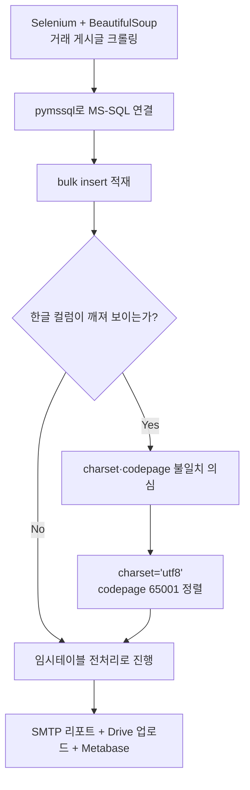
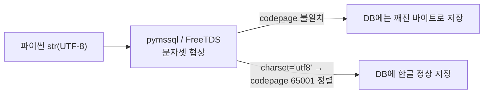
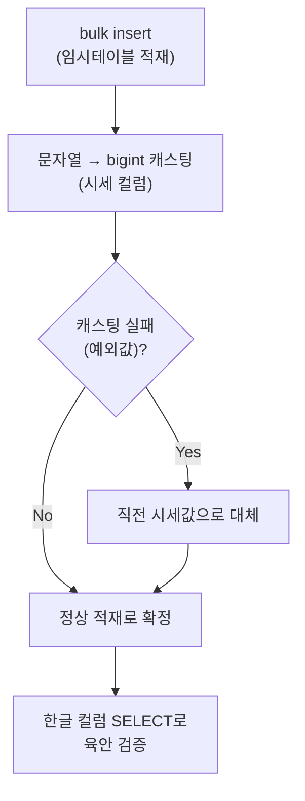

사이드 프로젝트로 게임 아이템 현금시세를 매일 크롤링해서 쌓는 파이프라인을 만든 적이 있다. Selenium과 BeautifulSoup으로 거래 게시글을 긁고, `pymssql`로 MS-SQL에 적재하고, 다음 날 SMTP로 리포트를 보내는 구조였다. 문제는 첫 적재 테스트에서 바로 터졌다. 영어·숫자는 멀쩡한데 **한글 컬럼(아이템명)만 물음표나 깨진 문자로 들어갔다.** 처음엔 크롤링 단계 인코딩을 의심했는데, 파이썬 콘솔 출력은 멀쩡했다. 문제는 DB로 넘어가는 그 사이였다.

전체 흐름과 이 문제가 어디서 생겼는지부터 그려본다.



(이 크롤링은 개인 사이드 프로젝트였고, robots.txt·이용약관과 요청 간 딜레이(레이트리밋)를 지키는 선에서 돌렸다.)

## 한글이 왜 깨졌나 — 어디서부터 의심해야 했나?

파이썬 문자열은 멀쩡한데 DB에만 들어가면 깨진다는 건, **문제가 애플리케이션이 아니라 "전송 구간"에 있다**는 뜻이다. `pymssql`은 내부적으로 FreeTDS 계층을 거쳐 MS-SQL과 TDS 프로토콜로 통신한다. 이 구간에서 클라이언트가 보내는 문자셋과 서버(컬럼 collation)가 기대하는 코드페이지가 어긋나면 한글 같은 멀티바이트 문자가 중간에서 깨진다.

처음엔 "인코딩 문제"라고 뭉뚱그려 생각했는데, 삽질 끝에 원인 후보를 세 갈래로 좁혔다.

- **charset 미지정** — `connect()`에 charset을 안 주면 환경에 따라 한글이 온전히 안 지나간다.
- **codepage 협상 불일치** — 클라이언트는 UTF-8로 보내는데 드라이버 쪽 인식이 다른 값인 경우.
- **컬럼이 varchar** — 애초에 유니코드를 못 담는 컬럼이면 charset을 다 맞춰도 소용없다.

컬럼 타입은 처음부터 `nvarchar`였으니 바로 제외. 남은 건 charset과 codepage 두 가지였다.

## charset과 codepage는 대체 뭐가 다른가?

둘 다 "문자 인코딩" 얘기라 헷갈리는데, 층이 다르다.



- **charset**은 `pymssql.connect()`에 주는 파라미터로, "내가 보내는 문자열이 이 문자셋이다"를 드라이버에게 알려준다. `charset='utf8'`을 명시하면 파이썬의 UTF-8 문자열을 드라이버가 UTF-8로 인식한다.
- **codepage**는 한 단계 아래, TDS 프로토콜 레벨에서 클라이언트-서버가 주고받는 바이트를 어떤 코드페이지로 해석할지의 값이다. UTF-8에 대응하는 번호가 **65001**이다.

내가 겪은 문제는 charset만 신경 쓰고 codepage 정렬은 놓친 경우였다. charset을 `utf8`로 줘도 실제 협상되는 코드페이지가 65001로 안 맞으면, 한글 같은 멀티바이트 문자에서 깨짐이 그대로 재현됐다. 둘을 **같이** 맞춰야 끝나는 문제였다.

## pymssql 연결 코드, 실제로 뭘 바꿨나?

바꾼 건 연결 함수 한 곳이다. 아래는 실제 스키마 대신 합성 테이블명으로 정리한 예시다.

```python
import os
import pymssql

# 비밀번호·서버 정보는 절대 하드코딩하지 않는다.
conn = pymssql.connect(
    server=os.environ["DB_SERVER"],
    user=os.environ["DB_USER"],
    password=os.environ["DB_PASSWORD"],
    database="market_watch",
    charset="utf8",     # 한글 인코딩 핵심
)
# freetds.conf의 client charset도 UTF-8로 맞춰 codepage 65001 협상이 되게 정렬한다.

cursor = conn.cursor()

rows = [
    ("검", 125000, "2026-07-10"),        # (item_name, price, collected_at)
    ("불꽃 지팡이", 89000, "2026-07-10"),  # 합성 예시
]

cursor.executemany(
    """
    INSERT INTO price_snapshot_stg (item_name, price, collected_at)
    VALUES (%s, %s, %s)
    """,
    rows,
)
conn.commit()
```

포인트는 두 가지다. `charset='utf8'`을 명시할 것, 코드페이지 협상도 65001로 정렬할 것. 하나만 맞추면 "됐다가 안 됐다가" 하는 애매한 상태가 된다.

## 고쳤다고 끝이 아니다 — bulk insert 이후엔 뭘 확인했나?

charset·codepage를 맞췄다고 바로 안심하지 않았다. 대량 적재는 스테이징(임시) 테이블에 먼저 넣고, 그 안에서 한 번 더 정제하는 순서로 짰다.



크롤링한 시세는 문자열이라 쉼표·단위가 섞여 bigint로 못 바꾸는 예외값이 종종 있었다. 이런 값은 버리지 않고 **직전 시세로 대체**해 그래프가 끊기지 않게 했다.

```sql
-- 적재 직후 한글이 정상인지 표본 확인 (합성 테이블명)
SELECT TOP 20 item_name, price, collected_at
FROM   price_snapshot_stg
ORDER  BY collected_at DESC;
```

자동화 파이프라인이라도 인코딩 문제는 로그만 봐선 안 잡힌다. 값을 눈으로 찍어보는 이 검증 단계가, 다음 날 물음표투성이 리포트를 안 보내는 방법이었다.

## 정리 — 한글 깨짐은 대개 "정렬"의 문제였다

- 파이썬 문자열이 DB에서만 깨진다면, 애플리케이션이 아니라 **클라이언트-서버 간 전송 구간**을 의심한다.
- `charset='utf8'`만으로는 부족할 수 있다. 실제 협상되는 **codepage(UTF-8=65001)** 와 정렬돼야 한다.
- 컬럼 타입이 `nvarchar`인지도 먼저 확인한다. varchar면 charset을 맞춰도 소용없다.
- 대량 적재는 임시테이블 전처리 + 표본 SELECT로 눈 검증하는 단계를 반드시 넣는다.

이 파이프라인(크롤링→적재→리포트→시각화)의 전체 구조는 다음 글에서 정리할 예정이다. 인코딩 하나 잡는 데도 층을 하나씩 벗겨야 했다는 게 이번 교훈이었다.

- 현금시세 모니터링 파이프라인: [github.com/DBhyeong/game-data-analysis](https://github.com/DBhyeong/game-data-analysis)
